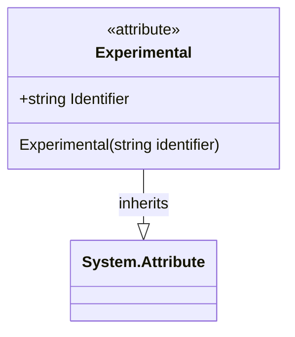

# Overview of the Source Code Structure

The provided source code snippet is a C# directive that applies a custom attribute to an assembly. The attribute, named `Experimental`, is intended to mark the assembly as being in an experimental stage of development. The attribute is applied with a string parameter, "SKEXP0032", which likely serves as an identifier for a specific experimental feature or phase.

# Primary Functionality

## The `Experimental` Attribute

The `Experimental` attribute's primary function is to signal to developers and the build system that the assembly is not stable and is subject to change. This attribute acts as metadata for the assembly, potentially influencing build warnings, feature flags, or other development and deployment processes.

### Implementation

The attribute is applied at the assembly level using the following syntax:

```csharp
[assembly: Experimental("SKEXP0032")]
```

The `Experimental` attribute would be defined in a separate file and would inherit from `System.Attribute`, the base class for all attributes in .NET. The attribute class would have a constructor that accepts a string parameter, allowing an identifier to be passed when the attribute is applied.

# UML Class Diagram

The structure of the `Experimental` attribute and its relationship with the assembly can be represented by a UML class diagram. Below is the diagram in valid Mermaid syntax:



In this UML class diagram, the `Experimental` attribute class is shown inheriting from `System.Attribute`. The `Experimental` class has a constructor that takes a string parameter for the identifier.

# Formatting and Style

The source code follows standard C# conventions for applying attributes, which is essential for consistency and readability. The use of comments above the attribute application provides context for developers, which is a good practice in code documentation.

# Accessibility

The documentation is intended for developers who are familiar with C# and the concept of assembly attributes. It provides the necessary information for understanding the purpose of the `Experimental` attribute and its implications when applied to an assembly.

# Conclusion

The `Experimental` attribute serves as a clear indicator to developers that the assembly is in a developmental stage and not ready for production use. Proper documentation of such attributes is essential for maintaining clarity and awareness among the development team and anyone who interacts with the codebase.

# Additional Considerations

## Attribute Definition and Behavior

The `Experimental` attribute's definition and behavior are not detailed in the provided snippet. However, it is important to note that the attribute would typically be defined in a separate file and include properties or methods that dictate its behavior when applied to an assembly. For example, it might trigger warnings during the build process or alter the assembly metadata to reflect its experimental status.

## Real-World Usage

In a real-world scenario, the `Experimental` attribute might be used in conjunction with a feature flag system that enables or disables certain features based on their experimental status. The identifier "SKEXP0032" could be used to track the feature's progress and manage its deployment across different environments.

## Maintaining Coding Style

Maintaining the original coding style in the documentation is crucial to ensure that the code remains consistent and readable. This includes following naming conventions, proper indentation, and the use of comments to provide context where necessary.