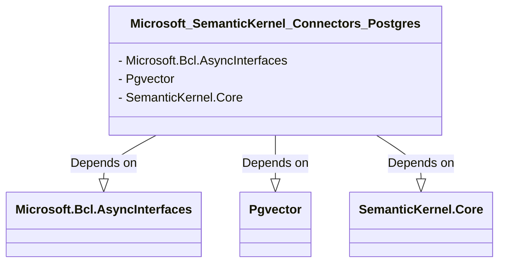

# Overview of Source Code Structure and Primary Functionalities

The provided source code is an XML configuration file for a .NET Standard library project. This project is designed to create a connector for Postgres databases, specifically with support for the pgvector extension. The XML file defines the project's build settings, dependencies, and metadata for the NuGet package that will be generated. The primary functionalities of this configuration are to establish the project's identity, manage its dependencies, and prepare it for distribution as a package.

## Project Configuration

### AssemblyName and RootNamespace

The `AssemblyName` and `RootNamespace` are set to ensure that the compiled output file name and the default namespace used within the project are consistent with the project's naming conventions.

```xml
<PropertyGroup>
  <AssemblyName>Microsoft.SemanticKernel.Connectors.Postgres</AssemblyName>
  <RootNamespace>$(AssemblyName)</RootNamespace>
</PropertyGroup>
```

### TargetFramework

The `TargetFramework` is specified as `netstandard2.0`, which provides compatibility with a range of .NET implementations, allowing for broad platform support.

```xml
<PropertyGroup>
  <TargetFramework>netstandard2.0</TargetFramework>
</PropertyGroup>
```

### VersionSuffix

The `VersionSuffix` is used to append an identifier to the version number, indicating that the project is in a pre-release state.

```xml
<PropertyGroup>
  <VersionSuffix>alpha</VersionSuffix>
</PropertyGroup>
```

## Shared Project Properties

The project includes shared properties from other files within the repository, which contain common build configurations and utility properties.

```xml
<Import Project="$(RepoRoot)/dotnet/nuget/nuget-package.props" />
<Import Project="$(RepoRoot)/dotnet/src/InternalUtilities/src/InternalUtilities.props" />
```

## NuGet Package Metadata

The metadata section provides information about the NuGet package, including its title and a brief description of its functionality.

```xml
<PropertyGroup>
  <Title>Semantic Kernel - Postgres Connector</Title>
  <Description>Postgres(with pgvector extension) connector for Semantic Kernel plugins and semantic memory</Description>
</PropertyGroup>
```

## Dependencies

The project declares its dependencies on external NuGet packages, which are required for its functionality. The versions of these packages are not specified in the provided snippet, but they are essential for ensuring compatibility and should be included in the actual project file.

```xml
<ItemGroup>
  <PackageReference Include="Microsoft.Bcl.AsyncInterfaces" Version="1.1.1" />
  <PackageReference Include="Pgvector" Version="0.1.2" />
</ItemGroup>
```

## Project Dependencies

The project references another project within the same repository, `SemanticKernel.Core`, which provides core functionalities that the Postgres connector will extend.

```xml
<ItemGroup>
  <ProjectReference Include="..\..\SemanticKernel.Core\SemanticKernel.Core.csproj" />
</ItemGroup>
```

# UML Component Diagram

The relationships between the project and its dependencies can be illustrated using a UML component diagram. This diagram shows how the `Microsoft.SemanticKernel.Connectors.Postgres` project relies on external NuGet packages and an internal project reference.



# Conclusion

The source code documentation provides a detailed breakdown of the .NET Standard project file for a Postgres connector library. It includes explanations of the project's configuration settings, shared properties, package metadata, dependencies, and project references. The documentation is formatted for clarity and is intended for professionals familiar with technical documentation and UML diagrams. A component diagram is provided to represent the project's dependencies. It is important to maintain the original coding style and structure for consistency and ease of understanding.