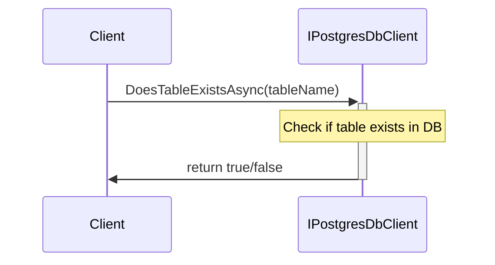
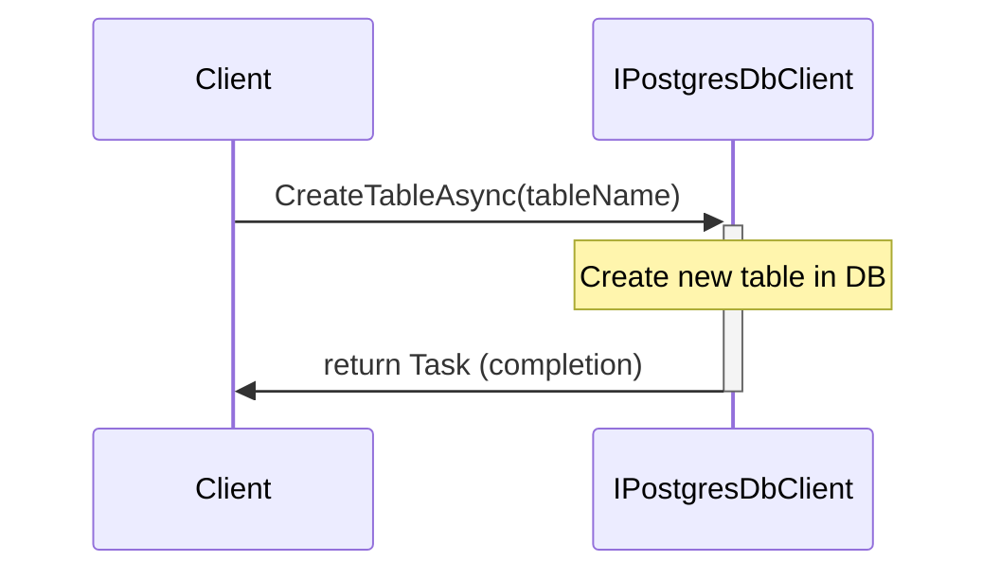
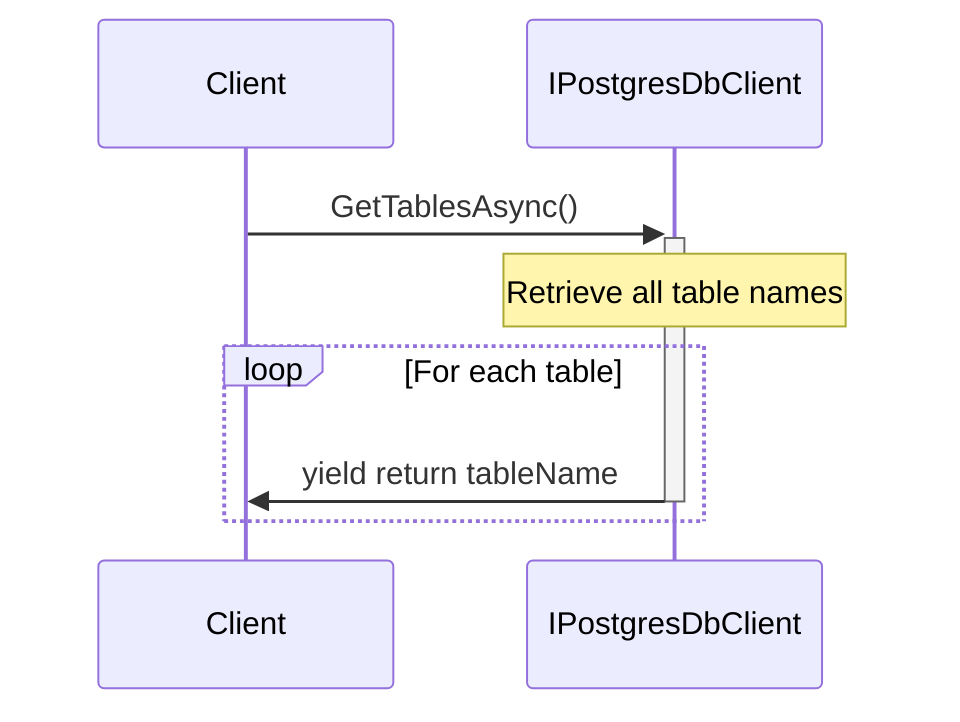
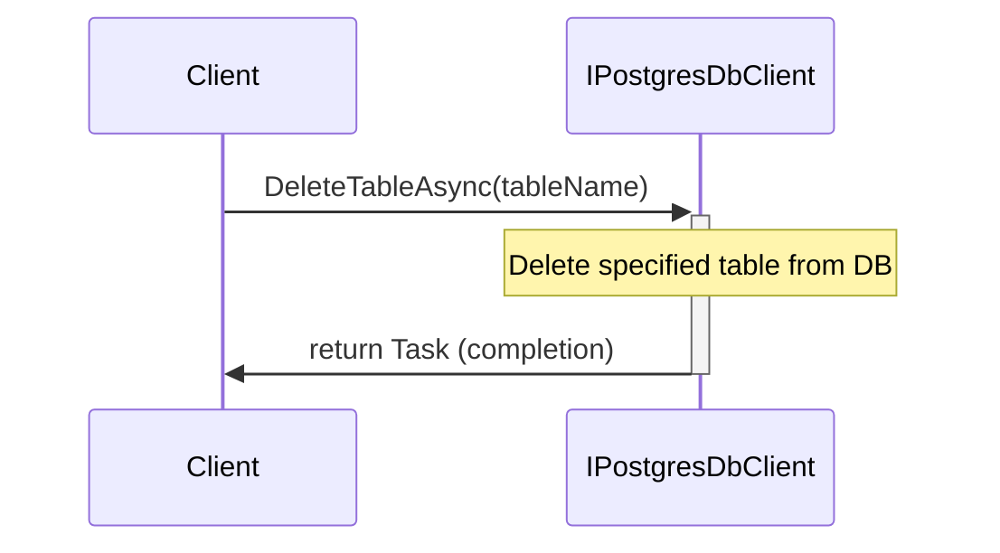
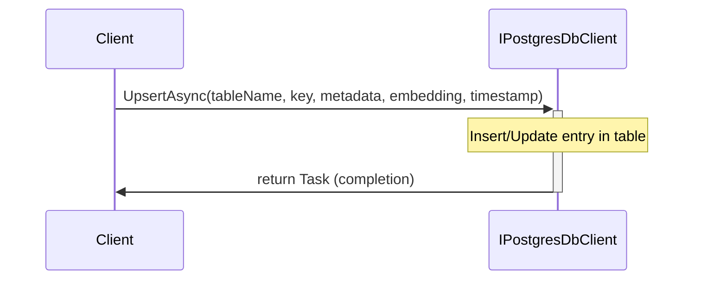
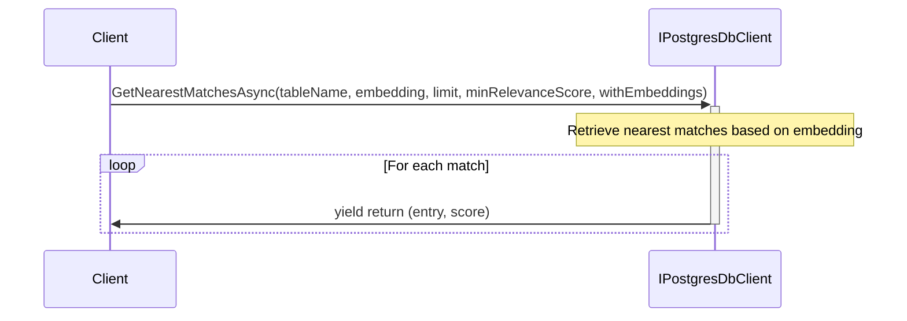
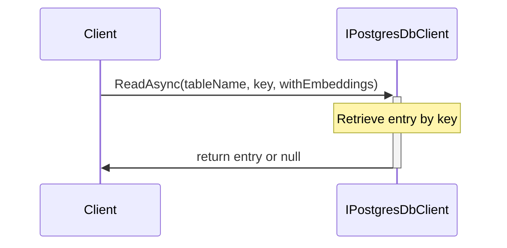
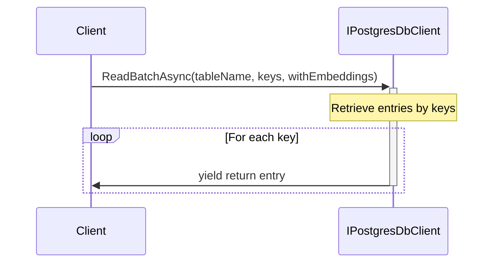
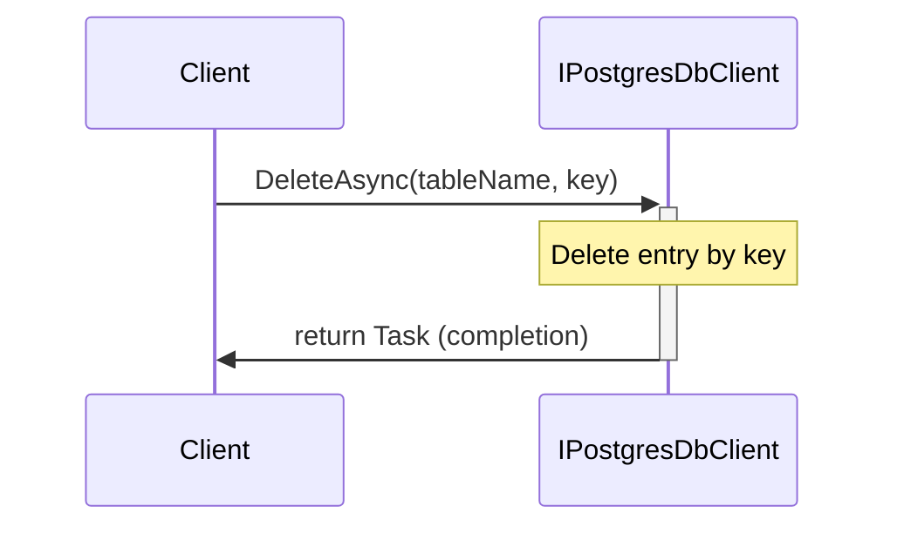
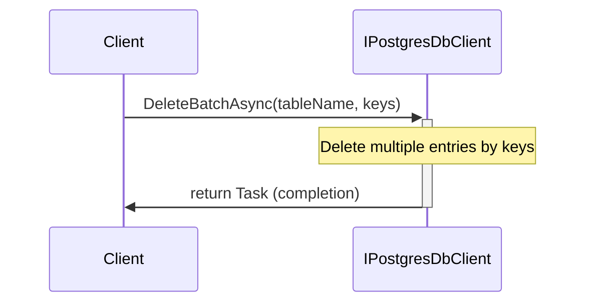

# Overview of IPostgresDbClient Interface

The `IPostgresDbClient` interface defines a set of operations for interacting with a PostgreSQL database in an asynchronous manner. It provides methods for creating, reading, updating, and deleting tables and their entries, as well as for performing more complex operations such as retrieving nearest matches to a given vector embedding.

The primary functionalities of this interface include:
- Checking for the existence of a table.
- Creating and deleting tables.
- Upserting (inserting or updating) entries in a table.
- Retrieving nearest matches based on vector embeddings.
- Reading entries by key or in batches.
- Deleting entries by key or in batches.

Each method in the interface is designed to be asynchronous, making use of `Task` and `IAsyncEnumerable` to support operations that may take time to complete, such as database I/O.

## DoesTableExistsAsync Method

### Purpose
Determines asynchronously if a table with a specified name exists in the database.

### Implementation
```csharp
Task<bool> DoesTableExistsAsync(string tableName, CancellationToken cancellationToken = default);
```

### UML Sequence Diagram


## CreateTableAsync Method

### Purpose
Creates a new table with the specified name in the database asynchronously.

### Implementation
```csharp
Task CreateTableAsync(string tableName, CancellationToken cancellationToken = default);
```

### UML Sequence Diagram


## GetTablesAsync Method

### Purpose
Retrieves a list of all tables in the database asynchronously.

### Implementation
```csharp
IAsyncEnumerable<string> GetTablesAsync(CancellationToken cancellationToken = default);
```

### UML Sequence Diagram


## DeleteTableAsync Method

### Purpose
Deletes the table with the specified name from the database asynchronously.

### Implementation
```csharp
Task DeleteTableAsync(string tableName, CancellationToken cancellationToken = default);
```

### UML Sequence Diagram


## UpsertAsync Method

### Purpose
Upserts an entry into a table, creating or updating the entry with the provided key asynchronously.

### Implementation
```csharp
Task UpsertAsync(string tableName, string key, string? metadata, Vector? embedding, DateTime? timestamp, CancellationToken cancellationToken = default);
```

### UML Sequence Diagram


## GetNearestMatchesAsync Method

### Purpose
Retrieves the nearest matches to a given vector embedding from a specified table asynchronously.

### Implementation
```csharp
IAsyncEnumerable<(PostgresMemoryEntry, double)> GetNearestMatchesAsync(string tableName, Vector embedding, int limit, double minRelevanceScore = 0, bool withEmbeddings = false, CancellationToken cancellationToken = default);
```

### UML Sequence Diagram


## ReadAsync Method

### Purpose
Reads an entry from a table by its key asynchronously.

### Implementation
```csharp
Task<PostgresMemoryEntry?> ReadAsync(string tableName, string key, bool withEmbeddings = false, CancellationToken cancellationToken = default);
```

### UML Sequence Diagram


## ReadBatchAsync Method

### Purpose
Reads multiple entries from a table by their keys asynchronously.

### Implementation
```csharp
IAsyncEnumerable<PostgresMemoryEntry> ReadBatchAsync(string tableName, IEnumerable<string> keys, bool withEmbeddings = false, CancellationToken cancellationToken = default);
```

### UML Sequence Diagram


## DeleteAsync Method

### Purpose
Deletes an entry from a table by its key asynchronously.

### Implementation
```csharp
Task DeleteAsync(string tableName, string key, CancellationToken cancellationToken = default);
```

### UML Sequence Diagram


## DeleteBatchAsync Method

### Purpose
Deletes multiple entries from a table by their keys asynchronously.

### Implementation
```csharp
Task DeleteBatchAsync(string tableName, IEnumerable<string> keys, CancellationToken cancellationToken = default);
```

### UML Sequence Diagram


In summary, the `IPostgresDbClient` interface provides a comprehensive set of operations for managing PostgreSQL database tables and entries in an asynchronous manner, which is crucial for applications that require non-blocking database interactions. The use of `Task` and `IAsyncEnumerable` ensures that the interface is well-suited for scalable and responsive applications.