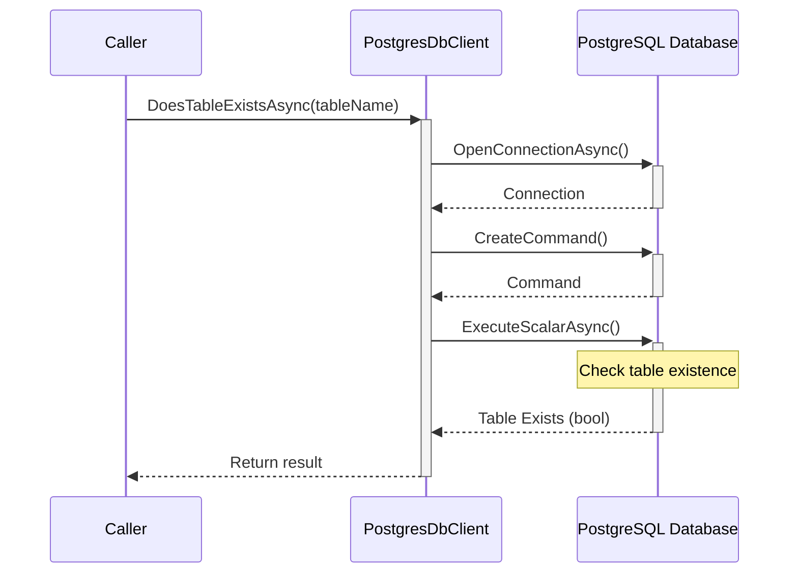
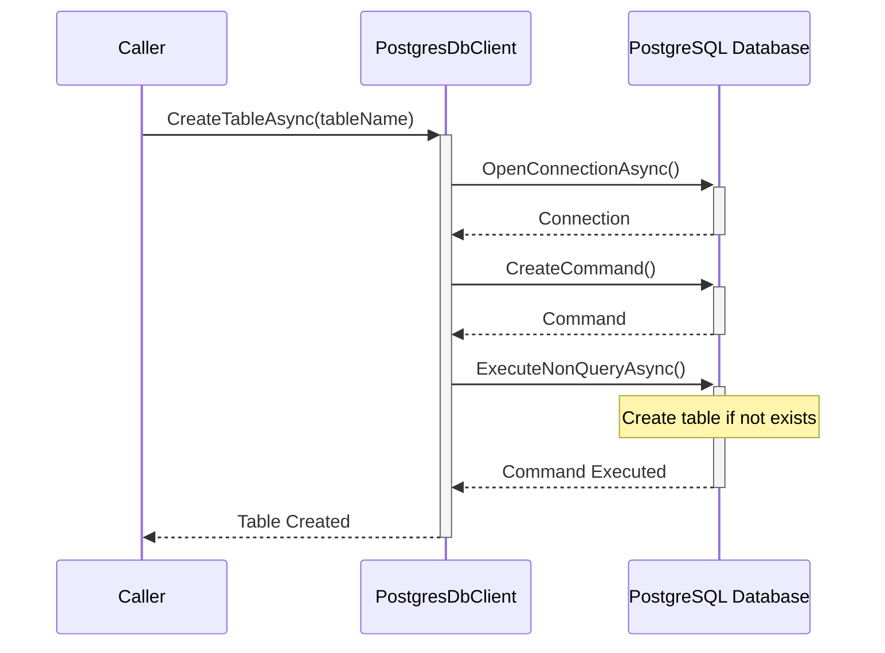
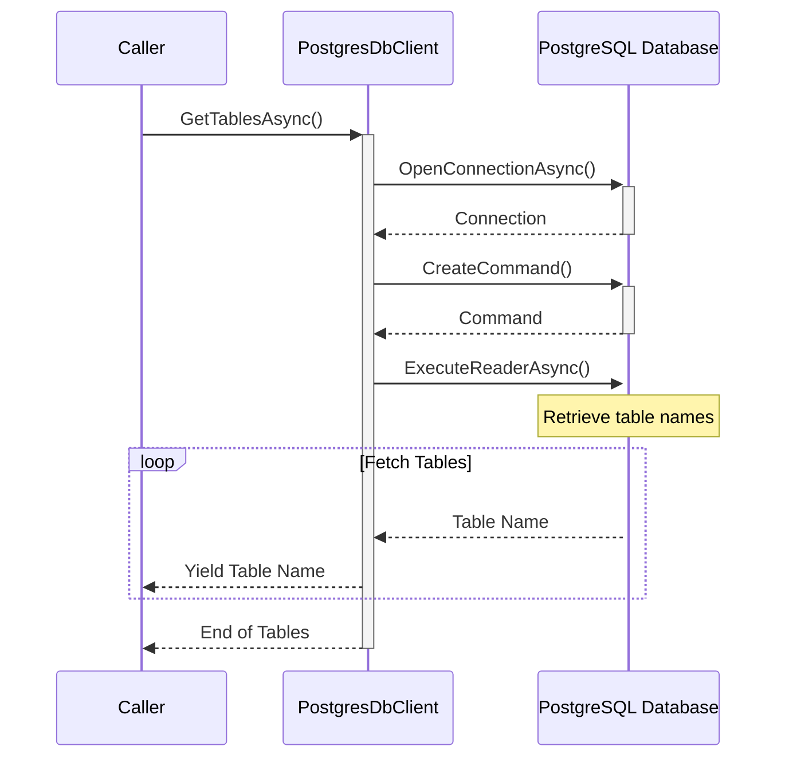
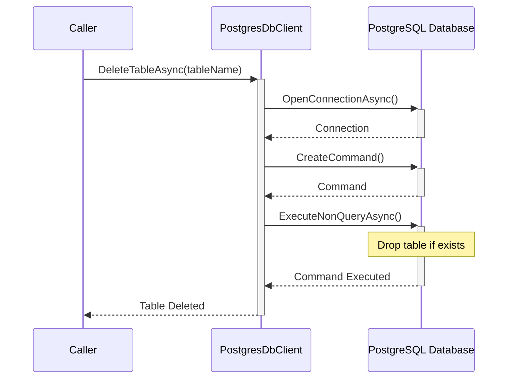

# Overview of PostgresDbClient Class

The `PostgresDbClient` class serves as an interface to a PostgreSQL database, facilitating operations on tables that store embeddings and metadata. It is designed to support applications that require storing and querying vector data, such as those used in machine learning for similarity searches. The class provides a range of functionalities, including checking for table existence, creating and deleting tables, and performing CRUD operations on table data.

## Primary Functionalities

- **Table Existence Check**: Determines if a table exists within the specified database schema.
- **Table Creation**: Establishes a new table with a predefined structure if it does not exist.
- **Table Enumeration**: Lists all tables within the schema.
- **Table Deletion**: Removes a table from the schema.
- **CRUD Operations**: Manages data by inserting, retrieving, updating, and deleting records.
- **Vector Operations**: Executes queries to find nearest vector matches (not included in the provided code snippet).

## Class Structure

The class is constructed with a `NpgsqlDataSource` for database connectivity, a schema name to define the namespace within the database, and a vector size that specifies the dimensionality of the vectors stored in the tables. The class methods are asynchronous, leveraging `NpgsqlConnection` and `NpgsqlCommand` to interact with the PostgreSQL database.

# Detailed Documentation

## Table Existence Check

The `DoesTableExistsAsync` method asynchronously checks if a table exists within the database schema.

### Code Snippet

```csharp
public async Task<bool> DoesTableExistsAsync(string tableName, CancellationToken cancellationToken = default)
{
    using NpgsqlConnection connection = await this._dataSource.OpenConnectionAsync(cancellationToken).ConfigureAwait(false);
    using NpgsqlCommand cmd = connection.CreateCommand();
    cmd.CommandText = $@"
        SELECT EXISTS (
            SELECT FROM information_schema.tables 
            WHERE table_schema = @schema AND table_name = @tableName)";
    cmd.Parameters.AddWithValue("@schema", this._schema);
    cmd.Parameters.AddWithValue("@tableName", tableName);

    return (bool)await cmd.ExecuteScalarAsync(cancellationToken).ConfigureAwait(false);
}
```

### UML Sequence Diagram



## Table Creation

The `CreateTableAsync` method asynchronously creates a new table within the schema if it does not already exist.

### Code Snippet

```csharp
public async Task CreateTableAsync(string tableName, CancellationToken cancellationToken = default)
{
    using NpgsqlConnection connection = await this._dataSource.OpenConnectionAsync(cancellationToken).ConfigureAwait(false);
    using NpgsqlCommand cmd = connection.CreateCommand();
    cmd.CommandText = $@"
        CREATE TABLE IF NOT EXISTS {this.GetFullTableName(tableName)} (
            key TEXT NOT NULL,
            metadata JSONB,
            embedding vector({this._vectorSize}),
            timestamp TIMESTAMP WITH TIME ZONE,
            PRIMARY KEY (key))";
    await cmd.ExecuteNonQueryAsync(cancellationToken).ConfigureAwait(false);
}
```

### UML Sequence Diagram



## Table Enumeration

The `GetTablesAsync` method asynchronously retrieves an enumerable collection of table names present in the schema.

### Code Snippet

```csharp
public async IAsyncEnumerable<string> GetTablesAsync([EnumeratorCancellation] CancellationToken cancellationToken = default)
{
    using NpgsqlConnection connection = await this._dataSource.OpenConnectionAsync(cancellationToken).ConfigureAwait(false);
    using NpgsqlCommand cmd = connection.CreateCommand();
    cmd.CommandText = @"
        SELECT table_name
        FROM information_schema.tables
        WHERE table_schema = @schema
            AND table_type = 'BASE TABLE'";
    cmd.Parameters.AddWithValue("@schema", this._schema);

    using NpgsqlDataReader dataReader = await cmd.ExecuteReaderAsync(cancellationToken).ConfigureAwait(false);
    while (await dataReader.ReadAsync(cancellationToken).ConfigureAwait(false))
    {
        yield return dataReader.GetString(dataReader.GetOrdinal("table_name"));
    }
}
```

### UML Sequence Diagram



## Table Deletion

The `DeleteTableAsync` method asynchronously drops a table from the schema if it exists.

### Code Snippet

```csharp
public async Task DeleteTableAsync(string tableName, CancellationToken cancellationToken = default)
{
    using NpgsqlConnection connection = await this._dataSource.OpenConnectionAsync(cancellationToken).ConfigureAwait(false);
    using NpgsqlCommand cmd = connection.CreateCommand();
    cmd.CommandText = $"DROP TABLE IF EXISTS {this.GetFullTableName(tableName)}";
    await cmd.ExecuteNonQueryAsync(cancellationToken).ConfigureAwait(false);
}
```

### UML Sequence Diagram



## Helper Method: GetFullTableName

The `GetFullTableName` method constructs the full table name using the schema and table name, ensuring it is properly formatted for SQL queries.

### Code Snippet

```csharp
private string GetFullTableName(string tableName)
{
    return $"{this._schema}.\"{tableName}\"";
}
```

## Security Considerations

It is crucial to ensure that the `tableName` parameter in methods like `GetFullTableName` is not user-controlled to prevent SQL injection attacks. This is a critical aspect of the class's design and must be highlighted for the audience to maintain the security of the database operations.

## Conclusion

The `PostgresDbClient` class provides a robust interface for managing database operations related to embeddings and metadata storage in a PostgreSQL database. The class is designed for asynchronous use and relies on the `Npgsql` library for database connectivity. The documentation includes UML diagrams to visualize the sequence of operations and the class's relationship with the database. Maintaining the original coding style and keeping the documentation up-to-date with any changes to the source code is essential for the integrity and security of the system.