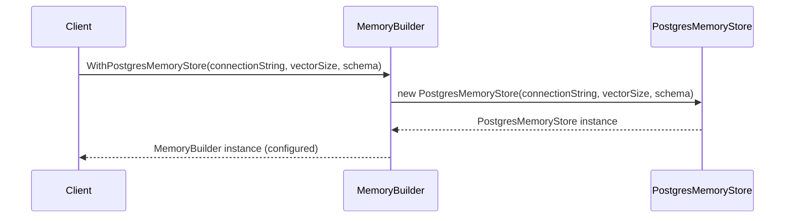
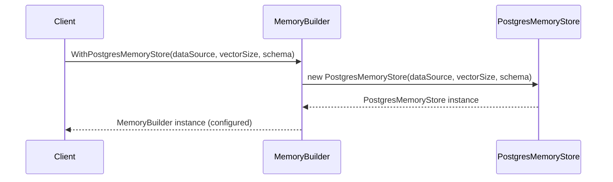
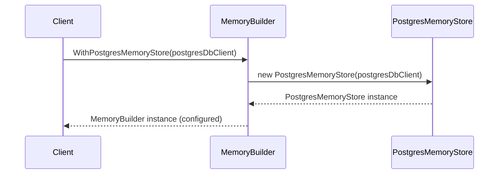

# Overview of Source Code Structure and Primary Functionalities

The source code provided defines a set of extension methods for the `MemoryBuilder` class, which is part of a framework designed to handle semantic data, with a focus on semantic vectors, in a Postgres database environment. The primary functionality of these extension methods is to enable the `MemoryBuilder` to integrate a `PostgresMemoryStore` as its backing store for the persistence and retrieval of semantic vectors.

The source code includes three distinct extension methods for configuring the `MemoryBuilder`:
1. `WithPostgresMemoryStore` using a connection string to connect to a Postgres database.
2. `WithPostgresMemoryStore` using an `NpgsqlDataSource` object for database connectivity.
3. `WithPostgresMemoryStore` using a custom `IPostgresDbClient` interface for more controlled database interactions.

Each method is designed to instantiate a `PostgresMemoryStore` with the appropriate configuration and add it to the `MemoryBuilder`, allowing for a fluent and chainable configuration pattern.

# Detailed Code Documentation

## WithPostgresMemoryStore using a Connection String

This extension method configures the `MemoryBuilder` to use a Postgres database as a memory store by providing a connection string. It specifies the size of the semantic vectors and optionally the database schema.

### Code Snippet

```csharp
public static MemoryBuilder WithPostgresMemoryStore(
    this MemoryBuilder builder,
    string connectionString,
    int vectorSize,
    string schema = PostgresMemoryStore.DefaultSchema)
{
    builder.WithMemoryStore((_) =>
    {
        return new PostgresMemoryStore(connectionString, vectorSize, schema);
    });

    return builder;
}
```

### UML Sequence Diagram



## WithPostgresMemoryStore using an NpgsqlDataSource

This method allows the `MemoryBuilder` to use an existing `NpgsqlDataSource` for Postgres database connectivity, which can be useful when the connection to the database is already established or managed externally.

### Code Snippet

```csharp
public static MemoryBuilder WithPostgresMemoryStore(
    this MemoryBuilder builder,
    NpgsqlDataSource dataSource,
    int vectorSize,
    string schema = PostgresMemoryStore.DefaultSchema)
{
    builder.WithMemoryStore((_) =>
    {
        return new PostgresMemoryStore(dataSource, vectorSize, schema);
    });

    return builder;
}
```

### UML Sequence Diagram



## WithPostgresMemoryStore using a Custom IPostgresDbClient

This method integrates a custom `IPostgresDbClient` into the `MemoryBuilder`. This is particularly useful when there is a need for a more customized or sophisticated interaction with the Postgres database that is not covered by the standard `PostgresMemoryStore` implementation.

### Code Snippet

```csharp
public static MemoryBuilder WithPostgresMemoryStore(
    this MemoryBuilder builder,
    IPostgresDbClient postgresDbClient)
{
    builder.WithMemoryStore((_) =>
    {
        return new PostgresMemoryStore(postgresDbClient);
    });

    return builder;
}
```

### UML Sequence Diagram



## UML Class Diagram

```mermaid
classDiagram
    class MemoryBuilder {
        +WithMemoryStore(Func~IMemoryStore~)
    }
    class PostgresMemoryStore {
        +PostgresMemoryStore(string, int, string)
        +PostgresMemoryStore(NpgsqlDataSource, int, string)
        +PostgresMemoryStore(IPostgresDbClient)
    }
    interface IPostgresDbClient {
    }
    MemoryBuilder "1" --> "1" PostgresMemoryStore : uses >
    PostgresMemoryStore "1" --> "1" IPostgresDbClient : uses >
```

# Conclusion

The source code provides a flexible way to extend the `MemoryBuilder` class to support Postgres databases for storing and retrieving semantic vectors. The extension methods are designed to accommodate different configurations based on the client's requirements, allowing for a fluent and chainable configuration pattern. The UML diagrams illustrate the sequence of interactions and the relationships between the classes and interfaces involved in this process. It is crucial to maintain the original coding style and ensure that the documentation is clear and concise for professionals familiar with technical documentation and UML diagrams.