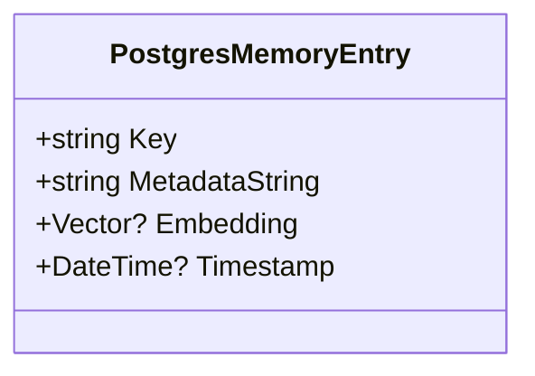
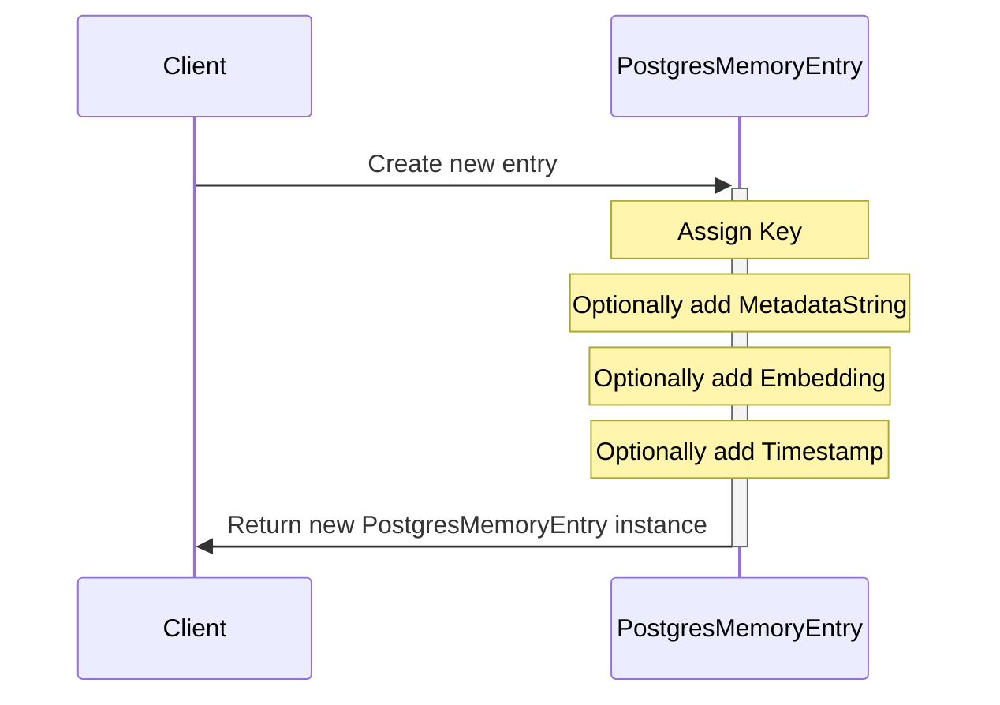

# Overview of PostgresMemoryEntry Structure

The `PostgresMemoryEntry` record struct is designed to represent a single unit of memory storage within a Postgres database. It is tailored for storing embeddings and associated metadata, which are crucial for machine learning applications and semantic analysis. The structure facilitates efficient memory retrieval and operations on vectorized data.

## Primary Functionalities

- **Unique Identifier Management**: Each memory entry has a unique key for retrieval and association purposes.
- **Metadata Storage**: Accommodates additional data in a string format, often JSON, providing context for the embeddings.
- **Embedding Storage**: Stores the vector representation of data, which is essential for similarity searches and vector operations.
- **Timestamping**: Records the creation or last update time in UTC to maintain consistency across different systems.

## Properties

### Key

The `Key` property serves as the unique identifier for the memory entry. It is a string that allows users to retrieve and associate the stored data with its identifier.

```csharp
public string Key { get; set; }
```

### MetadataString

The `MetadataString` property is a string that can store additional data related to the entry. This data is often in JSON format and provides context for the embeddings.

```csharp
public string MetadataString { get; set; }
```

### Embedding

The `Embedding` property holds the vector representation of the associated data. It is nullable to accommodate entries that may not have associated embeddings.

```csharp
public Vector? Embedding { get; set; }
```

### Timestamp

The `Timestamp` property is an optional DateTime value that indicates when the memory entry was created or last updated. It is always in UTC.

```csharp
public DateTime? Timestamp { get; set; }
```

## UML Class Diagram



The UML class diagram above represents the structure of the `PostgresMemoryEntry` record struct. It shows the properties and their types, highlighting the relationships within the struct itself.

## Sequence Diagram for Creating a PostgresMemoryEntry



The sequence diagram illustrates the process of creating a new `PostgresMemoryEntry` instance. The client assigns a key and optionally adds metadata, an embedding, and a timestamp before the new instance is returned.

# Conclusion

The `PostgresMemoryEntry` struct is a fundamental component designed for efficient storage and retrieval of vectorized data in a Postgres database. It is essential for systems that perform semantic analysis and machine learning tasks. The properties within the struct are well-defined, each serving a specific purpose that contributes to the overall functionality of the memory entry. The UML diagrams provide a visual representation of the structure and creation process, aiding in understanding the design and usage of the `PostgresMemoryEntry`.