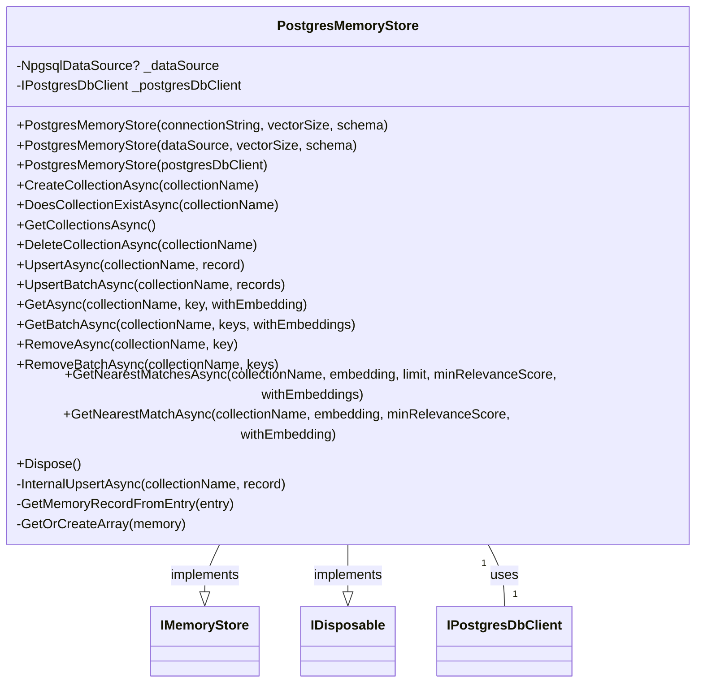

# Overview of PostgresMemoryStore Class

The `PostgresMemoryStore` class is designed to interact with a PostgreSQL database using the pgvector extension, providing a memory store for vector-based operations. It facilitates the management of collections (tables) and memory records (rows) within the database, allowing for efficient storage, retrieval, and similarity search of vector data. The class implements the `IMemoryStore` interface, which defines the contract for memory store operations, and the `IDisposable` interface for proper resource management.

## Primary Functionalities

- **Collection Management**: Create, check, retrieve, and delete collections within the database.
- **Record Management**: Insert (upsert), retrieve, and remove memory records in collections.
- **Similarity Search**: Perform vector similarity searches to find nearest matches.
- **Resource Management**: Dispose of resources such as database connections when no longer needed.

## UML Class Diagram



# Collection Management

## CreateCollectionAsync

This method is responsible for creating a new collection, which corresponds to a new table in the PostgreSQL database.

### Method Signature

```csharp
public async Task CreateCollectionAsync(string collectionName, CancellationToken cancellationToken = default)
```

### Algorithm

1. Validate the `collectionName` to ensure it is not null or whitespace.
2. Invoke `_postgresDbClient.CreateTableAsync` to create a new table in the database.

### Code Snippet

```csharp
public async Task CreateCollectionAsync(string collectionName, CancellationToken cancellationToken = default)
{
    Verify.NotNullOrWhiteSpace(collectionName);
    await _postgresDbClient.CreateTableAsync(collectionName, cancellationToken).ConfigureAwait(false);
}
```

## DoesCollectionExistAsync

Determines if a collection (table) exists within the database schema.

### Method Signature

```csharp
public async Task<bool> DoesCollectionExistAsync(string collectionName, CancellationToken cancellationToken = default)
```

### Algorithm

1. Validate the `collectionName`.
2. Use `_postgresDbClient.DoesTableExistsAsync` to check the existence of the table.

### Code Snippet

```csharp
public async Task<bool> DoesCollectionExistAsync(string collectionName, CancellationToken cancellationToken = default)
{
    Verify.NotNullOrWhiteSpace(collectionName);
    return await _postgresDbClient.DoesTableExistsAsync(collectionName, cancellationToken).ConfigureAwait(false);
}
```

## GetCollectionsAsync

Retrieves all collection names from the database.

### Method Signature

```csharp
public async IAsyncEnumerable<string> GetCollectionsAsync([EnumeratorCancellation] CancellationToken cancellationToken = default)
```

### Algorithm

1. Asynchronously iterate over collection names using `_postgresDbClient.GetTablesAsync`.
2. Yield each collection name to the caller.

### Code Snippet

```csharp
public async IAsyncEnumerable<string> GetCollectionsAsync([EnumeratorCancellation] CancellationToken cancellationToken = default)
{
    await foreach (var collection in _postgresDbClient.GetTablesAsync(cancellationToken).ConfigureAwait(false))
    {
        yield return collection;
    }
}
```

## DeleteCollectionAsync

Deletes a specified collection from the database.

### Method Signature

```csharp
public async Task DeleteCollectionAsync(string collectionName, CancellationToken cancellationToken = default)
```

### Algorithm

1. Validate the `collectionName`.
2. Call `_postgresDbClient.DeleteTableAsync` to remove the table.

### Code Snippet

```csharp
public async Task DeleteCollectionAsync(string collectionName, CancellationToken cancellationToken = default)
{
    Verify.NotNullOrWhiteSpace(collectionName);
    await _postgresDbClient.DeleteTableAsync(collectionName, cancellationToken).ConfigureAwait(false);
}
```

# Record Management

## UpsertAsync

Inserts or updates a memory record within a collection.

### Method Signature

```csharp
public async Task<string> UpsertAsync(string collectionName, MemoryRecord record, CancellationToken cancellationToken = default)
```

### Algorithm

1. Validate the `collectionName`.
2. Call `InternalUpsertAsync` to perform the upsert operation.

### Code Snippet

```csharp
public async Task<string> UpsertAsync(string collectionName, MemoryRecord record, CancellationToken cancellationToken = default)
{
    Verify.NotNullOrWhiteSpace(collectionName);
    return await InternalUpsertAsync(collectionName, record, cancellationToken).ConfigureAwait(false);
}
```

## UpsertBatchAsync

Performs batch insertion or updates of multiple memory records within a collection.

### Method Signature

```csharp
public async IAsyncEnumerable<string> UpsertBatchAsync(string collectionName, IEnumerable<MemoryRecord> records, [EnumeratorCancellation] CancellationToken cancellationToken = default)
```

### Algorithm

1. Validate the `collectionName`.
2. Iterate over the `records` collection.
3. For each `record`, call `InternalUpsertAsync` to perform the upsert operation.
4. Yield the key of the upserted record.

### Code Snippet

```csharp
public async IAsyncEnumerable<string> UpsertBatchAsync(string collectionName, IEnumerable<MemoryRecord> records, [EnumeratorCancellation] CancellationToken cancellationToken = default)
{
    Verify.NotNullOrWhiteSpace(collectionName);
    foreach (var record in records)
    {
        yield return await InternalUpsertAsync(collectionName, record, cancellationToken).ConfigureAwait(false);
    }
}
```

## GetAsync

Retrieves a single memory record by its key from a collection.

### Method Signature

```csharp
public async Task<MemoryRecord?> GetAsync(string collectionName, string key, bool withEmbedding = false, CancellationToken cancellationToken = default)
```

### Algorithm

1. Validate the `collectionName`.
2. Use `_postgresDbClient.ReadAsync` to fetch the record.
3. Convert the result to a `MemoryRecord` using `GetMemoryRecordFromEntry`.

### Code Snippet

```csharp
public async Task<MemoryRecord?> GetAsync(string collectionName, string key, bool withEmbedding = false, CancellationToken cancellationToken = default)
{
    Verify.NotNullOrWhiteSpace(collectionName);
    var entry = await _postgresDbClient.ReadAsync(collectionName, key, withEmbedding, cancellationToken).ConfigureAwait(false);
    return entry.HasValue ? GetMemoryRecordFromEntry(entry.Value) : null;
}
```

## GetBatchAsync

Retrieves multiple memory records by their keys from a collection.

### Method Signature

```csharp
public async IAsyncEnumerable<MemoryRecord> GetBatchAsync(string collectionName, IEnumerable<string> keys, bool withEmbeddings = false, [EnumeratorCancellation] CancellationToken cancellationToken = default)
```

### Algorithm

1. Validate the `collectionName`.
2. Asynchronously iterate over the `keys` using `_postgresDbClient.ReadBatchAsync`.
3. For each entry, convert it to a `MemoryRecord` using `GetMemoryRecordFromEntry`.
4. Yield the `MemoryRecord`.

### Code Snippet

```csharp
public async IAsyncEnumerable<MemoryRecord> GetBatchAsync(string collectionName, IEnumerable<string> keys, bool withEmbeddings = false, [EnumeratorCancellation] CancellationToken cancellationToken = default)
{
    Verify.NotNullOrWhiteSpace(collectionName);
    await foreach (var entry in _postgresDbClient.ReadBatchAsync(collectionName, keys, withEmbeddings, cancellationToken).ConfigureAwait(false))
    {
        yield return GetMemoryRecordFromEntry(entry);
    }
}
```

## RemoveAsync

Removes a memory record by its key from a collection.

### Method Signature

```csharp
public async Task RemoveAsync(string collectionName, string key, CancellationToken cancellationToken = default)
```

### Algorithm

1. Validate the `collectionName`.
2. Call `_postgresDbClient.DeleteAsync` to remove the record.

### Code Snippet

```csharp
public async Task RemoveAsync(string collectionName, string key, CancellationToken cancellationToken = default)
{
    Verify.NotNullOrWhiteSpace(collectionName);
    await _postgresDbClient.DeleteAsync(collectionName, key, cancellationToken).ConfigureAwait(false);
}
```

## RemoveBatchAsync

Removes multiple memory records by their keys from a collection.

### Method Signature

```csharp
public async Task RemoveBatchAsync(string collectionName, IEnumerable<string> keys, CancellationToken cancellationToken = default)
```

### Algorithm

1. Validate the `collectionName`.
2. Call `_postgresDbClient.DeleteBatchAsync` to remove the records.

### Code Snippet

```csharp
public async Task RemoveBatchAsync(string collectionName, IEnumerable<string> keys, CancellationToken cancellationToken = default)
{
    Verify.NotNullOrWhiteSpace(collectionName);
    await _postgresDbClient.DeleteBatchAsync(collectionName, keys, cancellationToken).ConfigureAwait(false);
}
```

# Similarity Search

## GetNearestMatchesAsync

Finds the nearest vector matches to a given embedding within a collection.

### Method Signature

```csharp
public async IAsyncEnumerable<(MemoryRecord, double)> GetNearestMatchesAsync(
    string collectionName,
    ReadOnlyMemory<float> embedding,
    int limit,
    double minRelevanceScore = 0,
    bool withEmbeddings = false,
    [EnumeratorCancellation] CancellationToken cancellationToken = default)
```

### Algorithm

1. Validate `collectionName` and ensure `limit` is positive.
2. Call `_postgresDbClient.GetNearestMatchesAsync` to retrieve the nearest matches.
3. Yield each result as a tuple of `MemoryRecord` and similarity score.

### Code Snippet

```csharp
public async IAsyncEnumerable<(MemoryRecord, double)> GetNearestMatchesAsync(
    string collectionName,
    ReadOnlyMemory<float> embedding,
    int limit,
    double minRelevanceScore = 0,
    bool withEmbeddings = false,
    [EnumeratorCancellation] CancellationToken cancellationToken = default)
{
    Verify.NotNullOrWhiteSpace(collectionName);
    if (limit <= 0) yield break;
    
    var results = _postgresDbClient.GetNearestMatchesAsync(
        tableName: collectionName,
        embedding: new Vector(GetOrCreateArray(embedding)),
        limit: limit,
        minRelevanceScore: minRelevanceScore,
        withEmbeddings: withEmbeddings,
        cancellationToken: cancellationToken);
    
    await foreach (var (entry, cosineSimilarity) in results.ConfigureAwait(false))
    {
        yield return (GetMemoryRecordFromEntry(entry), cosineSimilarity);
    }
}
```

# Resource Management

## Dispose

Ensures that resources such as database connections are properly disposed of when the `PostgresMemoryStore` instance is no longer needed.

### Method Signature

```csharp
public void Dispose()
```

### Algorithm

1. Call `Dispose(true)` to release managed resources.
2. Suppress finalization with `GC.SuppressFinalize(this)`.

### Code Snippet

```csharp
public void Dispose()
{
    Dispose(true);
    GC.SuppressFinalize(this);
}
```

## Dispose(bool)

A protected method that disposes of managed resources when called.

### Method Signature

```csharp
protected virtual void Dispose(bool disposing)
```

### Algorithm

1. If disposing, check if `_dataSource` is an `IDisposable` and dispose it if not null.

### Code Snippet

```csharp
protected virtual void Dispose(bool disposing)
{
    if (disposing)
    {
        (_dataSource as IDisposable)?.Dispose();
    }
}
```

# Conclusion

The `PostgresMemoryStore` class encapsulates the complexities of database interactions, providing a robust set of functionalities for managing memory records and conducting similarity searches within a PostgreSQL database. It ensures efficient resource management through the implementation of the `IDisposable` interface and is well-suited for applications requiring vector-based operations.