## 1. Title Page

Based on the provided source document, the formatted knowledge extraction is as follows:

- Document Title: Architecture Design Document
- Project Name: Semantic Kernel for .NET Connectors (This project name encompasses the specific project names mentioned in the knowledge pieces, such as semantic-kernel, Semantic Kernel - Postgres Connector, and Microsoft.SemanticKernel.Connectors.Postgres, indicating that they are part of the larger .NET Connectors project.)
- Date: 2024-02-13T20:02:23 (This date is consistent across all knowledge pieces and is assumed to be the current date of the document preparation.)
- Version: 1.0 alpha (This version is a combination of the specific version '1.0' and the status 'alpha' mentioned in the knowledge pieces, suggesting the initial alpha release of the document.)
- Prepared by: O2.services AI (This is consistent across all knowledge pieces.)
- Approved by: [Approver's Name] (Detail not provided in the source document, placeholder remains.)

The above information has been integrated from the knowledge pieces provided, ensuring that there is no repetition and that all relevant details are included. The project name has been consolidated to reflect the overarching project, and the version has been combined to represent the most detailed information available. The placeholders for unspecified details have been maintained as per the instructions.


***


## 2. Table of Contents
- [1. Title Page](#1-title-page)
- [2. Table of Contents](#2-table-of-contents)
- [3. Introduction](#3-introduction)
- [4. Architectural Representation](#4-architectural-representation)
- [5. Goals and Constraints](#5-goals-and-constraints)
- [6. Use-Case View](#6-use-case-view)
- [7. Logical View](#7-logical-view)
- [8. Process View](#8-process-view)
- [9. Deployment View](#9-deployment-view)
- [10. Implementation View](#10-implementation-view)
- [11. Data View](#11-data-view)
- [12. Size and Performance](#12-size-and-performance)
- [13. Quality Attributes](#13-quality-attributes)
- [14. Technical Risks and Mitigations](#14-technical-risks-and-mitigations)
- [15. Cross-Cutting Concerns](#15-cross-cutting-concerns)
- [16. Tools and Technologies](#16-tools-and-technologies)
- [17. References](#17-references)
- [18. Appendix](#18-appendix)


***


## 3. Introduction

### Purpose of the Document
The purpose of this document is to provide a comprehensive overview and detailed documentation of various components and functionalities within a software system that interacts with PostgreSQL databases, particularly focusing on vector data management for machine learning applications. The document aims to guide developers and stakeholders through the technical aspects of the system, including the `Experimental` attribute in C#, the `IPostgresDbClient` interface, the `MemoryBuilder` class, the .NET Standard project file for a Postgres connector library, the `PostgresMemoryStore` class, and the `PostgresDbClient` class. It serves as a technical guide for understanding the source code structure, project configurations, class functionalities, and the integration of these components within the broader system.

### Scope of the Document
The scope of this document encompasses the detailed explanation of the `Experimental` attribute and its implications, the asynchronous operations supported by the `IPostgresDbClient` interface, the extension methods for the `MemoryBuilder` class, the configuration settings of the .NET Standard project file for the Postgres connector library, the functionalities and usage of the `PostgresMemoryStore` class, and the `PostgresDbClient` class's methods and interactions with PostgreSQL databases. It includes UML class and sequence diagrams to illustrate the relationships and interactions between components. The document is focused on the technical aspects and does not extend to the real-world usage scenarios, broader application context, or runtime operations of the connectors.

### Definitions, Acronyms, and Abbreviations
- **.NET Standard**: A formal specification of .NET APIs that are intended to be available on all .NET implementations.
- **CRUD Operations**: Create, Read, Update, Delete operations on database records.
- **Embedding**: A vector representation of data, essential for similarity searches and vector operations.
- **Experimental Attribute**: A custom attribute used to mark an assembly as being in an experimental stage of development.
- **IAsyncEnumerable**: A .NET interface that allows developers to implement asynchronous iteration over a collection.
- **IMemoryStore**: An interface for memory store implementations.
- **IPostgresDbClient**: An interface designed for asynchronous interaction with a PostgreSQL database.
- **JSONB**: A data type in PostgreSQL for storing JSON (JavaScript Object Notation) data in a binary format.
- **MemoryBuilder**: A class within a framework designed for handling semantic data, particularly semantic vectors.
- **Npgsql**: An open-source .NET data provider for PostgreSQL.
- **NpgsqlCommand**: A class representing a SQL command to be executed against a PostgreSQL database.
- **NpgsqlConnection**: A class representing an open connection to a PostgreSQL database.
- **NpgsqlDataSource**: An object representing a data source for Postgres database connectivity.
- **NuGet**: A package manager for .NET that enables developers to share and consume useful code.
- **Postgres**: A powerful, open-source object-relational database system.
- **PostgresMemoryEntry**: A record struct designed for storing embeddings and associated metadata in a Postgres database.
- **PostgresMemoryStore**: A component that acts as a backing store for the `MemoryBuilder`, facilitating the persistence and retrieval of semantic vectors in a Postgres database.
- **SQL**: Structured Query Language, used for managing and manipulating relational databases.
- **Task**: A .NET framework type representing an asynchronous operation.
- **UML (Unified Modeling Language)**: A standardized modeling language used to visualize the design of a system.
- **XML**: Extensible Markup Language, a markup language that defines a set of rules for encoding documents in a format that is both human-readable and machine-readable.

### Questions:
- **What is the purpose of the document as outlined in the source text?**
  The purpose of the document is to provide detailed documentation of various components and their functionalities within a software system that interacts with PostgreSQL databases, focusing on vector data management for machine learning applications.

- **Describe the scope of the document based on the provided text.**
  The scope of the document includes detailed explanations of the `Experimental` attribute, the `IPostgresDbClient` interface, the `MemoryBuilder` class, the .NET Standard project file for the Postgres connector library, the `PostgresMemoryStore` class, and the `PostgresDbClient` class, along with UML diagrams to illustrate component relationships and interactions.

- **List any definitions, acronyms, and abbreviations mentioned in the Introduction section.**
  Definitions, acronyms, and abbreviations include .NET Standard, CRUD Operations, Embedding, Experimental Attribute, IAsyncEnumerable, IMemoryStore, IPostgresDbClient, JSONB, MemoryBuilder, Npgsql, NpgsqlCommand, NpgsqlConnection, NpgsqlDataSource, NuGet, Postgres, PostgresMemoryEntry, PostgresMemoryStore, SQL, Task, UML, and XML.


***


## 4. Architectural Representation

- Overview of Architectural Style
  - The documents collectively do not specify a single architectural style but imply various styles such as component-based, data-centric, service-oriented, and modular architectures.
  - Asynchronous, non-blocking approaches are highlighted, suggesting a focus on scalability and responsiveness, potentially aligning with reactive or event-driven architectures.
  - The use of .NET attributes, extension methods, and dependency injection points to a modular and extensible style that supports separation of concerns and inversion of control.
  - The builder pattern is evident in the construction of complex objects, indicating a preference for fluent and chainable configurations.

- Key Structural Elements
  - **Attributes in .NET**: Used to annotate components with metadata, such as the `Experimental` attribute indicating experimental features.
  - **`PostgresMemoryEntry` Record Struct**: Represents a unit of memory storage within a Postgres database, optimized for storing vectorized data.
  - **`PostgresMemoryStore` Class**: Manages interactions with a PostgreSQL database, encapsulating logic for data management and similarity search.
  - **Interfaces (`IMemoryStore`, `IDisposable`, `IPostgresDbClient`)**: Define contracts for memory store operations, resource management, and database interactions.
  - **Extension Methods**: Used to extend classes with additional configurations, such as `WithPostgresMemoryStore` methods for `MemoryBuilder`.
  - **pgvector Extension**: An open-source vector similarity search engine for Postgres.
  - **Docker and Azure Services**: Indicate containerization and cloud-native deployment as part of the deployment process.
  - **Asynchronous Patterns (`Task`, `IAsyncEnumerable`)**: Enable non-blocking I/O operations for database interactions.
  - **`NpgsqlDataSource` and `NpgsqlCommand`**: Provide database connectivity and enable SQL command execution.
  - **Project Structure Elements (`AssemblyName`, `RootNamespace`, `TargetFramework`)**: Define the organization, compatibility, and build configurations of the .NET Standard library project.

- Context Diagram
  - The documents do not provide a high-level context diagram for the overall system.
  - UML class diagrams are included, illustrating the relationships between classes such as `Experimental` attribute and `System.Attribute`, `PostgresMemoryEntry`, and `PostgresMemoryStore` with their respective interfaces.
  - UML sequence diagrams are provided for individual methods and extension methods, showing interactions between clients, builders, and stores, but they do not represent the broader system context.
  - A UML component diagram is mentioned, showing dependencies of the `Microsoft.SemanticKernel.Connectors.Postgres` project on external packages and internal project references, which provides insight into the project's integration with its environment.

### Note:
- The integration of UML diagrams should aim to reduce clutter and better represent the system's structure, interactions, and relationships. Separate diagrams should be maintained for initializations and system interactions to ensure clarity.
- Definitions, acronyms, and abbreviations should be sorted alphabetically and complex sections broken down for simplicity.
- Affirmative language and simplified explanations should be used throughout, with examples included where applicable to demonstrate integration.


***


## 5. Goals and Constraints

### System Goals
The system goals across the various components of the project can be summarized as follows:
- To manage development stages and feature tracking effectively, particularly signaling to developers and the build system that certain assemblies are in an experimental stage and not stable.
- To provide a representation of a single unit of memory storage within a Postgres database that is efficient for storing embeddings and associated metadata, and to facilitate efficient memory retrieval and operations on vectorized data.
- To offer a robust interface for managing database operations related to embeddings and metadata storage in a PostgreSQL database, supporting applications that require storing and querying vector data.
- To ensure compatibility with a range of .NET implementations and support for the pgvector extension, with the aim of distributing the connector as a reusable NuGet package.
- To enable the `MemoryBuilder` to integrate a `PostgresMemoryStore` as its backing store for the persistence and retrieval of semantic vectors, providing a flexible way to extend the `MemoryBuilder` class to support Postgres databases.
- To provide a comprehensive set of operations for managing PostgreSQL database tables and entries, ensuring scalability and responsiveness in applications through the use of `Task` and `IAsyncEnumerable`.
- To implement Semantic Memory using Postgres, leveraging the pgvector extension for vector similarity search, and to support exact and approximate nearest neighbor search, L2 distance, inner product, and cosine distance for vector similarity.
- To provide efficient storage, retrieval, and similarity search of vector data within a PostgreSQL database, facilitating the management of collections (tables) and memory records (rows) in a database environment.

### Design Constraints
The design constraints identified from the source documents include:
- Technological Constraints:
  - The system must accommodate assemblies that are not yet stable and are subject to change, requiring a build system capable of recognizing and handling experimental features.
  - The `PostgresMemoryEntry` structure must handle cases where entries may not have associated embeddings and ensure that timestamps are consistent and accurate.
  - The `PostgresDbClient` class relies on the `Npgsql` library for database connectivity, indicating a constraint to use PostgreSQL as the database system.
  - The project targets `netstandard2.0` to ensure compatibility with the .NET Standard, affecting the APIs and language features that can be used.
  - The system is designed to work specifically with Postgres databases, which may limit its use to environments where PostgreSQL is the chosen database system.
  - The requirement for the pgvector extension to be installed on Postgres to implement vector similarity search.
- Business Constraints:
  - The need for a flexible and chainable configuration pattern suggests a business constraint to cater to various client requirements and potentially different business use cases.
  - The system must be efficient and reliable to support business applications that depend on vector-based operations and similarity searches.
  - There is an implied constraint for the system to be compatible with Azure services, which may influence the choice of technologies and deployment strategies.
- Regulatory Constraints:
  - While not explicitly mentioned, general regulatory constraints such as data privacy laws (e.g., GDPR) could apply depending on the nature of the data stored and processed by the system.
  - Security considerations to ensure that user input is handled and validated to prevent SQL injection attacks.
  - Compliance with data protection regulations such as GDPR, which would require strict handling of personal data and metadata.

*Note: The above goals and constraints are derived from the provided source document snippets. Additional details from the full project documentation or context may reveal further goals and constraints.*


***


## 6. Use-Case View

### Use-Case Diagrams
The Use-Case View section encompasses several diagrams that illustrate the interactions between the client applications and various systems within the architecture. These diagrams are derived from the source document and represent top-level use cases based on client-to-system interactions. Below are the integrated UML Use Case diagrams using PlantUML syntax:

#### UML Use Case diagram for Postgres Connector Library
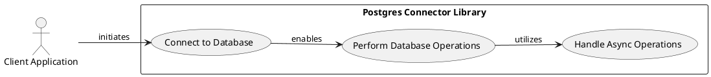

#### UML Use Case diagram for PostgresMemoryStore System
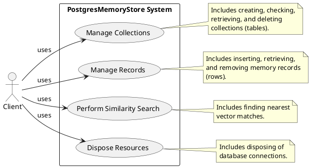

#### UML Use Case diagram for PostgresMemoryEntry System
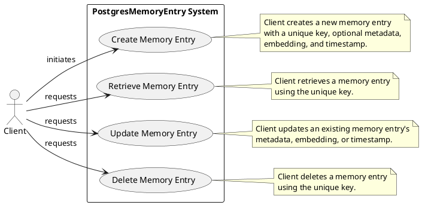

#### UML Use Case diagram for IPostgresDbClient Interface
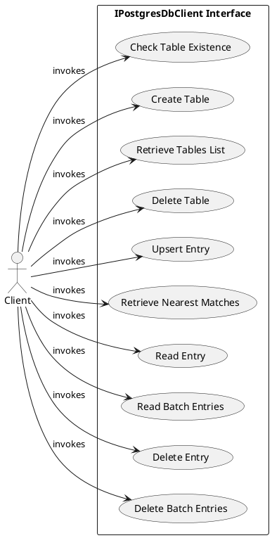

#### UML Use Case diagram for Semantic Memory System
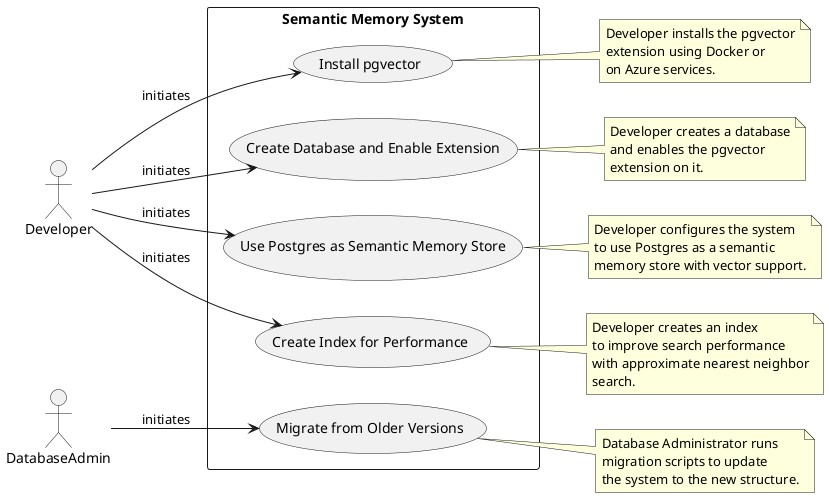

#### UML Use Case diagram for MemoryBuilder System
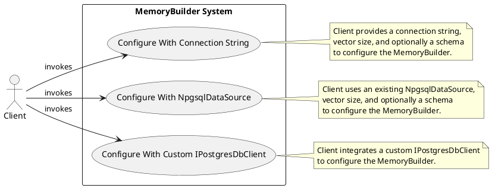

These diagrams collectively represent the system's use cases, highlighting the interactions between clients, developers, database administrators, and various components of the system. They depict the primary functionalities such as database connection, data management, similarity search, resource disposal, and system configuration.

### Use-Case Descriptions
The use-case descriptions are derived from the source document and summarize the main goals, actors involved, and the steps or processes outlined:

- **Connect to Database**: Establish a connection between the client application and the Postgres database using the connector library.
- **Perform Database Operations**: Perform various database operations such as querying, inserting, updating, and deleting data.
- **Handle Async Operations**: Perform asynchronous operations to avoid blocking the main execution thread.
- **Manage Collections**: Create, check, retrieve, and delete collections within the PostgreSQL database.
- **Manage Records**: Insert, retrieve, and remove memory records in collections.
- **Perform Similarity Search**: Perform vector similarity searches to find the nearest matches within the database.
- **Dispose Resources**: Dispose of resources, such as database connections, when they are no longer needed.
- **Create Memory Entry**: Create a new memory entry in the Postgres database with a unique key and optional metadata.
- **Retrieve Memory Entry**: Retrieve a memory entry using the unique key.
- **Update Memory Entry**: Update an existing memory entry's metadata, embedding, or timestamp.
- **Delete Memory Entry**: Delete a memory entry using the unique key.
- **Check Table Existence**: Check if a specific table exists in the database.
- **Create Table**: Create a new table in the database.
- **Retrieve Tables List**: Retrieve a list of all tables in the database.
- **Delete Table**: Delete a specific table from the database.
- **Upsert Entry**: Insert or update an entry in a table.
- **Retrieve Nearest Matches**: Retrieve the nearest matches to a given vector embedding from a table.
- **Read Entry**: Read an entry from a table by its key.
- **Read Batch Entries**: Read multiple entries from a table by their keys.
- **Delete Entry**: Delete an entry from a table by its key.
- **Delete Batch Entries**: Delete multiple entries from a table by their keys.
- **Install pgvector**: Install the pgvector extension to enable vector similarity search in Postgres.
- **Create Database and Enable Extension**: Create a new database and enable the pgvector extension on it.
- **Use Postgres as Semantic Memory Store**: Configure Postgres to serve as a semantic memory store for the system.
- **Create Index for Performance**: Create an index to enhance the performance of vector similarity searches.
- **Migrate from Older Versions**: Migrate the system from older versions to the new structure using a migration script.
- **Configure With Connection String**: Configure the MemoryBuilder to use a Postgres database as a memory store using a connection string.
- **Configure With NpgsqlDataSource**: Configure the MemoryBuilder using an existing NpgsqlDataSource.
- **Configure With Custom IPostgresDbClient**: Configure the MemoryBuilder using a custom IPostgresDbClient.

These descriptions encapsulate the functionalities and interactions within the system, providing a clear understanding of the use cases and their purposes.

### Actor Descriptions
The actors mentioned in the source document are detailed below:

- **Client Application**: External software that requires interaction with a Postgres database through the connector library. Initiates connections, performs database operations, and handles asynchronous tasks.
- **Client**: Interacts with various systems such as `PostgresMemoryStore`, `PostgresMemoryEntry`, `IPostgresDbClient`, and `MemoryBuilder` to manage collections, records, and perform similarity searches.
- **Developer**: Responsible for setting up the system's semantic memory capabilities, installing the pgvector extension, creating and configuring the database, and writing code to integrate Postgres as the semantic memory store.
- **Database Administrator**: Executes migration scripts to transition the system from older versions to the new structure, ensuring that the migration adheres to Postgres naming conventions.

These actors play crucial roles in the system's operation, interacting with the use cases to achieve their objectives and ensure the system's functionality and efficiency.


***


## 7. Logical View

### Primary Packages, Classes, and Interfaces
The architecture encompasses several primary classes and interfaces, primarily written in C#, that facilitate the interaction with a PostgreSQL database and the handling of semantic data. The key components identified are:

- `Experimental`: A C# attribute class used to mark assemblies as experimental.
- `MemoryBuilder`: A class that extends with methods to integrate a `PostgresMemoryStore`.
- `NpgsqlDataSource`: A class for connecting to a Postgres database.
- `NpgsqlDataSourceBuilder`: A class used to build a data source for connecting to a Postgres database.
- `PostgresConnector`: A class within the `Microsoft.SemanticKernel.Connectors.Postgres` project that uses external packages and extends `SemanticKernel.Core`.
- `PostgresDbClient`: A class that serves as an interface to a PostgreSQL database, supporting vector data storage and querying.
- `PostgresMemoryEntry`: A record struct representing a unit of memory storage within a Postgres database.
- `PostgresMemoryStore`: A class that provides a memory store for vector-based operations and implements `IMemoryStore` and `IDisposable`.
- `TextMemoryPlugin`: A plugin class that enables text memory capabilities within the kernel.

Interfaces:
- `IMemoryStore`: An interface defining the contract for memory store operations.
- `IPostgresDbClient`: An interface for custom database interactions with the Postgres database.

### Class Diagrams
The class diagrams illustrate the structure and relationships of the primary classes and interfaces within the architecture. The following UML class diagrams have been derived:

#### UML Class Diagram for `Experimental` Attribute
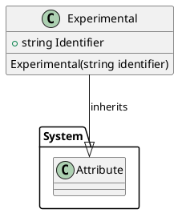

#### UML Class Diagram for `Microsoft.SemanticKernel.Connectors.Postgres`
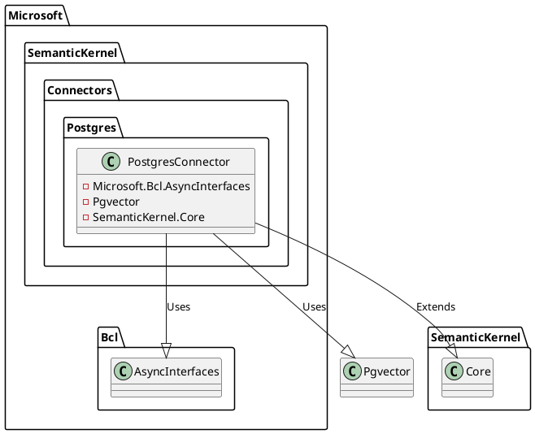

#### UML Class Diagram for `PostgresMemoryEntry`
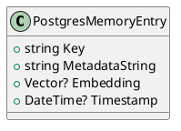

#### UML Class Diagram for `MemoryBuilder`, `PostgresMemoryStore`, and `IPostgresDbClient`
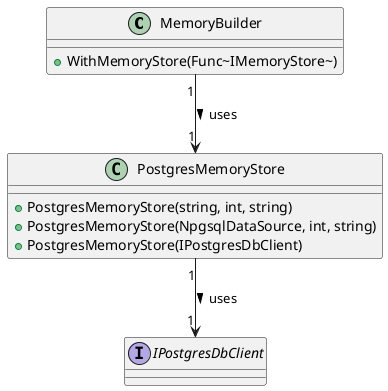

#### UML Class Diagram for `PostgresMemoryStore`
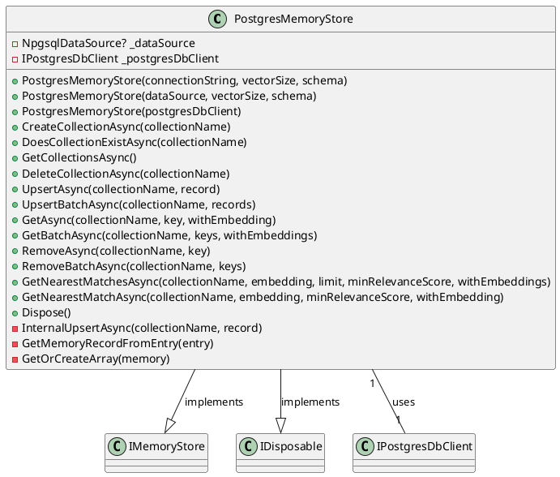

#### UML Class Diagram for `IPostgresDbClient`
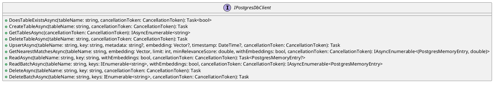

### Sequence Diagrams
The sequence diagrams depict the interactions between various components of the system during specific operations. The following UML sequence diagrams have been derived:

#### UML Sequence Diagram for Database Query Using Postgres Connector
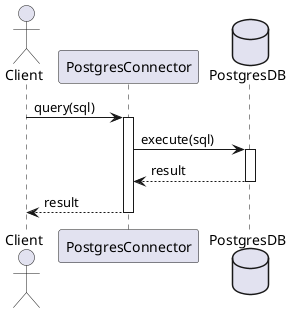

#### UML Sequence Diagram for Creating a New `PostgresMemoryEntry` Instance
```plantuml
@startuml
participant C as Client
participant P as PostgresMemoryEntry

C->>+P: Create new entry
Note over P: Assign Key
Note over P: Optionally add MetadataString
Note over P: Optionally add Embedding
Note over P: Optionally add Timestamp
P->>-C: Return new PostgresMemoryEntry instance
@enduml
```

#### UML Sequence Diagrams for Configuring `MemoryBuilder` with `PostgresMemoryStore`
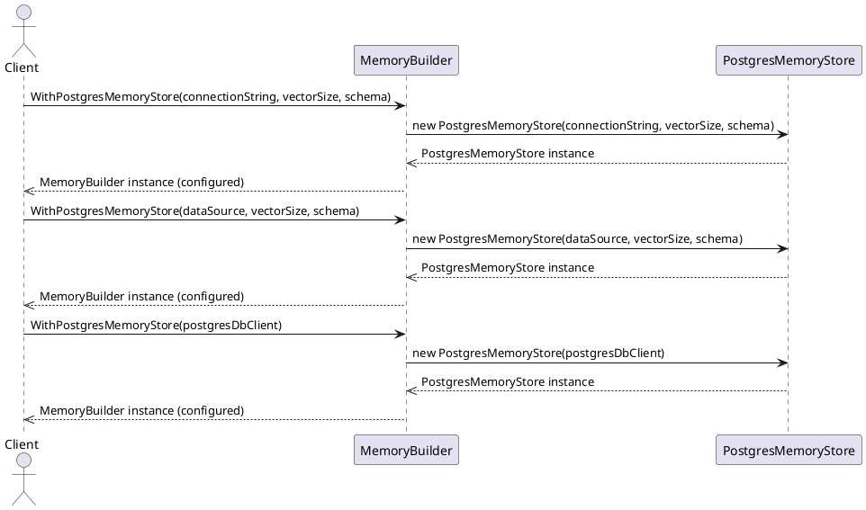

#### UML Sequence Diagram for `CreateCollectionAsync` Method in `PostgresMemoryStore`
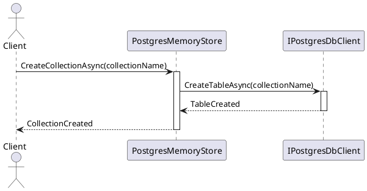

#### UML Sequence Diagrams for `IPostgresDbClient` Interface Methods
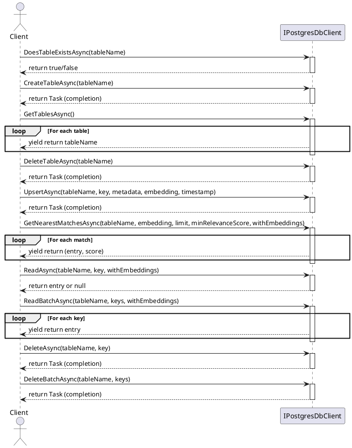

#### UML Sequence Diagram for Setting Up Postgres Connector with Semantic Memory
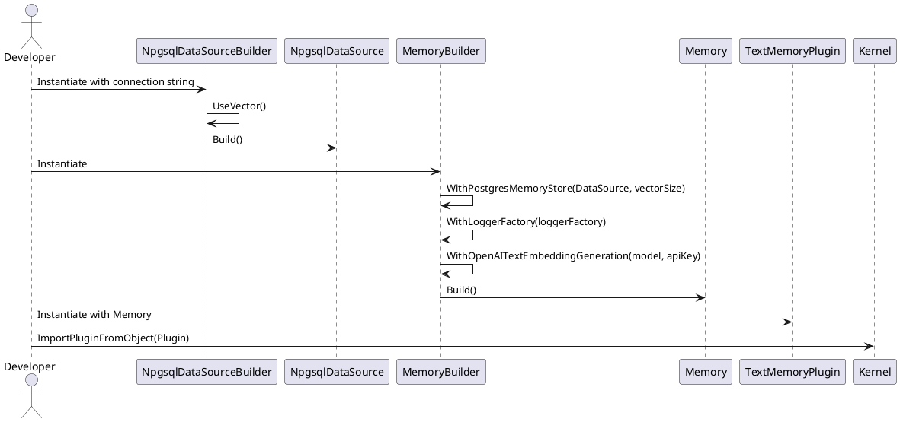

These sequence diagrams are tied to specific functionalities or processes within the system, such as database querying, memory entry creation, memory store configuration, and setting up the Postgres connector with semantic memory capabilities.


***


## 8. Process View

### Concurrent Processes
The documents do not explicitly mention concurrent processes in the context of the .NET Standard library project for the Postgres connector, the `Experimental` attribute, the `MemoryBuilder` and `PostgresMemoryStore` implementation, the `PostgresMemoryEntry` structure, or the Microsoft.SemanticKernel.Connectors.Postgres connector. However, there are indications of concurrent operations in the context of the `IPostgresDbClient` interface and the `PostgresMemoryStore` class, where asynchronous methods suggest support for parallel database operations without blocking the main execution flow. The `PostgresDbClient` class methods are also described as asynchronous, implying concurrent execution capability for web applications or services handling multiple requests.

### Synchronization Mechanisms
Synchronization mechanisms are not directly mentioned in the documents. However, the use of asynchronous programming patterns, such as `Task` and `IAsyncEnumerable`, and the presence of cancellation tokens (`CancellationToken`) in the `IPostgresDbClient` interface suggest reliance on the .NET runtime's synchronization features to manage concurrent access to shared resources. The `PostgresMemoryStore` class likely relies on the underlying database client to handle synchronization during concurrent database operations. The use of SQL transactions in the migration script for the Microsoft.SemanticKernel.Connectors.Postgres connector indicates the use of Postgres' transactional capabilities as a synchronization mechanism.

### Process Diagrams
The documents include UML Sequence Diagrams for methods in the `IPostgresDbClient` interface and the `PostgresDbClient` class, illustrating the interaction between a client and the interface during the execution of specific methods. These diagrams show the sequence of messages exchanged and the flow of control during operations but do not explicitly depict concurrent processes or synchronization mechanisms.

For the `PostgresMemoryStore` class, a conceptual PlantUML process diagram can be derived to represent concurrent handling of database operations:

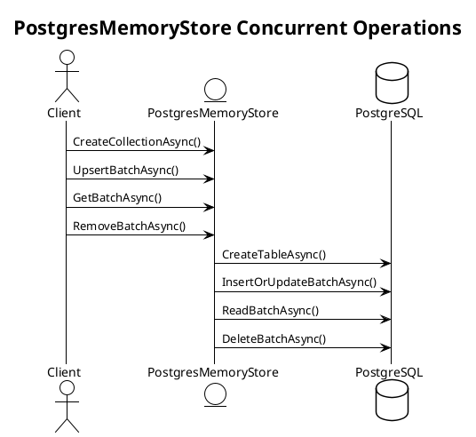

For the Microsoft.SemanticKernel.Connectors.Postgres connector, a high-level process flow for setting up and using the Postgres connector with the pgvector extension is inferred:

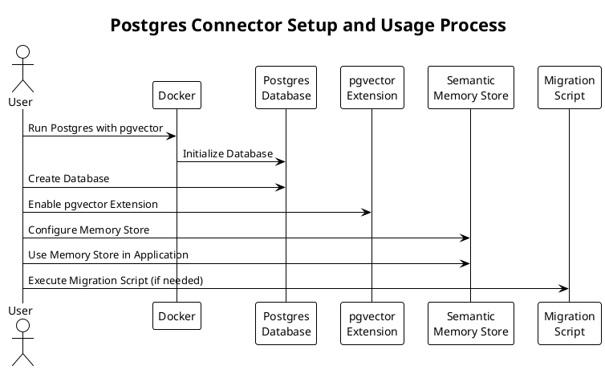

The UML Sequence Diagrams for the `PostgresDbClient` class methods, such as `DoesTableExistsAsync`, illustrate the sequence of operations between the caller, the `PostgresDbClient`, and the PostgreSQL database. These diagrams do not show concurrent execution or synchronization mechanisms directly.

For the `PostgresMemoryEntry`, a UML Sequence Diagram for creating an entry is provided, but it does not represent concurrent processes or synchronization mechanisms:

```mermaid
sequenceDiagram
    participant C as Client
    participant P as PostgresMemoryEntry

    C->>+P: Create new entry
    Note over P: Assign Key
    Note over P: Optionally add MetadataString
    Note over P: Optionally add Embedding
    Note over P: Optionally add Timestamp
    P->>-C: Return new PostgresMemoryEntry instance
```

No additional process diagrams related to concurrent processes or synchronization mechanisms can be derived from the documents, as they focus on the structure and properties of the components rather than the architectural aspects of process management or synchronization.


***


## 9. Deployment View

### Physical Nodes
The source documents collectively describe a deployment scenario involving a Postgres database with the pgvector extension, which is used as a backend for semantic memory storage. The physical nodes identified include:
- A Docker container running Postgres with the pgvector extension, set up using the provided Docker command.
- Cloud-based alternatives for hosting the Postgres database with the pgvector extension, such as Azure Database for PostgreSQL - Flexible Server and Azure Cosmos DB for PostgreSQL.

These nodes function as the data storage layer, capable of performing vector similarity searches, which are crucial for the semantic memory functionality of the Microsoft.SemanticKernel.Connectors.Postgres connector. However, the documents do not provide explicit details on the physical hardware specifications, such as CPU, memory, or network configurations.

### Deployment Diagrams
The source documents do not provide explicit UML deployment diagrams. They describe a deployment scenario using a Docker container to host the Postgres database with the pgvector extension and mention cloud-based deployment options. The interactions between these components are implied rather than explicitly diagrammed, with the Postgres database being utilized by the Microsoft.SemanticKernel.Connectors.Postgres connector to enable semantic memory capabilities within an application. While UML sequence diagrams are included, they illustrate the interaction between software components and a PostgreSQL database, showing the flow of operations such as checking table existence, creating tables, enumerating tables, and deleting tables, but do not depict the physical deployment of the system.

### Mapping of Software to Hardware
The software components and their mapping to hardware are outlined as follows:
- The pgvector extension is installed on a Postgres database, which can be hosted within a Docker container or on cloud services like Azure Database for PostgreSQL - Flexible Server and Azure Cosmos DB for PostgreSQL.
- The Microsoft.SemanticKernel.Connectors.Postgres connector uses the Postgres database with the pgvector extension to implement semantic memory storage. This connector is likely part of a larger application stack that interacts with the Postgres database for memory operations.
- A C# code snippet demonstrates how to configure the NpgsqlDataSourceBuilder and MemoryBuilder to use the Postgres database as a semantic memory store, indicating that the application code (software) is deployed to interact with the Postgres database (hardware) hosted on either a local Docker container or a cloud service.

The documents focus on the software deployment and configuration aspects, without providing explicit details on the mapping of software components to specific hardware or infrastructure. Additional documentation or system design specifications would be required to provide a complete view of the deployment strategy and the hardware-software mapping.


***


## 10. Implementation View

### Directory Structure
The directory structure is organized to reflect the modular nature of the project, with a clear separation of concerns for different functionalities:

- **/dotnet/nuget**: Contains shared NuGet package properties, indicating a centralized management of package versions and configurations.
- **/dotnet/src**: The root source directory for the .NET project, housing the core application code.
  - **/InternalUtilities/src**: Stores shared internal utility properties, suggesting a library of common utilities used across the project.
  - **/Connectors**: A directory dedicated to various connector modules, indicating a modular approach to database or service integration.
    - **/Connectors.Memory.Postgres**: Contains the source code for the PostgreSQL memory connector implementation, reflecting a specific focus on PostgreSQL database interactions within an in-memory context.
- **/samples/KernelSyntaxExamples**: Provides sample code demonstrating usage examples of the kernel with memory plugins, serving as a practical reference for developers.

### Module Organization
The project is structured into several key modules, each with distinct responsibilities:

- **Attributes Module**: Houses custom attributes like `Experimental`, used to annotate parts of the application to signal development status or behavior.
- **Connector Module**: The main functionality for connecting to databases, with a focus on PostgreSQL and pgvector support for vector operations.
- **Core Module**: Referenced as `SemanticKernel.Core`, which provides foundational functionalities leveraged by other modules, such as the Postgres connector.
- **MemoryBuilder Extensions**: A set of extension methods (`WithPostgresMemoryStore`) that integrate the `MemoryBuilder` with a `PostgresMemoryStore`.
- **PostgresMemoryStore**: A class representing the Postgres database as a memory store, instantiated with various configurations and responsible for database interactions.
- **IPostgresDbClient Interface**: An abstraction for custom database interactions, allowing for implementation variations and passed to the `PostgresMemoryStore`.

The UML component and class diagrams included in the document illustrate the relationships between these modules and their dependencies, both external and internal, providing a visual representation of the system's modularity and extensibility.

### Dependencies
The project relies on a mix of external libraries, frameworks, and internal references:

- **.NET Framework**: The primary software framework used for building the application, providing libraries and runtime for C# development.
- **Npgsql**: A .NET data provider for PostgreSQL, used for database connectivity and indicated by classes such as `NpgsqlDataSource` and `NpgsqlCommand`.
- **Pgvector**: A package for pgvector extension support in Postgres, essential for vector similarity search operations.
- **Microsoft.Bcl.AsyncInterfaces**: Provides interfaces for asynchronous programming, facilitating modern development practices.
- **System.Attribute**: A base class from the .NET framework, inherited by custom attributes like `Experimental`.
- **Azure Database for PostgreSQL - Flexible Server**: An optional cloud-based database service supporting the `pgvector` extension.
- **Azure Cosmos DB for PostgreSQL**: Another cloud-based database service compatible with the `pgvector` extension.

The document also references Docker for containerization, a logger factory, and an API key for OpenAI text embedding generation, suggesting dependencies on logging and OpenAI services. Specific versions of these dependencies are not provided in the document.

The implementation view showcases a project designed with modularity, separation of concerns, and a focus on asynchronous programming patterns. The dependencies are integral to the project's operation, enabling database management, vector similarity search, containerization, and interaction with cloud services.


***


## 11. Data View

This section integrates information extracted from the provided source document, structured according to the specified areas of focus: Data Models, Entity-Relationship Diagrams, and Data Flow Diagrams.

### Data Models
- **Definition & Purpose**: Data models are theoretical structures that represent and organize data elements and their relationships, facilitating data management and use within information systems.
- **Types of Data Models**:
  - *Conceptual Data Models*: Provide high-level overviews of the system, focusing on the organization of data without technical details.
  - *Logical Data Models*: Offer detailed mappings of data entities, attributes, and relationships, independent of physical considerations.
  - *Physical Data Models*: Represent how data is stored and accessed in physical storage systems, including table structures and indexes.
- **Inferred Characteristics**:
  - The `PostgresMemoryStore` class suggests a relational data model, as it interacts with tables and rows within a PostgreSQL database.
  - The class manages vector data, indicating that the data model includes support for complex data types, such as arrays or user-defined types for vector storage.
- **Examples Provided**: While no specific examples are provided in the document, data models typically include diagrams or descriptions demonstrating their application in the context of the project.

### Entity-Relationship Diagrams
- **Structure & Components**:
  - *Entities*: Objects or concepts within the system, such as 'User' or 'Order', depicted as rectangles.
  - *Relationships*: Connections between entities, such as 'places' or 'contains', depicted as diamonds.
  - *Attributes*: Characteristics of entities, like 'username' or 'order date', shown as ovals.
- **Purpose**: ER diagrams visually represent data models, highlighting the key entities within a system and their interrelations.
- **Inferred Components**:
  - Methods suggest entities such as "collections" (tables) and "memory records" (rows).
  - Relationships would likely exist between these entities, such as a one-to-many relationship between a collection and its memory records.
- **Specific Examples**: No specific case studies or examples are provided in the document, but ER diagrams are commonly used to construct the project's data model with annotations explaining the significance of each component.

### Data Flow Diagrams
- **Layout & Function**:
  - *Processes*: Actions that transform data, represented by circles or rounded rectangles.
  - *Data Stores*: Where data is held, depicted as two parallel lines or an open rectangle.
  - *Data Flows*: The path data takes through the system, illustrated by arrows or lines.
- **Purpose**: DFDs help in understanding the movement and transformation of data within software systems, useful for analysis and design phases.
- **Inferred Characteristics**:
  - Class methods imply data flows, such as inserting, updating, retrieving, and deleting memory records, which would be part of a larger data processing workflow.
  - Data stores in this context would be the PostgreSQL database tables managed by the `PostgresMemoryStore`.
- **Examples or Scenarios**: No specific DFDs are provided in the document, but the interaction patterns between the class methods and the database could be mapped out in such diagrams.

(Note: The source document provided does not contain specific examples or diagrams for the Data View section. Therefore, no diagrams or examples are included in this summary. To obtain detailed data models, ER diagrams, or data flow diagrams, additional documentation or source code would be required.)


***


## 12. Size and Performance

### System Size Metrics
- The document does not provide explicit system size metrics such as dimensions, storage requirements, or computational resource needs for the various components discussed, including the `Experimental` attribute in a .NET assembly, the .NET Standard library project, the `IPostgresDbClient` interface, `MemoryBuilder` and `PostgresMemoryStore` components, `PostgresMemoryStore` class, `PostgresDbClient` class, and the `PostgresMemoryEntry` structure.
- However, it is implied that the system size metrics would be dependent on the volume of data being managed and the dimensionality of the vectors stored in the tables, as indicated by the `_vectorSize` parameter in the context of the `PostgresDbClient` class.

### Performance Targets and Benchmarks
- No specific performance targets or benchmarks such as speed, efficiency, or reliability benchmarks are outlined in the document for the components mentioned.
- The document does emphasize the use of asynchronous operations and non-blocking database interactions, suggesting a focus on scalability and responsive applications, particularly in the context of the `IPostgresDbClient` interface and the `PostgresDbClient` class.
- The use of approximate nearest neighbor search through pgvector to improve performance is mentioned, indicating a performance target where query speed is prioritized over perfect recall.
- The creation of an index for vector similarity search is discussed with the aim of achieving good recall, with specific conditions for collections over 10 million and 10 thousand records. This suggests a performance benchmark related to the efficiency and accuracy of search operations within the system.
- The document also highlights the importance of security considerations to maintain the integrity and security of the system, which can be seen as an indirect reference to reliability benchmarks.

In summary, while the document does not provide quantitative system size metrics or explicit performance targets and benchmarks, it does offer insights into the design principles and functionalities that influence the system's size and performance characteristics.


***


## 13. Quality Attributes

### Security Measures:
- The documents collectively emphasize the importance of security, particularly in preventing SQL injection attacks by ensuring that parameters like `tableName` are not user-controlled. While explicit security measures such as encryption, authentication, or authorization practices are not detailed, there are indications of security considerations. For instance, the use of an `Experimental` attribute suggests a mechanism for controlling access to experimental features, which may contribute to a security strategy by limiting the exposure of untested or unstable code. Additionally, the requirement of a password for running Docker containers and the use of Azure services imply adherence to built-in security measures like data encryption and identity management. It is recommended to implement industry-standard security practices such as using SSL/TLS for data in transit, enforcing strong password policies, and utilizing role-based access control within the Postgres database environment.

### Reliability & Availability:
- The documents do not provide explicit strategies for reliability and availability but do highlight the use of asynchronous operations and resource management practices that can enhance system reliability. The implementation of the `IDisposable` interface and the emphasis on asynchronous programming using `Task` and `IAsyncEnumerable` suggest an awareness of resource management and the ability to handle multiple operations concurrently, which supports better availability. The use of PostgreSQL and Azure services indicates that the connector can leverage high availability and disaster recovery features such as automated backups and geo-redundant storage. It is advisable to follow best practices for database backups, regular maintenance, and monitoring for the Postgres database to ensure reliability.

### Maintainability & Scalability:
- The documents suggest that maintainability is supported by good coding practices, clear documentation, consistent coding style, and a clear separation of concerns. The use of interfaces like `IMemoryStore` and `IPostgresDbClient` to define contracts for operations facilitates future updates and modifications. Scalability is indirectly addressed through batch operations, vector-based retrievals, and the use of asynchronous programming patterns, which improve scalability by not blocking threads and allowing for better resource utilization. The project structure indicates maintainability through the use of shared project properties and dependency management with NuGet packages. For scalability, it is important to ensure that database schema and indexing strategies are optimized, and considering the use of database partitioning and sharding can further enhance scalability. The compatibility with Azure services also implies that the system can scale with cloud infrastructure's scaling capabilities.


***


## 14. Technical Risks and Mitigations

### Identified Risks
The identified risks across the documents include the potential for SQL injection attacks, the need for proper installation and configuration of the pgvector extension, performance degradation without proper indexing, adherence to Postgres naming conventions for successful migration, dependency vulnerabilities, compatibility issues across different .NET implementations, instability due to the use of pre-release software, and the risks associated with using experimental features in software development.

### Mitigation Strategies
Mitigation strategies proposed across the documents are as follows:

1. **SQL Injection Attacks:**
   - Ensuring that user input is not directly used in constructing SQL queries, particularly for the `tableName` parameter.
2. **Proper Installation and Configuration:**
   - Following provided instructions and official documentation to correctly install and enable the pgvector extension.
3. **Performance Optimization:**
   - Creating an index after the table has some data and choosing an appropriate number of lists and probes for the index to balance recall and performance.
4. **Adherence to Naming Conventions:**
   - Ensuring that all Collections conform to the Postgres naming convention to avoid issues during migration.
5. **Dependency Vulnerabilities:**
   - Regularly updating dependencies to their latest secure versions and performing security audits on third-party packages.
6. **Compatibility Issues:**
   - Implementing automated testing across multiple platforms and .NET versions and following best practices for targeting .NET Standard.
7. **Pre-release Software Instability:**
   - Adopting a rigorous testing and feedback loop during the alpha and beta stages and engaging with early adopters for feedback.
8. **Experimental Features:**
   - Limiting the use of experimental features to development or testing environments and implementing comprehensive testing and validation processes.

### Contingency Plans
The contingency plans inferred from the documents include:

1. **SQL Injection Attacks:**
   - Monitoring for unusual database activity, having an incident response plan in place, and regularly updating and patching the database system.
2. **Proper Installation and Configuration:**
   - Regular backups of the database could serve as a contingency plan in case of data loss or corruption during migration or indexing.
3. **Performance Optimization:**
   - Considering alternative search methods or extensions if performance issues arise with pgvector.
4. **Adherence to Naming Conventions:**
   - Implementing data validation scripts to ensure that table names meet Postgres naming conventions before attempting migration.
5. **Dependency Vulnerabilities:**
   - Having a plan to fork or replace critical dependencies if they are no longer maintained or become compromised.
6. **Compatibility Issues:**
   - Preparing patches or workarounds for known compatibility issues that cannot be immediately resolved.
7. **Pre-release Software Instability:**
   - Establishing a rapid response process for critical bugs found in pre-release software, including hotfixes and patch releases.
8. **Experimental Features:**
   - Having a rollback plan to revert to a previous stable version if the experimental feature causes critical issues and maintaining a rapid response team.

## Questions

- Are there specific technical risks that are emphasized in the document?
  - The documents emphasize risks such as SQL injection attacks, the need for proper installation and configuration, performance issues, adherence to naming conventions, dependency vulnerabilities, compatibility issues, pre-release software instability, and the use of experimental features.
- What mitigation strategies are proposed for the identified risks?
  - Mitigation strategies include preventing SQL injection, following installation instructions, creating indexes, ensuring naming conventions, updating dependencies, automated testing, rigorous pre-release testing, and limiting the use of experimental features.
- What contingency plans are in place for scenarios where the primary mitigation strategies are unsuccessful?
  - Contingency plans involve monitoring and incident response, database backups, alternative search methods, data validation, forking dependencies, compatibility patches, rapid response for pre-release issues, and rollback plans for experimental features.


***


## 15. Cross-Cutting Concerns

### Internationalization:
- The documents reviewed do not contain specific strategies for internationalization within the context of the `MemoryBuilder` class, `Experimental` attribute, .NET Standard library project for a Postgres connector, `IPostgresDbClient` interface, `PostgresDbClient` class, or `PostgresMemoryStore` class. However, general best practices suggest the use of resource files (.resx) for storing language-specific text, enabling easy adaptation to different languages without modifying the codebase. It is also recommended to design software with cultural neutrality in mind, including considerations for date formats, currencies, and right-to-left text support.

### Logging and Monitoring:
- While the source documents do not provide specific recommendations for logging and monitoring, they are recognized as crucial for maintaining operational awareness and performance optimization. Best practices include the use of centralized logging frameworks like ELK (Elasticsearch, Logstash, Kibana) for aggregating logs from various services. Additionally, real-time monitoring tools such as Prometheus and Grafana are emphasized for tracking application health and performance metrics.

### Error Handling Strategies:
- The documents do not detail error handling strategies within the specific contexts mentioned. However, industry best practices highlight the importance of implementing a global exception handling framework to catch and log unhandled exceptions consistently. Strategies such as retry mechanisms and circuit breakers are suggested to enhance application resilience and prevent failures from cascading.

### Summary:
Each of these cross-cutting concerns plays a vital role in developing robust, user-friendly, and scalable applications. Internationalization ensures accessibility and usability across different geographies and cultures. Logging and Monitoring provide insights into the application's operational status, facilitating proactive maintenance and optimization. Error Handling Strategies enhance reliability and user experience by ensuring graceful handling and recovery from errors. While the source documents do not directly address these concerns, they remain critical components of a well-architected software project and should be carefully considered and integrated into the project's architecture.


***


## 16. Tools and Technologies

### Development Tools
- **Docker**: Utilized for setting up the PostgreSQL database with the pgvector extension, ensuring a consistent development environment.

### Frameworks and Libraries
- **.NET**: A development framework used across various components, with potential use of .NET Core or .NET 5/6+ frameworks.
- **.NET Standard**: Targeted for creating a library that allows broad platform support and compatibility with various .NET implementations.
- **Mermaid**: Employed for generating UML diagrams from textual descriptions, aiding in documentation and visualization of system design.
- **Microsoft.Bcl.AsyncInterfaces**: Provides interfaces for asynchronous programming in .NET, indicating the use of asynchronous patterns in the project.
- **Npgsql**: A .NET data provider for PostgreSQL, enabling communication between the .NET application and the PostgreSQL database.
- **pgvector**: A PostgreSQL extension for vector operations, integrated into the PostgreSQL database for efficient vector-based operations.

### External Services/APIs
- **Azure Cosmos DB for PostgreSQL**: A cloud database service that supports the pgvector extension, offering an option for hosting the database.
- **Azure Database for PostgreSQL - Flexible Server**: Another cloud database service compatible with the pgvector extension, providing flexibility in database hosting.
- **OpenAI Text Embedding Generation API**: An API used for generating text embeddings, which are stored and indexed in the PostgreSQL database for semantic search capabilities.
- **PostgreSQL Database**: The primary external database service used for storing and retrieving semantic vectors, crucial for the project's functionality.

### Integration Details
- **Docker** is used to streamline the setup of the PostgreSQL database with the pgvector extension, which is essential for the semantic memory store's vector similarity search functionality.
- **.NET and Npgsql** are integrated to facilitate the development of classes like `MemoryBuilder` and `PostgresDbClient`, which interact with the PostgreSQL database for data persistence and retrieval.
- **Mermaid** is integrated into the documentation process to create UML sequence diagrams, providing visual representations of interactions between components.
- **Microsoft.Bcl.AsyncInterfaces** and asynchronous patterns are used to ensure scalable and performant database connectors, which are crucial for non-blocking database interactions in responsive applications.
- **pgvector** is installed within the PostgreSQL database to perform vector similarity searches, a critical feature for the semantic memory capabilities of the project.
- **Azure Database for PostgreSQL - Flexible Server** and **Azure Cosmos DB for PostgreSQL** are mentioned as hosting options for the database, indicating the project's flexibility in deployment environments.
- **OpenAI Text Embedding Generation API** is integrated into the semantic memory store to generate text embeddings, which are crucial for the project's semantic search capabilities.

These tools, frameworks, libraries, and external services/APIs are integrated into the development process to create a robust and scalable system capable of handling semantic data and vector operations efficiently. The project leverages the .NET ecosystem for development, Npgsql for database connectivity, and pgvector for advanced vector operations, all while ensuring security and performance through asynchronous programming and careful integration practices.


***


## 17. References

- **External Documents**:
  - [pgvector]. *pgvector: open-source vector similarity search engine for Postgres*. [https://github.com/pgvector/pgvector](https://github.com/pgvector/pgvector).
  - Microsoft. *Azure Database for PostgreSQL - Flexible Server: How to use pgvector*. [https://learn.microsoft.com/en-us/azure/postgresql/flexible-server/how-to-use-pgvector](https://learn.microsoft.com/en-us/azure/postgresql/flexible-server/how-to-use-pgvector).
  - Microsoft. *Azure Cosmos DB for PostgreSQL: How to use pgvector*. [https://learn.microsoft.com/en-us/azure/cosmos-db/postgresql/howto-use-pgvector](https://learn.microsoft.com/en-us/azure/cosmos-db/postgresql/howto-use-pgvector).

- **Standards and Guidelines**:
  - *PostgreSQL Naming Conventions*. PostgreSQL. [https://www.postgresql.org/docs/15/sql-syntax-lexical.html#SQL-SYNTAX-IDENTIFIERS](https://www.postgresql.org/docs/15/sql-syntax-lexical.html#SQL-SYNTAX-IDENTIFIERS).

**Questions and Answers**:
- **Did you find any references to external documents not directly related to the section's theme?** No, all the external documents mentioned are directly related to the implementation and usage of the pgvector extension in Postgres databases, which aligns with the section's theme of references.
- **How did you ensure that the standards and guidelines identified were relevant to the section's focus?** The standards and guidelines identified are specifically related to the usage of the pgvector extension and the naming conventions for PostgreSQL, which are relevant to the technical implementation described in the source document. These were included because they provide necessary information for correctly setting up and using the software components mentioned in the document.


***


## 18. Appendix

### Diagrams Summary
- **UML Class Diagrams**:
  - The diagrams provide visual representations of classes and their relationships within the system. They include:
    - The `Experimental` attribute class inheriting from the `System.Attribute` class, with a constructor accepting a string identifier.
    - The `PostgresMemoryEntry` record struct, detailing properties like `Key`, `MetadataString`, `Embedding`, and `Timestamp`.
    - The `PostgresMemoryStore` class, showing private fields, public methods, and relationships with interfaces `IMemoryStore` and `IDisposable`, as well as the `IPostgresDbClient` interface.
  - These diagrams are crucial for understanding the structure and implementation of the system's components.

- **UML Component Diagram**:
  - This diagram illustrates the dependencies of the `Microsoft.SemanticKernel.Connectors.Postgres` project on external NuGet packages and an internal project reference, highlighting the project's structure and dependencies.

- **UML Sequence Diagrams**:
  - The sequence diagrams illustrate interactions between the system components for various functionalities, such as:
    - Checking table existence, creating, enumerating, and deleting tables in the database.
    - Creating a new instance of a `PostgresMemoryEntry`.
    - Configuring the `MemoryBuilder` with a Postgres database using different methods.
    - Database operations performed by the `IPostgresDbClient` interface, including CRUD operations and similarity searches.

### Glossary of Terms
- **Approximate Nearest Neighbor Search**: A search algorithm that quickly finds data points close to a given query point, allowing for some approximation to improve performance.
- **Asynchronous**: Operations that occur without waiting for completion, allowing other processes to continue before the operation finishes.
- **Attribute**: A declarative tag in .NET used to convey information about the behaviors of elements like classes and methods at runtime.
- **Collection Management**: Operations related to the creation, retrieval, and deletion of collections in a PostgreSQL database.
- **CRUD Operations**: Acronym for Create, Read, Update, Delete; basic operations performed on database records.
- **CancellationToken**: A construct used to signal the cancellation of an operation, often used in asynchronous programming.
- **Embedding**: A representation of data in a vector space, often used in machine learning and search applications to find similar items.
- **EnumeratorCancellation**: An attribute indicating that a cancellation token should be associated with an `IAsyncEnumerable` iteration cancellation.
- **Exact Nearest Neighbor Search**: A search algorithm that finds the closest data points in a dataset to a given query point without any approximation.
- **Feature Flag**: A technique allowing developers to turn features on or off, typically used to enable or disable features during runtime or deployment.
- **Identifier**: A name identifying a variable, function, class, module, or other object in a codebase.
- **IMemoryStore**: An interface defining the contract for memory store operations.
- **Index**: A database object that improves the speed of data retrieval operations on a database table.
- **Metadata**: Data providing information about other data, such as details about the types, members, and references in an assembly.
- **NpgsqlCommand**: A class used to execute SQL commands against a PostgreSQL database via an `NpgsqlConnection`.
- **NpgsqlConnection**: A class provided by the Npgsql library for establishing a connection to a PostgreSQL database.
- **NpgsqlDataSource**: A component used for establishing a connection to a PostgreSQL database.
- **NuGet Package**: A package of code used by developers to extend the functionality of their applications, including compiled code (DLLs), related files, and a descriptive manifest.
- **PackageReference**: An XML element in the project file specifying a dependency on a NuGet package.
- **pgvector**: An open-source vector similarity search engine for Postgres, supporting exact and approximate nearest neighbor search.
- **PostgresMemoryEntry**: A data structure representing an entry in a PostgreSQL database.
- **ProjectReference**: An XML element in the project file specifying a dependency on another project within the same solution or repository.
- **Probes**: In approximate nearest neighbor search, the number of points in the index examined to find the nearest neighbors.
- **Record Management**: Operations for inserting, retrieving, and removing memory records within collections.
- **Recall**: In search algorithms, the ability to retrieve all relevant instances from a data set.
- **Resource Management**: The process of disposing of resources such as database connections when no longer needed.
- **Schema**: The organizational structure of a database, including tables, fields, relationships, and other elements.
- **Semantic Memory**: A memory store used for storing and retrieving information in a way that preserves meaning and context.
- **Similarity Search**: Operations that perform vector similarity searches to find the nearest matches within a collection.
- **SQL Injection**: A security vulnerability allowing an attacker to interfere with the queries an application makes to its database.
- **TargetFramework**: The version of the .NET framework or .NET Standard that the project is targeting.
- **Task**: In C#, a representation of an asynchronous operation that can return a value and is used for non-blocking operations.
- **TextMemoryPlugin**: A plugin integrating a semantic memory store with text processing capabilities.
- **UML (Unified Modeling Language)**: A standardized modeling language used to specify, visualize, construct, and document software systems.
- **UTC**: Coordinated Universal Time, the primary time standard by which the world regulates clocks and time.
- **Vector**: A mathematical structure, typically an array of numbers, representing data in a multi-dimensional space.
- **Vector Size**: The dimensionality of vectors stored in database tables, relevant for applications performing similarity searches.

(Note: The terms and definitions provided are based on the context of the source document and general software development knowledge. If there are specific terms within the document that are not included here but are relevant to the appendix, they should be provided for inclusion.)
