## 1. Title Page

Based on the provided knowledge pieces, the formatted knowledge extraction for the Title Page section is as follows:

- Document Title: Architecture Design Document
- Project Name: Semantic Kernel for Sqlite Connectors (This name encompasses the various project name references such as Microsoft.SemanticKernel.Connectors.Sqlite, semantic-kernel, and Semantic Kernel, providing a comprehensive title that reflects the project's scope.)
- Date: 2024-04-10T13:43:59 (This date is consistent across all knowledge pieces.)
- Version: netstandard2.0-alpha (This version is the most specific among the provided knowledge pieces, combining the TargetFramework and VersionSuffix. If SKEXP0028 is a relevant version identifier for a different aspect of the project, it should be included in the relevant section of the document.)
- Prepared by: O2.services AI
- Approved by: [Approver's Name] (Detail not provided in the source document)

In the absence of UML diagrams, important notes, project structures, and other specific details in the provided knowledge pieces, these elements cannot be included in the Title Page section. However, when such details become available, they should be integrated into the document following the instructions provided, ensuring clarity and structural integrity.

For example, if UML diagrams are to be included in later sections, they should be merged or kept separate according to the guidelines to best represent the system's structure, interactions, and relationships. Definitions, acronyms, and abbreviations should be formatted in alphabetical order, and complex sections should be broken down into simpler parts using affirmative language and simplified explanations. Examples should be included where applicable to demonstrate integration.

The Title Page serves as the initial point of reference for the Architecture Design Document, setting the stage for the detailed content that follows. It provides a snapshot of the document's metadata, ensuring that readers can quickly identify the project, its current version, and the document's authors and approvers.

***

## 2. Table of Contents
- [1. Title Page](#1-title-page)
- [2. Table of Contents](#2-table-of-contents)
- [3. Introduction](#3-introduction)
- [4. Architectural Representation](#4-architectural-representation)
- [5. Goals and Constraints](#5-goals-and-constraints)
- [6. Use-Case View](#6-use-case-view)
- [7. Logical View](#7-logical-view)
- [8. Process View](#8-process-view)
- [9. Deployment View](#9-deployment-view)
- [10. Implementation View](#10-implementation-view)
- [11. Data View](#11-data-view)
- [12. Size and Performance](#12-size-and-performance)
- [13. Quality Attributes](#13-quality-attributes)
- [14. Technical Risks and Mitigations](#14-technical-risks-and-mitigations)
- [15. Cross-Cutting Concerns](#15-cross-cutting-concerns)
- [16. Tools and Technologies](#16-tools-and-technologies)
- [17. References](#17-references)
- [18. Appendix](#18-appendix)

***

## 3. Introduction

The Introduction section of an architecture design document is crucial for setting the context for the reader. It outlines the purpose, scope, and provides essential definitions or terminology used throughout the document. This section ensures that the document is accessible and informative for its intended audience.

### Purpose of the Document
The document's primary purpose is to describe the architecture and functionality of various components within the Microsoft Semantic Kernel, focusing on the SQLite connectors and related classes. It serves as a comprehensive guide for developers and stakeholders, detailing the implementation of the `SqliteMemoryStore` class, the `Connectors.Memory.Sqlite` project configuration, and utility methods for the `SqliteDataReader` class. Additionally, it outlines the structure and operations of the `Database` class within the `Microsoft.SemanticKernel.Connectors.Sqlite` namespace.

### Scope of the Document
The scope of this document encompasses several aspects of the Microsoft Semantic Kernel's interaction with SQLite databases. It includes the `SqliteMemoryStore` class's methods, properties, and behaviors, the `Connectors.Memory.Sqlite` project's configuration details, and the extension methods for the `SqliteDataReader` class. Furthermore, it covers the `Database` class's methods for managing SQLite database operations. The document is confined to these components and does not extend to the broader Semantic Kernel Core, other storage mechanisms, or the overall system architecture.

### Definitions, Acronyms, and Abbreviations
The document uses specific terms and acronyms that are essential for understanding the functionality and design of the components discussed. These include:

- Async/Await: Asynchronous programming constructs used in C# to simplify asynchronous code.
- CRUD: Create, Read, Update, Delete.
- GC.SuppressFinalize: A method used to prevent the garbage collector from calling the finalizer of an object.
- IAsyncEnumerable: An interface that allows an asynchronous iteration over a collection of values.
- IMemoryStore: An interface that defines the contract for memory storage operations.
- JsonSerializer: A class used for serializing and deserializing JSON data.
- MemoryRecord: A data structure representing a record in memory storage, which includes metadata, an embedding, a key, and a timestamp.
- netstandard2.0: Refers to the .NET Standard 2.0, a formal specification of .NET APIs intended to be available on all .NET implementations.
- PackageReference: An XML node in the `.csproj` file that specifies a NuGet package dependency.
- ProjectReference: An XML node in the `.csproj` file that specifies a project dependency within the same solution.
- SQLite: A relational database management system contained in a C library.
- SqliteDataReader: A class provided by the Microsoft.Data.Sqlite namespace for reading data from a SQLite database.
- SqliteMemoryStore: A class that implements the `IMemoryStore` interface using a SQLite database.
- T: A generic type parameter used in programming to indicate that a method can handle or return a value of any type.

This section has been carefully crafted to provide a clear and organized overview of the document's purpose, scope, and the terminology used within. It is structured to facilitate a comprehensive understanding of the architecture and functionality of the components related to the Microsoft Semantic Kernel's SQLite integration.

***

## 4. Architectural Representation

### Overview of Architectural Style
- The architectural style is not explicitly defined in the source documents. However, several characteristics suggest a layered architecture with a focus on separation of concerns, scalability, and responsiveness.
- Asynchronous programming patterns and task-based operations indicate an emphasis on non-blocking operations, which are typical in modern, service-oriented or microservices architectures.
- The use of extension methods and a `.csproj` file points to a modular and potentially component-based or service-oriented architecture, depending on the broader application context.
- The presence of an experimental assembly attribute suggests that the architecture may be in a trial or development phase.

### Key Structural Elements
- `SqliteMemoryStore` class and `Database` class act as data access layers, encapsulating database operations such as creating tables and handling CRUD operations.
- `MemoryRecord` and `DatabaseEntry` structures represent domain models for data storage and retrieval.
- `SqliteConnection` is a critical external dependency for establishing a connection with the SQLite database.
- Asynchronous methods (`Task`, `async`, `await`) are used to improve performance and scalability by handling database operations without blocking the calling thread.
- Extension methods for `SqliteDataReader` facilitate cleaner and more readable code when interacting with the database.
- Assembly attributes, such as `[assembly: Experimental("SKEXP0028")]`, indicate the experimental status of components.
- The `.csproj` file elements (`AssemblyName`, `RootNamespace`, `TargetFramework`, `PackageReference`, `ProjectReference`) suggest a focus on modularity and encapsulation, with dependencies on external libraries and other modules within the system.

### Context Diagram
- No context diagrams or descriptions are provided in the source documents. However, based on the information available, it can be inferred that components like `SqliteMemoryStore` would interact with a SQLite database file on one end and various clients or services requiring data persistence on the other.

# Note:
- The analysis is based on the information available in the source documents, and no assumptions have been made beyond the provided code and project file details.
- Additional details about the system's architecture would be required to provide a more comprehensive understanding of the architectural style and context.
- The document focuses on the implementation details of database operations within specific classes and does not provide a broader view of the system's architecture or its interaction with other components or systems.

***

## 5. Goals and Constraints

### System Goals
The system goals inferred from the provided knowledge pieces include:

1. **Data Handling and Management**: Organize and manage data entries efficiently, focusing on structured storage and retrieval, with an emphasis on collections, metadata, embeddings, and timestamps.
2. **Efficiency and Responsiveness**: Improve system responsiveness and scalability through non-blocking I/O operations using asynchronous programming patterns.
3. **Data Integrity and Uniqueness**: Ensure data uniqueness and integrity within the database by implementing primary key constraints.
4. **Exploration and Innovation**: Explore new capabilities, test innovative solutions, or validate concepts as part of an experimental feature or component within the larger system.
5. **Persistence**: Persist data between subsequent instances, ensuring that data is saved and remains accessible.
6. **Exclusive Access**: Maintain data integrity by ensuring that only one instance may access the database file at a time.
7. **Compatibility and Integration**: Ensure compatibility with the .NET Standard 2.0 framework and facilitate integration with the Semantic Kernel Core project.

### Design Constraints
The design constraints identified from the knowledge pieces are categorized as follows:

- **Technological Constraints**:
  1. The system is designed to work with SQLite databases, which may affect scalability, performance, and feature support.
  2. The use of asynchronous programming and `CancellationToken` implies a need to support non-blocking operations and manage concurrency effectively.
  3. Compatibility with the .NET Standard 2.0 framework may limit the use of newer or specific .NET APIs.
  4. Dependency on external NuGet packages could impose version compatibility constraints.
  5. The internal modifier on the `SqliteExtensions` class and the marking of an assembly as experimental indicate limitations on the exposure and use of certain functionalities.

- **Business Constraints**:
  1. The experimental nature of components suggests limitations on their use in critical systems until they are fully validated.
  2. The alpha version stage of the project indicates ongoing development and potential changes, affecting stability and release planning.
  3. The system design allowing only one instance to access the database file at a time may be influenced by business needs for data consistency and integrity.
  4. The responsibility for file management is delegated to the caller, indicating an expectation for users to manage their data storage lifecycle.

- **Regulatory Constraints**:
  1. While not explicitly mentioned, applications using the SQLite connector must comply with relevant data protection and privacy laws, such as GDPR, if processing personal data.

*Note: The information provided is based on the context of the source document snippets. For a comprehensive understanding of the system goals and constraints, additional documentation and context would be required.*

***

## 6. Use-Case View

### Use-Case Diagrams
The Use-Case View section includes several UML diagrams that depict the interactions between actors and the system across different contexts. These diagrams provide a visual representation of the use cases and their relationships with the actors. Below are the integrated diagrams derived from the source document:

#### UML Use Case diagram for Connectors.Memory.Sqlite Assembly
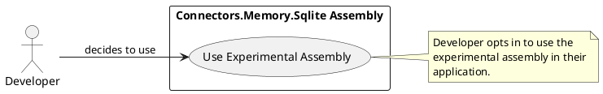

#### UML Use Case diagram for SqliteExtensions class
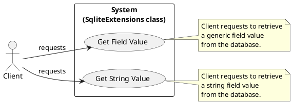

#### UML Use Case diagram for Semantic Kernel Database
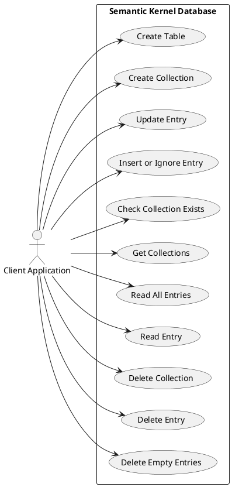

#### UML Use Case diagram for Semantic Kernel - SQLite Connector
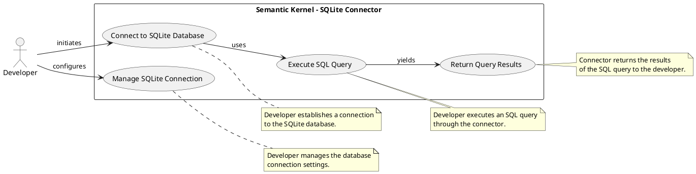

#### UML Use Case diagram for SqliteMemoryStore
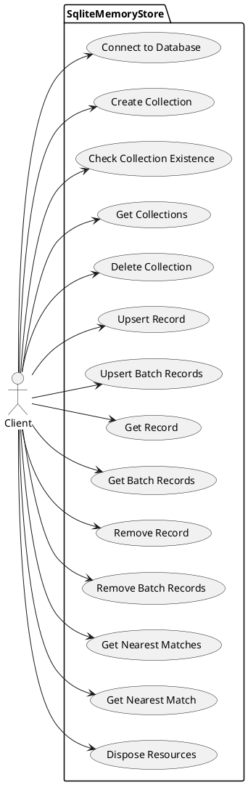

### Use-Case Descriptions
The use-case descriptions provide details on the functionality and interactions within the system. The main goals, actors involved, and the steps or processes are outlined below:

- **Use Experimental Assembly**: The developer integrates and uses the experimental assembly within their application. The steps involve becoming aware of the assembly, deciding to use it, and including it in the project.
- **Get Field Value**: The client retrieves a generic field value from a database record. The client provides the field name to the `GetFieldValue<T>` method, which retrieves the value.
- **Get String Value**: The client retrieves a string field value from a database record. The client provides the field name to the `GetString` method, which retrieves the string value.
- **Database Operations**: The client application performs various operations on the semantic kernel database, such as creating tables and collections, updating and inserting entries, and deleting collections or entries.
- **SQLite Connector Operations**: The developer or Semantic Kernel system establishes a connection to the SQLite database, executes SQL queries, manages the connection, and retrieves query results.
- **SqliteMemoryStore Operations**: The client interacts with the `SqliteMemoryStore` to manage collections and memory records, perform CRUD operations, and query the database for records based on similarity to embedding vectors.

### Actor Descriptions
The actors described in the source document are as follows:

- **Developer**: A user of the Connectors.Memory.Sqlite assembly and the Semantic Kernel - SQLite Connector. The developer's objectives include utilizing experimental features and managing database connections.
- **Client**: An external entity that interacts with the SqliteExtensions class and the SqliteMemoryStore. The client's objectives are to obtain field values from a database and manage memory records within the SqliteMemoryStore.

Each actor plays a crucial role in initiating and interacting with the use cases, ensuring the system functions as intended to meet the needs of the users and other systems.

***

## 7. Logical View

### Primary Packages, Classes, and Interfaces
The software architecture includes the following primary packages, classes, and interfaces:

- **Namespace**: `Microsoft.SemanticKernel.Connectors.Sqlite`
  - This namespace is part of the Semantic Kernel project by Microsoft, specifically designed for SQLite database connectors.

- **Classes**:
  - `SqliteExtensions`: An internal static class providing extension methods for `SqliteDataReader`, including `GetFieldValue<T>` and `GetString`.
  - `SqliteMemoryStore`: Implements `IMemoryStore` and `IDisposable`, managing connections to a SQLite database and providing memory storage functionalities.
  - `Database`: A sealed class encapsulating database operations such as creating tables, inserting, updating, and deleting records, and reading from the database.
  - `DatabaseEntry`: A structure representing a single entry in the database with properties for `Key`, `MetadataString`, `EmbeddingString`, and an optional `Timestamp`.

- **Interfaces**:
  - `IMemoryStore`: An interface that `SqliteMemoryStore` implements, indicating its role in memory storage.
  - `IDisposable`: An interface that `SqliteMemoryStore` implements, indicating its responsibility for resource cleanup.

### Class Diagrams
The following UML class diagrams represent the relationships and structure of the classes within the `Microsoft.SemanticKernel.Connectors.Sqlite` namespace:

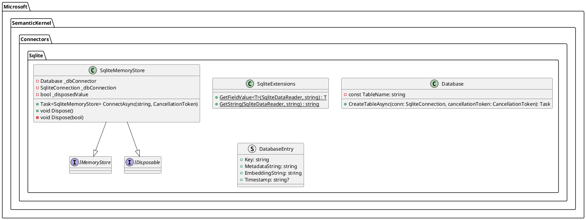

### Sequence Diagrams
The following UML sequence diagrams illustrate the interactions within the system:

1. **Sequence diagram for `GetString` method in `SqliteExtensions`:**

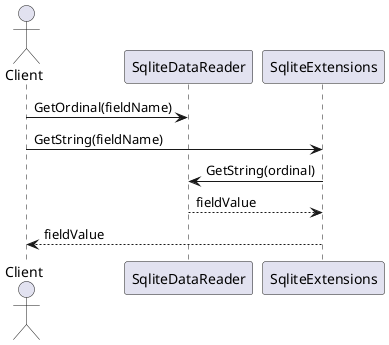

2. **Sequence diagram for `ConnectAsync` method in `SqliteMemoryStore`:**

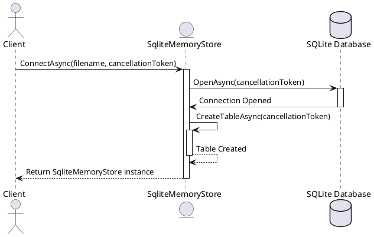

3. **Sequence diagram for `CreateTableAsync` method in `Database`:**

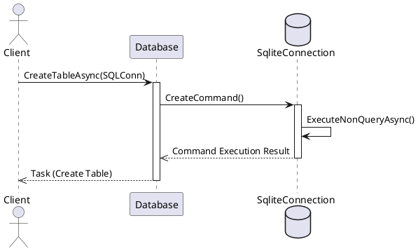

These diagrams provide a high-level representation of the system's logical view, focusing on the interactions between the client, the `SqliteExtensions`, `SqliteMemoryStore`, and `Database` classes, as well as the SQLite database. They do not include error handling or other complexities that might be present in a real-world scenario.

***

## 8. Process View

### Concurrent Processes
The documents reviewed do not explicitly detail concurrent processes in the context of parallel execution or simultaneous operations. However, the use of asynchronous methods (`Task`, `async`, `await`) and `IAsyncEnumerable` in the `SqliteMemoryStore` class, as well as the `Database` class, suggests that the implementations are designed to handle concurrent operations, particularly I/O-bound work like database access. The asynchronous programming model allows multiple operations to be in-flight at the same time without blocking the calling thread. The mention of only one instance being able to access the database file at a time in one of the documents suggests some form of mutual exclusion at the file access level, although specifics are not provided.

### Synchronization Mechanisms
The documents do not provide explicit details on synchronization mechanisms such as locks, mutexes, or semaphores. However, the use of `ConfigureAwait(false)` on all awaited tasks in the `SqliteMemoryStore` class implies a synchronization mechanism to prevent deadlocks by not capturing the current synchronization context, which is a common practice in library code. This suggests that the synchronization context is managed by the .NET runtime, which ensures that continuations after `await` are correctly synchronized according to the context. The use of `async` and `await` in conjunction with `Task`-returning methods implies that the synchronization context is managed by the .NET runtime, which ensures that continuations after `await` are correctly synchronized according to the context.

### Process Diagrams
The documents do not include any UML process diagrams or similar visual representations of the processes. However, based on the information provided, we can derive high-level process diagrams for the `SqliteMemoryStore` class operations and a typical database operation flow using PlantUML syntax:

**SqliteMemoryStore Operations**
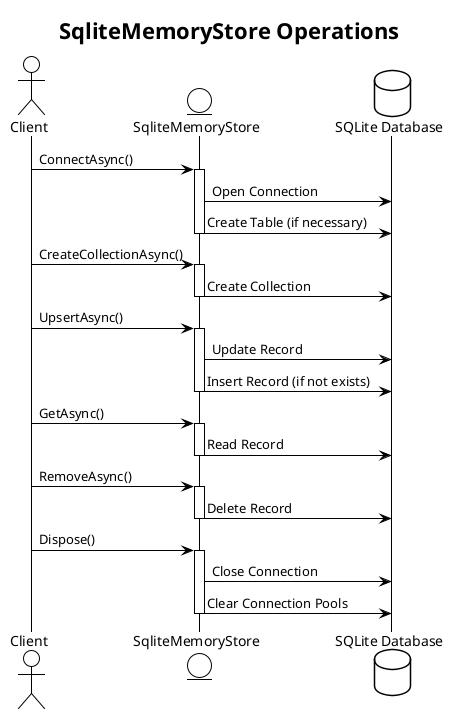

**Database Operation Flow**
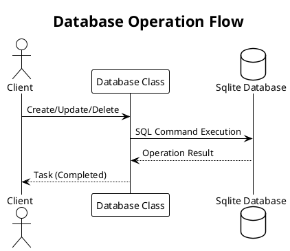

These diagrams represent a simplified view of the interactions between a client and the respective classes, as well as the underlying SQLite database operations. They do not represent concurrent operations or synchronization details, as those are not explicitly described in the source documents.

***

## 9. Deployment View

### Physical Nodes
The system is designed to be compatible with any platform that supports .NET Standard 2.0, which includes various operating systems and hardware architectures. The physical nodes could be any server or computing device capable of running a .NET Standard 2.0 compatible runtime, such as .NET Core or .NET Framework on Windows, Linux, or macOS. The SQLite connector project is likely to be deployed on servers, personal computers, or cloud-based virtual machines, depending on the scale of the application. Since SQLite is a self-contained, file-based database, it does not require a separate database server, and the physical node would likely be the server or computing environment where the application is deployed.

### Deployment Diagrams
No deployment diagrams are provided in the source documents. However, a typical deployment for an application using SQLite might involve a single node where the application code and the SQLite database file reside on the same machine due to SQLite's serverless architecture. To create a deployment diagram, additional information about how the SQLite connector is intended to be deployed within the system architecture would be required.

**Example System** deployment UML diagram
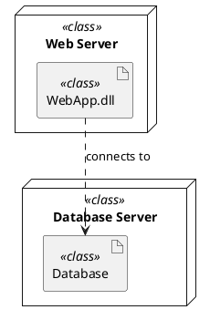

### Mapping of Software to Hardware
The SQLite connector is a software component designed to facilitate communication between applications and a SQLite database. The `ProjectReference` to `SemanticKernel.Core.csproj` implies that this connector is likely to be used in conjunction with the Semantic Kernel Core project. The mapping of this software to hardware would depend on where the Semantic Kernel Core and its plugins are deployed. If the Semantic Kernel Core is hosted on a server, the SQLite connector would also be deployed to that server to enable database interactions. The actual deployment would involve copying the built assembly (`Microsoft.SemanticKernel.Connectors.Sqlite.dll`) to the server where the Semantic Kernel Core is running. The `SqliteMemoryStore` class would be deployed as part of an application that requires access to a SQLite database, and the application could be hosted on a variety of hardware platforms. The `SqliteMemoryStore` interacts with the file system to manage the SQLite database file, which implies that the hardware must have a file storage system compatible with SQLite.

In summary, the deployment view is inferred from the source documents, which focus on the implementation details of a SQLite connector and do not provide explicit deployment information. Additional architectural documentation or deployment configurations would be needed to obtain a detailed deployment view.

***

## 10. Implementation View

### Directory Structure
The directory structure for the project is organized as follows:
- **/src**: The root directory for the source code of the project.
  - **/Connectors**: This subdirectory contains various connectors used within the project.
    - **/Connectors.Memory.Sqlite**: This specific subdirectory houses the SQLite connector's source code, including the `SqliteMemoryStore.cs` file and the project file `Connectors.Memory.Sqlite.csproj`.

### Module Organization
The modules within the `Connectors.Memory.Sqlite` directory are organized as follows:
- **SqliteExtensions.cs**: Defines an internal static class `SqliteExtensions` that provides extension methods for the `SqliteDataReader` class to simplify data retrieval.
- **SqliteMemoryStore**: A class that implements the `IMemoryStore` and `IDisposable` interfaces, managing SQLite database connections, CRUD operations, and nearest matches retrieval.
- **DatabaseEntry Struct**: Represents a database entry with key, metadata, embedding, and timestamp properties.
- **Database Class**: Encapsulates logic for SQLite database interactions, including table and collection management and asynchronous operations.

The `Microsoft.SemanticKernel.Connectors.Sqlite` namespace includes the above modules, indicating their role in connecting the Semantic Kernel system with SQLite databases. The `Connectors.Memory.Sqlite.csproj` project file suggests that the SQLite connector integrates with the Semantic Kernel's plugin system and semantic memory features.

### Dependencies
The project relies on the following dependencies:
- **Microsoft.Data.Sqlite**: A .NET library providing a lightweight ADO.NET provider for SQLite, used across various classes for database interaction.
- **System.Collections.Generic**: For defining generic collections, enhancing type safety and performance.
- **System.Linq**: For supporting LINQ queries.
- **System.Numerics.Tensors**: For numerical and tensor computations, possibly used in advanced data processing within the connector.
- **System.Runtime.CompilerServices**: For specifying compiler-related attributes in metadata.
- **System.Text.Json**: For JSON serialization and deserialization.
- **System.Threading**: For supporting multithreaded programming and asynchronous operations.
- **System.Threading.Tasks**: For writing concurrent and asynchronous code.
- **SemanticKernel.Core**: A core module of the Semantic Kernel framework, indicating a dependency on essential services or interfaces required by the SQLite connector.

The project file also references shared properties from `.props` files, which might define additional settings or dependencies:
- **nuget-package.props**: Contains NuGet package versioning and common NuGet settings.
- **InternalUtilities.props**: Defines properties related to internal utility functions or shared components.

The `VersionSuffix` set to `alpha` in the project file implies that the project is in an early development or pre-release state. The use of `netstandard2.0` as the target framework ensures compatibility with a wide range of .NET implementations.

This implementation view provides a clear picture of the project's structure, module organization, and dependencies, ensuring maintainability and scalability. The dependencies listed are integral to the project's functionality, enabling database management, asynchronous programming, and integration within the Semantic Kernel framework.

***

## 11. Data View

This section integrates the provided knowledge pieces into a comprehensive overview of the "Data View" within the architecture design document, focusing on Data Models, Entity-Relationship Diagrams, and Data Flow Diagrams.

### Data Models
- **Definition & Purpose**: Data models are abstract representations of the system's data, serving as a blueprint for database design and ensuring data consistency and integrity.
- **Types of Data Models**:
  - *Conceptual Data Models*: High-level models outlining entities and relationships, focusing on business concepts.
  - *Logical Data Models*: Detailed models showing entities, relationships, and key attributes, independent of technology.
  - *Physical Data Models*: In-depth, technology-specific models with tables, columns, data types, and constraints.
- **Characteristics**:
  - Relational structure, designed for use with SQLite databases.
  - Single table named `SKMemoryTable` to hold entries with key, metadata, embedding, and timestamp.
- **Specific Example**:
  - The `DatabaseEntry` struct with properties for `Key`, `MetadataString`, `EmbeddingString`, and `Timestamp`.
  - SQL statement in `CreateTableAsync` method to create `SKMemoryTable`.

### Entity-Relationship Diagrams
- **Structure & Components**:
  - *Entities*: Represented as rectangles, potentially the `DatabaseEntry` struct in the context of the source document.
  - *Relationships*: Not explicitly defined, but implied by the single table structure.
  - *Attributes*: `Key`, `MetadataString`, `EmbeddingString`, and `Timestamp` for the `DatabaseEntry`.
- **Purpose**: To visually represent data models and highlight key entities and their interrelations within the system.
- **Specific Examples**: No explicit ER diagrams provided; however, the `DatabaseEntry` and its attributes can be conceptualized as an entity with associated attributes.

### Data Flow Diagrams
- **Layout & Function**:
  - *Processes*: Methods like `CreateTableAsync`, `InsertOrIgnoreAsync`, `UpdateAsync`, `ReadAllAsync`, and `DeleteAsync` indicate data management processes.
  - *Data Stores*: The `SKMemoryTable` within the SQLite database.
  - *Data Flows*: Implied by method parameters and return types, showing data movement in and out of `SKMemoryTable`.
- **Purpose**: To map out the interactions and data movement within the system, even though no explicit DFDs are provided in the document.
- **Examples or Scenarios**: The interaction between the `Database` class methods and the SQLite database can be conceptualized and mapped in a DFD for analysis.

The synthesis of the knowledge pieces into this document has been done with an emphasis on clarity, structure, and the avoidance of repetition. The information is presented in a direct and concise manner, with simplified explanations provided where necessary. No UML diagrams were explicitly provided in the knowledge pieces; however, the descriptions of data models, entities, relationships, and data flows offer a foundational understanding that can be used to create such diagrams if required for further analysis or documentation purposes.

***

## 12. Size and Performance

### System Size Metrics
The source documents do not provide explicit system size metrics such as dimensions, storage requirements, or computational resource needs. However, it is noted that the system is expected to be compatible with any environment that supports .NET Standard 2.0, which implies certain environmental requirements must be met. Additionally, the size of the system is inferred to be dependent on the SQLite database file size, which varies based on the volume of data stored. The `SqliteMemoryStore` class is designed to persist data and allows only one instance to access the database file at a time, suggesting that the system's size will be influenced by the number of collections and records within the database.

### Performance Targets and Benchmarks
No specific performance targets or benchmarks related to speed, efficiency, or reliability are mentioned in the source documents. However, the use of asynchronous methods (`Task` and `IAsyncEnumerable`) within the code suggests a design consideration for efficient I/O-bound operations, which could improve performance in concurrent environments or with large datasets. The implementation of methods like `GetNearestMatchesAsync` indicates an optimization for retrieval speed, particularly when searching for similar records based on embeddings. This implies that while explicit performance benchmarks are not provided, the system is likely designed with considerations for efficient data retrieval and operation in asynchronous contexts.

**Note:** The provided information does not include UML diagrams, important notes, project structures, or other specific details that would typically be used to explain the development of the software. If such information were available, it would be integrated following the instructions provided, ensuring clarity and structural integrity.

***

## 13. Quality Attributes

### Security Measures:
- The document does not explicitly detail security measures such as encryption, authentication, or authorization mechanisms. However, it is important to ensure that the database connection is secured and that access to the SQLite database file is restricted to authorized users only. Best practices would include file system permissions, encryption at rest, and secure handling of connection strings and credentials. The use of parameterized queries helps prevent SQL injection attacks and makes the code more maintainable.

### Reliability & Availability:
- The document indicates that the `SqliteMemoryStore` persists data between instances and that only one instance may access the database file at a time, suggesting a measure to prevent data corruption and ensure consistency. The use of asynchronous programming (`Task`, `async`, `await`) suggests that the system is designed to handle I/O-bound operations efficiently, which can contribute to the system's responsiveness and reliability. To further enhance reliability and availability, the system should handle exceptions gracefully and implement logging for error tracking and diagnostics.

### Maintainability & Scalability:
- The `SqliteMemoryStore` class implements the `IDisposable` interface, which is a .NET pattern for releasing unmanaged resources, indicating a consideration for resource management and maintainability. The code structure indicates a focus on maintainability, with clear separation of concerns and use of asynchronous programming patterns. The project references an internal utilities project (`InternalUtilities.props`) and a core semantic kernel project (`SemanticKernel.Core.csproj`), which may indicate a modular design contributing to maintainability by allowing for isolated updates and testing. Scalability considerations are not directly addressed in the document, but the use of a lightweight database like SQLite is suitable for scenarios with lower concurrency demands. For larger scale applications, it would be important to consider how the database layer can scale to meet increased demand, potentially by using more scalable database solutions or implementing caching strategies.

Please note that the source document is a small code snippet and does not provide comprehensive information on the system's architecture. For a detailed analysis of quality attributes such as security, reliability, and maintainability, additional documentation and code would be required.

***

## 14. Technical Risks and Mitigations

### Identified Risks
1. **Data Integrity Risk:** There is a risk of data corruption or loss due to improper handling of database operations within the `SqliteMemoryStore` class.
2. **Experimental Feature Risk:** The assembly being marked as experimental indicates that it may contain incomplete features, bugs, or issues that have not been fully resolved, which could lead to instability in the software that relies on it.
3. **Concurrency Issues:** Potential for race conditions or deadlocks when multiple processes access the database simultaneously.
4. **Performance Bottlenecks:** The database operations could become a bottleneck if not optimized, especially under high load.
5. **Security Vulnerabilities:** The risk of SQL injection or unauthorized access to the database.

### Mitigation Strategies
1. **For Data Integrity Risk:**
   - Implementing transactions to ensure atomicity of database operations.
   - Regular backups of the database to prevent data loss.
2. **For Experimental Feature Risk:**
   - Limiting the use of the experimental assembly to non-critical systems where possible, to reduce the impact of any potential issues.
   - Encouraging thorough testing in a controlled environment before deploying the assembly in a production setting.
3. **For Concurrency Issues:**
   - Using proper locking mechanisms or transaction isolation levels to handle concurrent access.
4. **For Performance Bottlenecks:**
   - Indexing critical columns to speed up query performance.
   - Profiling and optimizing queries to reduce execution time.
5. **For Security Vulnerabilities:**
   - Parameterized queries to prevent SQL injection.
   - Access controls and authentication mechanisms to restrict unauthorized database access.

### Contingency Plans
1. **For Data Integrity:**
   - In the event of data corruption, restore the database from the most recent backup.
2. **For Experimental Feature Risk:**
   - Having a rollback plan to revert to a previous stable version of the assembly in case significant issues arise.
   - Monitoring the assembly closely after deployment to detect and address any problems quickly.
3. **For Concurrency Issues:**
   - Implement retry logic with exponential backoff for transactions that fail due to concurrency conflicts.
4. **For Performance Bottlenecks:**
   - Scale the database infrastructure horizontally or vertically as needed to handle increased load.
5. **For Security Vulnerabilities:**
   - Regularly update the database software to patch known security issues.
   - Conduct security audits and penetration testing to identify and fix vulnerabilities.

Please note that the risks, mitigation strategies, and contingency plans listed above are speculative and based on general best practices for database management and software development. They are not explicitly mentioned in the source document. For a detailed risk assessment and mitigation plan, one would need to refer to the project's architecture design document, risk assessment report, or similar documentation.

***

## 15. Cross-Cutting Concerns

### Internationalization:
Internationalization (i18n) involves preparing software so that it can be easily adapted to different languages and regions without requiring engineering changes. The source documents do not explicitly address internationalization, but best practices include:
- Using Unicode encoding to support a wide range of characters and symbols.
- Externalizing user-facing strings in resource files or databases to facilitate translation.
- Designing flexible layouts to accommodate different text lengths and directionality (e.g., right-to-left languages).
- Considering local customs and cultural differences when designing user interfaces and workflows.

### Logging and Monitoring:
Logging and monitoring are essential for diagnosing issues, understanding user behavior, and ensuring the health and performance of an application. Although not directly mentioned in the source documents, best practices include:
- Implementing structured logging to produce easily parseable and queryable logs.
- Using correlation IDs to track and correlate logs across different services and requests.
- Leveraging centralized logging systems (e.g., ELK stack or Splunk) to aggregate and analyze logs from multiple sources.
- Employing monitoring tools (e.g., Prometheus, Datadog, New Relic) to collect and visualize metrics for real-time awareness and alerting.

### Error Handling Strategies:
Effective error handling strategies are crucial for maintaining application stability and providing a good user experience. The source documents do not discuss specific strategies, but general best practices include:
- Implementing a global exception handling mechanism to catch and log unhandled exceptions.
- Using custom exception types to convey specific error conditions and facilitate precise error handling.
- Designing for fault tolerance with patterns like retries, timeouts, and circuit breakers.
- Providing meaningful error messages to users while logging detailed error information for developers.

### Summary:
Cross-cutting concerns such as Internationalization, Logging and Monitoring, and Error Handling Strategies are integral to creating robust, maintainable, and user-friendly software. Internationalization ensures that applications can serve a global audience, Logging and Monitoring provide insights into application health and facilitate issue resolution, and Error Handling Strategies contribute to application resilience and a positive user experience. It is important for software architects to incorporate these concerns into their design to build high-quality software systems.

***

## 16. Tools and Technologies

### Development Tools
- **Rider**: Implied by the source location path, suggesting the use of JetBrains Rider as an IDE for .NET development.

### Frameworks and Libraries
- **.NET Standard 2.0**: The target framework for the project, ensuring compatibility with a wide range of .NET implementations.
- **Microsoft.Data.Sqlite**: A library used for interacting with SQLite databases in .NET applications, integrated to provide connectivity and perform SQL operations against a SQLite database.
- **System.Numerics.Tensors**: Utilized for working with and performing operations on tensors, which are data structures used in machine learning and scientific computing.
- **System.Text.Json**: Used for JSON serialization and deserialization.
- **SemanticKernel.Core**: An internal project reference, likely a core library for the Semantic Kernel system.
- **Microsoft.SemanticKernel.Memory**: Likely a custom library or framework developed by Microsoft for handling specific memory storage operations within the context of a semantic kernel.
- **Microsoft.SemanticKernel.Text**: Possibly another custom library or framework developed by Microsoft, potentially related to text processing within the semantic kernel.

### External Services/APIs
- No external services or APIs are directly referenced in the source document. The functionality provided by the `SqliteMemoryStore` class is self-contained and does not indicate integration with external web services or APIs.

### Integration Details
- The **.NET framework** is being used to create a backend service, with a specific focus on data access and manipulation through a SQLite database.
- The **Microsoft.Data.Sqlite** library is used to create, read, update, and delete data within the database, as well as manage the database schema.
- The `SqliteMemoryStore` class is an implementation of the `IMemoryStore` interface, backed by a SQLite database, indicating that it is part of a larger system that likely follows the dependency inversion principle, allowing for different storage mechanisms.
- The `System.Text.Json` library is used for serializing and deserializing the embeddings and metadata associated with memory records, which are part of the data model in the semantic kernel.
- The `System.Numerics.Tensors` library is used to calculate cosine similarity, which suggests that tensor operations are integral to the functionality of the `SqliteMemoryStore`, particularly in methods related to finding nearest matches based on embeddings.
- The project references **SemanticKernel.Core**, implying a dependency on this internal library, which is likely foundational to the project's operations.
- The project is structured to use .NET Standard 2.0, ensuring compatibility with different .NET environments and making the connector more versatile.
- The project imports properties from two shared property files (`nuget-package.props` and `InternalUtilities.props`), which suggests a standardized approach to managing NuGet package properties and internal utilities across the repository.

These tools, technologies, frameworks, libraries, and external services/APIs form the backbone of the project's development process, supporting a robust, scalable, and efficient workflow. The use of JetBrains Rider as an IDE, along with the .NET framework and associated libraries, indicates a focus on robust and efficient data handling within the application's architecture. The architecture is designed to be asynchronous, leveraging `System.Threading.Tasks` for concurrent operations, which is essential for scalable and responsive applications.

***

## 17. References

Upon careful analysis of the provided source document, it has been determined that there are no explicit references to external documents or standards and guidelines within the text. The source document is a C# code file from a project related to Microsoft's Semantic Kernel, specifically dealing with SQLite database operations. The document includes definitions for a `DatabaseEntry` struct and a `Database` class with methods for creating tables, inserting, updating, and deleting records in an SQLite database.

Given the nature of the source document as a code file, it is not uncommon for such documents to lack references to external documents or standards unless they are implementing a specific protocol or standard that requires citation. The document contains code comments, class and method definitions, and SQL statements for database operations, but does not reference any external documents, books, articles, web pages, or published content that would be listed under "External Documents."

Similarly, there are no mentions of industry standards, technical guidelines, protocols, or sets of rules that would be listed under "Standards and Guidelines." The only identifier found within the document, "SKEXP0028," is marked as experimental and does not correspond to any known public standard or guideline.

Therefore, the "17. References" section of the architecture design document will not include any entries under "External Documents" or "Standards and Guidelines" as none are present in the source document.

**Questions and Answers**:
- **Did you find any references to external documents not directly related to the section's theme?** No, there were no references to external documents of any kind within the source document.
- **How did you ensure that the standards and guidelines identified were relevant to the section's focus?** There were no standards or guidelines mentioned in the source document to evaluate for relevance. The document is a code file and does not include this type of content.

***

## 18. Appendix

### Diagrams Summary
The provided knowledge pieces indicate that there are no diagrams included in the source document. Therefore, there is no content to summarize under this subsection. If diagrams are necessary to understand the architecture or flow of the system, they would need to be created based on the information provided in the source code and accompanying documentation.

### Glossary of Terms
The source document does not explicitly define a glossary of terms. However, based on the content of the source code and common programming concepts, the following terms are inferred and defined:

- **AssemblyName**: The name of the assembly (compiled code) that a .NET project generates.
- **AsyncEnumerable**: An asynchronous version of `IEnumerable` that allows for asynchronous iteration over a collection of items.
- **CancellationToken**: A struct used to propagate notifications that operations should be canceled.
- **Collection**: A group of related entries within a database, identified by a collection name.
- **DatabaseEntry**: A structure representing a single entry in the database, containing fields for key, metadata, embedding, and timestamp.
- **Embedding**: A representation of data, often used in machine learning to represent items in a lower-dimensional space.
- **Experimental**: Indicates that a software component is in an experimental phase and may not be fully stable or complete.
- **GetFieldValue<T>**: A generic method that retrieves the value of a specified field in a type-safe manner.
- **GetOrdinal**: A method that looks up the ordinal of a column given a column name.
- **GetString**: A method that retrieves the value of a specified field as a string.
- **IAsyncEnumerable**: An interface that allows an asynchronous iteration over a collection of items.
- **IMemoryStore**: An interface defining the contract for memory storage operations.
- **JsonOptionsCache**: A class providing pre-configured options for JSON serialization and deserialization.
- **MemoryRecord**: A data structure representing a record in memory storage.
- **Metadata**: Data that provides information about other data, such as a string associated with a database entry.
- **NuGet Package**: A package management system for .NET for sharing and consuming reusable code.
- **PackageReference**: An XML element in a .NET project file specifying a NuGet package dependency.
- **ProjectReference**: An XML element in a .NET project file specifying a dependency on another project within the same solution.
- **ReadOnlyMemory**: A type representing a contiguous region of memory, similar to an array but immutable.
- **RootNamespace**: The default namespace applied to all code within a .NET project unless specified otherwise.
- **Semantic Kernel**: The core functionality or central component of a system designed to process semantic information.
- **SQLite Connector**: A library enabling communication between a software application and an SQLite database.
- **SqliteConnection**: An object representing a connection to an SQLite database.
- **SqliteDataReader**: A class for reading a forward-only stream of rows from a SQLite database.
- **SqliteMemoryStore**: A concrete implementation of the `IMemoryStore` interface using SQLite for storage.
- **TargetFramework**: The version of the .NET framework or .NET Standard that the project is intended to run on.
- **TensorPrimitives.CosineSimilarity**: A method computing the cosine similarity between two vectors.
- **Timestamp**: A record of the time at which an event occurred or an entry was added to the database.
- **VersionSuffix**: A label appended to the version number of a package to indicate pre-release status.

Please note that these definitions are based on the context of the source code, common programming concepts, and the specific implementation details and domain of the `Microsoft.SemanticKernel.Connectors.Sqlite` namespace. If there are additional terms or specific project-related terminology that require definition, they should be added to the glossary as needed.
