# Prompt Gateway for External LLM with RESTful API and Plugin Support
## *Designing a Prompt Gateway with RESTful API Integration, Plugin-based Prompt Transformations, and Admin Configuration for an External LLM*

## *Abstract*
*The design document for the Prompt Gateway task outlines the creation of a RESTful API-accessible Prompt Gateway for an external LLM. The Prompt Gateway is responsible for reliably accepting prompts, applying optional transformations, and sending the transformed prompts to the LLM. To achieve this, the Prompt Gateway utilizes a combination of internal and external Plugin modules for prompt transformations. The order of these transformations is determined by an internal rule engine. The Prompt Gateway can be configured by an Admin with any number of Plugins, which are accessible via their respective RESTful endpoint URLs.*
***In addition to the Prompt Gateway implementation, the design document also specifies the need for a local startup shell script. This script will be used to initiate the Prompt Gateway and ensure its proper functioning. Furthermore, deployment artifacts for Ansible and Docker are required to facilitate easy deployment and management of the Prompt Gateway in different environments.***
*To ensure seamless usage and configuration of the Prompt Gateway, comprehensive documentation needs to be produced. This documentation should cover various aspects such as usage instructions, plugin configuration guidelines, and troubleshooting techniques. By providing detailed documentation, users and administrators will have a clear understanding of how to interact with and maintain the Prompt Gateway effectively.*

## *Task*
```Task
Create a Prompt Gateway for an external LLM with these specifications:
- Prompt Gateway is accessible to clients via a specific RESTful API URL.
- Prompt gateway reliably accepts prompts, then applies optional transformations, and sends transformed prompts to the LLM.
- Prompt Gateway handles Prompt Transformations via any number of external and/or internal Plugin modules.
- Prompt Gateway uses an internal rule engine to determine the order of the Prompt Transformations by the Plugins.
- An Admin can configure the Prompt Gateway with any number of Plugins.
- Prompt Transformation Plugins are accessible to the Prompt Gateway only via their respective RESTful endpoint URLs.

Provide a local startup shell script.
Create deployment artifacts for Ansible and Docker.
Produce comprehensive documentation: usage, plugin configuration, and troubleshooting.
```

## *Design*


### *Use Cases*

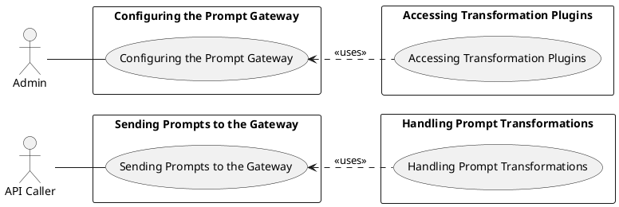


  


## Details

## Sending Prompts to the Gateway
Description:
*API Callers send prompts to the Prompt Gateway which are then transformed and sent to the LLM. *


### *Actors:*

- API Caller


### *Pre-conditions:*

- The API Caller is connected to the Prompt Gateway.


### *Post-conditions:*

- The transformed prompts are sent to the LLM.


### *Flow:*

- The API Caller sends a prompt to the Prompt Gateway.
- The Prompt Gateway applies optional transformations to the prompt.
- The transformed prompt is sent to the LLM.


### *Robustness*

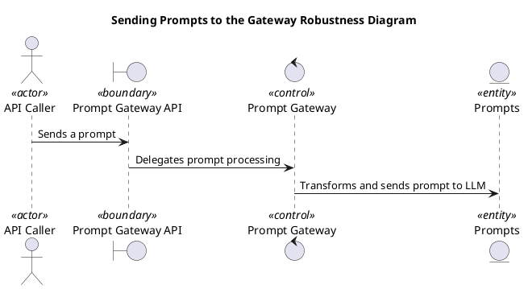


  


### *Sequence*

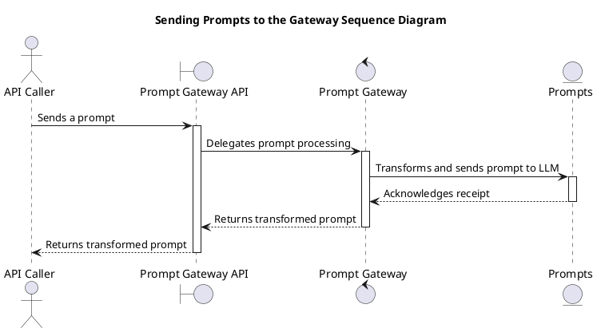


  


### *Activity*

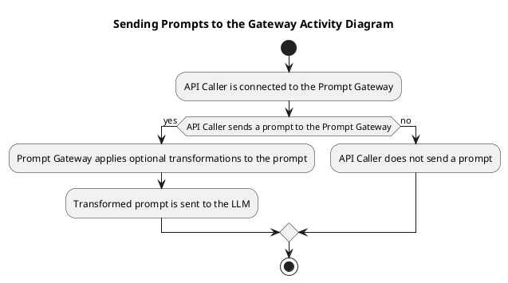


  


### *State*

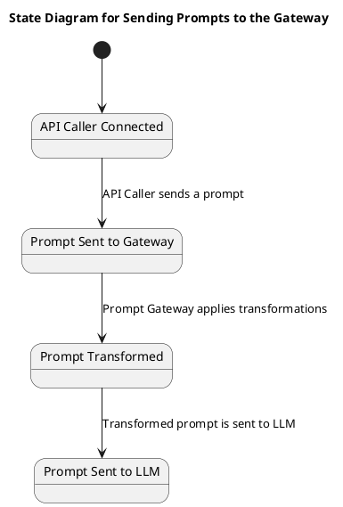


  


### *Class*

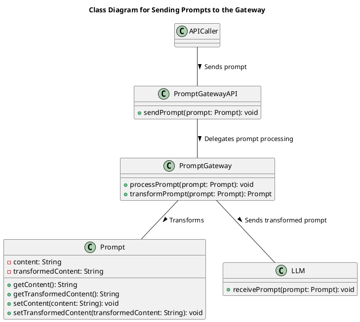


  

## Handling Prompt Transformations
Description:
*The Prompt Gateway handles prompt transformations via external and/or internal Plugin modules. *


### *Actors:*

- Prompt Gateway


### *Pre-conditions:*

- The Prompt Gateway has received a prompt.


### *Post-conditions:*

- The prompt has been transformed by the Plugin modules.


### *Flow:*

- The Prompt Gateway receives a prompt.
- The Prompt Gateway uses the rule engine to determine the order of transformations.
- The Prompt Gateway sends the prompt to the Plugin modules for transformation.


### *Robustness*

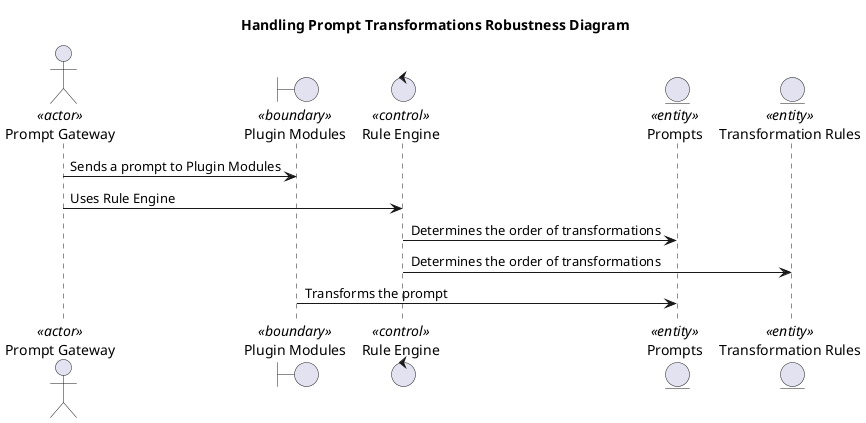


  


### *Sequence*

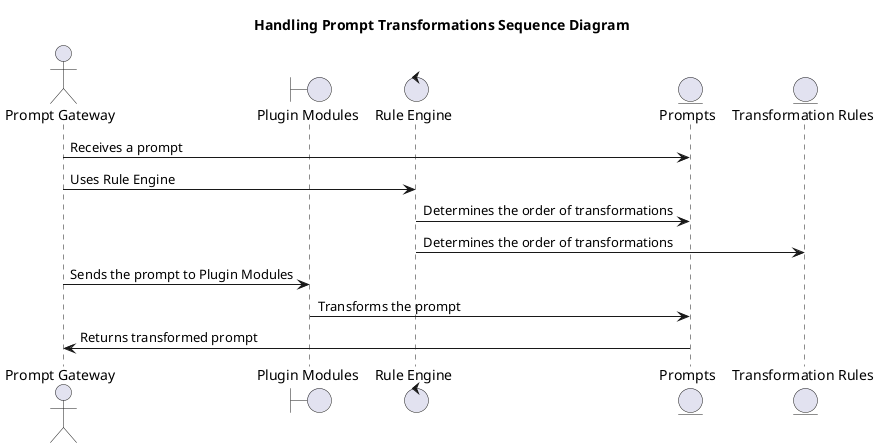


  


### *Activity*

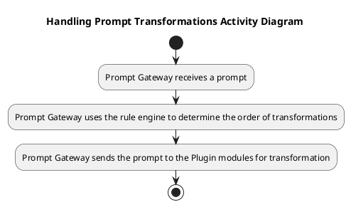


  


### *State*

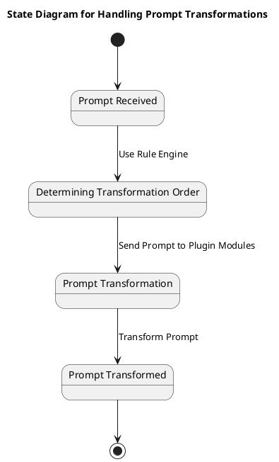


  


### *Class*

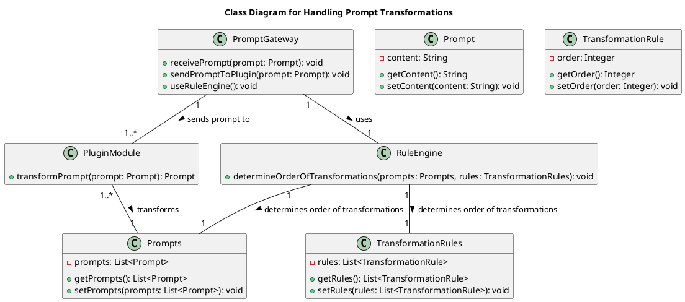


  

## Configuring the Prompt Gateway
Description:
*An Admin configures the Prompt Gateway with any number of Plugins. *


### *Actors:*

- Admin


### *Pre-conditions:*

- The Admin has access to the Prompt Gateway configuration.


### *Post-conditions:*

- The Prompt Gateway is configured with the selected Plugins.


### *Flow:*

- The Admin selects the Plugins to be used.
- The Admin configures the Prompt Gateway with the selected Plugins.


### *Robustness*

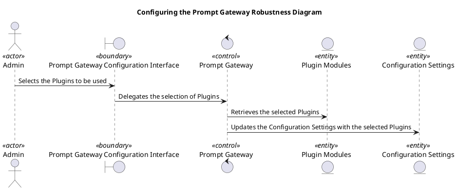


  


### *Sequence*

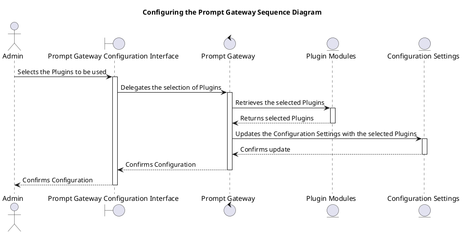


  


### *Activity*

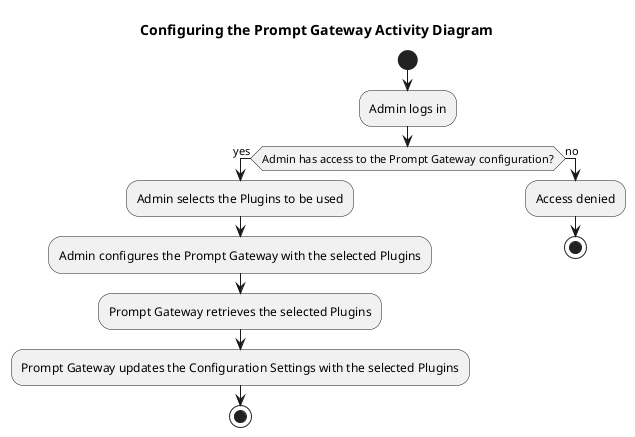


  


### *State*

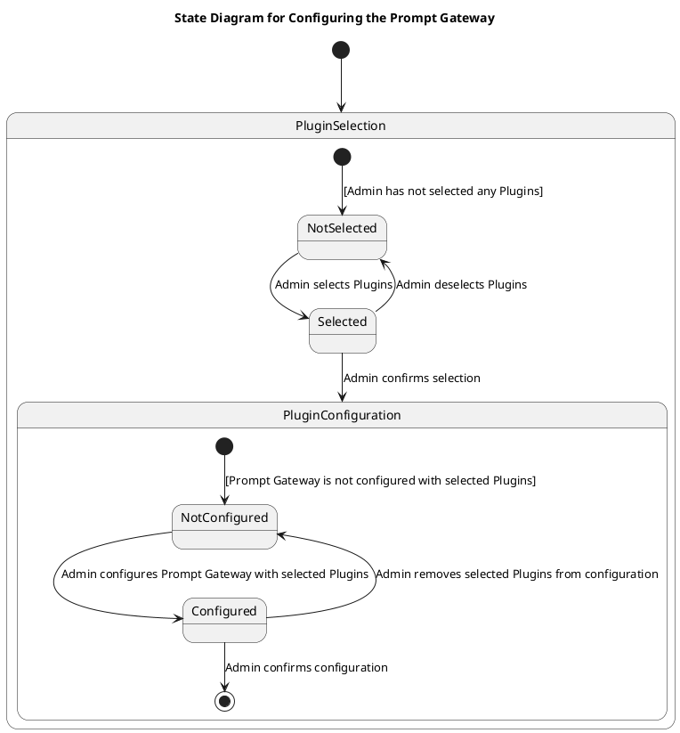


  


### *Class*

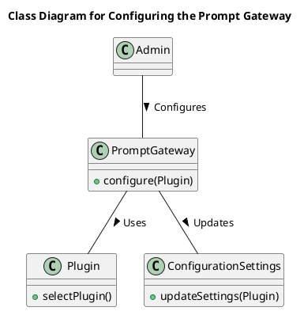


  

## Accessing Transformation Plugins
Description:
*The Prompt Gateway accesses the Transformation Plugins via their respective RESTful endpoint URLs. *


### *Actors:*

- Prompt Gateway


### *Pre-conditions:*

- The Prompt Gateway is configured with the Plugins.


### *Post-conditions:*

- The Prompt Gateway has accessed the Transformation Plugins.


### *Flow:*

- The Prompt Gateway sends a request to the Plugin's RESTful endpoint URL.
- The Plugin receives the request and establishes a connection with the Prompt Gateway.


### *Robustness*

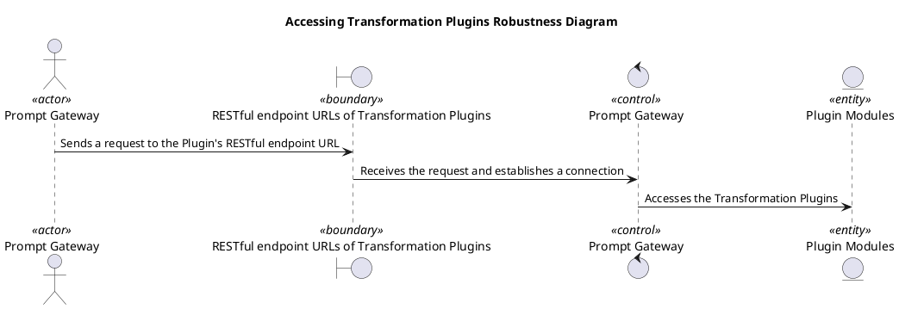


  


### *Sequence*

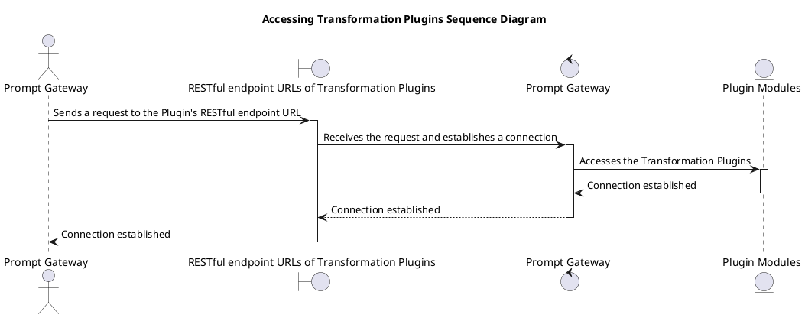


  


### *Activity*

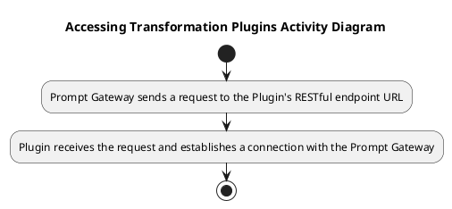


  


### *State*

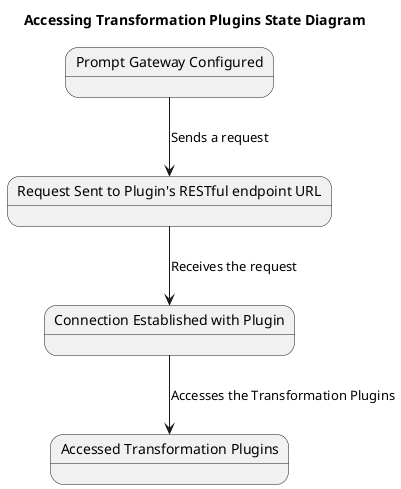


  


### *Class*

```plantuml
@startuml
title Accessing Transformation Plugins Class Diagram

class PromptGateway {
  -configuredPlugins: Plugin[]
  +sendRequest(plugin: Plugin): void
  +establishConnection(plugin: Plugin): void
}

class Plugin {
  -endpointURL: String
  +receiveRequest(): void
  +establishConnection(): void
}

class RESTfulEndpointURL {
  -url: String
}

PromptGateway "1" -- "0..*" Plugin : accesses
Plugin "1" -- "1" RESTfulEndpointURL : has
@enduml
```


