## 1. Title Page
- Document Title: Architecture Design Document
- Project Name: [Project Name]
- Date: 1/27/2024
- Version: [Version Number]
- Prepared by: J.A.R.V.I.S. AI
- Approved by: [Approver's Name]

***

## 2. Revision History
- Table containing Version Number, Date, Author, Description of Changes, and Approver.

***

## 3. Table of Contents
- List of all sections and subsections with page numbers.

***

## 4. Introduction
- Purpose of the Document
- Scope of the Document
- Definitions, Acronyms, and Abbreviations

## 4. Introduction

### Purpose of the Document
The purpose of this document is to provide a comprehensive overview of various components designed for interacting with PostgreSQL databases within the context of semantic memory systems and vector similarity searches. These components include the .NET Standard library project for a Postgres connector, the `IPostgresDbClient` interface, the `PostgresDbClient` class, the `PostgresMemoryBuilderExtensions` class, the `PostgresMemoryEntry` struct, and the `PostgresMemoryStore` class. The document serves as a technical guide for developers to understand the functionalities, configurations, and integration processes of these components, as well as the usage of the pgvector extension in Postgres.

### Scope of the Document
This document covers the XML configuration file of the .NET Standard library project, the primary functionalities of the `IPostgresDbClient` interface, the detailed functionalities provided by the `PostgresDbClient` class, the extension methods of the `PostgresMemoryBuilderExtensions` class, the structure and functionalities of the `PostgresMemoryEntry` struct, and the description of the `PostgresMemoryStore` class. It also includes UML diagrams that illustrate the structure and behavior of these components, as well as the sequence of operations for specific methods.

### Definitions, Acronyms, and Abbreviations
- **Async/Await**: A programming pattern used in C# for non-blocking asynchronous operations.
- **CRUD**: Create, Read, Update, Delete.
- **CancellationToken**: A construct in .NET that allows cooperative cancellation of asynchronous operations.
- **Docker**: A platform used to develop, ship, and run applications inside containers.
- **IMemoryStore**: An interface that defines the contract for memory store implementations.
- **IPostgresDbClient**: An interface defining a set of asynchronous operations for interacting with a PostgreSQL database.
- **JSONB**: JSON Binary, a data type in PostgreSQL for storing JSON data in a binary format.
- **MemoryBuilder**: A class within a framework designed to configure and manage memory stores.
- **MemoryRecord**: A data structure containing a key, metadata, and an optional embedding vector.
- **NpgsqlDataSource**: A class representing the data source object for PostgreSQL connectivity.
- **NpgsqlDataSourceBuilder**: A class used to build data source configurations for Npgsql, a .NET data provider for PostgreSQL.
- **NuGet**: A package manager for .NET, which allows developers to share reusable code.
- **Postgres**: An open-source relational database management system (RDBMS).
- **PostgresMemoryBuilderExtensions**: A utility class containing extension methods for the `MemoryBuilder` class to configure a Postgres memory store.
- **PostgresMemoryEntry**: A data structure representing an entry in the PostgreSQL database, which may include a key, metadata, vector embedding, and timestamp.
- **PostgresMemoryStore**: A class that serves as an implementation of the `IMemoryStore` interface for interacting with a PostgreSQL database.
- **Semantic Kernel**: A framework or system designed to work with semantic data and memory systems.
- **SQL**: Structured Query Language, a domain-specific language used in programming for managing data in a relational database management system.
- **Struct**: A data structure that encapsulates multiple related variables.
- **UML (Unified Modeling Language)**: A standardized modeling language in the field of software engineering.
- **Upsert**: A database operation that updates an existing entry if the key exists or inserts a new entry if it does not.
- **Vector**: A mathematical representation, possibly used for storing vector embeddings in the context of similarity searching.
- **pgvector**: An extension for Postgres that supports vector data types and operations.

***UML Diagramming Information:***
The document includes UML class diagrams that provide a visual representation of the `PostgresDbClient` and `PostgresMemoryStore` classes, showing their methods and relationships with other components. Additionally, UML sequence diagrams illustrate the flow of operations for methods such as `UpsertAsync` in the `IPostgresDbClient` interface and `GetNearestMatchesAsync` in the `PostgresMemoryStore` class. These diagrams are essential for developers to understand the asynchronous nature of the operations and the interactions between the client, the interface, and the database.

***Key Information to Emphasize:***
- The `PostgresDbClient` class is tailored for operations with PostgreSQL tables that store vector embeddings and provides asynchronous methods for CRUD operations and vector-based similarity searches.
- The `PostgresMemoryBuilderExtensions` class offers extension methods for integrating a Postgres memory store into the `MemoryBuilder` configuration.
- The `PostgresMemoryEntry` struct is a data structure designed for use with PostgreSQL databases in the context of semantic analysis or machine learning applications.
- The `PostgresMemoryStore` class implements the `IMemoryStore` interface and utilizes the pgvector extension for vector similarity search within a PostgreSQL database.
- The Microsoft.SemanticKernel.Connectors.Postgres connector utilizes Postgres and the pgvector extension to implement Semantic Memory for vector similarity search, with integration options for Azure services and Docker.

***Practice Extraction for a small section:***
To quickly start using the pgvector extension:
- Install pgvector using Docker.
- Create a database and enable the pgvector extension.
- Set up Postgres as a semantic memory store with vector support.
- Use `NpgsqlDataSourceBuilder` and `MemoryBuilder` for configuration.
- Integrate `TextMemoryPlugin` for text memory operations.

The integration of the provided knowledge pieces into this document has been conducted with a focus on clarity, structural integrity, and the avoidance of repetition, ensuring that all relevant information is included and easily accessible.

***

## 5. Architectural Representation
- Overview of Architectural Style
- Key Structural Elements
- Context Diagram

## 5. Architectural Representation

### Overview of Architectural Style
The architectural style of the system is multifaceted, encompassing a modular and service-oriented approach for the `IPostgresDbClient` interface, an object-oriented design for the `PostgresDbClient` class, and a plugin-based system for integrating with PostgreSQL databases using the pgvector extension. The system is designed to support semantic memory storage and retrieval, focusing on vector similarity search capabilities, and is structured to provide broad compatibility and interoperability within the .NET ecosystem.

### Key Structural Elements
The key structural elements across the system include interfaces such as `IPostgresDbClient`, classes like `PostgresDbClient` and `PostgresMemoryStore`, structs such as `PostgresMemoryEntry`, and extension methods for the `MemoryBuilder` class. These elements encapsulate data and behavior related to PostgreSQL database interactions, vector-based data management, and memory store configuration. The system also utilizes NuGet packages, project references, and shared properties to maintain consistency and streamline the build process.

### Context Diagram
The context diagrams provided illustrate the relationships and dependencies of the system's components. For instance, the `PostgresDbClient` class interacts with an `NpgsqlDataSource` and provides CRUD operations and vector-based similarity search methods. The `MemoryBuilder` class is extended by `PostgresMemoryBuilderExtensions` to configure a `PostgresMemoryStore`. The `PostgresMemoryEntry` struct represents data within the system, and the plugin-based architecture integrates with the PostgreSQL database, enhanced by the pgvector extension, to support semantic memory operations.

#### UML Diagrams
The UML diagrams included in the knowledge pieces visually represent the structure and behavior of the system's components. For example, the UML Class Diagram for the `PostgresDbClient` class shows its methods and dependencies, while the UML Sequence Diagrams illustrate interactions during operations like `UpsertAsync` and `GetNearestMatchesAsync`.

#### Important Notes
- The system targets .NET Standard 2.0 for broad compatibility.
- The `pgvector` extension is an open-source vector similarity search engine used by the system.
- The `MemoryBuilder` class uses a builder pattern to construct memory stores with PostgreSQL as the backend.

#### Project Structures
The project is structured with an `AssemblyName` of `Microsoft.SemanticKernel.Connectors.Postgres` and a `RootNamespace` aligned with the assembly name. It includes a `VersionSuffix` to indicate pre-release status and imports external configurations through shared properties.

#### Examples
An example of the system's modularity is the `IPostgresDbClient` interface, which defines a contract for PostgreSQL database operations, allowing for non-blocking, asynchronous operations. The `PostgresMemoryStore` class is another example, offering constructors for initializing database connections and methods for managing records and collections within the database.

By integrating these components, the system achieves a cohesive architectural representation that supports scalability, performance, and extensibility in managing semantic memory within a .NET environment.

***

## 6. Goals and Constraints
- System Goals
- Design Constraints (e.g., technological, business, regulatory)

## 6. Goals and Constraints

### System Goals

The primary system goals are to develop a .NET Standard library project that creates a Postgres connector, which is compatible with Semantic Kernel plugins and semantic memory systems. This connector aims to facilitate interactions with PostgreSQL databases, particularly for operations involving tables that store data entries with associated vector embeddings. It provides a comprehensive suite of asynchronous methods to perform Create, Read, Update, and Delete (CRUD) operations, as well as specialized vector-based similarity searches essential for applications dealing with vector embeddings.

The system is designed to be integrated into the `MemoryBuilder` configuration, enabling the configuration of a Postgres memory store using various methods such as a connection string, an `NpgsqlDataSource` object, or an existing `IPostgresDbClient` instance. It also aims to provide a structured representation of memory entries for storage in a PostgreSQL database to support semantic analysis or machine learning tasks. Furthermore, the system is intended to manage and query memory records in a PostgreSQL database with vector support, enabling creation, management, and querying of collections of memory records, each consisting of a key, metadata, and an optional embedding vector.

To achieve these goals, the system will support vector similarity search capabilities within Postgres, including exact and approximate nearest neighbor search, L2 distance, inner product, and cosine distance. It will offer compatibility with Azure Database for PostgreSQL - Flexible Server and Azure Cosmos DB for PostgreSQL, and facilitate the creation of indexes for improved performance in vector similarity searches. Additionally, the system will assist users in migrating from older versions of the Postgres Memory connector to the new implementation that uses separate tables for each Collection.

### Design Constraints

The design constraints are categorized into technological, business, and regulatory constraints:

**Technological Constraints:**
- The project must adhere to the .NET Standard 2.0 framework, which imposes limitations on the APIs that can be used.
- The system is designed to work specifically with Postgres databases and the `pgvector` extension for vector operations.
- The interface methods must be asynchronous to ensure non-blocking operations, crucial for I/O-bound work such as database querying.
- The querying functionality must support a limit and a minimum relevance score to filter the nearest matches based on vector similarity.
- The system must be compatible with the PostgreSQL database and the `pgvector` extension for vector operations.
- Requires the installation of the pgvector extension on Postgres and must be compatible with specific versions of Postgres, Azure Database for PostgreSQL - Flexible Server, and Azure Cosmos DB for PostgreSQL.

**Business Constraints:**
- The versioning strategy includes a version suffix (alpha), indicating that the project is in a pre-release state and may have constraints related to stability and feature completeness.
- The system should be designed to efficiently handle the operations associated with memory records, including batch processing and similarity searches, to meet performance expectations.
- The need to ensure that the migration script does not lead to data loss, especially when dropping existing tables.
- The requirement to maintain the system's performance and recall when using approximate nearest neighbor search.

**Regulatory Constraints:**
- Any connector interacting with databases must comply with data protection and privacy regulations, which could influence design decisions.
- If the system is used in environments subject to data protection regulations (such as GDPR or HIPAA), it must ensure compliance with such regulations, particularly in the management and deletion of entries.
- The `Timestamp` property must record times in `DateTimeKind.Utc` to comply with universal time recording practices, which may be a regulatory requirement in some contexts to ensure consistency across different time zones.

### UML Diagramming Information

The UML diagrams provided offer a visual representation of the system's architecture and interactions. For instance, the UML sequence diagram for the `UpsertAsync` method illustrates the flow of operations within the database operation, where an entry is either updated or inserted based on its existence. The UML class diagram for the `PostgresMemoryEntry` struct visually represents the structure, showing properties such as `Key`, `MetadataString`, `Embedding`, and `Timestamp`. Additionally, the UML class diagram for the `PostgresMemoryStore` class details its methods and relationships, while the UML sequence diagram for `GetNearestMatchesAsync` method depicts the interaction between the caller, `PostgresMemoryStore`, and the `IPostgresDbClient`.

These diagrams are essential for understanding the system's structure and behavior and should be included in the design document to provide clarity on the system's structure and behavior.

***

## 7. Use-Case View
- Use-Case Diagrams
- Use-Case Descriptions
- Actor Descriptions

## 7. Use-Case View

### Use-Case Diagrams
The use-case diagrams for the various components of the system provide a visual representation of the interactions between the actors and the system's functionalities. These diagrams include:

- **Semantic Memory Store Initialization**: Illustrating the initialization process of the semantic memory store using the Postgres connector with the pgvector extension.
- **Vector Similarity Search**: Showcasing the process of conducting exact and approximate nearest neighbor searches utilizing the pgvector extension.
- **Index Creation for Performance**: Depicting the decision-making process for creating an index to enhance search performance based on the dataset size.

Additionally, the UML Class Diagrams from the source documents should be included to visually represent the structure of classes like `PostgresDbClient` and `PostgresMemoryStore`. These diagrams display the private fields and public methods corresponding to the use cases described.

### Use-Case Descriptions
The use-case descriptions provide a detailed overview of the system's capabilities and the methods through which actors interact with the system. These descriptions include:

- **Creating and Managing Tables**: Operations such as creating, checking the existence of, retrieving, and deleting tables in the PostgreSQL database.
- **Data Operations**: Inserting or updating individual or batch entries, reading single or batch entries, and deleting entries from the database.
- **Vector-Based Similarity Search**: Performing exact and approximate nearest neighbor searches to retrieve records based on embedding vectors.
- **Semantic Memory Store Configuration**: Setting up a semantic memory store in Postgres using the pgvector extension, including configuring the data source and building the memory with appropriate plugins.
- **Index Management**: Creating an index to switch from exact to approximate nearest neighbor search, considering the number of lists and probes to balance recall and performance.

### Actor Descriptions
The actors involved in the system's use cases are:

- **Client Application**: An external system or application that uses the `PostgresDbClient` to manage and query vector-based data in a PostgreSQL database.
- **Consumer**: The end-user or system that utilizes the Postgres connector library in conjunction with Semantic Kernel plugins and semantic memory systems.
- **Developer**: The individual or team responsible for setting up and maintaining the project file, ensuring that all configurations are correct and up-to-date. Developers also utilize the Postgres connector to implement semantic memory stores and perform vector similarity searches within applications.
- **System Administrator**: A user who manages the database schema and tables, potentially using the `PostgresDbClient` for administrative tasks. Responsible for installing and configuring the pgvector extension on Postgres databases, including Docker setup and database initialization.
- **Database Administrator (DBA)**: Manages the Postgres database, including the creation of indexes to optimize vector similarity search performance based on data size and search requirements.

By integrating these use-case diagrams, descriptions, and actor definitions, the document provides a clear and comprehensive view of the system's functionality and the roles of various stakeholders in its operation.

***

## 8. Logical View
- Primary Packages, Classes, and Interfaces
- Class Diagrams
- Sequence Diagrams

## 8. Logical View

### Primary Packages, Classes, and Interfaces

The logical view of the system encompasses several primary classes, interfaces, and utility classes that facilitate the interaction with PostgreSQL databases, particularly for operations involving vector embeddings and semantic analysis.

- `IMemoryStore`: An interface that `PostgresMemoryStore` implements to interact with memory stores.
- `IPostgresDbClient`: A central interface defining the contract for operations on PostgreSQL databases, including table management, data entries, and querying based on vector similarity.
- `MemoryBuilder`: A class from a larger framework used to configure and manage memory stores.
- `NpgsqlDataSource`: An object representing the data source for the Postgres database.
- `NpgsqlDataSourceBuilder`: Responsible for building the data source configuration for connecting to the PostgreSQL database.
- `PostgresDbClient`: A class that interacts with PostgreSQL databases, particularly for tables with vector embeddings.
- `PostgresMemoryBuilderExtensions`: A utility class providing extension methods for the `MemoryBuilder` class to integrate Postgres memory stores.
- `PostgresMemoryEntry`: A struct encapsulating key elements for storing and retrieving memory entries in a PostgreSQL database.
- `PostgresMemoryStore`: A class representing the Postgres memory store that interacts with a Postgres database and implements the `IMemoryStore` interface.
- `SemanticKernel.Core`: A project within the same solution that the Postgres connector library relies on for core functionalities.
- `TextMemoryPlugin`: A plugin that interfaces with the semantic memory store.

### Class Diagrams

The class diagrams provide a visual representation of the structure and relationships of the primary classes and interfaces within the system:

1. `IPostgresDbClient` Interface:
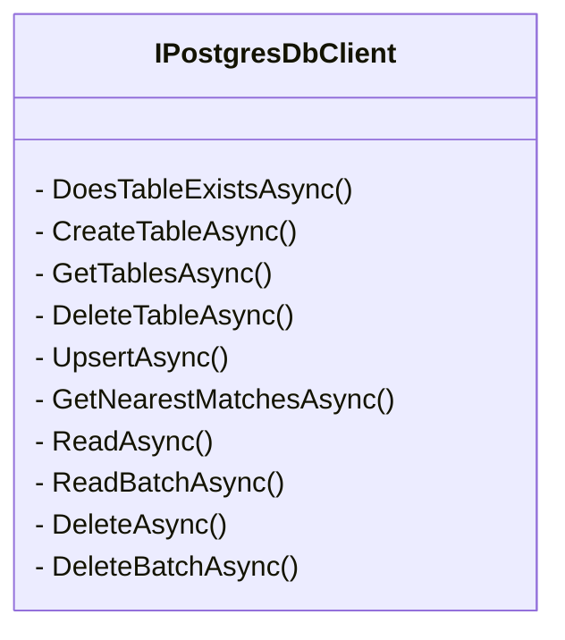

2. `PostgresDbClient` Class:
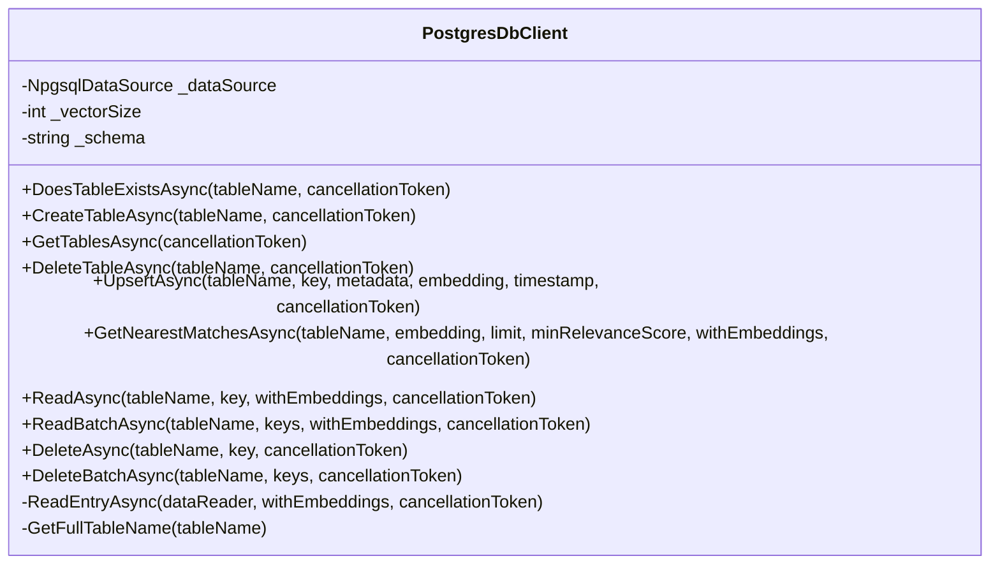

3. `PostgresMemoryStore` Class and Related Interfaces:
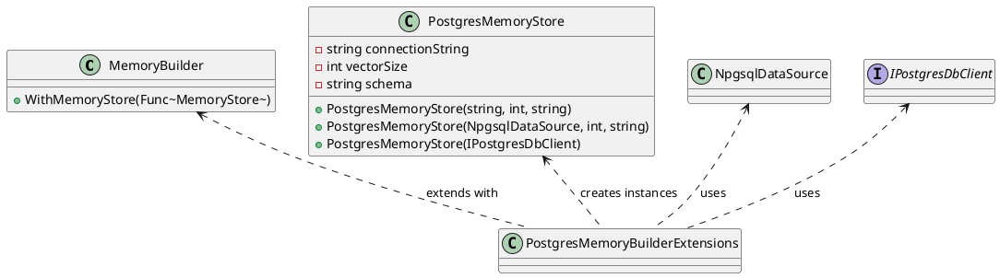

4. `PostgresMemoryEntry` Struct:
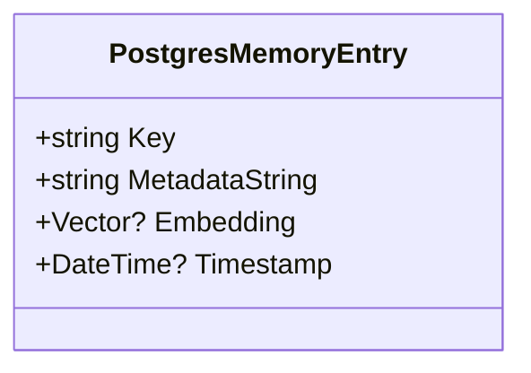

5. `PostgresMemoryStore` Class with `IMemoryStore` and `IPostgresDbClient` Interfaces:
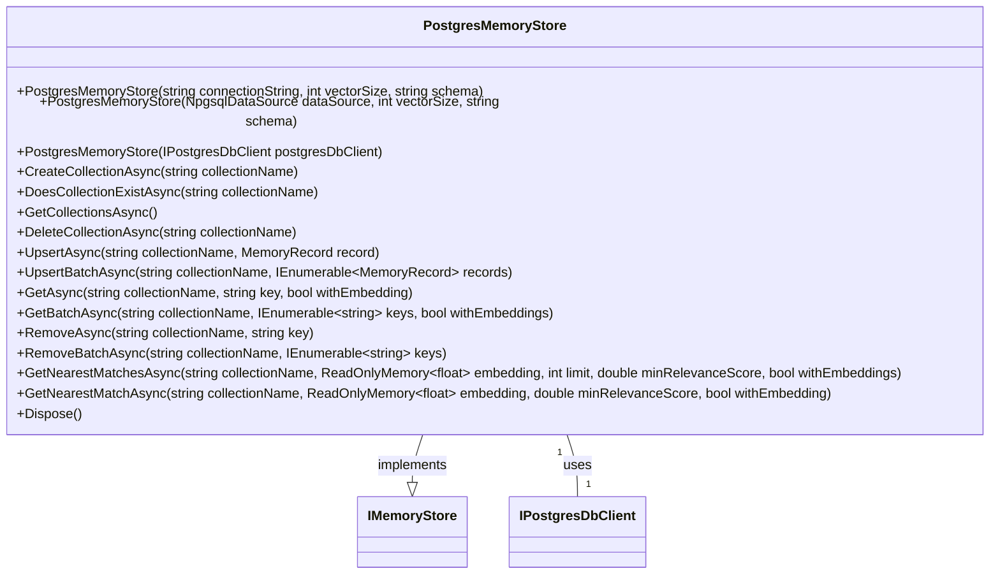

### Sequence Diagrams

The sequence diagrams illustrate the flow of operations for various methods within the system:

1. `UpsertAsync` Method Interaction with `IPostgresDbClient` Interface:
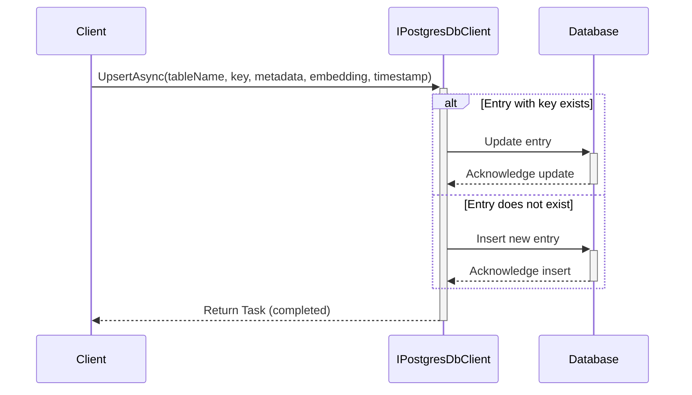

2. `UpsertAsync` Operation in `PostgresDbClient` Class:
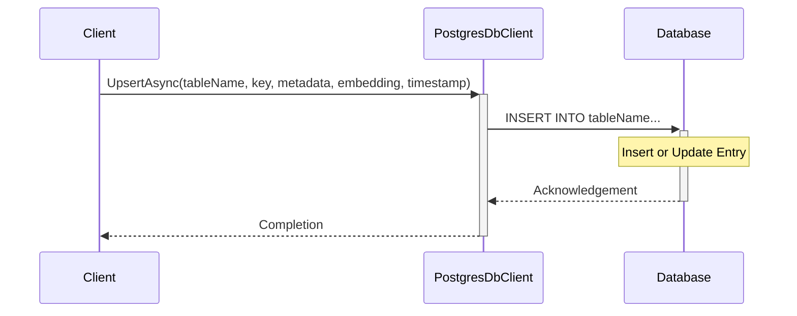

3. `WithPostgresMemoryStore` Extension Methods in `PostgresMemoryBuilderExtensions` Class:
- Connection String:
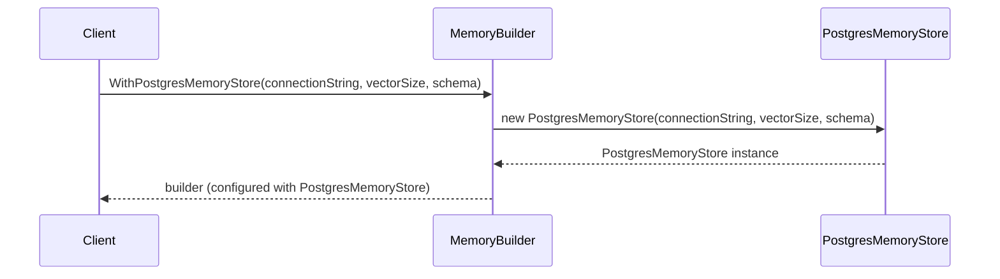
- NpgsqlDataSource:
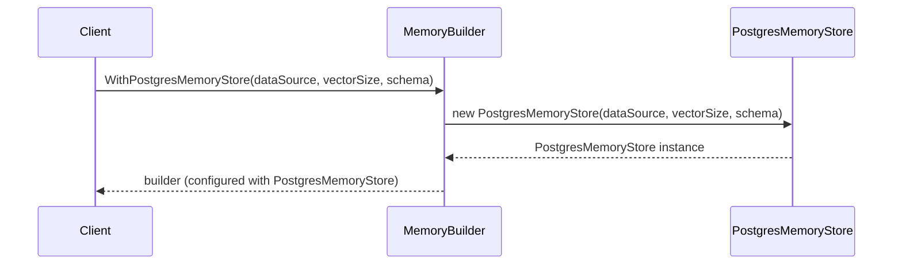
- IPostgresDbClient:
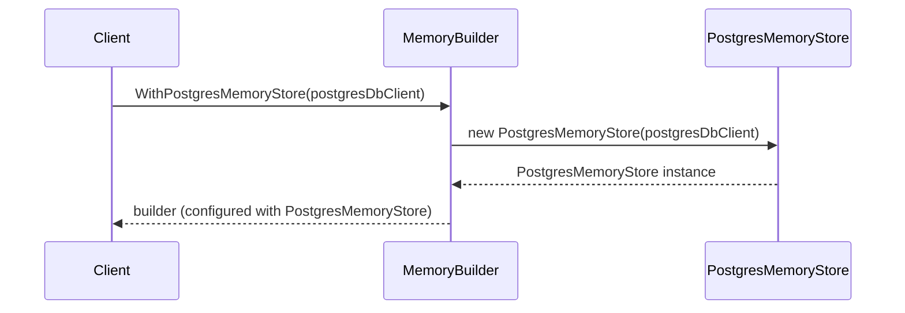

4. `GetNearestMatchesAsync` Method in `PostgresMemoryStore` Class:
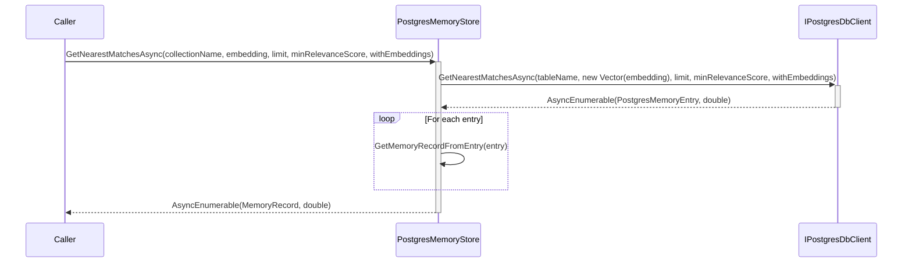

5. Initialization of Memory Store with PostgreSQL and Creating an Index for Vector Similarity Search:
- The sequence for initializing the memory store with PostgreSQL involves configuring the `NpgsqlDataSourceBuilder` with connection details, using the `UseVector()` method, and building the `NpgsqlDataSource`. The `MemoryBuilder` is then instantiated and configured with the `NpgsqlDataSource` using the `WithPostgresMemoryStore()` method. Additional configurations such as attaching a logger and setting up text embedding generation are applied before building the memory store. Finally, the `TextMemoryPlugin` is instantiated with the memory store and imported into the kernel.
- The sequence for creating an index involves determining the row count in the collection table, deciding on the type of index (exact or approximate), and executing SQL commands to create the index on the embedding column using the pgvector extension.

This comprehensive logical view, including class and sequence diagrams, provides a clear understanding of the system's architecture, the relationships between components, and the flow of operations for key functionalities.

***

## 9. Process View
- Concurrent Processes
- Synchronization Mechanisms
- Process Diagrams

## 9. Process View

### Concurrent Processes
The .NET Standard library project for the Postgres connector is designed to handle concurrent processes efficiently. This is evident from the asynchronous operations supported by the `IPostgresDbClient` and `PostgresDbClient` classes, which include methods like `UpsertAsync`, `ReadAsync`, `ReadBatchAsync`, `DeleteAsync`, `DeleteBatchAsync`, and `GetNearestMatchesAsync`. These methods enable multiple clients to interact with the database simultaneously without blocking each other, allowing for concurrent database connections and operations.

The `PostgresMemoryStore` class further supports concurrent operations on memory records within a PostgreSQL database, with methods such as `UpsertAsync`, `UpsertBatchAsync`, `GetAsync`, `GetBatchAsync`, `GetNearestMatchesAsync`, and `GetNearestMatchAsync` designed for asynchronous execution.

Additionally, the Microsoft.SemanticKernel.Connectors.Postgres connector uses Postgres and the pgvector extension to implement Semantic Memory, which involves concurrent processes for handling vector similarity searches, including exact and approximate nearest neighbor searches.

### Synchronization Mechanisms
Synchronization mechanisms are crucial for ensuring thread safety and data consistency during concurrent operations. While the source documents do not explicitly detail synchronization mechanisms, the use of asynchronous programming patterns and `CancellationToken` parameters in the `IPostgresDbClient` and `PostgresDbClient` classes suggests that thread safety and proper synchronization are inherent in the design. These mechanisms allow for cooperative cancellation of asynchronous operations and ensure that the completion of tasks is synchronized with the continuation of the process.

The `PostgresMemoryStore` class uses `CancellationToken` and `IAsyncEnumerable` return types to provide synchronization for concurrent access to a sequence of data. Additionally, standard database concurrency control mechanisms such as locks, transactions, and isolation levels are likely employed to ensure consistent and synchronized access to shared data.

The use of Docker containers for deploying the Postgres database with the pgvector extension also acts as a synchronization mechanism, providing isolated and consistent environments for the connector's operation.

### Process Diagrams
The source documents include UML sequence diagrams for various methods, illustrating the flow of operations and the asynchronous nature of the interactions. For instance, the `UpsertAsync` method's sequence diagram shows the concurrent nature of the operation, with the client initiating the process and the database performing an update or insert operation based on the entry's existence.

An expanded UML sequence diagram for concurrent `UpsertAsync` operations through the `PostgresDbClient` represents two clients performing concurrent operations, with the database acknowledging each operation separately.

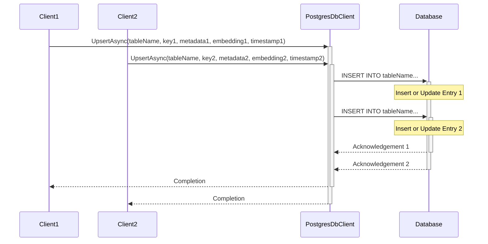

The `PostgresMemoryBuilderExtensions` class's UML sequence diagrams demonstrate the synchronous process flow during the configuration of the Postgres memory store, with a linear sequence of steps without branching or concurrent interactions.

For the `PostgresMemoryEntry` struct, while specific process diagrams are not provided, a UML activity diagram or sequence diagram could be created to illustrate the flow of operations involving this struct within the system, showing the sequence of interactions between different system components and the database.

The high-level process flow diagram for the Microsoft.SemanticKernel.Connectors.Postgres connector would include steps such as installation of the pgvector extension, creation of a database, configuration of the NpgsqlDataSource, and execution of SQL scripts for creating and indexing tables, with conditional logic for determining the number of lists for the index based on the row count.

***Note:*** The actual implementation details for handling concurrency, such as connection pooling, transaction management, and isolation levels, are not provided in the source document and would need to be inferred from the actual codebase or further documentation.

***

## 10. Deployment View
- Physical Nodes
- Deployment Diagrams
- Mapping of Software to Hardware

## 10. Deployment View

### Physical Nodes
The deployment architecture for the .NET Standard library project designed to create a Postgres connector involves several physical nodes. These include:

- A server or a set of servers where the PostgreSQL database is hosted, which must support .NET Standard 2.0 and be capable of running .NET applications.
- Application layer nodes, which may consist of web servers or application servers that interact with the `PostgresMemoryEntry` struct and the `MemoryBuilder` framework.
- A PostgreSQL database server node that is configured to support vector operations for similarity searches, indicating the need for appropriate extensions or configurations, such as the `pgvector` extension.
- Machine learning model servers, if applicable, given the use of embeddings within the `PostgresMemoryEntry` struct.
- Docker containers for the installation of the pgvector extension on Postgres, which can be deployed on cloud platforms such as Azure Database for PostgreSQL - Flexible Server and Azure Cosmos DB for PostgreSQL.

### Deployment Diagrams
Deployment diagrams for this project would illustrate the following:

- A Docker container named `postgres-pgvector` running the Postgres database with the pgvector extension enabled, exposing port 5432.
- Cloud deployment options, with Azure services hosting the Postgres database and the pgvector extension.
- The relationship between application server(s) where the `PostgresMemoryStore` class is deployed and the database server hosting the PostgreSQL instance, including network connectivity and relevant protocols or ports used for communication.
- The three-tier deployment architecture with client application instances, the `IPostgresDbClient` middleware or service layer, and the PostgreSQL database server.

### Mapping of Software to Hardware
The mapping of software components to hardware in the deployment architecture includes:

- The `PostgresDbClient` class and other software components such as `NpgsqlDataSourceBuilder`, `NpgsqlDataSource`, `MemoryBuilder`, and `TextMemoryPlugin`, which interact with the Postgres database to utilize it as a semantic memory store.
- The `PostgresMemoryStore` instances are created and configured within the `MemoryBuilder` framework, indicating that the software components are deployed on the same hardware or virtualized environment that runs the `MemoryBuilder`.
- The `PostgresMemoryStore` class, as part of an application, would be deployed on one or more application servers. These servers must have network access to the PostgreSQL database server.
- The PostgreSQL database software runs on the database server node, and the client application, which could be a web service, desktop application, or another type of service, would be deployed on a separate node, such as a web server or client machine.
- The deployment should consider the resource requirements for handling vector operations, which may be resource-intensive, and ensure that the hardware is appropriately provisioned to handle the computational load.

The deployment view should focus on the infrastructure required to support the functionalities of the `PostgresMemoryEntry` struct within a PostgreSQL database environment, considering the needs for semantic analysis or machine learning tasks. The deployment diagram will visualize the physical layout and the interaction between different nodes, while the mapping will detail how the software components are distributed across the hardware infrastructure.

***

## 11. Implementation View
- Directory Structure
- Module Organization
- Dependencies

## 11. Implementation View

### Directory Structure
The directory structure across the various components of the system is not explicitly detailed in the source documents. However, it can be inferred that the system is organized hierarchically, with a clear separation of concerns. For instance, the `PostgresMemoryEntry` struct suggests a directory structure that may include folders for database interaction (`Database/`), models (`Models/`), and utilities (`Utilities/`). Similarly, the `PostgresMemoryStore` and `IPostgresDbClient` interface would likely reside in directories dedicated to database interaction or within similar namespaces. The `Microsoft.SemanticKernel.Connectors.Postgres` connector is part of a larger project that includes a `samples` directory with `KernelSyntaxExamples`, indicating a structured directory that separates features such as examples and core functionality.

### Module Organization
The system's source code is organized into modules that encapsulate specific functionalities. The `PostgresDbClient` class, for example, is a single module that handles interactions with PostgreSQL databases, particularly for operations involving vector embeddings. The `PostgresMemoryBuilderExtensions` class is a utility class that provides extension methods for the `MemoryBuilder` class, configuring a Postgres memory store within the `MemoryBuilder` framework. The `Microsoft.SemanticKernel.Connectors.Postgres` connector integrates Postgres with Semantic Memory using the `pgvector` extension and includes examples demonstrating its usage. Each module is designed with asynchronous methods, suggesting that implementation modules should be capable of handling non-blocking I/O operations.

### Dependencies
The project has a mix of package and project dependencies. Package dependencies include `Microsoft.Bcl.AsyncInterfaces` for asynchronous programming interfaces and `Pgvector` to support the `pgvector` extension in Postgres. Project dependencies include `SemanticKernel.Core`, which provides core functionalities to the system. The `PostgresMemoryStore` class depends on the `IMemoryStore` interface, the `pgvector` extension, `NpgsqlDataSource`, and the `IPostgresDbClient` interface for database operations. The `PostgresMemoryBuilderExtensions` class depends on the `MemoryBuilder` class, `PostgresMemoryStore` class, `NpgsqlDataSource`, and `IPostgresDbClient`. The `Microsoft.SemanticKernel.Connectors.Postgres` connector relies on Postgres, `pgvector`, Docker, Npgsql, and optionally on cloud-based services like Azure Database for PostgreSQL - Flexible Server and Azure Cosmos DB for PostgreSQL.

### UML Diagramming Information
UML diagrams are provided for various components to illustrate their structure and interactions. For instance, the UML sequence diagram for the `UpsertAsync` method in the `IPostgresDbClient` interface shows the flow of operations and interactions between a client, the interface, and the database. The UML class diagram for the `PostgresDbClient` class provides a visual representation of its structure, detailing its private fields, public methods, and their relationships. Similarly, UML sequence diagrams for the `PostgresMemoryBuilderExtensions` class illustrate the interaction between the `Client`, `MemoryBuilder`, and `PostgresMemoryStore` during the configuration process. The UML class diagram for the `PostgresMemoryEntry` struct and the sequence diagram for the `GetNearestMatchesAsync` method in the `PostgresMemoryStore` class are also included to provide clarity on their respective structures and operations.

**Note**: The source document does not provide explicit textual information about the internal architecture or class design of the `Microsoft.SemanticKernel.Connectors.Postgres` module. The information provided focuses more on the usage and setup of the `pgvector` extension within a Postgres database and its integration with the Semantic Kernel's memory store. The migration script suggests that the module's implementation may involve dynamic SQL for table and index creation based on the data stored in the memory tables.

***

## 12. Data View
- Data Models
- Entity-Relationship Diagrams
- Data Flow Diagrams

## 12. Data View

### Data Models
The data models for the Postgres connector library and associated Semantic Kernel plugins are designed to interact with PostgreSQL database tables that store data entries with associated vector embeddings. These models are crucial for the functionalities of the Postgres connector, which include operations such as creating, checking the existence of, retrieving, and deleting collections and records, as well as performing similarity searches based on cosine similarity of embedding vectors.

The primary components of the data model include:
- **Key**: A unique identifier for each data entry.
- **Metadata**: A JSONB field to store associated metadata.
- **Embedding**: A vector field to store the vector embeddings, which are used for querying nearest matches based on vector similarity.
- **Timestamp**: A timestamp field to record the time of the entry.

The `PostgresMemoryEntry` struct is another significant part of the data model, which includes a key, a metadata string, an optional embedding vector, and an optional timestamp.

### Entity-Relationship Diagrams
Entity-Relationship Diagrams (ERDs) are not explicitly provided in the source document, but the relationships can be inferred from the data models and operations described. The primary relationship is a one-to-many relationship between Tables and Entries, where one table can contain multiple entries, but each entry belongs to exactly one table. Additionally, a self-referencing relationship within Entries is implied for nearest match querying, as vector embeddings within entries are used to find the closest matches.

### Data Flow Diagrams
Data Flow Diagrams (DFDs) are not included in the source document, but can be constructed based on the UML sequence diagrams provided. For instance, the `UpsertAsync` operation can be represented in a DFD that shows the data processes involved in upserting an entry, the data stores (tables), and the data flows between the client, the `IPostgresDbClient` interface, and the database. The steps include the client sending an upsert request, the `IPostgresDbClient` performing an update or insert operation, the database acknowledging the operation, and the `IPostgresDbClient` returning the completion status to the client.

The `GetNearestMatchesAsync` method's data flow involves the caller invoking the method on the `PostgresMemoryStore` instance, which then calls the `IPostgresDbClient`. The `IPostgresDbClient` returns an asynchronous enumerable of tuples, each containing a `PostgresMemoryEntry` and a relevance score, which the `PostgresMemoryStore` converts into `MemoryRecord` tuples to return to the caller.

### UML Diagrams
The UML diagrams provided in the source document include class diagrams and sequence diagrams that represent the class structure and data flow for specific operations. These diagrams are essential for understanding the architecture and interactions within the system.

**UML Class Diagram for PostgresMemoryEntry:**

**UML Sequence Diagram for Upsert Operation:**

These UML diagrams, along with the inferred ERDs and DFDs, provide a comprehensive view of the data architecture and flows within the system.

***

## 13. Size and Performance
- System Size Metrics
- Performance Targets and Benchmarks

## 13. Size and Performance

### System Size Metrics
The system size metrics for the .NET Standard library project are influenced by various factors, including dependencies, project references, and the data structures used within the system. The library interacts with PostgreSQL databases and is designed to handle data entries with associated vector embeddings. The size of these embeddings, such as the example size of 1536, directly impacts the size of the data stored and the complexity of vector-based operations. The `PostgresMemoryStore` class, which handles collections of memory records, can scale significantly depending on the number of collections and records managed. The `PostgresMemoryEntry` struct, with properties for keys, metadata, embeddings, and timestamps, also contributes to the system size, with the embedding vectors and metadata complexity influencing performance.

The system is designed to handle different scales of data efficiently, with specific indexing strategies for collections with over 10 million rows and for those with over 10,000 rows. The `PostgresDbClient` class initialization includes a `NpgsqlDataSource` object, a schema name, and a vector size, which are significant metrics affecting the system's size. The `IPostgresDbClient` interface supports batch operations and the retrieval of a large set of tables, indicating the system's capability to manage a moderate to large size.

### Performance Targets and Benchmarks
Performance targets and benchmarks for the project are centered around the efficiency of database interactions and the overhead introduced by the connector. The system's performance is measured by the efficiency of CRUD operations, the speed of vector-based similarity searches, and the handling of concurrent database queries. Asynchronous methods are used throughout the system to optimize for non-blocking I/O operations and efficient concurrency management.

The `PostgresDbClient` class's `GetNearestMatchesAsync` method performs vector-based similarity searches using the cosine similarity metric, which is computationally intensive and thus a critical factor in performance. The `UpsertAsync` method's sequence diagram indicates a need for quick response times in determining whether to update an existing entry or insert a new one. The pgvector extension for Postgres supports vector similarity search and allows for both exact and approximate nearest neighbor search, with performance tunable by adjusting the number of lists in the index creation and the number of probes during the search.

The UML Class Diagrams and Sequence Diagrams provided in the source document visually represent the structure and operation flow of classes like `PostgresDbClient` and `PostgresMemoryStore`, which are essential for assessing and planning for system performance. The diagrams illustrate the interaction between various components and the asynchronous nature of operations, highlighting potential bottlenecks and areas for optimization.

In summary, the system is designed to be scalable and performant, with a focus on handling large datasets and vector operations efficiently. Performance benchmarks should be established based on typical usage patterns, expected data volumes, and empirical testing during development and testing phases. The UML diagrams serve as a tool for understanding the system's architecture and performance characteristics, aiding in the optimization of the system's size and performance.

***

## 14. Quality Attributes
- Security Measures
- Reliability & Availability
- Maintainability & Scalability

## 14. Quality Attributes

### Security Measures
Security within the system is implicitly addressed through various practices and configurations. The use of passwords and API keys in code snippets and Docker container setups ensures that database access and external service interactions are protected. While explicit security measures are not detailed in the source code documentation, the nature of the project—a Postgres connector—necessitates the consideration of security measures such as authentication, authorization, encryption, and secure handling of SQL commands to prevent injection attacks.

### Reliability & Availability
The system is designed with reliability and availability in mind, leveraging .NET Standard 2.0 for broad compatibility and non-blocking asynchronous methods for database operations. This ensures that the system can handle concurrent operations without downtime. The presence of features like `UpsertAsync` enhances data integrity and reliability. Containerization through Docker and support for high availability services like **Azure Database for PostgreSQL - Flexible Server** and **Azure Cosmos DB for PostgreSQL** further contribute to the system's robustness.

### Maintainability & Scalability
Maintainability is facilitated by a clear project structure, consistent coding styles, and the use of shared properties to avoid duplication. The system's design allows for easy updates, testing, and integration with other systems, as seen with the use of dependency injection and builder patterns. Scalability is addressed through asynchronous programming patterns, batch operations, and dynamic index creation strategies that adapt to the size of the dataset. The system is scalable to different use cases and data sizes, as indicated by the configuration options for vector size and schema name.

### UML Diagramming Information
UML diagrams are integral to the documentation, providing visual representations of class structures, sequences of operations, and interactions between components. For instance, the UML sequence diagram for the `UpsertAsync` method illustrates the flow of operations between the client, the `IPostgresDbClient` interface, and the database. Although not explicitly provided in the source document, UML diagrams such as Component, Sequence, and Class diagrams could be created to represent the integration of the pgvector extension with Postgres, the steps involved in setting up the Postgres container, and the relationships between various classes in the C# code snippet.

### Practice Extraction for a Small Section
The practice extraction demonstrates the process of identifying security measures, maintainability, and scalability within a code snippet. It highlights the importance of including passwords for database connections, the use of builder patterns for maintainable system configuration, and the inclusion of parameters like `vectorSize` to accommodate scalability.

***

## 15. Technical Risks and Mitigations
- Identified Risks
- Mitigation Strategies
- Contingency Plans

## 15. Technical Risks and Mitigations

### Identified Risks
The technical risks identified across the project's components include:

1. **Asynchronous Operations**: The interface methods are asynchronous, which could lead to potential issues with concurrency and data consistency if not handled properly.
2. **Concurrency and Transaction Management**: The class methods may be subject to race conditions or transactional inconsistencies when multiple instances interact with the same database concurrently.
3. **Cross-Project Dependencies**: The Postgres connector depends on the `SemanticKernel.Core` project. Changes in the core project could potentially break the connector.
4. **Database Connection Failures**: The `PostgresMemoryStore` class relies on a stable connection to the PostgreSQL database. Connection issues could lead to failures in initializing the class or during operations.
5. **Database Connectivity**: The `PostgresDbClient` class relies on a `NpgsqlDataSource` object for database connectivity. Any issues with the PostgreSQL server or network problems could disrupt the service.
6. **Database Interactions**: Frequent database operations such as upserts, reads, and deletes could result in performance bottlenecks or transactional conflicts.
7. **Database Interactions**: The system relies on a Postgres database, which introduces a risk of database unavailability or connectivity issues.
8. **Dependency on External Database**: The system relies on a Postgres database, which introduces a risk of database unavailability or connectivity issues.
9. **Dependency on External Extension**: The system relies on the [pgvector](https://github.com/pgvector/pgvector) extension for Postgres, which is necessary for vector similarity search. If this extension is not maintained or becomes incompatible with future versions of Postgres, the system's functionality could be compromised.
10. **Dependency on External Packages**: The project relies on external NuGet packages like `Microsoft.Bcl.AsyncInterfaces` and `Pgvector`. Any breaking changes or discontinuation of these packages could impact the project's functionality.
11. **Performance Bottlenecks**: The performance may be affected by the size of the embedding vectors and the efficiency of the Postgres memory store implementation.
12. **Performance Bottlenecks**: The vector-based similarity search could become a performance bottleneck, especially with large datasets and high-dimensional vectors.
13. **Performance Issues**: The use of approximate nearest neighbor search through pgvector could lead to performance issues, especially as the size of the data grows. This could result in slower query responses and increased load times.
14. **Schema Changes**: The class is initialized with a schema name, and any changes to the schema could lead to failures in table management and data operations.
15. **Schema Compatibility**: The default or specified schema used in the Postgres memory store must be compatible with the existing database schema.
16. **Shared Property Configuration**: Importing shared properties from external files can lead to unexpected behaviors if those shared files are modified without considering all dependent projects.
17. **Table Management**: The dynamic creation and deletion of tables could lead to data loss if not managed correctly.
18. **Unique Identifier Collision**: The `Key` property is intended to be a unique identifier. There is a risk of collision if the uniqueness is not enforced, leading to data integrity issues.
19. **Vector Embeddings**: The querying for nearest matches based on vector similarity requires efficient indexing and could be computationally intensive, affecting performance.
20. **Vector Size Consistency**: The class is initialized with a vector size that specifies the dimensionality of the vector embeddings. Inconsistencies in vector size could lead to errors during data upserts and similarity searches.

### Mitigation Strategies
To address the identified risks, the following mitigation strategies have been proposed:

1. **Concurrency Control**: Implement proper synchronization mechanisms or use database transaction features to ensure data consistency during concurrent operations.
2. **Data Backup**: Regularly back up the database to prevent data loss during table management operations.
3. **Enforce Key Uniqueness**: Implement checks within the database to ensure that each `Key` is unique before insertion or update.
4. **Exception Handling**: Define a robust error handling framework within the interface implementation to manage and log exceptions effectively.
5. **Fallback to Alternative Packages**: Have a list of alternative packages that could replace current dependencies if they become unavailable or unsuitable.
6. **Indexing**: Use appropriate indexing strategies for vector embeddings to ensure efficient nearest neighbor searches.
7. **Isolate Core Dependencies**: Abstract the dependencies on `SemanticKernel.Core` through interfaces or adapters to minimize the impact of changes.
8. **Monitor .NET Standard Evolution**: Keep abreast of changes in .NET Standard and plan for migration to newer versions of .NET if necessary.
9. **Parameterized Queries**: Use parameterized queries instead of string interpolation to prevent SQL injection vulnerabilities.
10. **Performance Optimization**: Optimize database queries and use caching where appropriate to improve performance and reduce the load on the database.
11. **Regularly Update and Test Dependencies**: Keep the project's dependencies up to date and test thoroughly when updating to ensure compatibility.
12. **Robust Connection Handling**: Implement connection retry policies and robust error handling to manage database connectivity issues.
13. **Schema Versioning**: Use schema versioning and migration strategies to handle schema changes without disrupting the service.
14. **Shared Property Management**: Implement strict version control and review processes for shared property files to prevent breaking changes.
15. **Stable Release Management**: Move to a stable release as soon as the library is mature enough, and maintain a clear release cycle.
16. **Time Synchronization**: Ensure that all servers interacting with the database are synchronized with a reliable time source to maintain accurate timestamping.
17. **Transaction Management**: Use database transactions and locking mechanisms to handle concurrent modifications safely.
18. **Version Control and Interface Stability**: Use semantic versioning for the `SemanticKernel.Core` project and maintain stable interfaces to avoid breaking changes.

### Contingency Plans
In the event that the mitigation strategies are insufficient, the following contingency plans are in place:

1. **Automated Schema Migration Tools**: Utilize automated schema migration tools to manage schema changes and rollbacks if necessary.
2. **Backup and Recovery**: Regularly backup the database and test recovery procedures to protect against data corruption or loss.
3. **Database Failover**: In case of database downtime, switch to a standby database or a pre-configured replica.
4. **Disaster Recovery**: Establish a disaster recovery plan to restore data from backups in case of critical failures.
5. **Documentation and Training**: Ensure that the system's documentation is up-to-date and provide training for developers to handle potential risks effectively.
6. **Fallback Mechanisms**: In case of performance degradation, have a fallback mechanism to a more performant database or a simplified querying mechanism.
7. **Fallback to Secondary Database**: In case of primary database failure, have a secondary standby database to switch over to.
8. **Fallback to Previous Version**: In case of incompatibility with new versions of Postgres or pgvector, have a plan to revert to a previous, stable version of the system.
9. **Framework Compatibility Testing**: Implement a comprehensive testing strategy that includes compatibility tests for different .NET versions.
10. **Monitoring and Alerts**: Implement monitoring tools to track the health of the database and set up alerts for any anomalies that could indicate issues.
11. **Pre-release Channels**: Use different distribution channels for stable and pre-release versions to mitigate the risk of consumers using unstable versions.
12. **Runtime Monitoring**: Implement monitoring to detect vector size inconsistencies and trigger alerts or fallback processes.

***UML Diagramming Information:***
The UML diagrams provided offer visual representations of the system's components and their interactions. These include class diagrams for the `PostgresMemoryEntry` struct and the `PostgresDbClient` class, as well as sequence diagrams for operations like `UpsertAsync`. These diagrams are essential for understanding the structure and flow of operations within the system and are integral to risk assessment and mitigation planning.

***Key Information Emphasis:***
- The system's reliance on a Postgres database and the pgvector extension is a significant risk factor.
- Performance and schema compatibility are critical areas for risk mitigation.
- Proper configuration and management of data sources and client instances are essential.
- Contingency plans should be in place for database failover, performance scaling, schema migration, configuration rollback, and client instance monitoring.

***

## 16. Cross-Cutting Concerns
- Internationalization
- Logging and Monitoring
- Error Handling Strategies

## 16. Cross-Cutting Concerns

### Internationalization
Internationalization is a critical aspect of software development, ensuring that applications can support various character sets and collations to accommodate international data. While the source documents do not explicitly mention internationalization concerns, it is implied that the system should support different locales and character encodings, particularly for a library connecting to Postgres databases that interact with data in multiple languages.

### Logging and Monitoring
Logging and monitoring are essential for tracking the behavior, performance, and issues of a library in production environments. The source documents suggest that the system has provisions for logging activities, which is crucial for monitoring the system's health and performance, as well as for debugging purposes. The use of a `loggerFactory` indicates that the system is designed to log activities, and the `Timestamp` property within the `PostgresMemoryEntry` struct could be utilized for logging and monitoring purposes, as it records the time at which the entry was created or last modified.

### Error Handling Strategies
Error handling strategies are vital for managing exceptions, resource cleanup, and communicating errors to client applications. The source documents do not provide specific details on error handling strategies. However, the use of asynchronous methods (`async`) and cancellation tokens (`CancellationToken`) suggests that the classes are designed to handle operation cancellations gracefully. Additionally, the presence of a `Dispose` method indicates that the `PostgresMemoryStore` class implements the `IDisposable` interface for proper resource cleanup, which is part of exception-safe handling and resource management.

### UML Diagramming Information
UML diagrams offer insights into the class structure and the sequence of operations for key methods, which can be useful for understanding the architecture and potential areas where cross-cutting concerns may be addressed. The source documents include several UML diagrams:

- UML sequence diagram for the `UpsertAsync` method, illustrating the flow of operations when upserting an entry into a table.
- UML class diagram for the `PostgresMemoryEntry` struct, showing the properties `Key`, `MetadataString`, `Embedding`, and `Timestamp`.
- UML class diagram for the `PostgresMemoryStore` class, showing its relationship with the `IMemoryStore` interface and the `IPostgresDbClient` object.
- UML sequence diagram for the `GetNearestMatchesAsync` method, illustrating the interaction between the caller, the `PostgresMemoryStore` class, and the `IPostgresDbClient` object during the execution of a similarity search.
- UML sequence diagrams that illustrate the interactions between the client, the `MemoryBuilder`, and the `PostgresMemoryStore` for each of the extension methods provided by the `PostgresMemoryBuilderExtensions` class.

These diagrams are consistent with the textual descriptions provided for each method, showing the flow from the client's request to configure the memory builder with a Postgres memory store, through the creation of the `PostgresMemoryStore` instance, and back to the client with the configured builder.

### Examples
The source document provides examples of how to set up and use the pgvector extension with Postgres, including Docker commands, SQL for creating databases and enabling extensions, and C# code for integrating the Postgres memory store with a semantic kernel. These examples are relevant to the design document section as they touch upon the practical aspects of implementing the system, which may include considerations for logging, monitoring, and error handling.

***

## 17. Tools and Technologies
- Development Tools
- Frameworks and Libraries
- External Services/APIs

## 17. Tools and Technologies

### Development Tools
The development of the project requires a range of tools to facilitate the creation, testing, and deployment of the software. The primary programming language used is C#, suggesting the use of an Integrated Development Environment (IDE) such as Visual Studio, which supports C# and .NET development. Additionally, Docker is employed for setting up the project environment, specifically for installing the pgvector extension in a Postgres container. XML configuration files are also utilized for defining project structure and dependencies.

### Frameworks and Libraries
The project is built on the .NET Standard 2.0 framework, ensuring compatibility across various .NET implementations. Asynchronous programming is a key feature, with the `System.Threading.Tasks` namespace being used for `Task` and `IAsyncEnumerable` types. The Npgsql library is a critical component, serving as the PostgreSQL data provider for .NET, which is used in conjunction with the `NpgsqlDataSource` object for database connectivity. The Microsoft.Bcl.AsyncInterfaces package provides additional compatibility for asynchronous interfaces. The Pgvector package is essential for supporting the `pgvector` extension in Postgres, which is integral to the Postgres connector functionality.

### External Services/APIs
The project interfaces with several external services and APIs. It is designed to work with Semantic Kernel plugins and semantic memory systems, which may involve interactions with related external services or APIs. PostgreSQL is the primary external database service, with the project relying on the `pgvector` extension for vector operations within the database. Cloud database services such as Azure Database for PostgreSQL - Flexible Server and Azure Cosmos DB for PostgreSQL are also supported, both of which accommodate the `pgvector` extension. Additionally, the OpenAI Text Embedding Generation API is used for generating text embeddings, with the code example specifying the "text-embedding-ada-002" model and requiring an API key for access.

### UML Diagramming Information
The project documentation includes UML diagrams to illustrate the architecture and interactions within the system. Specifically, UML class diagrams provide a visual representation of classes such as `PostgresDbClient` and `PostgresMemoryStore`, detailing their structures and relationships with interfaces like `IMemoryStore` and `IPostgresDbClient`. UML sequence diagrams are also provided to depict the flow of operations for methods such as `UpsertAsync` and `GetNearestMatchesAsync`, showing the interactions between clients, interfaces, and the database. These diagrams are created using the mermaid syntax, a text-based diagramming tool that can be integrated into documentation or development tools that support it.

**Note:** No UML diagrams are applicable for sections solely focused on configuration and setup of the project. However, where class structures and interactions are defined, UML diagrams are included to aid in understanding the system's architecture.

**Abbreviations:**
- API: Application Programming Interface
- IDE: Integrated Development Environment
- UML: Unified Modeling Language

**Examples:**
- An example of using Docker for setting up the project environment would involve creating a Dockerfile that specifies the installation of the pgvector extension within a Postgres container.
- A UML class diagram example would show the `PostgresDbClient` class with its private fields and public methods, illustrating how it interacts with the PostgreSQL database through the `IPostgresDbClient` interface.

***

## 18. References
- External Documents
- Standards and Guidelines

## 18. References

### External Documents
The following external documents are referenced in the design and implementation of the software:

- Azure Cosmos DB for PostgreSQL Documentation: Provides guidelines on using the pgvector extension with Azure Cosmos DB for PostgreSQL.
- Azure Database for PostgreSQL - Flexible Server Documentation: Offers instructions on utilizing the pgvector extension with Azure Database for PostgreSQL - Flexible Server.
- C# Documentation: Serves as a reference for C# programming constructs and asynchronous programming patterns used in the `PostgresMemoryStore` class.
- IEEE Standards for Software Documentation: Ensures that the documentation of the `PostgresMemoryStore` class adheres to industry standards for software documentation.
- JSONB Data Type Documentation: Necessary for understanding the usage, indexing, and query optimization of the JSONB data type within PostgreSQL.
- KernelSyntaxExamples (Example 14 & 15): Located within the source document's repository, under the directory `../../../samples/KernelSyntaxExamples/`, providing practical examples of syntax usage.
- Npgsql Documentation: Critical for understanding the implementation and usage of the `NpgsqlDataSource` object within the `PostgresDbClient` class.
- NuGet Package Metadata: Details the package's purpose as a Postgres connector for Semantic Kernel plugins and semantic memory systems.
- pgvector GitHub Repository and Installation Documentation: Essential for understanding the pgvector extension used for vector operations and its installation process on Postgres.
- PostgreSQL Documentation: Serves as a comprehensive guide for PostgreSQL database management, query syntax, and the `pgvector` extension.
- Postgres Naming Convention: Outlines the naming conventions for identifiers in PostgreSQL.

### Standards and Guidelines
The project adheres to the following standards and guidelines:

- .NET Design Guidelines: Followed for best practices in designing C# classes, methods, and interfaces, ensuring the `PostgresMemoryStore` class follows .NET conventions.
- .NET Standard 2.0: The project targets .NET Standard 2.0 for broad compatibility across different .NET implementations.
- Asynchronous Programming Best Practices in C#: Guidelines followed to ensure best practices in asynchronous programming are applied.
- Assembly Naming: The assembly name "Microsoft.SemanticKernel.Connectors.Postgres" follows Microsoft's naming conventions for assemblies.
- C# Asynchronous Programming Guidelines: Ensures that asynchronous methods in the `PostgresDbClient` class adhere to best practices.
- Data Security and Privacy Standards: Standards related to data security, privacy, and compliance are considered to align the class's operations with legal and ethical requirements.
- Database Schema Design Standards: Guidelines on schema design are followed to ensure best practices for database structure.
- Dependency Injection Principles: Applied in the implementation of the `IPostgresDbClient` interface in the `PostgresMemoryStore` class.
- Interface Design Principles for Database Clients in .NET Applications: Followed to ensure the `IPostgresDbClient` interface is designed according to best practices.
- Package Dependencies: Specifies dependencies such as "Microsoft.Bcl.AsyncInterfaces" for asynchronous programming interfaces and "Pgvector" for Postgres vector support.
- Project References: The project references the "SemanticKernel.Core" project, indicating a dependency on its core functionalities.
- Shared Property Importation: Promotes consistency across the repository by importing shared properties from external files, adhering to the DRY principle.
- UML Sequence Diagram Standards: Followed for representing object interactions in the provided UML sequence diagrams.
- Vector Embeddings Standards: Industry standards for vector embeddings, such as dimensionality or storage formats, are referenced to ensure proper handling of vector data.
- Versioning Strategy: Uses a version suffix "alpha" to indicate a pre-release version, adhering to semantic versioning guidelines.

### UML Diagramming Information
The UML diagrams provided in the source documents serve as essential references for understanding the structure and behavior of the classes involved:

- UML Class Diagrams: Visual representations of class structures, such as the `PostgresMemoryEntry` struct and the `PostgresMemoryStore` class, detailing their properties, methods, and relationships with other components.
- UML Sequence Diagrams: Illustrate the flow of operations for methods like `UpsertAsync` in the `IPostgresDbClient` interface and the `GetNearestMatchesAsync` method in the `PostgresMemoryStore` class. These diagrams depict the interactions between clients, interfaces, and databases during operations such as upserts and nearest neighbor searches.

The UML diagrams are integral to the documentation, providing clarity on the design and interaction patterns of the software components.

***

## 19. Appendix
- Additional Diagrams
- Glossary of Terms

## 19. Appendix

This appendix serves as a supplementary section to the main body of the design document, providing additional visual representations of the system's behavior and clarifying terminology for readers. It includes UML diagrams that illustrate the structure and interactions within the software, as well as a comprehensive glossary of terms relevant to the Microsoft.SemanticKernel.Connectors.Postgres and the pgvector extension.

### Additional Diagrams

The following UML diagrams have been included to visually represent the structure and behavior of the system:

#### UML Class Diagram for `PostgresDbClient`

#### UML Sequence Diagram for Upsert Operation

#### UML Class Diagram for `PostgresMemoryStore`

#### UML Sequence Diagram for GetNearestMatchesAsync

### Glossary of Terms

The glossary of terms is organized alphabetically for ease of reference:

- **.NET Standard**: A formal specification of .NET APIs that are intended to be available on all .NET implementations.
- **AssemblyName**: The name of the compiled assembly, a reusable, versionable, and self-describing building block of a .NET application.
- **Azure Cosmos DB for PostgreSQL**: A globally distributed, multi-model database service with PostgreSQL compatibility in Azure.
- **Azure Database for PostgreSQL - Flexible Server**: A managed service that provides a PostgreSQL database in Azure.
- **Cancellation Token**: A construct in C# that allows cooperative cancellation of asynchronous operations.
- **CRUD**: Create, Read, Update, Delete - basic operations of persistent storage.
- **EnumeratorCancellation**: An attribute in C# that propagates the cancellation token to the enumerator of an asynchronous enumerable.
- **Exact Nearest Neighbor Search**: A search algorithm that finds the closest vector in a dataset to a given query vector.
- **Extension Method**: A method that is defined as static but appears to be an instance method on the extended type.
- **IAsyncEnumerable**: An interface in C# that allows asynchronous iteration over a sequence of values.
- **IMemoryStore**: An interface that defines the contract for memory store operations.
- **IPostgresDbClient**: An interface defining operations for managing a PostgreSQL database.
- **JSONB**: A data type in PostgreSQL that stores JSON data in a decomposed binary format.
- **MemoryBuilder**: A class within a framework designed to configure and manage memory stores.
- **MemoryRecord**: A data structure that contains a key, metadata, and an optional embedding vector.
- **NpgsqlDataSource**: A class in C# that represents a connection to a PostgreSQL database.
- **NpgsqlDataSourceBuilder**: A class used to build a data source for Npgsql, a .NET data provider for PostgreSQL.
- **NuGet Package**: A package manager for .NET that provides a centralized repository for package distribution.
- **PackageReference**: An element in the project file that specifies a package dependency.
- **pgvector**: An extension for Postgres, presumably related to vector operations or data types within the database.
- **Postgres**: An open-source relational database management system.
- **PostgresDbClient**: A C# class designed to interact with PostgreSQL databases, particularly for operations involving vector embeddings.
- **PostgresMemoryEntry**: A data structure representing an entry in a PostgreSQL database, which may include a key, metadata, vector embedding, and timestamp.
- **PostgresMemoryStore**: A database memory connector that interacts with a Postgres database.
- **Primary Key**: A unique identifier for a record in a database table.
- **ProjectReference**: An element in the project file that specifies a dependency on another project within the same solution.
- **RootNamespace**: The default namespace used by the compiler when it compiles code files.
- **Semantic Kernel**: A conceptual term likely related to the core functionality of the software that deals with semantic memory or data processing.
- **Semantic Memory**: A type of memory store that is used for storing and retrieving knowledge about the world.
- **TargetFramework**: The specification of the version of the .NET framework that the project is intended to run on.
- **Task**: In the context of C# and .NET, a Task represents an asynchronous operation that can return a value.
- **TextMemoryPlugin**: A plugin for semantic memory that deals with text.
- **Timestamp**: A sequence of characters or encoded information identifying when a certain event occurred.
- **UML**: Unified Modeling Language - a standardized modeling language in the field of software engineering.
- **Vector Embedding**: A mathematical representation of data, typically used in the context of machine learning and similarity searches.
- **VersionSuffix**: A label appended to the version number to indicate a pre-release version.

The appendix provides a clear and structured overview of the additional diagrams and terms used throughout the design document, ensuring that readers have a comprehensive understanding of the system's architecture and components.

***

## 20. Approval Sheet
- Signatures of Key Stakeholders
- Approval Status and Dates

## 20. Approval Sheet

This section of the document serves as a formal record of the consensus on the design, functionality, and implementation of the components described within the Microsoft.SemanticKernel.Connectors.Postgres project. It is essential for capturing the acknowledgment and agreement of key stakeholders on the project's deliverables. The Approval Sheet will include the following:

- **Signatures of Key Stakeholders**: Each stakeholder who has reviewed and approved the design document will sign here. The signatures validate the stakeholders' agreement with the project's current state, including the `PostgresDbClient` class, `PostgresMemoryStore` class, `PostgresMemoryEntry` struct, and the `PostgresMemoryBuilderExtensions` class, as well as the setup and usage instructions for the pgvector extension.

- **Approval Status and Dates**: This section will document the approval status (approved, rejected, or pending) for each stakeholder, along with the corresponding dates. This information is crucial for tracking the progress and formal approval process of the project.

The Approval Sheet will encompass the following key components and functionalities as outlined in the design document:

- The `PostgresDbClient` class, which provides asynchronous CRUD operations, vector-based similarity searches, and table management functionalities.
- The `PostgresMemoryStore` class, which implements the `IMemoryStore` interface and offers collection management, record management, and similarity search functionalities.
- The `PostgresMemoryEntry` struct, which defines the properties of a memory entry, including key, metadata, embedding, and timestamp.
- The `PostgresMemoryBuilderExtensions` class, which facilitates the registration of a Postgres memory store into a `MemoryBuilder` configuration using various parameters.

Additionally, the Approval Sheet will reference the UML diagrams provided in the design document, which serve as visual aids for understanding the structure and interactions of the classes and methods. These include:

- UML Sequence Diagram for the `UpsertAsync` method in the `PostgresDbClient` class.
- UML Class Diagram for the `PostgresDbClient` class.
- UML Sequence Diagrams for the `WithPostgresMemoryStore` methods in the `PostgresMemoryBuilderExtensions` class.
- UML Class Diagram for the `PostgresMemoryStore` class.

The Approval Sheet will also reflect the technical components and setup instructions for using the Microsoft.SemanticKernel.Connectors.Postgres with the pgvector extension, including Docker installation, database creation, and indexing strategy. A migration script is provided to assist with the transition to the new structure of using separate tables for each collection, adhering to Postgres naming conventions.

In conclusion, the Approval Sheet will serve as a comprehensive record of the design and implementation standards, functionalities, and interactions within the project, as well as the stakeholders' consent to proceed with the project as described.
