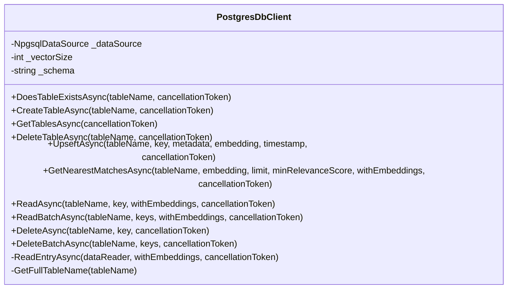
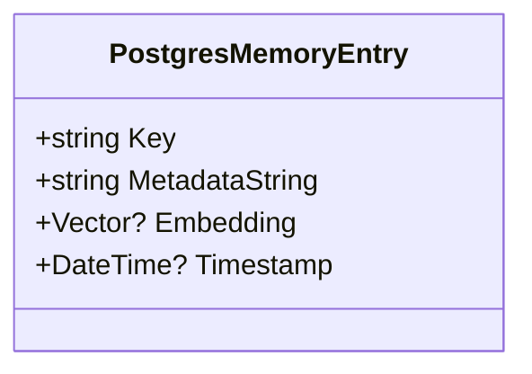
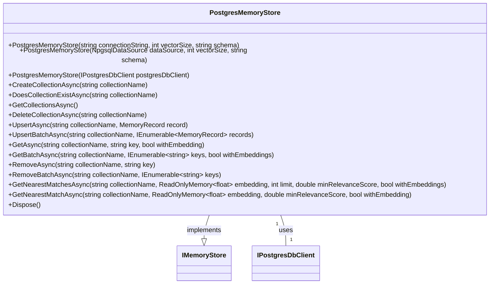
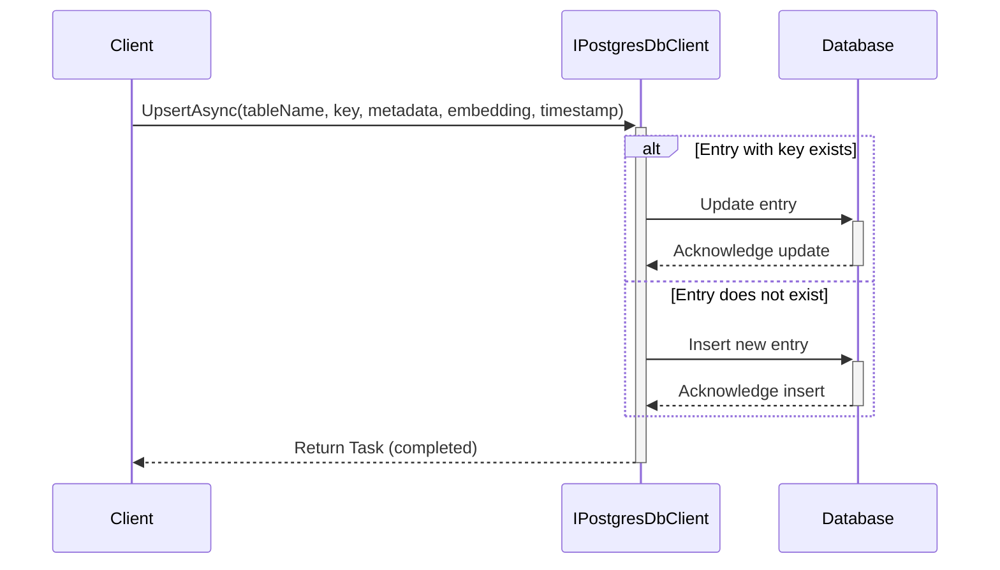
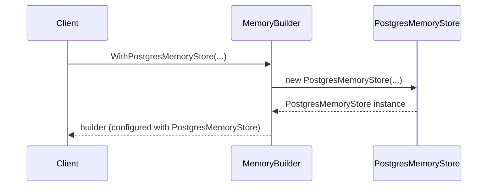
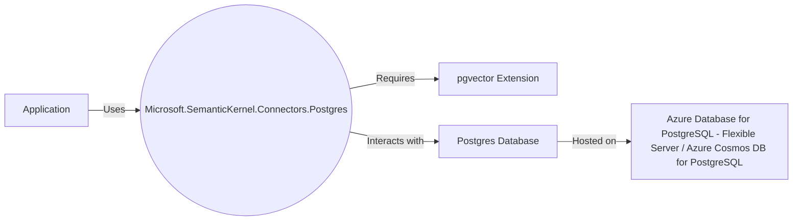
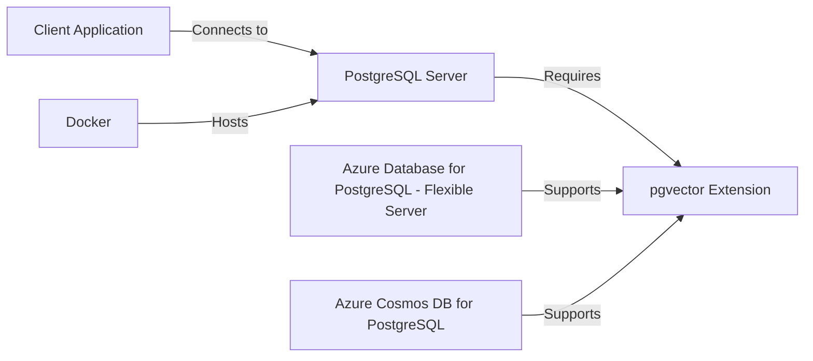
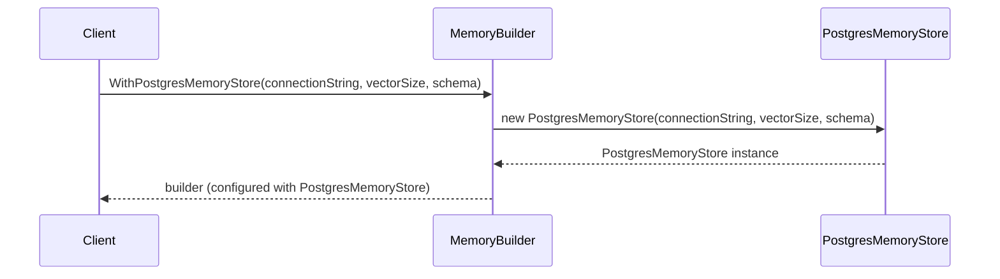
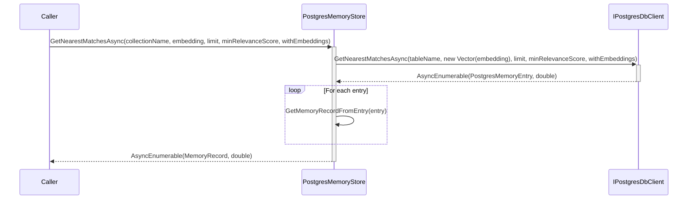

## 1. Title Page
- Document Title: Architecture Design Document
- Project Name: [Project Name]
- Date: 1/28/2024
- Prepared by: O2.services AI


***


## 2. Table of Contents
- [1. Title Page](#1-title-page)
- [2. Table of Contents](#2-table-of-contents)
- [3. Introduction](#3-introduction)
- [4. Architectural Representation](#4-architectural-representation)
- [5. Goals and Constraints](#5-goals-and-constraints)
- [6. Use-Case View](#6-use-case-view)
- [7. Logical View](#7-logical-view)
- [8. Process View](#8-process-view)
- [9. Deployment View](#9-deployment-view)
- [10. Implementation View](#10-implementation-view)
- [11. Data View](#11-data-view)
- [12. Size and Performance](#12-size-and-performance)
- [13. Quality Attributes](#13-quality-attributes)
- [14. Technical Risks and Mitigations](#14-technical-risks-and-mitigations)
- [15. Cross-Cutting Concerns](#15-cross-cutting-concerns)
- [16. Tools and Technologies](#16-tools-and-technologies)
- [17. References](#17-references)
- [18. Appendix](#18-appendix)


***


## 3. Introduction

### Purpose of the Document
The purpose of this document is to provide a comprehensive architectural design for various components that facilitate the integration and management of PostgreSQL databases within different frameworks and systems. These components include a .NET Standard library project for a Postgres connector, the `IPostgresDbClient` interface, the `PostgresDbClient` class, `PostgresMemoryBuilderExtensions` class, `PostgresMemoryEntry` struct, and the `PostgresMemoryStore` class. The document aims to detail the functionalities, configurations, and interactions of these components, particularly in the context of semantic memory systems and vector similarity searches, which are crucial for applications in semantic analysis and machine learning.

### Scope of the Document
This document encompasses the architectural design details of the Postgres connector library, the `IPostgresDbClient` interface, the `PostgresDbClient` class, `PostgresMemoryBuilderExtensions` class, `PostgresMemoryEntry` struct, and the `PostgresMemoryStore` class. It includes their methods for CRUD operations, table management, data management, querying capabilities, and vector-based similarity searches within a PostgreSQL database environment. The document also covers the integration of these components with the Semantic Kernel suite and the Semantic Memory system, as well as the setup and usage of the pgvector extension for Postgres. Additionally, it provides UML diagrams that visually represent the class structures, interactions, and sequence of operations for these components.

### Definitions, Acronyms, and Abbreviations
- **API**: Application Programming Interface
- **Async**: Asynchronous, referring to operations that are non-blocking and may involve I/O-bound work.
- **CRUD**: Create, Read, Update, Delete
- **Docker**: A platform for developing, shipping, and running applications inside software containers.
- **Embedding**: A representation of data in a high-dimensional space, often used in machine learning to capture the semantic properties of data.
- **IMemoryStore**: An interface that the `PostgresMemoryStore` class implements.
- **IPostgresDbClient**: An interface defining operations for PostgreSQL database management.
- **IVFFLAT**: An indexing method used for approximate nearest neighbor search in pgvector.
- **JSONB**: JSON Binary, a binary format to store JSON data in PostgreSQL
- **Metadata**: Data that provides information about other data.
- **MemoryBuilder**: A class within a framework designed to configure and manage memory stores.
- **MemoryRecord**: A data structure containing a key, metadata, and an optional embedding vector.
- **NpgsqlDataSource**: An object representing a pool of connections to a Postgres database.
- **NpgsqlDataSourceBuilder**: A class used to build a data source for Npgsql, a .NET data provider for PostgreSQL.
- **NuGet**: A package manager for the Microsoft development platform including .NET.
- **pgvector**: An extension for Postgres that supports vector operations, likely used for semantic memory systems.
- **Postgres**: An open-source relational database management system.
- **PostgresMemoryBuilderExtensions**: A utility class providing extension methods for the `MemoryBuilder` class to support Postgres memory stores.
- **PostgresMemoryEntry**: A data structure integral to the storage and retrieval of memory-related data within a PostgreSQL database environment.
- **PostgresMemoryStore**: A database memory connector that interacts with a Postgres database.
- **Semantic Kernel**: A framework or system designed to work with semantic data, which may include plugins and memory systems for enhanced data processing and analysis.
- **Semantic Memory**: A component of the Semantic Kernel that stores and retrieves information based on semantic similarity.
- **SQL**: Structured Query Language
- **Struct**: A data structure in programming that is a composite type used to encapsulate variables under one name.
- **TextMemoryPlugin**: A plugin for the Semantic Kernel that enables text-based memory operations.
- **Timestamp**: A record of the time at which an event occurred, typically expressed as a date and time of day.
- **UML**: Unified Modeling Language, a standardized modeling language in the field of software engineering.
- **Upsert**: A combination of insert and update operations; if an entry exists, it is updated, otherwise, it is inserted.
- **Vector**: In the context of this document, a mathematical object used to represent embeddings, which can be a sequence of numbers.
- **Vector Embedding**: A mathematical representation of data in a vector space.
- **Vector Size**: The dimensionality of the vector space in which embeddings are represented.
- **XML**: Extensible Markup Language, a markup language that defines a set of rules for encoding documents in a format that is both human-readable and machine-readable.

***UML Diagrams***

The document includes several UML diagrams that provide a visual representation of the components and their interactions:

1. UML Class Diagram for `PostgresDbClient`:


2. UML Class Diagram for `PostgresMemoryEntry`:


3. UML Class Diagram for `PostgresMemoryStore`:


4. UML Sequence Diagrams for various operations such as `UpsertAsync` and `GetNearestMatchesAsync`.

The UML diagrams are essential for understanding the structure and interactions of the components and are included in the relevant sections of the document.


***


## 4. Architectural Representation

### Overview of Architectural Style
The architectural style of the system is multifaceted, encompassing several design patterns and paradigms to support a robust and scalable Postgres connector for Semantic Kernel plugins and semantic memory systems. The system is designed with a focus on structured data storage and retrieval, suitable for applications in semantic analysis and machine learning. It employs a data-centric architectural style, with the `PostgresMemoryEntry` struct serving as a foundational element for data representation.

The `IPostgresDbClient` interface and the `PostgresDbClient` class follow an object-oriented architectural style, encapsulating data access and manipulation logic for PostgreSQL databases within a single class. The `PostgresMemoryStore` class is designed following the object-oriented programming paradigm, with a clear emphasis on modularity and encapsulation. It implements the `IMemoryStore` interface, indicating adherence to the principle of programming to interfaces, which promotes loose coupling and high cohesion within the system.

Additionally, the architecture utilizes a connector-based approach, leveraging the `Microsoft.SemanticKernel.Connectors.Postgres` to integrate Semantic Memory capabilities into applications. The connector requires the `pgvector` extension for Postgres, enabling vector similarity search functionalities.

### Key Structural Elements
The key structural elements of the system include:
- **`AssemblyName`**: `Microsoft.SemanticKernel.Connectors.Postgres` - Defines the compiled assembly's name.
- **`RootNamespace`**: Matches the `AssemblyName` to ensure consistency in referencing.
- **`TargetFramework`**: `.NET Standard 2.0` - Ensures broad compatibility across different .NET implementations.
- **`VersionSuffix`**: `alpha` - Indicates the library is in a pre-release state.
- **`NuGet Package Metadata`**: Includes the title "Semantic Kernel - Postgres Connector" and a description for the package.
- **`Package Dependencies`**: Lists essential NuGet packages like `Microsoft.Bcl.AsyncInterfaces` and `Pgvector`.
- **`Project References`**: Establishes a dependency on the `SemanticKernel.Core` project within the same solution.
- **`NpgsqlDataSource`**: Represents the database connectivity component.
- **`Schema Name`**: Defines the namespace within the database.
- **`Vector Size`**: Specifies the dimensionality of the vector embeddings.
- **`MemoryBuilder`**: A class that is part of a larger framework designed to configure and manage memory stores.
- **`PostgresMemoryBuilderExtensions`**: A utility class providing extension methods to the `MemoryBuilder` class for the integration of Postgres memory stores.
- **`PostgresMemoryStore`**: Represents the Postgres memory store that is configured and managed by the `MemoryBuilder` through the extension methods.
- **`PostgresMemoryEntry` Struct**: Acts as the primary data structure for memory entries in the PostgreSQL database.

### Context Diagram
The context diagrams for the system are represented using various UML diagrams to illustrate the architectural elements and their relationships:

1. For the `Microsoft.SemanticKernel.Connectors.Postgres` library:
```
+---------------------------------------------------+
|                                                   |
|  Microsoft.SemanticKernel.Connectors.Postgres     |
|                                                   |
|  +----------------------+  +-------------------+  |
|  | NuGet Package        |  | Project Reference |  |
|  | Dependencies         |  |                   |  |
|  |                      |  | SemanticKernel.Core|  |
|  | - Bcl.AsyncInterfaces|  +-------------------+  |
|  | - Pgvector           |                         |
|  +----------------------+                         |
|                                                   |
+---------------------------------------------------+
```

2. For the `IPostgresDbClient` interface and its interaction with clients and the database:


3. For the `PostgresDbClient` class:


4. For the `PostgresMemoryBuilderExtensions` class and its interaction with the `MemoryBuilder`:


5. For the `PostgresMemoryEntry` struct:


6. For the `PostgresMemoryStore` class:


7. For the connector-based approach and its integration with Azure services:


**Note**: The context diagrams above represent a high-level view of the system's architecture, showing the relationship between the application, the `Microsoft.SemanticKernel.Connectors.Postgres`, the `pgvector` extension, and the underlying Postgres database, which can be hosted on Azure services.


***


## 5. Goals and Constraints

### System Goals

The overarching goal is to develop a robust .NET Standard library project that serves as a Postgres connector, compatible with Semantic Kernel plugins and semantic memory systems. The library aims to provide a high-level API for managing vector-based data in PostgreSQL databases, enabling CRUD operations on tables designed for data entries with associated vector embeddings. It will support table management operations, non-blocking asynchronous interfaces for database management, and efficient data management functionalities, including upserting entries and querying for nearest vector matches.

Key objectives include:
- Ensuring broad compatibility by targeting .NET Standard 2.0.
- Implementing a versioning strategy for pre-release versions.
- Configuring metadata for NuGet packaging for easy distribution.
- Establishing dependencies on other projects within the same solution.
- Providing utility classes for easy integration of Postgres memory stores.
- Supporting semantic analysis or machine learning tasks with structured memory entries.
- Enabling advanced similarity search capabilities using the `pgvector` extension.
- Offering flexible initialization options and support for dependency injection.
- Ensuring compatibility with Azure Database for PostgreSQL and Azure Cosmos DB.
- Providing a quick start guide for Docker setup.
- Supporting exact and approximate nearest neighbor search functionalities.
- Offering a migration path from older versions of the Postgres Memory connector.

### Design Constraints

The design constraints are categorized into technological, business, and regulatory constraints:

**Technological Constraints:**
- Adherence to the .NET Standard 2.0 framework.
- Compatibility with C# programming language and PostgreSQL databases.
- Handling I/O-bound work asynchronously to avoid performance degradation.
- Accommodating specialized indexing and search capabilities for vector similarity.
- Ensuring the `MemoryBuilder` class is compatible with `PostgresMemoryBuilderExtensions`.
- Compatibility with the `pgvector` extension for vector operations.
- Conformance to Postgres naming conventions and consistent vector size definitions.

**Business Constraints:**
- Alignment with the overarching goals of the Semantic Kernel ecosystem.
- Catering to applications requiring efficient data retrieval based on vector similarity.
- Flexibility to support different configurations and scales of data.
- Robust migration process to prevent data loss and ensure data integrity.

**Regulatory Constraints:**
- Compliance with licensing agreements for third-party packages.
- Adherence to general data protection and privacy regulations.

### UML Diagramming Information

The UML diagrams provided are essential for visualizing the structure and interactions within the system. They include class diagrams representing the structure of classes like `PostgresDbClient` and `PostgresMemoryStore`, and sequence diagrams illustrating the flow of operations for methods such as `UpsertAsync` and `GetNearestMatchesAsync`.

**UML Class Diagrams:**
- `PostgresDbClient` and `PostgresMemoryStore` classes with their respective methods and properties.
- `PostgresMemoryEntry` struct showing properties for unique identifiers, metadata, embeddings, and timestamps.

**UML Sequence Diagrams:**
- The `UpsertAsync` method's flow of operations, demonstrating the asynchronous nature of the operation.
- The `GetNearestMatchesAsync` method's process flow, detailing the interactions for similarity searches.

**UML Activity Diagrams:**
- The migration process from older versions to the new table structure, including decision points for creating indexes.

**Examples of UML Diagrams:**

_Class Diagram for `PostgresDbClient`:_


_Sequence Diagram for `UpsertAsync` Method:_


These diagrams should be included in the architecture design document to visually communicate the system's structure and processes, ensuring that the system goals align with the project's objectives and that the design constraints are considered during development.


***


## 6. Use-Case View

This section provides a comprehensive overview of the use cases, actors, and their interactions within the system. It includes detailed descriptions of the functionalities provided by the `PostgresDbClient` and `PostgresMemoryStore` classes, as well as the roles of various actors such as the Semantic Kernel Plugin/User, Client, SystemUser, and Database Administrator. The use-case diagrams offer visual representations of these interactions, and the descriptions provide context for the actors' responsibilities and the system's capabilities.

### Use-Case Diagrams

The use-case diagrams included in this section are designed using UML (Unified Modeling Language) to visually represent the interactions between the actors and the system. The diagrams depict various scenarios, including table and data management, querying, memory store configuration, and entry manipulation within a PostgreSQL database environment.

1. **Semantic Kernel Plugin/User and Postgres Connector Library Interaction**:
   ```mermaid
   @startuml
   left to right direction
   actor Client as C
   interface "IPostgresDbClient" as I
   database "PostgreSQL Database" as DB

   C --> I : Uses
   I --> DB : Manages Data
   @enduml
   ```

2. **Client and PostgresDbClient Class Interaction**:
   ```mermaid
   classDiagram
       class PostgresDbClient {
           +DoesTableExistsAsync(tableName, cancellationToken)
           +CreateTableAsync(tableName, cancellationToken)
           +DeleteTableAsync(tableName, cancellationToken)
           +UpsertAsync(tableName, key, metadata, embedding, timestamp, cancellationToken)
           +GetNearestMatchesAsync(tableName, embedding, limit, minRelevanceScore, withEmbeddings, cancellationToken)
           +ReadAsync(tableName, key, withEmbeddings, cancellationToken)
           +ReadBatchAsync(tableName, keys, withEmbeddings, cancellationToken)
           +DeleteAsync(tableName, key, cancellationToken)
           +DeleteBatchAsync(tableName, keys, cancellationToken)
       }
   ```

3. **MemoryBuilder and PostgresMemoryStore Configuration**:
   ```mermaid
   classDiagram
       class MemoryBuilder {
           +WithPostgresMemoryStore(connectionString, vectorSize, schema)
           +WithPostgresMemoryStore(dataSource, vectorSize, schema)
           +WithPostgresMemoryStore(postgresDbClient)
       }
       class PostgresMemoryStore {
           +PostgresMemoryStore(connectionString, vectorSize, schema)
           +PostgresMemoryStore(dataSource, vectorSize, schema)
           +PostgresMemoryStore(postgresDbClient)
       }
       MemoryBuilder "1" -- "*" PostgresMemoryStore : configures>>
   ```

4. **SystemUser and PostgresMemoryEntry Interaction**:
   ```mermaid
   classDiagram
       class SystemUser {
           <<actor>>
       }
       class PostgresMemoryEntry {
           +CreateEntry()
           +RetrieveEntry()
           +UpdateEntry()
           +DeleteEntry()
       }
       SystemUser --> PostgresMemoryEntry : Uses
   ```

5. **Caller and PostgresMemoryStore Interaction**:
   ```mermaid
   classDiagram
       class PostgresMemoryStore {
           +CreateCollectionAsync(string collectionName)
           +DoesCollectionExistAsync(string collectionName)
           +GetCollectionsAsync()
           +DeleteCollectionAsync(string collectionName)
           +UpsertAsync(string collectionName, MemoryRecord record)
           +UpsertBatchAsync(string collectionName, IEnumerable~MemoryRecord~ records)
           +GetAsync(string collectionName, string key, bool withEmbedding)
           +GetBatchAsync(string collectionName, IEnumerable~string~ keys, bool withEmbeddings)
           +GetNearestMatchesAsync(string collectionName, ReadOnlyMemory~float~ embedding, int limit, double minRelevanceScore, bool withEmbeddings)
           +GetNearestMatchAsync(string collectionName, ReadOnlyMemory~float~ embedding, double minRelevanceScore, bool withEmbedding)
           +Dispose()
       }
       PostgresMemoryStore --|> IMemoryStore : implements
   ```

### Use-Case Descriptions

The use-case descriptions provide a detailed account of the functionalities and interactions that the system supports. These include:

1. **Table Management**: Operations such as creating, checking the existence of, retrieving, and deleting tables.
2. **Data Management**: Operations including upserting, reading, and deleting single or batch entries.
3. **Querying**: Functionality to retrieve nearest matches to a given vector, with options for result limitation and relevance filtering.
4. **Memory Store Configuration**: Methods for registering Postgres memory stores using various configurations.
5. **Entry Manipulation**: Creating, retrieving, updating, and deleting memory entries.
6. **Collection Management**: Creating, checking, retrieving, and deleting collections, as well as upserting and retrieving records, including similarity searches.
7. **Semantic Memory Store Operations**: Installing the pgvector extension, creating databases, enabling extensions, creating indexes for vector similarity search, and migrating from older versions.

### Actor Descriptions

The actors in the system are defined as follows:

- **Semantic Kernel Plugin/User**: External entities using the Postgres connector library to interact with databases and semantic memory systems.
- **Client**: Users or systems that interact with the `IPostgresDbClient` interface or `PostgresDbClient` class to perform operations on the PostgreSQL database.
- **SystemUser**: Individuals who perform operations such as creating, retrieving, updating, and deleting memory entries.
- **Database Administrator**: Professionals responsible for the installation, configuration, and maintenance of the database system, including the installation of the pgvector extension and database management.
- **Developer**: Software developers who integrate the Postgres database with applications for semantic memory storage and retrieval.

### Important Notes

- The Postgres connector library is designed to work with Semantic Kernel plugins and semantic memory systems, leveraging core functionalities from projects like `SemanticKernel.Core`.
- The library is distributed as a NuGet package, facilitating integration into other systems or applications.
- Specific details on the use cases or interactions between actors and the system are inferred based on the library's intended functionalities and dependencies.
- The UML diagrams should be created based on the extracted use cases and actor descriptions, visually representing the relationships and interactions described.

### Definitions, Acronyms, and Abbreviations

- **IMemoryStore**: Interface defining the contract for memory store operations.
- **IPostgresDbClient**: Interface for managing data within a PostgreSQL database.
- **NuGet**: A package manager for the Microsoft development platform.
- **pgvector**: A PostgreSQL extension for efficient vector similarity search.
- **UML**: Unified Modeling Language, used for modeling software systems.

By integrating these knowledge pieces, we have constructed a cohesive Use-Case View section that outlines the system's capabilities, the actors involved, and their interactions, supported by UML diagrams for visual clarity.


***


## 7. Logical View

### Primary Packages, Classes, and Interfaces

The logical view of the system primarily revolves around the `Microsoft.SemanticKernel.Connectors.Postgres` package, which is designed to create a Postgres connector for Semantic Kernel plugins and semantic memory systems. The key classes and interfaces identified across the knowledge pieces include:

- `IPostgresDbClient`: An interface defining operations for managing a PostgreSQL database, including table management, data management, and querying.
- `PostgresDbClient`: A class providing asynchronous CRUD operations for PostgreSQL database tables, with a focus on handling vector embeddings.
- `PostgresMemoryBuilderExtensions`: A utility class offering extension methods for the `MemoryBuilder` class to configure Postgres memory stores.
- `PostgresMemoryEntry`: A struct for storing memory-related entries in a PostgreSQL database, used for semantic analysis or machine learning tasks.
- `PostgresMemoryStore`: A class implementing the `IMemoryStore` interface, abstracting database operations through the `IPostgresDbClient` interface.
- `NpgsqlDataSourceBuilder`: A class for building the data source configuration for PostgreSQL.
- `NpgsqlDataSource`: Represents the data source for PostgreSQL.
- `MemoryBuilder`: Constructs the semantic memory store.
- `TextMemoryPlugin`: A plugin for text memory operations.

Additionally, the `pgvector` PostgreSQL extension is noted for vector similarity search, enhancing the capabilities of the system.

### Class Diagrams

The class diagrams provided offer a visual representation of the relationships and structure of the primary classes and interfaces within the system:

- `IPostgresDbClient` and its methods.
- `PostgresDbClient` with its private fields, public methods, and private helper methods.
- `PostgresMemoryBuilderExtensions` and its methods for integrating a Postgres memory store into a `MemoryBuilder` configuration.
- `PostgresMemoryEntry` struct and its properties.
- `PostgresMemoryStore` class, its constructor overloads, public methods, and its implementation of the `IMemoryStore` interface.
- `NpgsqlDataSourceBuilder` and `NpgsqlDataSource` classes, and their relationship with `MemoryBuilder` and `TextMemoryPlugin`.

The class diagrams are essential for developers to understand the system's architecture and for guiding the implementation of the system components.

### Sequence Diagrams

The sequence diagrams illustrate the interactions between various components of the system during specific operations:

- `UpsertAsync` method interaction between the client, `IPostgresDbClient` or `PostgresDbClient`, and the database.
- `WithPostgresMemoryStore` methods showing the flow of calls and object interactions for each extension method provided by `PostgresMemoryBuilderExtensions`.
- `GetNearestMatchesAsync` method in `PostgresMemoryStore` detailing the sequence of operations and the use of the `IPostgresDbClient` interface.
- Initialization process of the memory with PostgreSQL, demonstrating the use of `NpgsqlDataSourceBuilder`, `MemoryBuilder`, and `TextMemoryPlugin`.

These sequence diagrams are crucial for understanding the dynamic behavior of the system and the flow of data between the system components.

**Note**: The sequence diagrams for the interactions involving the `PostgresMemoryEntry` struct are to be developed based on specific use cases and workflows of the system.

In conclusion, the logical view section of the architecture design document encapsulates the structure and behavior of the system's primary packages, classes, and interfaces. It provides a clear understanding of the system's capabilities and the relationships between its components, which is vital for the development and maintenance of the software.


***


## 8. Process View

The Process View section of the architecture design document focuses on the concurrent processes, synchronization mechanisms, and process diagrams that illustrate the flow of operations within the system. This view is crucial for understanding how the system handles multiple operations simultaneously and ensures data consistency and integrity.

### Concurrent Processes

The system is designed to handle concurrent processes efficiently, particularly in the context of interacting with PostgreSQL databases and the pgvector extension for vector similarity search. Key classes and interfaces, such as `IPostgresDbClient`, `PostgresDbClient`, `PostgresMemoryStore`, and `PostgresMemoryEntry`, are equipped with asynchronous methods that allow for non-blocking database interactions. This enables the system to serve multiple requests simultaneously, such as inserting new memory entries, updating existing ones, and retrieving memory entries for analysis or processing by machine learning models.

The `PostgresMemoryBuilderExtensions` class, while not explicitly defining concurrent processes, is expected to be used in a concurrent environment where multiple clients may be configuring memory stores simultaneously. The `PostgresMemoryStore` class, in particular, is designed to handle concurrent operations on memory records, supporting asynchronous execution essential for managing concurrent requests in a multi-user environment.

### Synchronization Mechanisms

Synchronization mechanisms are critical for maintaining data consistency and integrity during concurrent access. The system leverages the inherent synchronization mechanisms provided by the C# language and the .NET framework, such as the use of `async` and `await` keywords for asynchronous programming. These mechanisms ensure that database operations are executed in a thread-safe manner without explicit locking mechanisms.

The underlying PostgreSQL database and the `pgvector` extension handle synchronization and concurrency control, with the database's transactional capabilities ensuring that concurrent accesses and modifications to the data are isolated and consistent. The `PostgresMemoryStore` delegates the responsibility of synchronization to the database layer, relying on its transactional and locking mechanisms to manage concurrent modifications to the semantic memory store.

### Process Diagrams

The architecture design document includes various UML diagrams that provide a visual representation of the system's processes. These diagrams illustrate the interactions between different components of the system during operations such as upserts, similarity searches, and memory store configurations.

- **UML Sequence Diagrams**: These diagrams depict the flow of operations for methods like `UpsertAsync` and `GetNearestMatchesAsync`, showing how the system handles concurrent upsert requests and similarity searches in an asynchronous manner.

- **UML Activity Diagram**: An activity diagram is provided to visualize the potential concurrent processes involving the `PostgresMemoryEntry` struct, demonstrating the paths for inserting and retrieving memory entries.

- **Component Diagram**: A component diagram is included to illustrate the dependencies between the `PostgresDbClient` library and other projects or packages, such as `SemanticKernel.Core`, `Microsoft.Bcl.AsyncInterfaces`, and `Pgvector`.

- **UML Sequence Diagram for Setting Up and Using the Postgres Connector**: This diagram outlines the main activities involved in setting up and using the Postgres connector with the pgvector extension for semantic memory storage.

The diagrams serve as a reference for understanding the flow of operations, the concurrent nature of the processes, and the interactions between clients, database clients, and the database itself. They are essential for visualizing how the system manages concurrency and synchronization, although they do not depict detailed error handling, security considerations, or sub-processes.

***Note:*** The actual implementation of the Postgres connector may involve additional concurrent processes and synchronization mechanisms not detailed in the provided source code documentation. These would need to be derived from the implementation codebase.

In summary, the Process View section provides a comprehensive overview of how the system manages concurrent processes through asynchronous programming, relies on the database's synchronization mechanisms, and uses UML diagrams to illustrate the flow of operations within the system.


***


## 9. Deployment View

### Physical Nodes
The deployment of the system involves various physical nodes to support the PostgreSQL database and the .NET Standard library. The nodes include:
- Client systems that interact with the PostgreSQL database through the `IPostgresDbClient` interface.
- Servers hosting the PostgreSQL database instances managed by the `IPostgresDbClient` interface.
- Servers capable of hosting a PostgreSQL database and supporting the .NET runtime environment for the C# `PostgresDbClient` class.
- Application servers where the `MemoryBuilder` framework is deployed, which require access to the Postgres database server.
- PostgreSQL database servers that host the database with the `pgvector` extension installed, capable of handling vector operations for similarity searches.
- Optional deployment methods such as Docker containers for PostgreSQL with pgvector and cloud deployments like Azure Database for PostgreSQL - Flexible Server or Azure Cosmos DB for PostgreSQL.

### Deployment Diagrams
The deployment diagrams visualize the architecture and the interactions between the system components:

```mermaid
deploymentDiagram
  node Client {
    artifact "Client Application" {
      component C as "Client"
    }
  }
  node ApplicationServer {
    artifact "Application Layer" {
      component I as "IPostgresDbClient Interface"
    }
  }
  node DatabaseServer {
    artifact "PostgreSQL Database" {
      database DB as "Database"
    }
  }
  C .[#black].> I : Uses
  I .[#black].> DB : Manages
```

```mermaid
deploymentDiagram
    node "Application Server" {
        artifact "Semantic Analysis Module" {
            component "PostgresMemoryEntry Struct"
        }
    }
    database "PostgreSQL Database" {
        node "Database Server" {
            component "Memory Entry Storage" {
                component "Key"
                component "MetadataString"
                component "Embedding"
                component "Timestamp"
            }
        }
    }
    "Application Server" --> "PostgreSQL Database" : Stores and retrieves data
```

```mermaid
deploymentDiagram
    node "Application Server" {
        artifact "PostgresMemoryStore.dll" {
            component PostgresMemoryStore
        }
    }
    database "PostgreSQL Database" {
        frame "pgvector extension" {
        }
    }
    PostgresMemoryStore .-> PostgreSQL Database : uses -- "Database Connection"
```



These diagrams collectively illustrate the deployment of the Postgres connector on a .NET server, the relationship with the Semantic Kernel plugins, the Postgres database, the application servers with the `MemoryBuilder` framework, and the `PostgresMemoryStore` instances connected to the Postgres database server. They also show the optional deployment methods using Docker and cloud services.

### Mapping of Software to Hardware
The mapping of software to hardware is as follows:
- The `IPostgresDbClient` interface is deployed on application servers, handling operations like table and data management, and querying for nearest matches based on vector similarity.
- The `PostgresDbClient` class is deployed on servers or cloud services with .NET runtime support, with the PostgreSQL database deployed on a separate server or managed database service.
- The `PostgresMemoryBuilderExtensions` class is deployed within the application servers as part of the `MemoryBuilder` framework, with the Postgres database server hosting the actual data storage.
- The `PostgresMemoryEntry` struct is part of the semantic analysis module on the application server, interacting with the PostgreSQL database server to store and retrieve memory entries.
- The `PostgresMemoryStore` class can be deployed on any hardware supporting .NET applications and has network connectivity to the PostgreSQL database server.
- The `Microsoft.SemanticKernel.Connectors.Postgres` connector is deployed on a PostgreSQL server instance with the `pgvector` extension installed for vector similarity search.

**Key Points:**
- The deployment strategy must ensure that the PostgreSQL server is configured with appropriate security measures.
- The deployment view should consider scalability, resource management, and the potential high resource usage of vector operations.
- Network configurations must allow for secure and efficient communication between the `MemoryBuilder` framework on the application servers and the Postgres database server.
- The `PostgresMemoryStore` class supports dependency injection for the database client, which facilitates testing and may influence deployment strategies.

**Note:** The deployment diagrams are simplified representations of the deployment architecture, focusing on the PostgreSQL server and its dependencies. The actual deployment may involve additional components such as load balancers, network configurations, and security measures, which are not depicted in the diagrams.


***


## 10. Implementation View

### Directory Structure
The directory structure for the implementation is designed to reflect the modular organization of the system, ensuring separation of concerns and ease of navigation. The structure includes:

- `src/database/models`: Houses the `PostgresMemoryEntry.cs` file, encapsulating the database interaction logic.
- `samples/KernelSyntaxExamples/`: Contains `Example14_SemanticMemory.cs` and `Example15_TextMemoryPlugin.cs`, demonstrating memory usage with the kernel.
- A hierarchical organization for the `.NET Standard library project`, with XML configuration files suggesting a multi-project solution.

### Module Organization
The system is organized into several key modules, each with a specific focus:

- `Microsoft.SemanticKernel.Connectors.Postgres`: Utilizes the Postgres database to implement Semantic Memory, integrating the `pgvector` extension for vector similarity search functionality.
- `IPostgresDbClient` Interface: Outlines operations for managing PostgreSQL databases, including methods like `DoesTableExistsAsync`, `CreateTableAsync`, and `GetNearestMatchesAsync`.
- `PostgresDbClient` Class: Encapsulates the logic for interacting with PostgreSQL databases, including table management and data operations.
- `PostgresMemoryBuilderExtensions` Class: Contains extension methods for configuring the Postgres memory store within the `MemoryBuilder` class.
- `PostgresMemoryStore` Class: Implements the `IMemoryStore` interface, providing methods for collection and record management, similarity search, and resource cleanup.

### Dependencies
The project has a range of dependencies, both package and project-based:

- Package Dependencies: Include `Microsoft.Bcl.AsyncInterfaces` for asynchronous programming interfaces and `Pgvector` for Postgres vector support.
- Project Dependencies: The `SemanticKernel.Core` project is referenced within the same solution.
- PostgreSQL Database: The primary dependency for the semantic memory store.
- pgvector Extension: Required for vector similarity search, must be installed on the Postgres database.
- Npgsql: A .NET data provider for PostgreSQL used in the code example.
- External Services: OpenAI API for text embedding generation.

### UML Diagramming Information
The architecture design document includes various UML diagrams to visually represent the system's structure and interactions:

- Component Diagram: Illustrates the high-level structure and dependencies of the `SemanticKernel.Connectors.Postgres` project.
- Class Diagram: Represents the structure of the `PostgresDbClient` class, `PostgresMemoryEntry` struct, and `PostgresMemoryStore` class, showing their properties and methods.
- Sequence Diagrams: Depict the flow of operations for methods such as `UpsertAsync` and `GetNearestMatchesAsync`, detailing the interactions between clients, interfaces, and the database.

#### Example UML Sequence Diagram for WithPostgresMemoryStore (Connection String)


#### Example UML Sequence Diagram for GetNearestMatchesAsync


The UML diagrams serve as visual aids to complement the textual description, providing a clear understanding of how the components are implemented, organized, and interact with their dependencies.


***


## 11. Data View

### Data Models

The data models described across the knowledge pieces focus on the representation and management of data within a PostgreSQL database, utilizing the `pgvector` extension for vector similarity search. The primary data models include:

- **PostgresMemoryEntry**: A struct or class representing an entry in the PostgreSQL database, characterized by attributes such as key, metadata, embedding, and timestamp. This model is central to the CRUD operations and similarity searches performed by the system.

- **PostgresDbClient Class**: A class responsible for CRUD operations on PostgreSQL tables designed to store data entries with vector embeddings. It is initialized with a `NpgsqlDataSource` for database connectivity, a schema name, and a vector size indicating the dimensionality of vector embeddings.

- **PostgresMemoryStore**: A class that represents the data model for the Postgres memory store, which is a database memory connector for Postgres databases. It implements the `IMemoryStore` interface and interacts with PostgreSQL using the `pgvector` extension to manage memory records with key, metadata, and embedding vectors.

- **Semantic Memory Store Model**: Utilizes a PostgreSQL database with the `pgvector` extension for vector similarity search, storing data in separate tables for each collection with fields for key, metadata, embedding, and timestamp.

- **Indexing Model**: Describes the creation of indexes on the `embedding` field using the `ivfflat` method for approximate nearest neighbor search, with the number of lists in the index determined by the size of the data.

### Entity-Relationship Diagrams

The Entity-Relationship Diagrams (ERDs) inferred from the knowledge pieces illustrate the relationships between the various entities within the system:

- **Tables and Entries Relationship**: Each table in the PostgreSQL database can contain multiple entries, with each entry uniquely identified by its key.

- **Collections and Indexes**: Each collection corresponds to a table in the database, with each table potentially having an associated index for the `embedding` field to facilitate efficient similarity searches.

- **PostgresMemoryStore Relationships**: The `PostgresMemoryStore` has a one-to-one relationship with `IPostgresDbClient` and implements the `IMemoryStore` interface.

### Data Flow Diagrams

The Data Flow Diagrams (DFDs) describe the flow of data within the system for various operations:

- **Upsert Operation**: Involves checking if an entry exists and either updating it or inserting a new one, followed by an acknowledgment of the operation.

- **Query Operation**: Entails requesting nearest matches based on vector similarity and retrieving those matches from the database.

- **Delete Operation**: Consists of requesting to delete an entry by key, processing the delete request, removing the entry from the database, and confirming the deletion.

- **Vector-Based Similarity Search**: Involves retrieving entries based on the cosine similarity of their vector embeddings to a given vector.

- **Data Insertion and Index Creation Flow**: Data is inserted into the collection-specific table with the necessary fields, and after sufficient data is present, an index is created based on the data size to facilitate efficient similarity searches.

### UML Diagrams

The UML diagrams provided offer a visual representation of the system's structure and the sequence of operations:

- **UML Class Diagrams**: Illustrate the structure of the `PostgresDbClient` class and the `PostgresMemoryEntry` struct, detailing their properties and respective data types.

- **UML Sequence Diagrams**: Depict the flow of operations for methods such as `UpsertAsync` and `GetNearestMatchesAsync`, showing the interactions between clients, the `PostgresDbClient` or `PostgresMemoryStore`, and the database during these operations.

### Conclusion

The Data View section of the architecture design document encapsulates the data models, entity-relationship diagrams, and data flow diagrams that represent the relationships and data flows within the system involving the Postgres connector. The UML diagrams provided enhance the understanding of the system's structure and operational sequences. Further details on the system's classes and data schema would be required for the actual creation of additional diagrams.


***


## 12. Size and Performance

### System Size Metrics
The system size metrics encompass various aspects of the .NET Standard library project, including dependencies, project references, and database considerations. The project's baseline size is influenced by the inclusion of the .NET Standard framework and package references such as `Microsoft.Bcl.AsyncInterfaces` and `Pgvector`. Additionally, the project's reference to `SemanticKernel.Core` within the same solution adds to the size considerations.

The `IPostgresDbClient` interface and `PostgresDbClient` class play a significant role in the system size metrics. They are designed to handle database operations, including batch operations and tables with vector embeddings. The number of tables, entries, and the dimensionality of vector embeddings are critical factors. The `PostgresMemoryBuilderExtensions` class introduces methods for integrating Postgres memory stores, which may impact the memory footprint depending on the number of instances and size of embedding vectors specified.

The `PostgresMemoryEntry` struct and `PostgresMemoryStore` class are designed to handle collections of memory records and support vector operations using the `pgvector` extension. The `vectorSize` parameter in constructors and the `PostgresMemoryEntry` struct properties, such as `Key`, `MetadataString`, `Embedding`, and `Timestamp`, contribute to the overall size of the database.

The `pgvector` extension for Postgres is essential for the semantic memory store's functionality, supporting vector similarity search and allowing for exact and approximate nearest neighbor search. The memory store's vector size is configurable, impacting the size and performance based on the chosen method.

### Performance Targets and Benchmarks
Performance targets and benchmarks are established to measure the efficiency and speed of the system, particularly in vectorized operations and asynchronous programming patterns. The `pgvector` extension's focus on performance in vectorized operations is a key performance benchmark, with the system optimized for vector similarity searches and non-blocking I/O operations.

The `PostgresDbClient` class's asynchronous CRUD operations and vector-based similarity searches necessitate response time benchmarks for these operations. Throughput (entries processed per second) and latency (time taken to complete an operation) are important metrics, especially for batch operations like `ReadBatchAsync` and `DeleteBatchAsync`.

The `PostgresMemoryStore` class's performance will be influenced by the underlying PostgreSQL database performance, with an emphasis on performance and scalability when handling large sets of data. The efficiency of the `PostgresMemoryStore` instances, the connection method, and the size of the embedding vectors are all considered when setting performance benchmarks.

The system can be tuned by creating indexes for approximate nearest neighbor search, trading some recall for performance. The creation of indexes is dependent on the number of data rows, with different strategies for collections with over 10 million rows, over 10 thousand rows, and fewer. The number of lists for the index and the number of probes during querying are key parameters for achieving good recall and can be adjusted for performance optimization.

### UML Diagramming Information
UML diagrams are utilized to provide visual representations of the system's components and interactions. The UML sequence diagrams for the `UpsertAsync` method and the `GetNearestMatchesAsync` operation offer insights into potential bottlenecks and the performance characteristics of these operations. The UML class diagrams for the `PostgresDbClient` and `PostgresMemoryStore` classes highlight the private fields and methods relevant to system size and performance.

The UML component diagram could represent the integration of the `pgvector` extension with the Postgres database and the Microsoft.SemanticKernel.Connectors.Postgres connector. UML sequence diagrams might illustrate the process of creating a database, enabling the `pgvector` extension, and setting up the semantic memory store with necessary configurations for performance. A UML class diagram could depict the structure of new tables created during migration, showing the fields for key, metadata, embedding, and timestamp, and the relationship between the tables and the indexes.

### Examples
For instance, when creating an index for collections with more than 10,000 records, the index is created with a number of lists equal to the square root of the count of records for collections over 10 million records. For collections with more than 10 thousand but fewer than 10 million records, the number of lists is equal to the count of records divided by 1000. This decision-making process for creating indexes based on the count of records in a collection can be illustrated with a UML activity diagram, showing the conditional logic and actions taken for different sizes of data sets.

### Definitions, Acronyms, and Abbreviations
- CRUD: Create, Read, Update, Delete
- I/O: Input/Output
- UML: Unified Modeling Language

In summary, the size and performance section of the architecture design document outlines the system size metrics and performance targets and benchmarks, supported by UML diagrams that provide clarity on the system's structure and performance considerations.


***


## 13. Quality Attributes

### Security Measures
Security within the architecture is paramount, and several components contribute to this attribute. The `IPostgresDbClient` interface's asynchronous operations help mitigate risks associated with blocking I/O operations. The `PostgresDbClient` class, while not detailing explicit security measures, implies the use of PostgreSQL's security features such as authentication and authorization. The `PostgresMemoryBuilderExtensions` class suggests that security configurations are managed externally, emphasizing the importance of secure connection details. The `PostgresMemoryEntry` struct's unique `Key` property can be leveraged for access controls. Additionally, the use of the `pgvector` extension within the Postgres connector indicates reliance on Postgres's inherent security mechanisms, including encryption. The `NpgsqlDataSourceBuilder` demonstrates the use of password-based authentication for database access.

### Reliability & Availability
The architecture's reliability and availability are supported by various methods and extensions. The project targets .NET Standard 2.0 for broad compatibility and includes a versioning strategy for pre-release testing. The `IPostgresDbClient` interface provides essential data persistence methods, and the `GetNearestMatchesAsync` method ensures efficient querying. The `PostgresDbClient` class's asynchronous CRUD operations and conflict resolution strategy via the `UpsertAsync` method contribute to system reliability. The `PostgresMemoryBuilderExtensions` class's extension methods ensure correct configuration of a `PostgresMemoryStore` instance. The `PostgresMemoryEntry` struct's `Timestamp` property is vital for tracking data changes. The `PostgresMemoryStore` class's asynchronous methods and cancellation tokens enhance service reliability. The `pgvector` extension's support for exact and approximate nearest neighbor search affects search result reliability, and its availability on Azure services suggests high system availability.

### Maintainability & Scalability
Maintainability and scalability are facilitated through various design choices. Shared properties and clear assembly settings promote maintainability. The project's modular architecture, as seen with references to `SemanticKernel.Core`, enhances system reliability and facilitates updates. The `IPostgresDbClient` interface's separation of concerns and asynchronous design support scalability. The `PostgresDbClient` class's use of UML diagrams aids in maintainability. The `PostgresMemoryBuilderExtensions` class's design allows for easy integration and configuration changes. The `PostgresMemoryEntry` struct's flexible `MetadataString` property and the nullable `Vector?` type for the `Embedding` property contribute to system scalability. The `PostgresMemoryStore` class's dependency injection and use of `IAsyncEnumerable` in methods support scalable architectures. The `pgvector` extension's indexing capabilities are crucial for scalability, and the migration script provided indicates a focus on maintainability.

***UML Diagramming Information:***
The architecture includes several UML diagrams that provide visual representations of the system's structure and behavior. The UML sequence diagrams illustrate the flow of operations for methods like `UpsertAsync`, which is relevant for reliability and maintainability discussions. The UML class diagrams for `PostgresDbClient`, `PostgresMemoryEntry`, and `PostgresMemoryStore` highlight the properties and methods that contribute to the system's quality attributes. Additionally, a UML component diagram can be created to visualize the architecture with respect to security, reliability, availability, maintainability, and scalability, featuring components such as `PostgresConnector`, `pgvector`, `AzureDatabaseForPostgreSQL`, and `AzureCosmosDBForPostgreSQL`.

**Examples of UML Diagrams:**
- UML Sequence Diagram for `UpsertAsync` Method:


- UML Class Diagram for `PostgresMemoryEntry`:


- UML Component Diagram (conceptual example):
```mermaid
componentDiagram
    component PostgresConnector {
        [pgvector]
    }
    database AzureDatabaseForPostgreSQL {
        [pgvector]
    }
    database AzureCosmosDBForPostgreSQL {
        [pgvector]
    }
    PostgresConnector --> pgvector : uses
    AzureDatabaseForPostgreSQL --> pgvector : supports
    AzureCosmosDBForPostgreSQL --> pgvector : supports
```

The integration of these UML diagrams into the architecture design document will enhance the understanding of the system's design and support discussions on quality attributes.


***


## 14. Technical Risks and Mitigations

### Identified Risks

1. **Asynchronous Operations**: The `IPostgresDbClient` interface methods are asynchronous, which could lead to potential issues with concurrency and data consistency if not handled properly.
2. **Complex Querying**: The `GetNearestMatchesAsync` method involves complex querying for nearest matches based on vector similarity, which may be computationally intensive and could affect performance.
3. **Cross-Project Dependencies**: The project references other projects within the same solution, such as `SemanticKernel.Core`. Changes in the referenced projects could break the Postgres connector if not managed correctly.
4. **Database Connectivity**: The `PostgresDbClient` class relies on a `NpgsqlDataSource` object for database connectivity. Any issues with the PostgreSQL database connection, such as network failures, incorrect connection strings, or database downtime, could disrupt the functionality of the class.
5. **Database Connection Failures**: The class provides multiple constructors for database connections, which could lead to connection failures if not properly managed.
6. **Database Interactions**: The interface interacts with a PostgreSQL database, which may be prone to connection issues, transaction errors, or unexpected downtime.
7. **Data Integrity**: The upsert operation relies on the key column to resolve conflicts. Any issues with key uniqueness or data corruption could affect data integrity.
8. **Data Migration Risks**: Migrating from older versions of the Postgres Memory connector involves risks related to data integrity and compatibility, as the new implementation uses a separate table to store each Collection.
9. **Data Source Configuration**: Misconfiguration of the `NpgsqlDataSource` object could lead to system failures or performance issues.
10. **Dependency on External Database**: The system's reliance on a Postgres database introduces a risk of failure if the database becomes unavailable or experiences issues.
11. **Dependency on `pgvector` Extension**: The `PostgresMemoryStore` class relies on the `pgvector` extension for PostgreSQL, which introduces a risk if the extension is deprecated or has breaking changes.
12. **Embedding Data Integrity**: The `Embedding` property is nullable, which could lead to incomplete data entries if not handled properly.
13. **Inconsistent Build Configurations**: The project imports shared properties from external files, which could lead to inconsistencies if these shared files are not properly synchronized across all projects that depend on them.
14. **Metadata Schema Evolution**: The `MetadataString` property stores metadata in a string format, which may need to evolve over time, leading to potential backward compatibility issues.
15. **Package Dependencies**: The project has specific NuGet package dependencies, such as `Microsoft.Bcl.AsyncInterfaces` and `Pgvector`. Any breaking changes or discontinuation of these packages could impact the project's functionality.
16. **Performance Bottlenecks**: The vector-based similarity search operation is computationally intensive and could become a performance bottleneck, especially with large datasets and high query volumes.
17. **Resource Leaks**: Improper management of database connections and resources could lead to resource leaks.
18. **Schema Changes**: The class is initialized with a specific schema name. Any changes to the database schema, such as renaming or removal, could lead to failures in table management and data operations.
19. **Table Management**: Operations such as creating and deleting tables are critical and could lead to data loss if not executed correctly.
20. **Timestamp Consistency**: The `Timestamp` property relies on `DateTimeKind.Utc`, which must be consistently applied to avoid timezone-related errors.
21. **Unique Identifier Collision**: The `Key` property is intended to be unique, but there is a risk of collision in large datasets.
22. **Vector Size Consistency**: The class is designed to work with vector embeddings of a specified dimensionality. Inconsistencies in vector size could result in errors during data upserts and similarity searches.

### Mitigation Strategies

1. **Alternative Packages**: Identify and evaluate alternative packages that could replace current dependencies if they become unavailable or unsuitable for the project's needs.
2. **Backup and Recovery**: Establish regular backup procedures and a recovery plan to prevent data loss during table management operations.
3. **Concurrency Control**: Implement robust concurrency control mechanisms to ensure data consistency during asynchronous operations.
4. **Connection Pooling**: Use connection pooling to manage database connections efficiently and handle peak loads.
5. **Connection Resilience**: Implement connection retry policies and health checks to ensure robust database connectivity.
6. **Data Source Validation**: Validate `NpgsqlDataSource` configurations before deployment and provide clear documentation on proper setup.
7. **Database Availability**: Implement health checks and monitoring to ensure the availability of the Postgres database. Use connection pooling and retry mechanisms to handle transient failures.
8. **Decoupling Projects**: Where feasible, reduce tight coupling between projects by abstracting shared functionalities into separate libraries or services that can be versioned and managed independently.
9. **Extension Monitoring**: Regularly monitor the status and updates of the `pgvector` extension to anticipate and prepare for any changes.
10. **Fallback to Previous Stable Configurations**: In case of inconsistencies arising from shared property files, have a rollback plan to revert to the last known stable configuration.
11. **Inter-Project Communication Protocol**: Establish a communication protocol between teams managing different projects within the solution to ensure that any changes that could affect the Postgres connector are communicated in advance.
12. **Key Collision**: Implement a robust hashing or UUID generation strategy to minimize the risk of key collisions.
13. **Metadata Schema Management**: Use versioning for metadata schemas and provide migration scripts to handle transitions without data loss.
14. **Performance Optimization**: Optimize the querying algorithms and database indexing to improve the performance of the `GetNearestMatchesAsync` method.
15. **Regular Dependency Review**: Schedule regular reviews of package dependencies to check for updates, deprecations, or security vulnerabilities and plan for necessary updates or replacements.
16. **Resource Management**: Ensure that the `Dispose` method is correctly implemented and used to release resources when the `PostgresMemoryStore` instance is no longer needed.
17. **Robust Connection Handling**: Implement connection retry logic and robust error handling to manage database connectivity issues.
18. **Schema Versioning**: Use database migrations and schema versioning to manage changes in the database schema.
19. **Secure Connection Strings**: Store connection strings securely using environment variables, secret management tools, or configuration services with encryption.
20. **Timestamp Enforcement**: Enforce the use of UTC time across all systems interacting with the database to maintain consistency.
21. **Vector Size Validation**: Introduce validation checks to ensure that the vector size specified during initialization matches the vector size of the data being processed.
22. **Version Control for Shared Properties**: Implement strict version control and change management procedures for the shared property files to ensure that any changes are tracked and reviewed before being applied.

### Contingency Plans

1. **Alternative Extensions or Solutions**: Research and identify alternative vector similarity search solutions that could replace pgvector if necessary.
2. **Backup and Restore**: Ensure regular backups of the database are taken before migration and that a reliable restore process is in place.
3. **Client Instance Isolation**: Ensure that `IPostgresDbClient` instances are managed with proper lifecycle controls to prevent issues with shared usage.
4. **Client Instance Management**: Using an existing `IPostgresDbClient` instance requires careful management to avoid conflicts or resource leaks.
5. **Client Instance Recovery**: Implement a recovery mechanism to recreate or reset `IPostgresDbClient` instances if they become corrupted or unresponsive.
6. **Configuration Rollback**: Prepare to rollback configurations to a last-known-good state in case of misconfiguration issues.
7. **Connection String Rotation**: Regularly rotate connection strings and credentials to minimize the impact of potential security breaches.
8. **Data Migration Testing**: Thoroughly test the migration script in a controlled environment before applying it to production data to ensure that the migration is successful and data integrity is maintained.
9. **Disaster Recovery**: Create a disaster recovery plan that includes steps for restoring data and services in case of critical failures during table management.
10. **Fallback Mechanisms**: Develop fallback mechanisms to handle failures in asynchronous operations, such as retry policies or circuit breakers.
11. **Fallback to Alternative Store**: In case of Postgres database failure, have a contingency plan to switch to an alternative memory store.
12. **Fallback to Secondary Database**: In case of primary database failure, have a secondary standby database to switch over to.
13. **Key Collision**: In case of a collision, have a secondary unique attribute or a combination of attributes that can ensure the uniqueness of entries.
14. **Load Testing**: Conduct load testing to identify performance bottlenecks and ensure the system can handle high volumes of queries.
15. **Monitoring and Alerts**: Set up comprehensive monitoring and alerting systems to detect and respond to database connectivity issues promptly.
16. **Naming Convention Tool**: Create a tool to automatically rename non-compliant Collection names according to the Postgres naming convention.
17. **Performance Monitoring and Scaling**: Set up performance monitoring to detect any degradation in search performance and have a scaling strategy ready to address performance issues.
18. **Regular Data Audits**: Conduct regular data audits to detect and correct any inconsistencies in vector sizes or data entries.
19. **Rollback Procedures**: Develop and document rollback procedures for installation, configuration, and migration processes in case of failure.
20. **Schema Change Notifications**: Establish a notification system to alert developers of any schema changes that could impact the `PostgresDbClient` class.
21. **Scalability Solutions**: Plan for scalability by considering distributed database solutions or database sharding if performance bottlenecks become significant.
22. **Timestamp Discrepancies**: Regularly audit timestamps to detect and correct any inconsistencies due to timezone handling errors.

***Relevant UML Diagramming Information***

The architecture design document will include various UML diagrams to aid in understanding the system's structure and potential risks:

- **Component Diagram**: Illustrates the dependencies between the Postgres connector project and its package and project references.
- **Sequence Diagrams**: Depict the flow of operations for methods such as `UpsertAsync` and `GetNearestMatchesAsync`, highlighting the complexity and potential points of failure.
- **Class Diagrams**: Provide a visual representation of the `PostgresDbClient` class structure and the `PostgresMemoryEntry` struct, showing the relationships and critical fields that could pose risks.

These diagrams serve as visual aids to complement the textual descriptions of risks, mitigations, and contingency plans, providing a clearer understanding of the system's architecture and potential failure points.


***


## 15. Cross-Cutting Concerns

### Internationalization
The design document does not contain specific details related to internationalization. However, it is noted that the `MetadataString` property within the `PostgresMemoryEntry` struct may contain attributes in various languages and should support internationalization standards such as Unicode to accommodate different character sets.

### Logging and Monitoring
Logging and monitoring are not explicitly detailed in the source document. Nevertheless, the use of a `loggerFactory` suggests that logging is a consideration in the architecture. It is recommended to implement logging mechanisms to track the execution of database operations, which can be critical for monitoring performance and identifying issues. The `Timestamp` property of the `PostgresMemoryEntry` struct is crucial for logging purposes, as it records the time at which the entry was created or last modified in UTC format.

### Error Handling Strategies
Error handling strategies are not directly addressed in the source document. However, it is implied that error handling should be robust, possibly including the handling of operation cancellations, database connection failures, and exceptions related to data retrieval and manipulation. Proper error handling should be implemented to manage cases where the `Embedding` property is null, as it is a nullable type and may not always contain data. The system should also handle errors related to the uniqueness of the `Key` property to prevent conflicts within the database.

### UML Diagramming Information
The UML diagrams provided in the source document are relevant to the architecture and sequence of operations and should be included in the design document to illustrate the class structure and interactions for the `PostgresMemoryStore` class. The UML Class Diagram for the `PostgresMemoryStore` class and the UML Sequence Diagram for the `GetNearestMatchesAsync` method are included to visually represent the process of integrating a Postgres memory store into the `MemoryBuilder` configuration and the flow of data and control among the components.

**UML Class Diagram for PostgresMemoryStore:**
```mermaid
classDiagram
    class PostgresMemoryStore {
        +PostgresMemoryStore(string connectionString, int vectorSize, string schema)
        +PostgresMemoryStore(NpgsqlDataSource dataSource, int vectorSize, string schema)
        +PostgresMemoryStore(IPostgresDbClient postgresDbClient)
        +CreateCollectionAsync(string collectionName)
        +DoesCollectionExistAsync(string collectionName)
        +GetCollectionsAsync()
        +DeleteCollectionAsync(string collectionName)
        +UpsertAsync(string collectionName, MemoryRecord record)
        +UpsertBatchAsync(string collectionName, IEnumerable~MemoryRecord~ records)
        +GetAsync(string collectionName, string key, bool withEmbedding)
        +GetBatchAsync(string collectionName, IEnumerable~string~ keys, bool withEmbeddings)
        +RemoveAsync(string collectionName, string key)
        +RemoveBatchAsync(string collectionName, IEnumerable~string~ keys)
        +GetNearestMatchesAsync(string collectionName, ReadOnlyMemory~float~ embedding, int limit, double minRelevanceScore, bool withEmbeddings)
        +GetNearestMatchAsync(string collectionName, ReadOnlyMemory~float~ embedding, double minRelevanceScore, bool withEmbedding)
        +Dispose()
    }
    PostgresMemoryStore --|> IMemoryStore : implements
    PostgresMemoryStore "1" -- "1" IPostgresDbClient : uses
```

**UML Sequence Diagram for GetNearestMatchesAsync:**
```mermaid
sequenceDiagram
    participant C as Caller
    participant P as PostgresMemoryStore
    participant D as IPostgresDbClient

    C->>+P: GetNearestMatchesAsync(collectionName, embedding, limit, minRelevanceScore, withEmbeddings)
    P->>+D: GetNearestMatchesAsync(tableName, new Vector(embedding), limit, minRelevanceScore, withEmbeddings)
    D-->>-P: AsyncEnumerable(PostgresMemoryEntry, double)
    loop For each entry
        P->>P: GetMemoryRecordFromEntry(entry)
    end
    P-->>-C: AsyncEnumerable(MemoryRecord, double)
```

The UML diagrams should be included in the architecture design document to visually represent the process of integrating a Postgres memory store into the `MemoryBuilder` configuration and the flow of data and control among the components when configuring a Postgres memory store.


***


## 16. Tools and Technologies

### Development Tools
The development tools encompass the programming languages, interfaces, and utilities used to build and manage the software components. The primary language used is C#, evident from the syntax and constructs such as `Task`, `IAsyncEnumerable`, and tuples. XML configuration plays a role in setting up .NET Standard library projects, while Docker is employed for installing necessary extensions like pgvector on Postgres. The `NpgsqlDataSource` is a critical component for establishing connections to PostgreSQL databases, and `IPostgresDbClient` serves as an abstraction for database operations, promoting testability and flexibility.

### Frameworks and Libraries
This section outlines the frameworks and libraries that provide foundational support and extended functionality for the software. The .NET Standard 2.0 framework ensures broad compatibility across .NET implementations, while libraries like Microsoft.Bcl.AsyncInterfaces and Npgsql facilitate asynchronous programming and PostgreSQL database connectivity, respectively. Pgvector is a library that supports the `pgvector` extension in PostgreSQL, essential for vector operations. The MemoryBuilder Framework, including classes like `MemoryBuilder` and `PostgresMemoryStore`, is used to configure and manage memory stores. Entity Framework or another ORM may be utilized for database interactions, and a vector processing library is likely in use for handling vector operations.

### External Services/APIs
External services and APIs are integral to the system's operation, providing database services and additional functionalities. PostgreSQL Database is the primary external service, with the system's components designed to manage and query it. Azure Database for PostgreSQL - Flexible Server and Azure Cosmos DB for PostgreSQL are cloud database services that support the pgvector extension. The OpenAI Text Embedding Generation API is an example of an external API used for generating text embeddings.

### UML Diagrams
UML diagrams are included to visually represent the system's architecture and the interactions between components. The UML sequence diagrams illustrate the flow of operations for methods like `UpsertAsync`, showing the interactions between clients, interfaces like `IPostgresDbClient`, and the PostgreSQL database. Class diagrams depict the structure of classes and structs such as `PostgresDbClient` and `PostgresMemoryEntry`, detailing their properties and methods. A UML component diagram is provided to represent the high-level architecture, including the integration of Microsoft.SemanticKernel.Connectors.Postgres with the necessary extensions and services.

**Note:** UML diagrams are not applicable for XML configuration documentation as it does not define classes or interactions.

### Important Notes
- NuGet is identified as the package manager for .NET, handling package dependencies.
- Mermaid is a tool used for creating diagrams and visualizations, such as UML sequence diagrams.
- The pgvector extension is used for vector operations within the PostgreSQL database, and it is installed using Docker.
- Asynchronous programming features like async/await and IAsyncEnumerable are highlighted for their use in the system.

### Examples
- An example of integrating the `PostgresMemoryStore` with PostgreSQL data sources involves initializing instances with `NpgsqlDataSource` and configuring them using extension methods provided by `PostgresMemoryBuilderExtensions`.
- The `PostgresMemoryEntry` struct, with properties like `Key`, `MetadataString`, `Embedding`, and `Timestamp`, is an example of a data structure designed for use with PostgreSQL databases and potentially machine learning services.

**Alphabetical Lists:**
- Development Tools: C#, Docker, NpgsqlDataSource, XML configuration.
- Frameworks and Libraries: .NET Standard 2.0, Entity Framework, MemoryBuilder Framework, Microsoft.Bcl.AsyncInterfaces, Npgsql, pgvector.
- External Services/APIs: Azure Cosmos DB for PostgreSQL, Azure Database for PostgreSQL - Flexible Server, OpenAI Text Embedding Generation API, PostgreSQL Database.

**UML Diagrams Included:**
- UML Class Diagram for `PostgresDbClient` and `PostgresMemoryEntry`.
- UML Sequence Diagram for `UpsertAsync` method and extension methods in `PostgresMemoryBuilderExtensions`.
- UML Component Diagram for the semantic memory implementation using the Postgres connector.


***


## 17. References

### External Documents

The architecture design document references several external documents that are essential for the development and understanding of the Postgres connector within the .NET Standard library project. These documents include:

- Interface definition and operations for `IPostgresDbClient`, which outlines the primary functionalities of the interface.
- PostgreSQL Documentation, which provides comprehensive information on PostgreSQL features, such as data types, functions, and operators used in the `PostgresDbClient` class for vector-based similarity searches and other CRUD operations.
- Npgsql Documentation, detailing the usage of the Npgsql data provider for PostgreSQL, the underlying connectivity tool used by the `PostgresDbClient` class.
- pgvector Documentation, which includes information on the pgvector extension for PostgreSQL, enabling efficient vector-based searches.
- Azure Database for PostgreSQL and Azure Cosmos DB for PostgreSQL documentation, which provide guidance on using pgvector with Azure services.
- Shared NuGet package properties and internal utility properties, which ensure consistency across the repository (`$(RepoRoot)/dotnet/nuget/nuget-package.props` and `$(RepoRoot)/dotnet/src/InternalUtilities/src/InternalUtilities.props`).
- UML Sequence Diagram for `UpsertAsync` method and other UML diagrams that provide a visual representation of the `PostgresDbClient` class structure and the sequence of operations for the upsert functionality and other methods.
- Postgres Naming Conventions, which are crucial for maintaining a consistent lexical structure within the database system.

### Standards and Guidelines

The project adheres to a set of standards and guidelines to ensure compatibility, ease of distribution, and maintainability, including:

- .NET Standard 2.0, which is the target framework for broad compatibility.
- NuGet Package Metadata, which provides guidelines for defining package title and description.
- Project Reference Conventions, which offer guidelines for referencing other projects within the same solution.
- C# Asynchronous Programming Model, which outlines the use of `async` and `await` keywords for asynchronous programming in C#.
- JSONB Data Type in PostgreSQL, which is used in the `PostgresDbClient` class to store metadata associated with vector embeddings.
- JSON Data Interchange Format, which may be used for the `MetadataString` property in the `PostgresMemoryEntry` struct.
- IEEE Standard for Floating-Point Arithmetic (IEEE 754), relevant for the representation of the embedding vector if it uses floating-point numbers.
- ISO 8601 Date and Time Format, which is used for the `Timestamp` property in the `PostgresMemoryEntry` struct, adhering to `DateTimeKind.Utc`.
- C# Coding Conventions (C# Programming Guide), which provide a standard for writing readable and maintainable C# code.
- .NET Asynchronous Programming Patterns, which are essential for writing efficient asynchronous code in .NET applications.
- Entity Framework Core, which is a modern object-database mapper for .NET that supports LINQ queries, change tracking, updates, and schema migrations.
- Postgres SQL Syntax and Lexical Structure, which is essential for writing correct SQL queries and maintaining the database structure.
- pgvector Indexing Documentation, which provides guidelines for creating and managing vector indexes in PostgreSQL.

### UML Diagrams

The document includes various UML diagrams that serve as visual aids for understanding the system's architecture:

#### UML Class Diagram for `PostgresDbClient`
```mermaid
classDiagram
    class PostgresDbClient {
        -NpgsqlDataSource _dataSource
        -int _vectorSize
        -string _schema
        +DoesTableExistsAsync(tableName, cancellationToken)
        +CreateTableAsync(tableName, cancellationToken)
        +GetTablesAsync(cancellationToken)
        +DeleteTableAsync(tableName, cancellationToken)
        +UpsertAsync(tableName, key, metadata, embedding, timestamp, cancellationToken)
        +GetNearestMatchesAsync(tableName, embedding, limit, minRelevanceScore, withEmbeddings, cancellationToken)
        +ReadAsync(tableName, key, withEmbeddings, cancellationToken)
        +ReadBatchAsync(tableName, keys, withEmbeddings, cancellationToken)
        +DeleteAsync(tableName, key, cancellationToken)
        +DeleteBatchAsync(tableName, keys, cancellationToken)
        -ReadEntryAsync(dataReader, withEmbeddings, cancellationToken)
        -GetFullTableName(tableName)
    }
```

#### UML Sequence Diagram for `UpsertAsync` Operation
```mermaid
sequenceDiagram
    participant C as Client
    participant P as PostgresDbClient
    participant DB as Database

    C->>+P: UpsertAsync(tableName, key, metadata, embedding, timestamp)
    P->>+DB: INSERT INTO tableName...
    Note over DB: Insert or Update Entry
    DB-->>-P: Acknowledgement
    P-->>-C: Completion
```

#### UML Class Diagram for `PostgresMemoryEntry`
```mermaid
classDiagram
    class PostgresMemoryEntry {
        +string Key
        +string MetadataString
        +Vector? Embedding
        +DateTime? Timestamp
    }
```

#### UML Class Diagram for `PostgresMemoryStore`
```mermaid
classDiagram
    class PostgresMemoryStore {
        +PostgresMemoryStore(string connectionString, int vectorSize, string schema)
        +PostgresMemoryStore(NpgsqlDataSource dataSource, int vectorSize, string schema)
        +PostgresMemoryStore(IPostgresDbClient postgresDbClient)
        +CreateCollectionAsync(string collectionName)
        +DoesCollectionExistAsync(string collectionName)
        +GetCollectionsAsync()
        +DeleteCollectionAsync(string collectionName)
        +UpsertAsync(string collectionName, MemoryRecord record)
        +UpsertBatchAsync(string collectionName, IEnumerable~MemoryRecord~ records)
        +GetAsync(string collectionName, string key, bool withEmbedding)
        +GetBatchAsync(string collectionName, IEnumerable~string~ keys, bool withEmbeddings)
        +RemoveAsync(string collectionName, string key)
        +RemoveBatchAsync(string collectionName, IEnumerable~string~ keys)
        +GetNearestMatchesAsync(string collectionName, ReadOnlyMemory~float~ embedding, int limit, double minRelevanceScore, bool withEmbeddings)
        +GetNearestMatchAsync(string collectionName, ReadOnlyMemory~float~ embedding, double minRelevanceScore, bool withEmbedding)
        +Dispose()
    }
    PostgresMemoryStore --|> IMemoryStore : implements
    PostgresMemoryStore "1" -- "1" IPostgresDbClient : uses
```

#### UML Sequence Diagram for `GetNearestMatchesAsync`
```mermaid
sequenceDiagram
    participant C as Caller
    participant P as PostgresMemoryStore
    participant D as IPostgresDbClient

    C->>+P: GetNearestMatchesAsync(collectionName, embedding, limit, minRelevanceScore, withEmbeddings)
    P->>+D: GetNearestMatchesAsync(tableName, new Vector(embedding), limit, minRelevanceScore, withEmbeddings)
    D-->>-P: AsyncEnumerable(PostgresMemoryEntry, double)
    loop For each entry
        P->>P: GetMemoryRecordFromEntry(entry)
    end
    P-->>-C: AsyncEnumerable(MemoryRecord, double)
```

These diagrams are integral to the document as they provide a clear and concise visual representation of the system's components and their interactions.


***


## 18. Appendix

### 18.1 Additional Diagrams

#### 18.1.1 System Architecture Diagram
- Integration of `Microsoft.SemanticKernel.Connectors.Postgres` with Postgres database using `pgvector`.

#### 18.1.2 Data Flow Diagram
- Setup and initialization process for Postgres database with `pgvector`.

#### 18.1.3 Index Creation Workflow
- Decision-making process for index creation based on data row count.

#### Project Structure Diagram
- Illustrates the hierarchical structure of the project, including the main project file and its dependencies on shared properties and other projects within the solution.

#### Dependency Diagram
- Shows the relationships between the Postgres connector project and its NuGet package dependencies, as well as its dependency on the `SemanticKernel.Core` project.

#### UML Class Diagram for PostgresDbClient
```mermaid
classDiagram
    class PostgresDbClient {
        -NpgsqlDataSource _dataSource
        -int _vectorSize
        -string _schema
        +DoesTableExistsAsync(tableName, cancellationToken)
        +CreateTableAsync(tableName, cancellationToken)
        +GetTablesAsync(cancellationToken)
        +DeleteTableAsync(tableName, cancellationToken)
        +UpsertAsync(tableName, key, metadata, embedding, timestamp, cancellationToken)
        +GetNearestMatchesAsync(tableName, embedding, limit, minRelevanceScore, withEmbeddings, cancellationToken)
        +ReadAsync(tableName, key, withEmbeddings, cancellationToken)
        +ReadBatchAsync(tableName, keys, withEmbeddings, cancellationToken)
        +DeleteAsync(tableName, key, cancellationToken)
        +DeleteBatchAsync(tableName, keys, cancellationToken)
        -ReadEntryAsync(dataReader, withEmbeddings, cancellationToken)
        -GetFullTableName(tableName)
    }
```

#### UML Class Diagram for PostgresMemoryEntry Struct
```mermaid
classDiagram
    class PostgresMemoryEntry {
        +string Key
        +string MetadataString
        +Vector? Embedding
        +DateTime? Timestamp
    }
```

#### UML Class Diagram for PostgresMemoryStore
```mermaid
classDiagram
    class PostgresMemoryStore {
        +PostgresMemoryStore(string connectionString, int vectorSize, string schema)
        +PostgresMemoryStore(NpgsqlDataSource dataSource, int vectorSize, string schema)
        +PostgresMemoryStore(IPostgresDbClient postgresDbClient)
        +CreateCollectionAsync(string collectionName)
        +DoesCollectionExistAsync(string collectionName)
        +GetCollectionsAsync()
        +DeleteCollectionAsync(string collectionName)
        +UpsertAsync(string collectionName, MemoryRecord record)
        +UpsertBatchAsync(string collectionName, IEnumerable~MemoryRecord~ records)
        +GetAsync(string collectionName, string key, bool withEmbedding)
        +GetBatchAsync(string collectionName, IEnumerable~string~ keys, bool withEmbeddings)
        +RemoveAsync(string collectionName, string key)
        +RemoveBatchAsync(string collectionName, IEnumerable~string~ keys)
        +GetNearestMatchesAsync(string collectionName, ReadOnlyMemory~float~ embedding, int limit, double minRelevanceScore, bool withEmbeddings)
        +GetNearestMatchAsync(string collectionName, ReadOnlyMemory~float~ embedding, double minRelevanceScore, bool withEmbedding)
        +Dispose()
    }
    PostgresMemoryStore --|> IMemoryStore : implements
    PostgresMemoryStore "1" -- "1" IPostgresDbClient : uses
```

#### UML Sequence Diagram for GetNearestMatchesAsync
```mermaid
sequenceDiagram
    participant C as Caller
    participant P as PostgresMemoryStore
    participant D as IPostgresDbClient

    C->>+P: GetNearestMatchesAsync(collectionName, embedding, limit, minRelevanceScore, withEmbeddings)
    P->>+D: GetNearestMatchesAsync(tableName, new Vector(embedding), limit, minRelevanceScore, withEmbeddings)
    D-->>-P: AsyncEnumerable(PostgresMemoryEntry, double)
    loop For each entry
        P->>P: GetMemoryRecordFromEntry(entry)
    end
    P-->>-C: AsyncEnumerable(MemoryRecord, double)
```

#### UML Sequence Diagram for UpsertAsync Method
```mermaid
sequenceDiagram
    participant C as Client
    participant I as IPostgresDbClient
    participant DB as Database

    C->>+I: UpsertAsync(tableName, key, metadata, embedding, timestamp)
    alt Entry with key exists
        I->>+DB: Update entry
        DB-->>-I: Acknowledge update
    else Entry does not exist
        I->>+DB: Insert new entry
        DB-->>-I: Acknowledge insert
    end
    I-->>-C: Return Task (completed)
```

#### UML Sequence Diagram for Upsert Operation
```mermaid
sequenceDiagram
    participant C as Client
    participant P as PostgresDbClient
    participant DB as Database

    C->>+P: UpsertAsync(tableName, key, metadata, embedding, timestamp)
    P->>+DB: INSERT INTO tableName...
    Note over DB: Insert or Update Entry
    DB-->>-P: Acknowledgement
    P-->>-C: Completion
```

#### UML Sequence Diagrams for PostgresMemoryBuilderExtensions Methods
1. **WithPostgresMemoryStore (Connection String)**
```mermaid
sequenceDiagram
    participant C as Client
    participant MB as MemoryBuilder
    participant PMS as PostgresMemoryStore

    C->>MB: WithPostgresMemoryStore(connectionString, vectorSize, schema)
    MB->>PMS: new PostgresMemoryStore(connectionString, vectorSize, schema)
    PMS-->>MB: PostgresMemoryStore instance
    MB-->>C: builder (configured with PostgresMemoryStore)
```

2. **WithPostgresMemoryStore (NpgsqlDataSource)**
```mermaid
sequenceDiagram
    participant C as Client
    participant MB as MemoryBuilder
    participant PMS as PostgresMemoryStore

    C->>MB: WithPostgresMemoryStore(dataSource, vectorSize, schema)
    MB->>PMS: new PostgresMemoryStore(dataSource, vectorSize, schema)
    PMS-->>MB: PostgresMemoryStore instance
    MB-->>C: builder (configured with PostgresMemoryStore)
```

3. **WithPostgresMemoryStore (IPostgresDbClient)**
```mermaid
sequenceDiagram
    participant C as Client
    participant MB as MemoryBuilder
    participant PMS as PostgresMemoryStore

    C->>MB: WithPostgresMemoryStore(postgresDbClient)
    MB->>PMS: new PostgresMemoryStore(postgresDbClient)
    PMS-->>MB: PostgresMemoryStore instance
    MB-->>C: builder (configured with PostgresMemoryStore)
```

### 18.2 Glossary of Terms

- **.NET Standard**: A formal specification of .NET APIs that are intended to be available on all .NET implementations.
- **AssemblyName**: The name of the compiled assembly resulting from the project.
- **Async/Await Pattern**: A design pattern in C# that allows for non-blocking, asynchronous operations.
- **Azure Cosmos DB for PostgreSQL**: A fully managed database service with turnkey global distribution and transparent multi-master replication.
- **Azure Database for PostgreSQL - Flexible Server**: A managed service that provides a scalable PostgreSQL database with built-in high availability.
- **CancellationToken**: A token that allows cooperative cancellation between threads, thread pool, or Task objects.
- **Collection Table**: A table in a database that stores a set of items or records.
- **Connection String**: A string used to define the connection parameters to a database.
- **Cosine Similarity**: A metric used to measure how similar two vectors are irrespective of their size.
- **CRUD**: Create, Read, Update, Delete operations.
- **Data Management**: Operations for upserting, reading, and deleting entries in the database.
- **Docker**: A platform used to develop, ship, and run applications inside isolated containers.
- **Embedding Vector**: A vector used to represent data in a multi-dimensional space for similarity searches.
- **EnumeratorCancellation**: An attribute used in C# to indicate that an enumerator should be canceled when a CancellationToken is canceled.
- **IMemoryStore**: An interface that defines the contract for memory store operations.
- **IPostgresDbClient**: Interface defining operations for managing a PostgreSQL database.
- **JSONB**: A data type in PostgreSQL for storing JSON (JavaScript Object Notation) data in a binary format.
- **Key**: A unique identifier for a memory entry within the database.
- **MemoryBuilder**: A class within a framework designed to configure and manage memory stores.
- **MemoryRecord**: A data structure containing a key, metadata, and an optional embedding vector.
- **Mermaid Syntax**: A markdown-like script language for generating diagrams from text via JavaScript.
- **MetadataString**: A string containing attributes related to the memory entry, potentially in JSON format.
- **Migration Script**: A set of SQL commands used to transfer data from one database schema to another.
- **NpgsqlDataSource**: A class representing the data source object for PostgreSQL in C#.
- **NpgsqlDataSourceBuilder**: A class used to build a data source for connecting to a Postgres database.
- **NuGet Package**: A package management system for .NET that allows developers to share reusable code.
- **PackageReference**: An XML element that specifies a NuGet package dependency in the project file.
- **pgvector**: An open-source vector similarity search engine for Postgres that supports exact and approximate nearest neighbor search, L2 distance, inner product, and cosine distance.
- **Postgres**: An open-source relational database management system.
- **PostgresMemoryBuilderExtensions**: A class providing extension methods for the MemoryBuilder class to configure Postgres memory stores.
- **PostgresMemoryEntry**: A data structure designed to store memory entries in a PostgreSQL database, including a unique key, metadata, embedding vector, and timestamp.
- **PostgresMemoryStore**: A database memory connector that interacts with a Postgres database.
- **Postgres Naming Convention**: The set of rules that define the valid format for identifiers in PostgreSQL.
- **ProjectReference**: An XML element that specifies a dependency on another project within the same solution.
- **Querying**: Operation for retrieving nearest matches to a vector from the database.
- **RootNamespace**: The default namespace used by the project, typically matching the assembly name.
- **Schema**: A logical collection of database objects, identified by a name within a database instance.
- **Semantic Kernel**: A conceptual framework for managing semantic memory systems and plugins.
- **Semantic Memory**: A type of memory store that processes and stores information abstractly and categorically.
- **Table Management**: Operations related to creating, checking, retrieving, and deleting database tables.
- **TargetFramework**: The version of the .NET framework that the project is built against.
- **TextMemoryPlugin**: A plugin that integrates text-based memory capabilities into an application.
- **Timestamp**: A nullable `DateTime` property that records the creation or modification time of the entry in UTC format.
- **UML (Unified Modeling Language)**: A standardized modeling language in the field of software engineering.
- **Upsert**: Insert or update an entry in the database.
- **Vector Embedding**: A data structure used to represent data points in a multi-dimensional space.
- **Vector Size**: The size of the embedding vectors, typically used in machine learning and data representation contexts.
- **VersionSuffix**: A label appended to the version number to indicate a pre-release state.
