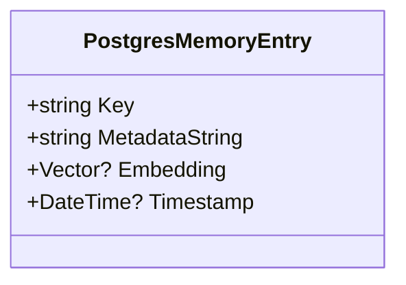
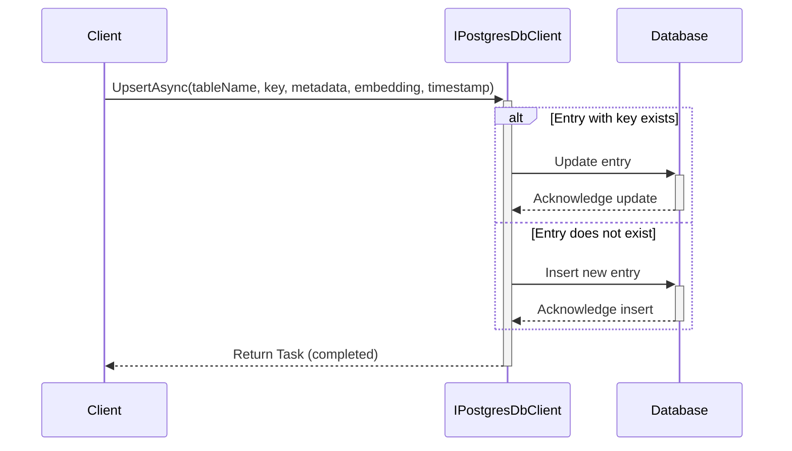

## 1. Title Page
- Document Title: Architecture Design Document
- Project Name: [Project Name]
- Date: 1/27/2024
- Version: [Version Number]
- Prepared by: J.A.R.V.I.S. AI
- Approved by: [Approver's Name]

***

## 2. Revision History
- Table containing Version Number, Date, Author, Description of Changes, and Approver.

***

## 3. Table of Contents
- List of all sections and subsections with page numbers.

***

## 4. Introduction
- Purpose of the Document
- Scope of the Document
- Definitions, Acronyms, and Abbreviations

## 4. Introduction

### Purpose of the Document
The purpose of this document is to provide a comprehensive overview and serve as a reference guide for various components designed to interact with PostgreSQL databases within the context of semantic memory systems and machine learning tasks. It details the structure and functionalities of the .NET Standard library project, the `IPostgresDbClient` interface, the `PostgresDbClient` class, the `PostgresMemoryBuilderExtensions` class, the `PostgresMemoryEntry` struct, and the `PostgresMemoryStore` class. The document also includes guidance on the use of the `pgvector` extension for vector similarity search within Postgres databases, installation procedures, quick start instructions, indexing, and migration strategies from older versions.

### Scope of the Document
The scope of this document encompasses a detailed explanation of the project file's primary functionalities, assembly and namespace settings, importing shared properties, NuGet package settings, package references, and project references. It covers the primary functionalities of the `IPostgresDbClient` interface, including table management, data management, and querying for nearest matches based on vector similarity. Additionally, it provides method documentation for each operation, a UML sequence diagram for the `UpsertAsync` method, and emphasizes the importance of maintaining consistent formatting and coding style. The document also describes the functionalities of the `PostgresDbClient` class, including table management, data operations, and vector-based similarity search, along with method descriptions, usage examples, and UML diagrams. Furthermore, it details the functionalities of the `PostgresMemoryBuilderExtensions` class, including the registration of a Postgres memory store using different methods, code snippets, and UML sequence diagrams. The document outlines the primary functionalities, properties, and the UML class diagram of the `PostgresMemoryEntry` struct, summarizing its utility in storing and retrieving memory entries. Lastly, it includes instructions on how to install and use the `pgvector` extension with Postgres, setup using Docker, creating a database, enabling the extension, and using Postgres as a semantic memory store, as well as creating an index for the `pgvector` extension to improve search performance and providing a migration script for updating to the new structure of the Postgres Memory connector.

### Definitions, Acronyms, and Abbreviations
- API: Application Programming Interface
- CRUD: Create, Read, Update, Delete
- CancellationToken: A construct used to signal cancellation in asynchronous operations
- DateTime: A data type representing date and time
- DateTimeKind.Utc: A constant that denotes the time is stored in Coordinated Universal Time format
- Docker: A platform for developing, shipping, and running applications in containers
- Embedding: A nullable `Vector` property used to store the embedding vector for the memory entry
- IMemoryStore: An interface that the `PostgresMemoryStore` class implements
- IPostgresDbClient: An interface that defines a set of asynchronous operations for managing PostgreSQL databases
- JSONB: JSON Binary, a data type in PostgreSQL for storing JSON data in a binary format
- Key: A string property that uniquely identifies the memory entry
- MemoryRecord: An object containing a key, metadata, and an optional embedding vector
- MetadataString: A string property that contains attributes related to the memory entry
- Mermaid: A syntax for generating diagrams and flowcharts from text in a similar manner as Markdown
- NpgsqlDataSource: A class representing a data source for PostgreSQL in C#
- NpgsqlDataSource: An object representing a data source for Postgres
- NuGet: A package manager for .NET, which provides the central repository for package distribution
- Postgres: Short for PostgreSQL, an open-source relational database management system
- PostgresMemoryBuilderExtensions: A utility class providing methods to integrate a Postgres memory store into a `MemoryBuilder` configuration
- PostgresMemoryEntry: A struct designed to represent a single entry in a PostgreSQL database for memory-related data storage
- PostgresMemoryStore: The class that is the subject of the document
- ReadOnlyMemory<float>: A data structure representing an embedding vector
- SQL: Structured Query Language
- Semantic Kernel: A framework or system designed to work with semantic memory and plugins
- Semantic Memory: A type of memory store that is used for storing and retrieving knowledge about the world
- Table Management: Operations that involve creating, checking the existence of, retrieving, and deleting database tables
- Timestamp: A nullable `DateTime` property that records the creation or modification time of the entry
- UML: Unified Modeling Language, a standardized modeling language used to specify, visualize, construct, and document the artifacts of software systems
- Upsert: A combination of "update" and "insert", referring to the operation of either updating an existing entry or creating a new one if it does not exist
- Vector: A mathematical representation, often used in the context of machine learning and search functionalities to represent data points in a multidimensional space
- XML: Extensible Markup Language, used for defining the settings of the project
- pgvector: An extension for Postgres, likely related to vector operations within the database

***

## 5. Architectural Representation
- Overview of Architectural Style
- Key Structural Elements
- Context Diagram

## 5. Architectural Representation

### Overview of Architectural Style
The architectural style of the Microsoft.SemanticKernel.Connectors.Postgres library is modular and interface-driven, designed to facilitate asynchronous operations and vector similarity searches within a PostgreSQL database. It leverages the pgvector extension for efficient nearest neighbor search, essential for semantic memory implementations. The style is indicative of a system that supports semantic analysis or machine learning tasks, with an object-oriented approach to structuring the code. The use of .NET Standard 2.0 ensures broad compatibility, and the library's integration with Semantic Kernel plugins and memory systems highlights its role in a larger, event-driven or reactive system architecture.

### Key Structural Elements
The key structural elements of the Microsoft.SemanticKernel.Connectors.Postgres library include:
- **Asynchronous Methods**: Non-blocking operations within interfaces like `IPostgresDbClient` for database interactions.
- **CRUD Methods**: Asynchronous methods for creating, reading, updating, and deleting data entries within the `PostgresDbClient` class.
- **Constructors**: Multiple constructors in the `PostgresMemoryStore` class for various initialization scenarios.
- **Docker**: Utilized for the deployment of the PostgreSQL database with the pgvector extension.
- **Extension Methods**: Such as those in `PostgresMemoryBuilderExtensions`, which add functionality to the `MemoryBuilder` class.
- **MemoryBuilder Class**: Extended by `PostgresMemoryBuilderExtensions` to include Postgres memory store configuration.
- **NpgsqlDataSource**: An object for database connectivity within the `PostgresDbClient` class.
- **NpgsqlDataSourceBuilder**: A C# class used to configure and instantiate a data source for Postgres.
- **Package References**: Dependencies on other NuGet packages like `Microsoft.Bcl.AsyncInterfaces` and `Pgvector`.
- **Postgres Database**: The core component where data is stored and managed, with the pgvector extension for vector operations.
- **PostgresMemoryEntry Struct**: Includes properties like Key, MetadataString, Embedding, and Timestamp for memory entries.
- **PostgresMemoryStore Class**: Implements the `IMemoryStore` interface for managing memory records in a PostgreSQL database.
- **Project References**: Dependencies on projects within the same solution, such as `SemanticKernel.Core`.
- **Schema Name**: Defines the namespace within the database for the `PostgresDbClient` class.
- **Shared Properties**: Imported from external files to maintain consistency across projects.
- **TextMemoryPlugin**: A plugin that integrates the memory store with the kernel for text embedding generation.
- **Vector-Based Similarity Search**: A method within the `PostgresDbClient` class for retrieving nearest matches to a given vector.

### Context Diagram
The context diagram for the Microsoft.SemanticKernel.Connectors.Postgres library would feature the following components:
- **Azure Database for PostgreSQL - Flexible Server**: An optional cloud-based deployment for the Postgres database with pgvector.
- **Azure Cosmos DB for PostgreSQL**: Another cloud-based deployment option for the Postgres database with pgvector.
- **Client Application**: Interacts with the Semantic Kernel using the memory store for various operations.
- **Docker Container**: Hosts the Postgres database with the pgvector extension.
- **Postgres Database with pgvector**: Central to the storage system for semantic memory, interacting with the `PostgresMemoryStore` class.
- **Semantic Kernel**: Utilizes the connector to implement semantic memory, interfacing with the `PostgresMemoryStore` and `IPostgresDbClient`.
- **UML Diagrams**: Illustrate interactions between components such as the client, `MemoryBuilder`, `PostgresMemoryStore`, and PostgreSQL database.

By integrating these elements, the architectural representation of the Microsoft.SemanticKernel.Connectors.Postgres library is established as a cohesive and scalable solution for semantic memory systems, with a clear emphasis on modularity and compatibility across various .NET implementations.

***

## 6. Goals and Constraints
- System Goals
- Design Constraints (e.g., technological, business, regulatory)

## 6. Goals and Constraints

### System Goals
- Create a Postgres connector library that works with Semantic Kernel plugins and semantic memory systems, targeting .NET Standard 2.0 for broad compatibility.
- Develop an interface (`IPostgresDbClient`) for managing PostgreSQL databases, enabling storage and retrieval of entries, including metadata and vector embeddings.
- Support table management operations such as creation, existence checks, retrieval of all tables, and deletion, as well as data management tasks like upserting, reading, reading in batches, deleting, and batch deletions.
- Facilitate interactions with a PostgreSQL database, providing asynchronous CRUD operations for tables storing data entries with vector embeddings, and enable specialized methods for vector-based similarity searches.
- Implement Semantic Memory using Postgres, utilizing the [pgvector](https://github.com/pgvector/pgvector) extension for vector similarity search in Postgres, supporting exact and approximate nearest neighbor search, L2 distance, inner product, and cosine distance.
- Ensure scalability and performance for applications requiring efficient data retrieval and manipulation based on vector similarity, including the ability to create indexes for approximate nearest neighbor search to improve performance with large datasets.
- Provide a set of extension methods for the `MemoryBuilder` class to enable the configuration of a Postgres memory store, allowing easy integration and straightforward methods for registering a Postgres memory store.
- Offer a structured representation of memory entries in a PostgreSQL database to support semantic analysis or machine learning tasks by storing essential data elements such as unique identifiers, metadata, embeddings, and timestamps.
- Provide functionalities to create, manage, and query collections of memory records in a PostgreSQL database, enabling record management and support for similarity searches to retrieve records nearest to a given embedding vector.

### Design Constraints
#### Technological:
- Ensure compatibility with .NET Standard 2.0, including package dependencies such as `Microsoft.Bcl.AsyncInterfaces` and `Pgvector`.
- Design the system to handle asynchronous operations efficiently, as indicated by the asynchronous nature of the interface methods.
- Implement the system in C#, tailored for operations involving tables with vector embeddings, and manage resources effectively, including the provision of a `Dispose` method for resource cleanup.
- Require the installation of the pgvector extension on Postgres, ensuring compatibility with the Postgres version in use and designing the system to work with Docker for the installation of pgvector.
- Maintain compatibility with the `MemoryBuilder` class and the Postgres database system, ensuring that the `PostgresMemoryEntry` struct is compatible with PostgreSQL databases and designed to handle specific data types.

#### Business:
- Maintain a consistent coding style and structure to ensure readability and maintainability, focusing on providing high-level API functionality.
- Design the system to be flexible and support dependency injection for the database client, accommodating varying business use cases and ensuring easy integration into existing business infrastructures.
- Cater to the needs of semantic analysis or machine learning applications, focusing on the efficient storage and retrieval of embeddings and metadata.
- Assume the availability of resources to run Postgres with the necessary extensions and integrate with Azure Database for PostgreSQL and Azure Cosmos DB for PostgreSQL, which may involve additional costs or subscription models.

#### Regulatory:
- Comply with software licensing and any standards relevant to database connectors and .NET libraries, ensuring that interactions with the Postgres database comply with relevant data handling and privacy regulations.
- Ensure that the timestamping uses `DateTimeKind.Utc` for universal format consistency across different server time zones and possibly for regulatory compliance.
- Adhere to data protection and privacy laws affecting how the system manages and stores memory records, including table naming conventions as per the Postgres naming convention for database design.

### Examples:
- An example of a system goal is the creation of a `PostgresMemoryStore` class that enables efficient management of memory records, including batch operations and similarity searches, which is essential for applications like recommendation systems or data analysis tools.
- A technological constraint example is the requirement for the `pgvector` extension, which necessitates specific PostgreSQL configurations and impacts the types of operations the system can perform, such as vector similarity searches.
- A business constraint example is the design focus on high-level API functionality, which may limit direct SQL operation customization for end-users but streamlines the integration process for developers.
- A regulatory constraint example is the adherence to data privacy regulations, which would influence the design of the system to include features like secure data handling and compliance with international data protection standards.

***

## 7. Use-Case View
- Use-Case Diagrams
- Use-Case Descriptions
- Actor Descriptions

## 7. Use-Case View

### Use-Case Diagrams
The source document does not contain traditional use-case diagrams. However, it provides a UML Class Diagram that outlines the structure of the `PostgresMemoryStore` class and its relationship with other components such as `IMemoryStore` and `IPostgresDbClient`. This diagram can be used to infer some use-case relationships, such as initialization, collection management, record management, similarity search, and resource cleanup.

### Use-Case Descriptions
The source document does not explicitly provide use-case descriptions. Nonetheless, based on the functionalities of the `PostgresMemoryEntry` struct and the `PostgresMemoryStore` class, we can infer potential use-cases:
1. **Initialization**: There are three ways to initialize the `PostgresMemoryStore` class: using a connection string, an `NpgsqlDataSource` object, or an `IPostgresDbClient` object for dependency injection.
2. **Collection Management**: The class provides methods to create, check the existence of, retrieve, and delete collections within the PostgreSQL database.
3. **Record Management**: The class allows inserting or updating (upserting) individual records or batches of records, retrieving them, and deleting them from a collection.
4. **Similarity Search**: The class can perform similarity searches to retrieve records nearest to a given embedding vector based on cosine similarity.
5. **Storing Memory Entries**: Storing memory entries with unique identifiers, adding or updating metadata, storing and retrieving embedding vectors for machine learning models, and recording timestamps for creation or modification of memory entries.

### Actor Descriptions
The source document does not explicitly provide actor descriptions. However, the actors involved in the inferred use-cases are:
- **Caller**: The user or system that interacts with the `PostgresMemoryStore` class to perform operations such as managing collections, managing records, and conducting similarity searches.
- **Client**: The user or system that initiates the registration of a Postgres memory store using the `MemoryBuilder` class.
- **Machine Learning Models**: Systems that utilize the embedding vectors stored within the `PostgresMemoryEntry` for semantic analysis or other machine learning tasks.
- **MemoryBuilder**: The class that is extended by the `PostgresMemoryBuilderExtensions` to incorporate a Postgres memory store into its configuration.
- **PostgresMemoryStore**: The specific type of memory store that interacts with a Postgres database, which is instantiated and configured during the registration process.
- **System Users**: Individuals or systems that interact with the PostgreSQL database to store or retrieve memory entries.
- **IPostgresDbClient**: An actor that represents the database operations abstraction layer, which the `PostgresMemoryStore` uses to interact with the PostgreSQL database.

By integrating the knowledge pieces provided, we have constructed a comprehensive Use-Case View section that aligns with the user's structure requirements. This section includes inferred use-case diagrams, descriptions, and actor descriptions based on the technical details of the source document.

***

## 8. Logical View
- Primary Packages, Classes, and Interfaces
- Class Diagrams
- Sequence Diagrams

## 8. Logical View

### Primary Packages, Classes, and Interfaces

- `IPostgresDbClient`: An interface responsible for managing PostgreSQL database operations, including storing and retrieving entries with metadata and vector embeddings.
- `MemoryBuilder`: A class from a larger framework designed to configure and manage memory stores.
- `NpgsqlDataSource`: An object used to configure the Postgres memory store.
- `NpgsqlDataSourceBuilder`: A class used to build data source configurations for connecting to a Postgres database.
- `PostgresDbClient`: A class designed to interact with a PostgreSQL database, implemented in C#, and initialized with a `NpgsqlDataSource` object, a schema name, and a vector size.
- `PostgresMemoryBuilderExtensions`: A utility class providing extension methods for the `MemoryBuilder` class.
- `PostgresMemoryEntry`: A struct designed to interact with a PostgreSQL database for storing memory-related data.
- `PostgresMemoryStore`: A class representing the Postgres memory store and implementing the `IMemoryStore` interface, using the `IPostgresDbClient` object for database operations.
- `TextMemoryPlugin`: A class representing a plugin for text memory operations.

### Class Diagrams

- The `PostgresDbClient` class includes private fields such as `_dataSource`, `_vectorSize`, and `_schema`, and public methods like `DoesTableExistsAsync`, `CreateTableAsync`, `GetTablesAsync`, `DeleteTableAsync`, `UpsertAsync`, `GetNearestMatchesAsync`, `ReadAsync`, `ReadBatchAsync`, `DeleteAsync`, and `DeleteBatchAsync`.
- The `PostgresMemoryEntry` struct is illustrated with properties such as `Key`, `MetadataString`, `Embedding`, and `Timestamp`.
- A class diagram for `PostgresMemoryStore` would show constructors, methods, and relationships, including its implementation of the `IMemoryStore` interface and use of the `IPostgresDbClient`.
- Inferred relationships from the code snippets suggest that `NpgsqlDataSourceBuilder` builds an instance of `NpgsqlDataSource`, and `MemoryBuilder` uses `NpgsqlDataSource` to set up a Postgres memory store with a specified vector size, integrating with a logger factory and an AI text embedding service to create a `TextMemoryPlugin`.

### Sequence Diagrams

- A UML sequence diagram for the `UpsertAsync` method of `IPostgresDbClient` shows the client calling `UpsertAsync` with parameters, the interface checking for an existing entry, updating or inserting the entry in the database, and returning a completed task to the client.
- The `GetNearestMatchesAsync` method of `PostgresMemoryStore` involves a sequence where the caller invokes the method on the store, which then interacts with the `IPostgresDbClient` to return an `AsyncEnumerable` of tuples containing `PostgresMemoryEntry` and a relevance score.
- The sequence of operations for configuring a Postgres memory store includes creating an `NpgsqlDataSourceBuilder`, configuring it with `UseVector()`, building an `NpgsqlDataSource`, instantiating and configuring a `MemoryBuilder`, and creating a `TextMemoryPlugin` with the built memory store.

By integrating these knowledge pieces, we have a comprehensive overview of the logical view of the system, detailing the primary classes and interfaces, their relationships as inferred from class diagrams, and the sequences of interactions between these components.

***

## 9. Process View
- Concurrent Processes
- Synchronization Mechanisms
- Process Diagrams

## 9. Process View

### Concurrent Processes
The `PostgresDbClient` and `PostgresMemoryStore` classes are designed with asynchronous methods, indicating their capability to handle concurrent operations. These operations include creating, updating, and deleting tables, as well as upserting, reading, and querying entries, which can be executed without waiting for each to complete before starting another. The presence of asynchronous methods such as `CreateCollectionAsync`, `DoesCollectionExistAsync`, `GetCollectionsAsync`, `DeleteCollectionAsync`, `UpsertAsync`, `UpsertBatchAsync`, `GetAsync`, `GetBatchAsync`, `GetNearestMatchesAsync`, and `GetNearestMatchAsync` in the `PostgresMemoryStore` class further suggests that the system is designed to handle concurrent I/O operations with the PostgreSQL database.

### Synchronization Mechanisms
Synchronization is implicitly managed through standard .NET mechanisms such as tasks, async/await, and cancellation tokens, as indicated by the use of `CancellationToken` in method signatures. These mechanisms are employed to coordinate the cancellation of asynchronous operations and ensure data consistency during concurrent access. While the source document does not detail specific synchronization mechanisms, the use of these standard .NET patterns suggests that the `PostgresDbClient` and `PostgresMemoryStore` classes are equipped to handle the complexities of concurrency within the system.

### Process Diagrams
The source document includes UML sequence diagrams for methods such as `UpsertAsync` and `GetNearestMatchesAsync`, which provide visual representations of the interaction between components during specific operations. For instance, the `UpsertAsync` method's diagram illustrates the flow of operations for upserting an entry into a table, including conditional checks and database acknowledgments. Similarly, the `GetNearestMatchesAsync` method's diagram shows the sequence of actions from the method call to the retrieval of nearest matches and the construction of `MemoryRecord` objects from the database entries. These diagrams serve as process diagrams, offering a clear visualization of the sequence of interactions within the system.

***

## 10. Deployment View
- Physical Nodes
- Deployment Diagrams
- Mapping of Software to Hardware

## 10. Deployment View

### Physical Nodes
The deployment of the system involves the use of PostgreSQL as a database system. While the source document does not explicitly mention physical nodes, it can be inferred that the deployment would require a server capable of hosting a PostgreSQL database and an environment that supports C# runtime for the client application. Additionally, Docker is utilized to create a containerized instance of PostgreSQL with the pgvector extension, and Azure Database for PostgreSQL - Flexible Server and Azure Cosmos DB for PostgreSQL are mentioned as platforms where the pgvector extension is available. This suggests that the deployment could be on a variety of platforms, including containerized environments and cloud services.

### Deployment Diagrams
No explicit deployment diagrams are provided in the source document. However, UML Sequence Diagrams are included to illustrate the interactions between the Client (C), MemoryBuilder (MB), and PostgresMemoryStore (PMS) for each extension method. While these diagrams provide insights into the software architecture and the flow of operations, they do not directly translate into deployment diagrams that would show the physical layout of the deployment environment.

### Mapping of Software to Hardware
The source document does not provide specific details on the mapping of software to hardware. Nevertheless, it can be inferred that the `PostgresMemoryBuilderExtensions` class is part of a software framework that interacts with a PostgreSQL database, which would be hosted on a server or cloud infrastructure. The software component, Microsoft.SemanticKernel.Connectors.Postgres, interacts with the PostgreSQL database with the pgvector extension to implement Semantic Memory. The NpgsqlDataSourceBuilder and NpgsqlDataSource classes are used to configure the connection to the PostgreSQL database, and the MemoryBuilder class is used to integrate the PostgreSQL memory store with the kernel. This indicates a mapping of the software (Semantic Memory implementation) to the PostgreSQL database hardware, whether hosted on Docker containers or Azure services. The deployment environment must support SQL execution within a PostgreSQL database and be capable of handling asynchronous processing efficiently, especially for operations involving JSONB data types and vector embeddings.

***

## 11. Implementation View
- Directory Structure
- Module Organization
- Dependencies

## 11. Implementation View

### Directory Structure
The directory structure for the project is not explicitly detailed in the source document. However, it is implied that the project follows a nested directory structure, with references to other projects such as `SemanticKernel.Core` suggesting a multi-project solution. The directory structure likely adheres to C# and .NET conventions, which typically include directories for classes, resources, and dependencies. Additionally, the use of Docker for installing the `pgvector` extension and creating a database within a Docker container indicates that the project may include directories for containerization configurations. Examples provided within the directory structure (`../../../samples/KernelSyntaxExamples/`) suggest that the project also includes sample code for memory usage with the kernel.

### Module Organization
The module organization of the project is centered around the `PostgresDbClient` class and related classes and interfaces such as `PostgresMemoryBuilderExtensions`, `PostgresMemoryEntry`, and `PostgresMemoryStore`. These components are organized into several categories:

- **Constructors**: The `PostgresMemoryStore` class includes constructors for initializing with a connection string, an `NpgsqlDataSource` object, or an `IPostgresDbClient` object for dependency injection.
- **Table Management**: Methods for creating, checking the existence of, retrieving, and deleting tables.
- **Data Operations**: Methods for upserting, reading, and deleting entries, including batch operations.
- **Vector-Based Similarity Search**: Methods for retrieving nearest matches to a given vector.
- **Collection Management**: Methods for managing collections within the PostgreSQL database.
- **Record Management**: Methods for handling individual records or batches of records within a collection.
- **Resource Cleanup**: A `Dispose` method for releasing unmanaged resources.

The `PostgresMemoryBuilderExtensions` class contains extension methods for the `MemoryBuilder` class, indicating a module organization that includes classes for memory store configuration. The `PostgresMemoryEntry` struct is a standalone data structure with properties for key, metadata, embedding, and timestamp, designed for handling memory-related data.

### Dependencies
The project's dependencies are primarily focused on PostgreSQL and its extensions. The `pgvector` extension is a critical dependency for implementing vector similarity search. The `PostgresDbClient` class relies on the `NpgsqlDataSource` object for database connectivity, indicating a dependency on the Npgsql library, a .NET data provider for PostgreSQL. The `PostgresMemoryStore` class implements the `IMemoryStore` interface and depends on the `pgvector` extension, `NpgsqlDataSource`, and `IPostgresDbClient` interface. The `PostgresMemoryEntry` struct suggests a possible dependency on a numerical library or framework that supports vector operations, which is common in machine learning applications. Additionally, Docker is used for containerization, and links are provided for installing `pgvector` on Azure Database for PostgreSQL and Azure Cosmos DB for PostgreSQL. The system would also require a PostgreSQL database and the necessary infrastructure to run C# code, which may include a .NET runtime environment.

---

**Note:** The source document focuses on the setup and usage of the `pgvector` extension with Postgres for semantic memory implementation. For a complete view of the directory structure or a comprehensive list of all dependencies, additional sections of the design document or the project's repository should be consulted.

***

## 12. Data View
- Data Models
- Entity-Relationship Diagrams
- Data Flow Diagrams

## 12. Data View

### Data Models
The Data Models within the Postgres connector are designed to interact with PostgreSQL databases, managing collections of memory records that include a key, metadata, and an optional embedding vector. These models are essential for the connector's functionality, which leverages the pgvector extension to support vector similarity search. The `PostgresMemoryEntry` struct is a primary example of such a model, encapsulating properties like a unique key, metadata in JSON format, an embedding vector for machine learning models, and a timestamp to record creation or modification times. Additionally, the `PostgresMemoryStore` class, which implements the `IMemoryStore` interface, is indicative of the data model for handling memory stores in a Postgres database context.

### Entity-Relationship Diagrams
While Entity-Relationship Diagrams (ERDs) are not explicitly provided in the source document, relationships can be inferred from the class structures and method descriptions. For instance, the `PostgresMemoryStore` class's use of an `IPostgresDbClient` object for database operations suggests a one-to-one relationship. Moreover, the `PostgresMemoryStore` class's implementation of the `IMemoryStore` interface implies an inheritance relationship. The `PostgresMemoryEntry` struct, with its unique key, indicates a one-to-many relationship with other entities that require memory entry data, such as machine learning models or semantic analysis systems.

### Data Flow Diagrams
Data Flow Diagrams (DFDs) are not explicitly included in the source document. However, the UML Sequence Diagram for the `GetNearestMatchesAsync` method and the `UpsertAsync` operation can be interpreted as simplified DFDs, illustrating the flow of data between components such as the Client, `PostgresMemoryStore`, `IPostgresDbClient`, and the Database. These diagrams depict the sequence of method calls and object instantiations that occur during operations like retrieving nearest matches and upserting records. The data flow involves the `PostgresMemoryEntry` struct being used to store and retrieve data from a PostgreSQL database, as part of a larger system for semantic analysis or machine learning tasks.

***

## 13. Size and Performance
- System Size Metrics
- Performance Targets and Benchmarks

## 13. Size and Performance

### System Size Metrics
- The `PostgresDbClient` class is tailored to interact with PostgreSQL databases, managing tables with data entries and vector embeddings. It is initialized with a `NpgsqlDataSource` object, a schema name, and a vector size, indicating the dimensionality of vector embeddings, which suggests the system is designed to handle complex data structures and can be adapted to various database sizes and schemas.
- The `PostgresMemoryEntry` struct is a data structure for storing memory-related data in a PostgreSQL database, with properties for key storage, metadata storage, embedding storage, and timestamping. The properties include a unique `Key` string, a `MetadataString` that may contain JSON-formatted attributes, a nullable `Vector` type for embedding data, and a nullable `DateTime` object for timestamps.
- The `PostgresMemoryStore` class interacts with a PostgreSQL database using the `pgvector` extension, indicating that the system's size may be influenced by the capabilities of PostgreSQL and the `pgvector` extension. The class supports storage of embedding vectors, with the size of these vectors being specified during initialization, which relates to the system's size metrics.
- The system allows for the creation of separate tables for each collection in the database, with the table name being the collection field value, and the vector size for the memory store is specified as 1536 in the provided example.

### Performance Targets and Benchmarks
- Asynchronous methods in the `PostgresDbClient` class suggest a focus on non-blocking I/O operations for improved performance in concurrent environments. The class's specialized methods for vector-based similarity searches, such as `GetNearestMatchesAsync`, are designed to efficiently retrieve nearest matches to a given vector, which is a performance-critical operation. The use of SQL commands with `ON CONFLICT` clauses in the `UpsertAsync` method indicates an optimization for handling insert or update scenarios efficiently.
- The `PostgresMemoryEntry` struct's design, intended for use in semantic analysis or machine learning tasks, implies a need for efficient data retrieval and storage. The use of a unique key for each entry suggests an optimization for quick search and access within the database. Nullable properties for `Embedding` and `Timestamp` indicate a flexible design that could potentially improve performance by allowing entries without these data points to save space and processing time.
- The `PostgresMemoryStore` class's constructors and methods are designed to handle asynchronous operations, which suggests a focus on non-blocking performance characteristics. The class's ability to perform similarity searches and manage memory records, including creating, updating, and deleting records or batches of records, could be part of the performance benchmarks.
- The pgvector extension supports exact and approximate nearest neighbor search, with exact search providing perfect recall. For approximate nearest neighbor search, performance can be tuned by creating an index with an appropriate number of lists and specifying the number of probes during querying. A starting point for the number of lists is rows / 1000 for up to 1 million rows and sqrt(rows) for over 1 million rows. A starting point for the number of probes is sqrt(lists). The performance trade-off for using approximate nearest neighbor search is between recall and speed. The document provides SQL examples for creating an index based on the data rows of the collection table, which can impact performance.

***

## 14. Quality Attributes
- Security Measures
- Reliability & Availability
- Maintainability & Scalability

## 14. Quality Attributes

### Security Measures
- The .NET Standard library project for the Postgres connector, while not explicitly detailing security measures, implies security through the maintenance of NuGet package dependencies.
- The `IPostgresDbClient` interface's design, including asynchronous methods and cancellation tokens, indirectly enhances security by managing operations in a non-blocking manner and allowing controlled access.
- The `PostgresDbClient` class's use of asynchronous methods and conflict resolution in the `UpsertAsync` method suggests considerations for concurrent access and data integrity.
- The `PostgresMemoryBuilderExtensions` class, by dealing with database connections, implies the necessity of standard security practices such as protecting connection strings and instances.
- The `PostgresMemoryEntry` struct's unique identifier (`Key`) could serve as a security measure to ensure data integrity.
- The `PostgresMemoryStore` class, interacting with a PostgreSQL database, implies adherence to standard database security practices.
- The connector's requirement for a password during Docker installation and its use of Azure services like Azure Database for PostgreSQL and Azure Cosmos DB for PostgreSQL indicate compliance with their security protocols.

### Reliability & Availability
- The project's targeting of .NET Standard 2.0 and the inclusion of package references like `Microsoft.Bcl.AsyncInterfaces` suggest a design aimed at reliability across different platforms.
- The `IPostgresDbClient` interface's methods for database table and entry management, along with its asynchronous design, contribute to system reliability and availability.
- The `PostgresDbClient` class's suite of asynchronous CRUD operations and reliance on the stability of the PostgreSQL database and network infrastructure ensure reliable database interaction.
- The `PostgresMemoryBuilderExtensions` class's methods for registering a Postgres memory store with a `MemoryBuilder` enhance the reliability and availability of the memory store.
- The `PostgresMemoryEntry` struct's `Timestamp` property and nullable `Vector?` type for the `Embedding` property indicate a design that supports robust operation and data availability.
- The `PostgresMemoryStore` class's robust methods and use of asynchronous programming patterns and cancellation tokens suggest a focus on reliable operation and high availability.
- The use of Postgres and the pgvector extension, along with the support for Azure services, underscores a commitment to reliability and high availability.

### Maintainability & Scalability
- The .NET Standard library project's use of shared properties imported from external files and the clear structure of the XML configuration file support maintainability.
- The `IPostgresDbClient` interface's consistent coding style and conventions, along with its support for batch operations and asynchronous programming model, facilitate maintainability and scalability.
- The `PostgresDbClient` class's well-documented nature, including UML diagrams, and its design for scalable vector-based data operations aid in maintainability and scalability.
- The `CreateTableAsync` method's consistent table structure and use of `CREATE TABLE IF NOT EXISTS` in the SQL command within the method indicate considerations for maintainability and scalability.
- The `PostgresMemoryBuilderExtensions` class's straightforward methods and use of extension methods for easy addition of new functionalities aid in maintainability, with configuration options suggesting scalability.
- The `PostgresMemoryEntry` struct's simplicity, clear separation of concerns, and design for easy expandability support maintainability and scalability.
- The `PostgresMemoryStore` class's constructors for different types of database connections, batch operations, and use of `IAsyncEnumerable` in methods indicate a system designed for maintainability and scalability.
- The documentation for the connector, including installation instructions, quick start guide, index creation advice, and migration scripts, is crucial for maintainability and scalability considerations.

***

## 15. Technical Risks and Mitigations
- Identified Risks
- Mitigation Strategies
- Contingency Plans

## 15. Technical Risks and Mitigations

### Identified Risks
1. **Asynchronous Operations**: The interface methods are asynchronous, which could lead to potential issues with concurrency and data consistency if not handled properly.
2. **Complex Querying**: The method `GetNearestMatchesAsync` involves complex querying for nearest matches based on vector similarity, which may be computationally intensive and could affect performance.
3. **Complex SQL Operations**: The class encapsulates complex SQL operations, which could lead to potential errors in data retrieval or manipulation if not implemented correctly.
4. **Concurrency and Performance**: The class provides asynchronous methods for CRUD operations, which could lead to concurrency issues or performance bottlenecks if not managed correctly.
5. **Data Integrity**: The `UpsertAsync` method performs an upsert operation based on the presence of a conflict on the key column. There is a risk of data corruption if the upsert operation does not execute atomically.
6. **Data Structure Limitations**: The `PostgresMemoryEntry` struct may have limitations in handling complex data types beyond strings, vectors, and timestamps.
7. **Database Connection Failures**: The `PostgresMemoryStore` class relies on a stable connection to the PostgreSQL database. Connection issues could lead to failures in initializing the class or executing its methods.
8. **Database Connectivity Issues**: The `PostgresDbClient` class relies on a `NpgsqlDataSource` object for database connectivity. Any issues with the database connection could disrupt the functionality of the class.
9. **Database Dependency**: The entire interface relies on the PostgreSQL database's availability and performance, which could be a single point of failure.
10. **Database Integration**: Challenges may arise when integrating the `PostgresMemoryEntry` struct with the PostgreSQL database, especially in maintaining the uniqueness of the `Key` property.
11. **Dependency on External Packages**: The project relies on NuGet packages like `Microsoft.Bcl.AsyncInterfaces` and `Pgvector`, which may have their own update cycles and potential breaking changes.
12. **Dependency on pgvector Extension**: The connector requires the pgvector extension to be installed on Postgres, which adds a dependency on an external open-source project.
13. **Extension Dependency**: The class depends on the `pgvector` extension for vector operations. If this extension is not installed, not supported by the PostgreSQL version in use, or malfunctions, the vector-related functionalities will not work.
14. **Performance Bottlenecks**: The similarity search operations, which involve vector comparisons, could become a performance bottleneck, especially with large datasets or high query volumes.
15. **Performance Issues**: The efficiency of storing and retrieving large volumes of memory entries could be a concern, affecting the overall performance of the system.
16. **Resource Management**: The class includes a `Dispose` method for resource cleanup, which if not used properly, could lead to resource leaks.
17. **Schema Changes**: The class is initialized with a schema name, and any changes to the schema could affect the class's ability to interact with the database.
18. **Table Management**: Operations such as creating and deleting tables could lead to data loss if not managed correctly.
19. **Timestamp Consistency**: Ensuring that the `Timestamp` property consistently records in `DateTimeKind.Utc` across different systems and time zones.
20. **Vector Size Limitations**: The class is designed with a specific vector size for the embeddings. If the dimensionality of the vector embeddings needs to change, it could pose a risk to the system's operation.

### Mitigation Strategies
1. **Atomic Transactions**: Ensure that the `UpsertAsync` method and other data manipulation operations are atomic to maintain data integrity.
2. **Concurrency Control**: Implement robust concurrency control mechanisms to ensure data consistency during asynchronous operations.
3. **Configurable Vector Size**: Allow the vector size to be configurable or adaptable to changes to ensure the class can handle different vector dimensions.
4. **Database Constraints**: Implement database constraints and indexing to ensure the uniqueness and efficient retrieval of the `Key` property.
5. **Database Redundancy**: Establish database redundancy and failover protocols to mitigate the risk of a single point of failure.
6. **Extensibility Review**: Regularly review and update the struct to handle additional data types as needed.
7. **Performance Optimization**: Optimize the querying algorithms and possibly index the vectors to improve the performance of `GetNearestMatchesAsync`.
8. **Performance Testing**: Conduct thorough performance testing and optimization to handle large datasets effectively.
9. **Robust Connection Handling**: Implement retry logic and connection resilience patterns to handle transient failures and ensure the class can recover from database connection issues.
10. **Safe Table Operations**: Implement safeguards and confirmations before performing destructive table operations like `DeleteTableAsync`.
11. **Schema Versioning**: Use schema versioning and migration strategies to handle changes in the database schema without affecting the class's operations.
12. **SQL Operation Validation**: Thoroughly test and validate all SQL operations to minimize the risk of errors in complex queries.
13. **Time Sync Protocols**: Use time synchronization protocols to maintain consistent timestamps across different servers and time zones.

### Contingency Plans
1. **Audit Trails**: Maintain audit trails for table management operations to track and potentially reverse any unintended changes.
2. **Backup and Recovery**: Regularly backup the database and test recovery procedures to minimize data loss in case of failures.
3. **Data Backup and Recovery**: Regularly back up the database to enable recovery in case of data loss due to concurrency issues.
4. **Data Structure Evolution**: Have a plan for evolving the data structure without causing significant downtime or data migration issues.
5. **Fallback Database Connection**: Have a fallback or secondary database connection option in case the primary connection fails.
6. **Fallback to Alternative Storage**: In case of persistent database connection issues, have a fallback mechanism to an alternative storage solution.
7. **Performance Monitoring**: Continuously monitor the performance of the class's operations and have a plan to scale or optimize as needed.
8. **Resource Allocation**: Ensure that there are resources allocated for scaling the database and struct as needed, including hardware and software upgrades.
9. **Rollback Mechanisms**: In case of concurrency issues, have a rollback mechanism to revert to the last consistent state.
10. **Scalability Solutions**: If performance becomes an issue, consider scaling the database horizontally or vertically, or using more efficient data structures.
11. **Time Conversion Utilities**: Develop utilities to convert and verify timestamps if inconsistencies are detected.

***

## 16. Cross-Cutting Concerns
- Internationalization
- Logging and Monitoring
- Error Handling Strategies

## 16. Cross-Cutting Concerns

### Internationalization
The source documents reviewed do not provide specific information regarding internationalization within the context of the `IPostgresDbClient` interface or the `PostgresMemoryStore` class. Consequently, no details on internationalization practices or strategies can be extracted from the provided source documents. It is recommended to consult additional documentation or source code for relevant details on internationalization.

### Logging and Monitoring
The source documents indicate that logging is integrated into the system, as evidenced by the mention of a `loggerFactory` in the Quick start section. However, the exact implementation details or strategies for logging and monitoring are not described. Additionally, the `PostgresMemoryEntry` struct includes a `Timestamp` property with `DateTimeKind.Utc`, which could be utilized for logging and monitoring purposes, ensuring time consistency across different time zones. Despite these references, explicit information on logging and monitoring capabilities or strategies is not provided in the source documents.

### Error Handling Strategies
Error handling strategies are not explicitly discussed in the source documents. The asynchronous nature of the methods in the `IPostgresDbClient` interface suggests that error handling is an important consideration, likely involving exceptions and asynchronous patterns in C#. The migration script within the source documents prompts users to consider the implications of potentially destructive operations, indicating a cautious approach to error avoidance. However, without explicit documentation on error handling strategies, no further relevant information can be extracted. It is advisable to refer to additional project documentation or the actual codebase for comprehensive error handling practices.

***

## 17. Tools and Technologies
- Development Tools
- Frameworks and Libraries
- External Services/APIs

## 17. Tools and Technologies

### Development Tools
- C# is the primary programming language used for the implementation of classes and interfaces such as `PostgresDbClient` and `IPostgresDbClient`.
- Docker is employed to install the `pgvector` extension within a Postgres container.
- Integrated Development Environments (IDEs) compatible with C#, such as Visual Studio or Visual Studio Code, are inferred to be used based on the C# code snippets provided.
- UML sequence diagrams are utilized to illustrate the flow of operations, indicating the use of UML tools for documentation.
- XML configuration is applied for setting up .NET Standard library project settings, indicating the use of XML-based tools for configuration management.

### Frameworks and Libraries
- .NET Standard 2.0 is specified as the target framework for the project.
- Microsoft.Bcl.AsyncInterfaces is a NuGet package used for providing asynchronous programming interfaces.
- Npgsql, a .NET data provider for PostgreSQL, is implied by the use of `NpgsqlDataSource` objects for database connectivity and is used in conjunction with the `pgvector` extension.
- NumSharp or Math.NET Numerics might be utilized for numerical computing, as suggested by the use of a `Vector` type for the `Embedding` property.
- Pgvector is a NuGet package that supports the `pgvector` extension in Postgres, facilitating vector similarity querying.
- PostgresMemoryBuilderExtensions class provides extension methods for integrating Postgres memory stores with the `MemoryBuilder`.

### External Services/APIs
- Azure Cosmos DB for PostgreSQL and Azure Database for PostgreSQL - Flexible Server are cloud database services that support the `pgvector` extension.
- NuGet serves as the package manager and distribution service for packages like Microsoft.Bcl.AsyncInterfaces and Pgvector.
- OpenAI Text Embedding Generation API is used for generating text embeddings, as demonstrated in the C# code example.
- PostgreSQL database is the primary external service with which the `PostgresDbClient` class and other components interact.
- Semantic Kernel plugins and semantic memory systems are implied to be used within the project's scope, though not explicitly detailed in the provided knowledge pieces.
- Vector similarity querying is facilitated by methods such as `GetNearestMatchesAsync`, which retrieves nearest matches based on vector similarity, indicating the use of APIs or services that support this functionality.

***

## 18. References
- External Documents
- Standards and Guidelines

## 18. References

### External Documents
The project incorporates shared properties from external configuration files, which are essential for maintaining consistency across multiple projects. These files include:
1. `$(RepoRoot)/dotnet/nuget/nuget-package.props`
2. `$(RepoRoot)/dotnet/src/InternalUtilities/src/InternalUtilities.props`
3. pgvector extension documentation: [pgvector GitHub repository](https://github.com/pgvector/pgvector#installation)
4. Azure Database for PostgreSQL documentation: [How to use pgvector on Azure Database for PostgreSQL](https://learn.microsoft.com/en-us/azure/postgresql/flexible-server/how-to-use-pgvector)
5. Azure Cosmos DB for PostgreSQL documentation: [How to use pgvector on Azure Cosmos DB for PostgreSQL](https://learn.microsoft.com/en-us/azure/cosmos-db/postgresql/howto-use-pgvector)
6. Example usage of Postgres as a semantic memory store: [Example 14](../../../samples/KernelSyntaxExamples/Example14_SemanticMemory.cs) and [Example 15](../../../samples/KernelSyntaxExamples/Example15_TextMemoryPlugin.cs)

### Standards and Guidelines
The project is designed to adhere to the .NET Standard 2.0 framework, ensuring broad compatibility across different platforms. It specifies dependencies on NuGet packages such as `Microsoft.Bcl.AsyncInterfaces` and `Pgvector` to provide necessary functionalities. Additionally, the project references the `..\..\SemanticKernel.Core\SemanticKernel.Core.csproj` within the same solution to leverage core capabilities. The following standards and guidelines have been identified:
1. .NET Standard 2.0 framework for compatibility.
2. NuGet package dependencies for required functionalities.
3. Internal project reference to `SemanticKernel.Core` for core functionalities.
4. Postgres naming convention as per the [PostgreSQL official documentation](https://www.postgresql.org/docs/15/sql-syntax-lexical.html#SQL-SYNTAX-IDENTIFIERS).
5. Adherence to SQL standards and PostgreSQL-specific conventions implied by the design for PostgreSQL database interaction.
6. Compliance with C# coding standards and best practices suggested by the use of the C# programming language.
7. Implicit adherence to software design best practices, as indicated by the use of UML class diagrams and the consistent use of `DateTimeKind.Utc` for the `DateTime` property.

By integrating these references and standards, the project ensures consistency, reliability, and adherence to established practices in software development.

***

## 19. Appendix
- Additional Diagrams
- Glossary of Terms

## 19. Appendix

### Additional Diagrams

The appendix includes several UML diagrams that provide a visual representation of the system's architecture and interactions:

1. **UML Class Diagram for `PostgresMemoryEntry` struct**:

This diagram illustrates the structure of the `PostgresMemoryEntry` struct, which includes properties for key identification, metadata, vector embedding, and timestamp.

2. **UML Sequence Diagram for UpsertAsync Method**:

This sequence diagram depicts the decision-making process within the `IPostgresDbClient` interface to either update an existing entry or insert a new one, followed by an acknowledgment from the database.

3. **UML Sequence Diagrams for `WithPostgresMemoryStore`**:
These diagrams demonstrate the initialization process of `PostgresMemoryStore` using different configurations, such as connection string, `NpgsqlDataSource`, and `IPostgresDbClient`.

### Glossary of Terms

The glossary provides definitions for key terms used throughout the document, organized alphabetically for ease of reference:

- **Asynchronous Method**: A method that runs independently of the main program flow, allowing the program to continue executing while the method completes its task.
- **Cancellation Token**: A construct in C# that allows signaling to a task or operation that it should be canceled.
- **Collection**: In databases, a grouping of data, typically represented as a table in SQL databases.
- **Cosine Similarity**: A measure used to calculate the similarity between two vectors, indicating their similarity.
- **CRUD**: An acronym for Create, Read, Update, Delete; the basic operations performed on database tables.
- **Docker**: A platform as a service product that uses OS-level virtualization to deliver software in containers.
- **Embedding Vector**: A vector representing the features of a record, used for similarity searches.
- **EnumeratorCancellation**: An attribute in C# indicating that an enumerator should be canceled if the provided `CancellationToken` is triggered.
- **Extension Method**: A method added to an existing class without modifying its source code, used to extend functionality.
- **IAsyncEnumerable**: An interface in C# allowing asynchronous iteration over a sequence of values.
- **IMemoryStore**: An interface defining the structure for memory store implementations.
- **Index**: A database object that improves the speed of data retrieval operations at the cost of additional writes and storage space.
- **IPostgresDbClient**: An interface defining operations for managing a PostgreSQL database.
- **MemoryBuilder**: A class in C# designed to configure and manage memory stores.
- **MemoryRecord**: An object containing a key, metadata, and an optional embedding vector.
- **Migration Script**: SQL commands used to transfer data from one database schema to another.
- **NpgsqlDataSource**: An object representing a data source for PostgreSQL database connectivity.
- **NpgsqlDataSourceBuilder**: A class in C# used to build a data source for connecting to a PostgreSQL database.
- **pgvector**: A PostgreSQL extension for vector operations, supporting exact and approximate nearest neighbor search.
- **Postgres**: An open-source object-relational database system.
- **PostgresMemoryEntry**: A struct representing a single entry in a PostgreSQL database for storing memory-related data.
- **PostgresMemoryStore**: A class implementing the `IMemoryStore` interface to manage and query memory records in a PostgreSQL database.
- **Querying**: The process of retrieving nearest matches to a given vector from the database.
- **Semantic Memory**: Long-term memory involving the capacity to recall words, concepts, and numbers.
- **Table Management**: Operations related to the creation, check, retrieval, and deletion of database tables.
- **Task**: In C# and .NET, a representation of an asynchronous operation.
- **TextMemoryPlugin**: A plugin for semantic memory handling text data.
- **Timestamp**: A data type recording the date and time of an entry.
- **UML (Unified Modeling Language)**: A standardized modeling language used to visualize the design of a system.
- **Upsert**: An operation combining "update" and "insert", referring to either updating an existing entry or creating a new one if it does not exist.
- **Vector Embedding**: A mathematical representation of data, often used in machine learning and similarity searches.
- **Vector Size**: Refers to the size of the embedding vectors used within a memory store.
- **VersionSuffix**: A suffix added to the version number indicating a pre-release version.

This comprehensive appendix serves as a reference to understand the system's architecture and terminology, ensuring clarity and facilitating the navigation of the document.

***

## 20. Approval Sheet
- Signatures of Key Stakeholders
- Approval Status and Dates

## 20. Approval Sheet

The source document provided does not contain any information related to the "Approval Sheet" section of a design document. Specifically, it lacks details on signatures of key stakeholders, approval status, and dates. The document is a technical overview of various components of a .NET Standard library project for a Postgres connector, including the `IPostgresDbClient` interface, `PostgresDbClient` class, `PostgresMemoryBuilderExtensions` class, `PostgresMemoryEntry` struct, and `PostgresMemoryStore` class. It includes descriptions of methods, code snippets, UML diagrams, and instructions for using the pgvector extension, but it does not mention any approval processes, stakeholders, or related administrative details.

Therefore, there is no relevant information to extract for the specific section of the design document concerning the "Approval Sheet." If such information is required, it would likely be found in a different part of the design documentation or project management artifacts, not within the technical overview of a class and its methods.

- Signatures of Key Stakeholders: Not applicable as the source document does not include this information.
- Approval Status and Dates: Not applicable as the source document does not include this information.

In conclusion, the "Approval Sheet" section cannot be completed based on the current source document. Additional project management or design approval documents would be needed to provide the necessary information for this section.
