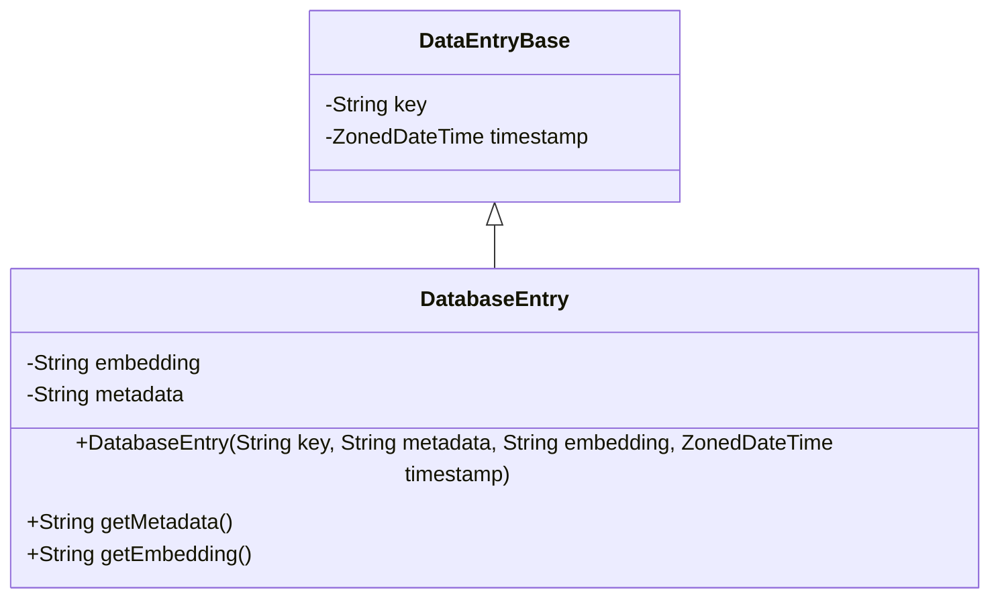
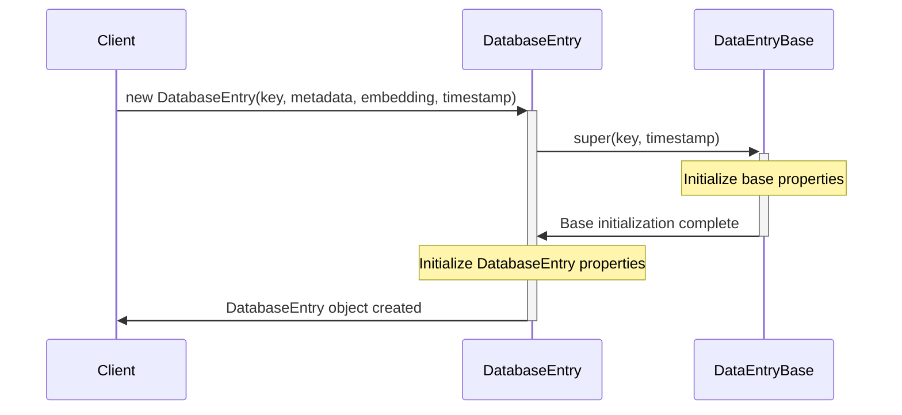

# Overview of `DatabaseEntry` Class

The `DatabaseEntry` class is a specialized type of data entry that extends the `DataEntryBase` class. It is designed to store and manage data entries that include both metadata and embedding information in JSON format. This class is particularly useful for applications involving semantic processing and machine learning, as it provides a way to handle data in both contextual and numerical formats.

## Primary Functionalities

- **Unique Identification**: Each `DatabaseEntry` object has a unique key that identifies it within the Semantic Kernel Memory Table.
- **Metadata Storage**: The class stores metadata in a JSON string, which can include various descriptive details about the entry.
- **Embedding Information**: It also stores embedding information in a JSON string, which is a numerical representation of the entry suitable for machine learning models.
- **Timestamping**: The class records the time when the entry was last created or updated.

## Inheritance from `DataEntryBase`

The `DatabaseEntry` class inherits from `DataEntryBase`, which provides the foundational structure for data entries, including the unique key and timestamp. The `DataEntryBase` class is not detailed in the provided code snippet, but it is assumed to contain at least these two properties and possibly additional methods that `DatabaseEntry` would inherit.

## Class Structure

```java
public class DatabaseEntry extends DataEntryBase {
    private final String embedding;
    private final String metadata;

    public DatabaseEntry(String key, String metadata, String embedding, ZonedDateTime timestamp) {
        super(key, timestamp);
        this.metadata = metadata;
        this.embedding = embedding;
    }

    public String getMetadata() {
        return metadata;
    }

    public String getEmbedding() {
        return embedding;
    }
}
```

## UML Class Diagram



# Detailed Feature Documentation

## Unique Key

Each `DatabaseEntry` object has a unique key that serves as its identifier. This key is inherited from the `DataEntryBase` class.

## Metadata Storage

The `metadata` field is a JSON string that contains descriptive information about the entry. This could include titles, descriptions, tags, and other relevant data that provides context to the entry.

### Example of Metadata Retrieval

```java
public String getMetadata() {
    return metadata;
}
```

## Embedding Information

The `embedding` field is a JSON string that represents the entry in a numerical format. This format is designed to be compatible with machine learning models, which can process this numerical data for various applications.

### Example of Embedding Retrieval

```java
public String getEmbedding() {
    return embedding;
}
```

## Timestamping

The timestamp indicates when the entry was created or last updated. This information is crucial for maintaining the integrity of the data and for tracking changes over time.

### Constructor with Timestamp

```java
public DatabaseEntry(String key, String metadata, String embedding, ZonedDateTime timestamp) {
    super(key, timestamp);
    this.metadata = metadata;
    this.embedding = embedding;
}
```

## UML Sequence Diagram for Object Creation



# Conclusion

The `DatabaseEntry` class is a crucial component for applications that require a combination of contextual and numerical data representation. It extends the `DataEntryBase` class to include additional properties for metadata and embedding information. The class is designed with a clear structure and provides methods to access its properties. The UML diagrams included in this documentation help visualize the class structure and the sequence of operations for creating a `DatabaseEntry` object. It is important to maintain the original coding style and structure to ensure consistency and readability of the code.