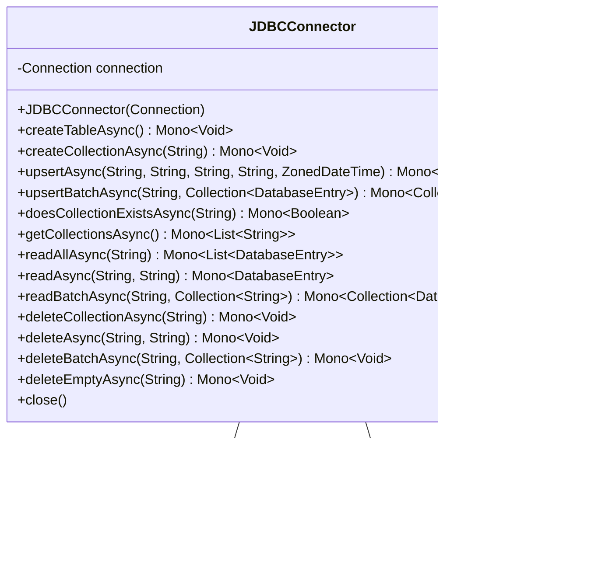

# Overview of JDBCConnector Class

The `JDBCConnector` class serves as an interface between Java applications and a SQL database using Java Database Connectivity (JDBC). It provides methods to perform asynchronous CRUD (Create, Read, Update, Delete) operations on the database. The class manages connections, executes SQL queries, and handles results. It also includes utility methods for formatting and parsing date-time objects.

## Primary Functionalities

- **Asynchronous Table Operations**: Create tables and indices in the database asynchronously.
- **Asynchronous CRUD Operations**: Insert, update, read, and delete records in the database asynchronously.
- **Batch Operations**: Perform batch insert, update, and delete operations.
- **Collection Management**: Manage collections (tables) within the database.
- **Connection Management**: Open and close database connections.

## Class Structure

The `JDBCConnector` class extends the `SQLConnector` interface and implements the `Closeable` interface, indicating that it must provide an implementation for closing the database connection.

### UML Class Diagram



## Asynchronous Table Operations

### createTableAsync Method

The `createTableAsync` method is responsible for creating the necessary tables and indices in the database if they do not already exist. It uses SQL `CREATE TABLE IF NOT EXISTS` and `CREATE INDEX IF NOT EXISTS` statements to ensure idempotency.

#### Code Snippet

```java
public Mono<Void> createTableAsync() {
    return Mono.fromRunnable(
                    () -> {
                        String createCollectionKeyTable =
                                "CREATE TABLE IF NOT EXISTS "
                                        + COLLECTIONS_TABLE_NAME
                                        + " ("
                                        + "id TEXT PRIMARY KEY"
                                        + " )";
                        // ... (omitted for brevity)
                        try (Statement statement = this.connection.createStatement()) {
                            statement.addBatch(createCollectionKeyTable);
                            statement.addBatch(createSKMemoryTable);
                            statement.addBatch(createIndex);
                            statement.executeBatch();
                        } catch (SQLException e) {
                            throw new SQLConnectorException(
                                    SQLConnectorException.ErrorCodes.SQL_ERROR,
                                    "\"CREATE TABLE\" failed",
                                    e);
                        }
                    })
            .subscribeOn(Schedulers.boundedElastic())
            .then();
}
```

### UML Sequence Diagram for createTableAsync


## Asynchronous CRUD Operations

### upsertAsync Method

The `upsertAsync` method performs an "upsert" operation, which inserts a new record or updates an existing one based on the provided key. It constructs a SQL `INSERT OR REPLACE INTO` statement and executes it.

#### Code Snippet

```java
public Mono<String> upsertAsync(
        String collection,
        String key,
        String metadata,
        String embedding,
        ZonedDateTime timestamp) {
    return Mono.fromRunnable(
                    () -> {
                        String query =
                                "INSERT OR REPLACE INTO "
                                        + TABLE_NAME
                                        + " (collection, key, metadata, embedding, timestamp)"
                                        + " VALUES (?, ?, ?, ?, ?)";
                        try (PreparedStatement statement =
                                this.connection.prepareStatement(query)) {
                            statement.setString(1, collection);
                            statement.setString(2, key);
                            statement.setString(3, metadata != null ? metadata : "");
                            statement.setString(4, embedding != null ? embedding : "");
                            statement.setString(5, formatDatetime(timestamp));
                            statement.executeUpdate();
                        } catch (SQLException e) {
                            throw new SQLConnectorException(
                                    SQLConnectorException.ErrorCodes.SQL_ERROR,
                                    "\"INSERT OR REPLACE INTO\" failed",
                                    e);
                        }
                    })
            .subscribeOn(Schedulers.boundedElastic())
            .thenReturn(key);
}
```

### UML Sequence Diagram for upsertAsync


## Batch Operations

### upsertBatchAsync Method

The `upsertBatchAsync` method allows for batch upsert operations. It constructs a single SQL `INSERT OR REPLACE INTO` statement with multiple records and executes it in a batch.

#### Code Snippet

```java
public Mono<Collection<String>> upsertBatchAsync(
        String collection, Collection<DatabaseEntry> records) {
    Collection<String> keys = new ArrayList<>();
    return Mono.fromRunnable(
                    () -> {
                        String query =
                                "INSERT OR REPLACE INTO "
                                        + TABLE_NAME
                                        + " (collection, key, metadata, embedding, timestamp)"
                                        + " VALUES (?, ?, ?, ?, ?)";
                        try (PreparedStatement statement =
                                this.connection.prepareStatement(query)) {
                            for (DatabaseEntry entry : records) {
                                statement.setString(1, collection);
                                statement.setString(2, entry.getKey());
                                statement.setString(
                                        3,
                                        entry.getMetadata() != null ? entry.getMetadata() : "");
                                statement.setString(
                                        4,
                                        entry.getEmbedding() != null
                                                ? entry.getEmbedding()
                                                : "");
                                statement.setString(5, formatDatetime(entry.getTimestamp()));
                                statement.addBatch();
                                keys.add(entry.getKey());
                            }
                            statement.executeBatch();
                        } catch (SQLException e) {
                            throw new SQLConnectorException(
                                    SQLConnectorException.ErrorCodes.SQL_ERROR,
                                    "\"INSERT OR REPLACE INTO\" failed",
                                    e);
                        }
                    })
            .subscribeOn(Schedulers.boundedElastic())
            .thenReturn(keys);
}
```

### UML Sequence Diagram for upsertBatchAsync


## Connection Management

### close Method

The `close` method is used to close the database connection. It is part of the `Closeable` interface implementation.

#### Code Snippet

```java
@Override
public void close() {
    try {
        this.connection.close();
    } catch (SQLException e) {
        throw new SQLConnectorException(
                SQLConnectorException.ErrorCodes.SQL_ERROR,
                "Database access error while closing connection",
                e);
    }
}
```

### UML Sequence Diagram for close


## Conclusion

The `JDBCConnector` class is a comprehensive solution for managing asynchronous database operations using JDBC. It encapsulates the complexity of database interactions and provides a clean, reactive API for performing operations on a SQL database. The class is designed to be used with a reactive programming model, leveraging the capabilities of Project Reactor to handle asynchronous tasks.