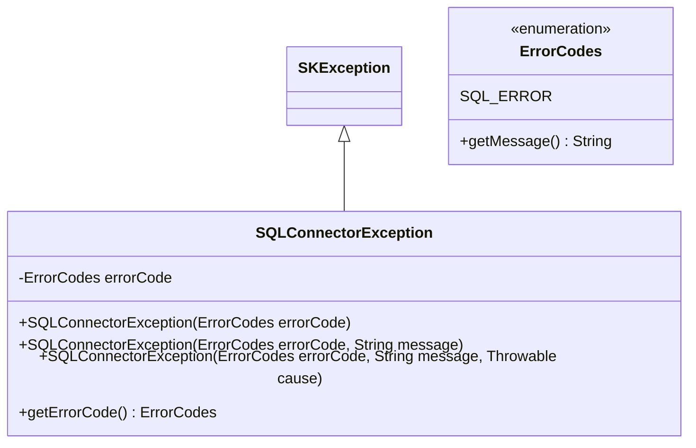

# Overview of SQLConnectorException Class

The `SQLConnectorException` class is a custom exception tailored to represent errors related to SQL connections and operations. It extends the `SKException` class, which implies that it is part of a broader exception handling framework specific to the system in which it is used. The class is designed to provide detailed information about SQL errors by associating them with specific error codes and messages.

## Primary Functionalities

- Encapsulation of SQL error information with distinct error codes.
- Provision of multiple constructors to create exceptions with varying levels of detail, from error code only to including a message and a cause.
- Ability to retrieve the error code associated with the exception for diagnostic or logging purposes.

## Class Structure

The class includes the following key components:

- A private final field `errorCode` that stores the specific error code for the exception.
- An inner `ErrorCodes` enumeration that lists possible SQL error types.
- A set of constructors that allow for the instantiation of exceptions with different levels of detail.
- A method `getErrorCode()` to retrieve the stored error code.

# ErrorCodes Enumeration

The `ErrorCodes` enumeration within the `SQLConnectorException` class defines different types of SQL errors. It currently includes a single error code `SQL_ERROR`, which is a placeholder for a generic SQL error. This enumeration can be expanded to encompass more specific error types as the need arises.

## Code Snippet: ErrorCodes Enumeration
```java
public enum ErrorCodes {
    SQL_ERROR("SQL error");

    private final String message;

    ErrorCodes(String message) {
        this.message = message;
    }

    public String getMessage() {
        return message;
    }
}
```

# Constructors

The `SQLConnectorException` class offers three constructors to accommodate various levels of exception detail.

## Constructor with Error Code Only
This constructor initializes an `SQLConnectorException` with an error code, setting both the message and cause to `null`.

### Code Snippet: Constructor with Error Code Only
```java
public SQLConnectorException(@Nonnull ErrorCodes errorCode) {
    this(errorCode, null, null);
}
```

## Constructor with Error Code and Message
This constructor allows for the creation of an `SQLConnectorException` with an error code and a descriptive message, omitting the cause.

### Code Snippet: Constructor with Error Code and Message
```java
public SQLConnectorException(@Nonnull ErrorCodes errorCode, @Nullable String message) {
    this(errorCode, message, null);
}
```

## Constructor with Error Code, Message, and Cause
This constructor provides the most detail, enabling the instantiation of an `SQLConnectorException` with an error code, a message, and the original cause of the error.

### Code Snippet: Constructor with Error Code, Message, and Cause
```java
public SQLConnectorException(
        @Nonnull ErrorCodes errorCode, @Nullable String message, @Nullable Throwable cause) {
    super(message, cause);
    this.errorCode = errorCode;
}
```

# Retrieving the Error Code

The `getErrorCode` method is used to access the error code associated with the exception, which is crucial for classifying the type of SQL error that has occurred.

## Code Snippet: Retrieving the Error Code
```java
public ErrorCodes getErrorCode() {
    return errorCode;
}
```

# UML Class Diagram

The UML class diagram below illustrates the structure of the `SQLConnectorException` class, its inheritance from the `SKException` superclass, and the `ErrorCodes` enumeration.



# Conclusion

The `SQLConnectorException` class serves as a specialized exception for handling SQL-related errors in a structured and informative manner. It provides the flexibility to report errors with varying levels of detail and supports error handling within the application's exception framework. The UML class diagram offers a visual representation of the class's structure and its relationships, facilitating an understanding of its design and intended use.