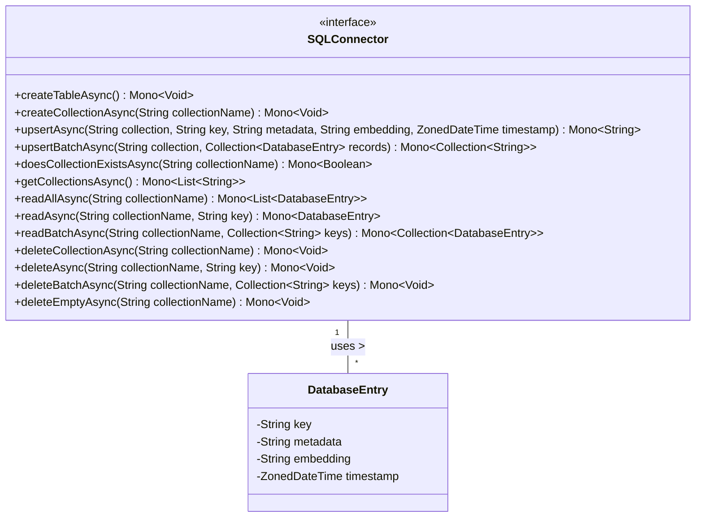

# Overview of SQLConnector Interface

The `SQLConnector` interface is designed to provide an asynchronous API for interacting with a SQL database using reactive programming principles. It leverages the Reactor library's `Mono` type to represent single-result asynchronous operations. The interface includes methods for creating and managing database collections, performing CRUD operations on database entries, and handling deletions of collections and entries in a non-blocking manner.

## Primary Functionalities

- **Asynchronous Table and Collection Management:** Methods to create and manage tables and collections within the database asynchronously.
- **Asynchronous CRUD Operations:** Methods to perform upsert, read, and delete operations on database entries, either individually or in batches.
- **Collection Existence Check:** Method to check asynchronously if a collection exists within the database.
- **Collection Retrieval:** Method to retrieve a list of all collection names in the database asynchronously.
- **Entry Management:** Methods to read all entries from a collection, read specific entries by key, and delete empty entries based on predefined criteria.

## UML Class Diagram

The UML class diagram below represents the structure of the `SQLConnector` interface and its relationship with the `DatabaseEntry` class:



# Method Documentation

## createTableAsync

### Primary Function
The `createTableAsync` method is responsible for creating a new table in the database asynchronously, potentially following a predefined schema.

### Implementation
```java
Mono<Void> createTableAsync();
```
This method does not require any parameters and returns a `Mono<Void>` which, upon subscription, will complete when the table creation operation has finished.

## createCollectionAsync

### Primary Function
The `createCollectionAsync` method creates a new collection in the database asynchronously.

### Implementation
```java
Mono<Void> createCollectionAsync(String collectionName);
```
The `collectionName` parameter specifies the name of the collection to be created. The method returns a `Mono<Void>` that completes upon the successful creation of the collection.

## upsertAsync

### Primary Function
The `upsertAsync` method performs an upsert operation, inserting a new entry or updating an existing one based on the provided key.

### Implementation
```java
Mono<String> upsertAsync(
    String collection,
    String key,
    String metadata,
    String embedding,
    ZonedDateTime timestamp);
```
This method takes parameters for the collection name, key, metadata, embedding content, and a timestamp. It returns a `Mono<String>` that emits the key of the upserted entry when the operation is completed.

## upsertBatchAsync

### Primary Function
The `upsertBatchAsync` method inserts or updates a batch of entries into a specified collection asynchronously.

### Implementation
```java
Mono<Collection<String>> upsertBatchAsync(String collection, Collection<DatabaseEntry> records);
```
The `collection` parameter specifies the target collection, and `records` is a collection of `DatabaseEntry` objects representing the entries to upsert. The method returns a `Mono<Collection<String>>` that emits the keys of the upserted entries upon completion.

## doesCollectionExistsAsync

### Primary Function
The `doesCollectionExistsAsync` method checks if a specified collection exists in the database asynchronously.

### Implementation
```java
Mono<Boolean> doesCollectionExistsAsync(String collectionName);
```
The `collectionName` parameter specifies the collection to check. The method returns a `Mono<Boolean>` that emits `true` if the collection exists, and `false` otherwise.

## getCollectionsAsync

### Primary Function
The `getCollectionsAsync` method retrieves a list of existing collection names in the database asynchronously.

### Implementation
```java
Mono<List<String>> getCollectionsAsync();
```
This method does not take any parameters and returns a `Mono<List<String>>` that emits a list of collection names available in the database.

## readAllAsync

### Primary Function
The `readAllAsync` method reads all entries from a specified collection asynchronously.

### Implementation
```java
Mono<List<DatabaseEntry>> readAllAsync(String collectionName);
```
The `collectionName` parameter specifies the collection from which to read entries. The method returns a `Mono<List<DatabaseEntry>>` that emits a list of `DatabaseEntry` objects representing all entries from the specified collection.

## readAsync

### Primary Function
The `readAsync` method retrieves a single entry from a specified collection based on the provided key asynchronously.

### Implementation
```java
Mono<DatabaseEntry> readAsync(String collectionName, String key);
```
The `collectionName` and `key` parameters specify the collection and the unique identifier of the entry to retrieve. The method returns a `Mono<DatabaseEntry>` that emits the retrieved entry or `null` if not found.

## readBatchAsync

### Primary Function
The `readBatchAsync` method reads a batch of entries from a specified collection identified by a collection of keys asynchronously.

### Implementation
```java
Mono<Collection<DatabaseEntry>> readBatchAsync(String collectionName, Collection<String> keys);
```
The `collectionName` parameter specifies the collection, and `keys` is a collection of unique identifiers for the entries to retrieve. The method returns a `Mono<Collection<DatabaseEntry>>` that emits the retrieved entries.

## deleteCollectionAsync

### Primary Function
The `deleteCollectionAsync` method deletes an entire collection from the database asynchronously.

### Implementation
```java
Mono<Void> deleteCollectionAsync(String collectionName);
```
The `collectionName` parameter specifies the collection to delete. The method returns a `Mono<Void>` that completes when the collection deletion operation has finished.

## deleteAsync

### Primary Function
The `deleteAsync` method deletes a specific entry from a collection based on the provided key asynchronously.

### Implementation
```java
Mono<Void> deleteAsync(String collectionName, String key);
```
The `collectionName` and `key` parameters specify the collection and the unique identifier of the entry to delete. The method returns a `Mono<Void>` that completes when the entry deletion operation has finished.

## deleteBatchAsync

### Primary Function
The `deleteBatchAsync` method deletes a batch of entries from a specified collection identified by a collection of keys asynchronously.

### Implementation
```java
Mono<Void> deleteBatchAsync(String collectionName, Collection<String> keys);
```
The `collectionName` parameter specifies the collection, and `keys` is a collection of unique identifiers for the entries to delete. The method returns a `Mono<Void>` that completes when the batch entry deletion operation has finished.

## deleteEmptyAsync

### Primary Function
The `deleteEmptyAsync` method deletes all entries from a collection that are considered empty based on predefined criteria asynchronously.

### Implementation
```java
Mono<Void> deleteEmptyAsync(String collectionName);
```
The `collectionName` parameter specifies the collection from which empty entries will be deleted. The method returns a `Mono<Void>` that completes when the empty entry deletion operation has finished.

# Error Handling and Exceptions

All methods in the `SQLConnector` interface return `Mono` types, which encapsulate both the result of the operation and any errors that may occur. Implementers and users of the interface should handle errors by subscribing to the returned `Mono` and providing appropriate error handling logic. This may include logging errors, retrying operations, or propagating errors to higher layers of the application.

# Constraints and Expected Behavior

- The `key` parameter in methods such as `upsertAsync` and `readAsync` must be a unique identifier that conforms to the database's indexing constraints.
- The `metadata` and `embedding` parameters in `upsertAsync` should be valid JSON strings or structured data that can be stored in the database.
- The `timestamp` parameter in `upsertAsync` should be a valid `ZonedDateTime` instance representing the time of the operation.
- The `Mono<Void>` return type indicates the completion of the operation and allows for the propagation of errors in case the operation fails.

# DatabaseEntry Class

The `DatabaseEntry` class is referenced in the interface but is not detailed in this documentation. It is assumed to encapsulate the key, metadata, embedding content, and other relevant information for a database entry. The structure and fields of the `DatabaseEntry` class should be defined in its own documentation, which should be consulted for a complete understanding of how it is used in conjunction with the `SQLConnector` interface.