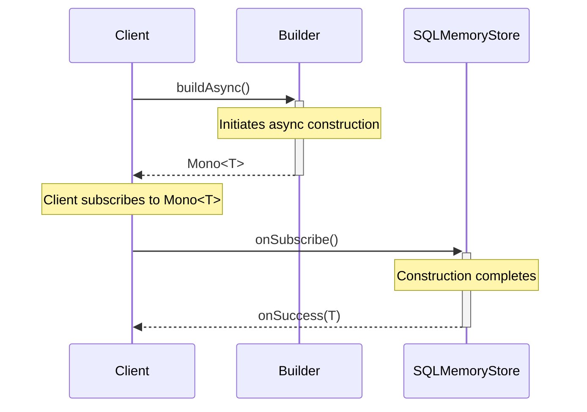
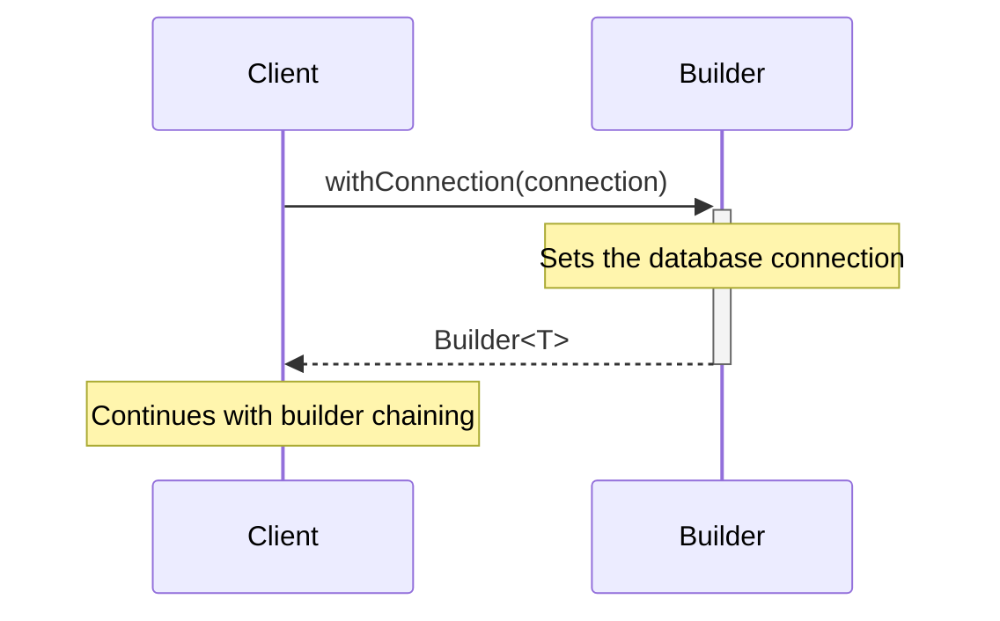
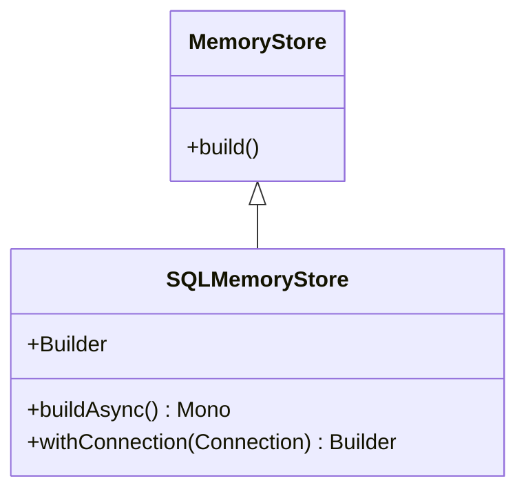

# Overview of SQLMemoryStore Interface

The `SQLMemoryStore` interface extends the `MemoryStore` interface and is designed to provide an abstraction for a memory store that interacts with a SQL database. It includes a nested `Builder` interface that offers a fluent API for constructing instances of `SQLMemoryStore`.

## Primary Functionalities

- **Asynchronous Building**: The `Builder` interface allows for the asynchronous creation of `SQLMemoryStore` instances.
- **Database Connection Configuration**: It provides a method to set the database connection that the memory store will use.

## SQLMemoryStore Interface

```java
public interface SQLMemoryStore extends MemoryStore {
    // Interface definition...
}
```

The `SQLMemoryStore` interface inherits from `MemoryStore` and does not declare additional methods on its own. It serves as a marker interface to indicate a specific type of memory store that works with SQL databases.

## Builder Interface

The `Builder` interface nested within `SQLMemoryStore` is a generic interface that provides the blueprint for building `SQLMemoryStore` instances.

### Methods

- `buildAsync()`: Asynchronously creates an instance of `SQLMemoryStore`.
- `withConnection(Connection connection)`: Sets the database connection for the memory store.

### Builder Interface Code Snippet

```java
public interface SQLMemoryStore extends MemoryStore {
    interface Builder<T extends SQLMemoryStore> extends MemoryStore.Builder<T> {
        Mono<T> buildAsync();
        Builder<T> withConnection(Connection connection);
    }
}
```

## Asynchronous Building with buildAsync Method

The `buildAsync` method is responsible for the asynchronous construction of the `SQLMemoryStore` instance. It returns a `Mono<T>`, which is a reactive type from Project Reactor, indicating that the operation is asynchronous and will produce a single result in the future.

### buildAsync Method Code Snippet

```java
Mono<T> buildAsync();
```

### UML Sequence Diagram for buildAsync Method



## Setting Database Connection with withConnection Method

The `withConnection` method allows the client to specify the `Connection` object that the `SQLMemoryStore` will use to interact with the database. This method is part of the fluent API provided by the `Builder` and returns the `Builder` instance for chaining.

### withConnection Method Code Snippet

```java
Builder<T> withConnection(Connection connection);
```

### UML Sequence Diagram for withConnection Method



## UML Class Diagram for SQLMemoryStore and Related Interfaces



In the UML class diagram, `SQLMemoryStore` is shown to inherit from `MemoryStore`. The `Builder` interface is nested within `SQLMemoryStore` and extends the `MemoryStore.Builder` interface, adding methods specific to the construction of `SQLMemoryStore` instances.

# Conclusion

The `SQLMemoryStore` interface and its nested `Builder` interface provide a structured way to create memory store instances that are capable of interacting with SQL databases. The asynchronous building pattern and the fluent API for setting the database connection are key features that facilitate the integration of the memory store into reactive applications. The provided UML diagrams help visualize the sequence of operations and the class structure, aiding in understanding the design and usage of these interfaces.