## 1. Title Page
- Document Title: Architecture Design Document
- Project Name: [Project Name]
- Date: 2/9/2024
- Version: [Version Number]
- Prepared by: O2.services AI
- Approved by: [Approver's Name]


***


## 2. Table of Contents
- [1. Title Page](#1-title-page)
- [2. Table of Contents](#2-table-of-contents)
- [3. Introduction](#3-introduction)
- [4. Architectural Representation](#4-architectural-representation)
- [5. Goals and Constraints](#5-goals-and-constraints)
- [6. Use-Case View](#6-use-case-view)
- [7. Logical View](#7-logical-view)
- [8. Process View](#8-process-view)
- [9. Deployment View](#9-deployment-view)
- [10. Implementation View](#10-implementation-view)
- [11. Data View](#11-data-view)
- [12. Size and Performance](#12-size-and-performance)
- [13. Quality Attributes](#13-quality-attributes)
- [14. Technical Risks and Mitigations](#14-technical-risks-and-mitigations)
- [15. Cross-Cutting Concerns](#15-cross-cutting-concerns)
- [16. Tools and Technologies](#16-tools-and-technologies)
- [17. References](#17-references)
- [18. Appendix](#18-appendix)


***


## 3. Introduction

### Purpose of the Document
The purpose of this document is to provide a comprehensive architectural overview of several key components within our system, each designed to handle specific aspects of database and error management. These components include the `SQLConnectorException` class, the `DatabaseEntry` class, the `SQLMemoryStore` interface, the `JDBCConnector` class, and the `SQLConnector` interface. The document aims to outline the functionalities, structures, and relationships of these components to ensure a clear understanding of their roles and interactions within the system.

### Scope of the Document
This document encompasses the design and implementation details of the aforementioned components, covering their primary functionalities such as error handling, data entry management, asynchronous database operations, and reactive programming integration. It includes UML diagrams to visually represent the class structures, object creation processes, and sequence of operations for each component.

### Definitions, Acronyms, and Abbreviations
- **API**: Application Programming Interface
- **CRUD**: Create, Read, Update, Delete
- **DatabaseEntry**: A class that extends `DataEntryBase`, designed to store and manage data entries with metadata and embedding information.
- **DataEntryBase**: The base class that provides foundational structure for data entries, including a unique key and timestamp.
- **ErrorCodes**: An enumeration within the `SQLConnectorException` class that defines different types of SQL errors.
- **JDBC**: Java Database Connectivity
- **JSON**: JavaScript Object Notation, a lightweight data-interchange format.
- **JVM**: Java Virtual Machine
- **Mono<T>**: A reactive type from Project Reactor representing an asynchronous computation that yields a single result.
- **Reactor**: A fourth-generation reactive programming framework for building non-blocking applications on the JVM.
- **Semantic Kernel Memory Table**: A conceptual data structure that utilizes `DatabaseEntry` objects for semantic processing and machine learning applications.
- **SKException**: The superclass from which `SQLConnectorException` extends.
- **SQL**: Structured Query Language
- **SQLConnector**: An interface that provides an asynchronous API for SQL database interactions using reactive programming principles.
- **SQLConnectorException**: A custom exception class for handling SQL-related errors.
- **SQLMemoryStore**: An interface that extends `MemoryStore` for SQL database interaction.
- **UML**: Unified Modeling Language, a standardized modeling language in the field of software engineering.
- **ZonedDateTime**: A date-time with a time-zone in the ISO-8601 calendar system.

The document will now proceed to detail each component, starting with their UML diagrams to establish a foundational understanding of their design before delving into their specific functionalities and interactions.


***


## 4. Architectural Representation

### Overview of Architectural Style

The architectural styles of the system components are diverse, yet they share a common emphasis on structured, object-oriented, and reactive programming principles. The `SQLConnectorException` and `DatabaseEntry` classes demonstrate a structured and object-oriented approach, while the `SQLConnector`, `SQLMemoryStore`, and `JDBCConnector` components exhibit an asynchronous, non-blocking style utilizing reactive programming principles. The `SQLConnectorException` class specifically manages SQL-related errors within a structured exception handling framework. The `DatabaseEntry` class encapsulates metadata and embedding information for semantic processing and machine learning applications. The `SQLConnector` interface and `JDBCConnector` class are built upon the Reactor library to handle asynchronous data streams, and the `SQLMemoryStore` interface represents a layer of abstraction in a reactive system.

### Key Structural Elements

The system's key structural elements include classes, interfaces, and enumerations that define the behavior and structure of the system components:

- **`SQLConnectorException` Class**: A custom exception class that extends the `SKException` superclass, providing detailed SQL error information.
- **`ErrorCodes` Enumeration**: An enumeration within the `SQLConnectorException` class for classifying SQL errors.
- **`DatabaseEntry` Class**: A specialized class that extends `DataEntryBase`, managing entries with metadata and embedding information.
- **`SQLConnector` Interface**: Defines asynchronous methods for database operations, leveraging the Reactor library.
- **`SQLMemoryStore` Interface**: An extension of the `MemoryStore` interface, indicating a layered architecture with a nested `Builder` interface for asynchronous construction.
- **`JDBCConnector` Class**: Implements the `SQLConnector` interface and the `Closeable` interface for managing asynchronous database operations and connection lifecycle.

### Context Diagram

The context diagrams provide a visual representation of the relationships and structures of the system components:

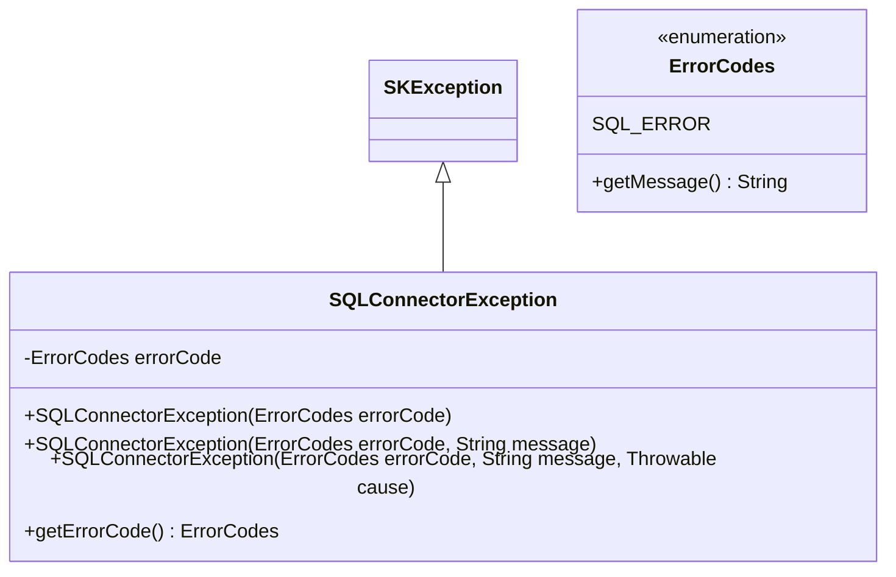

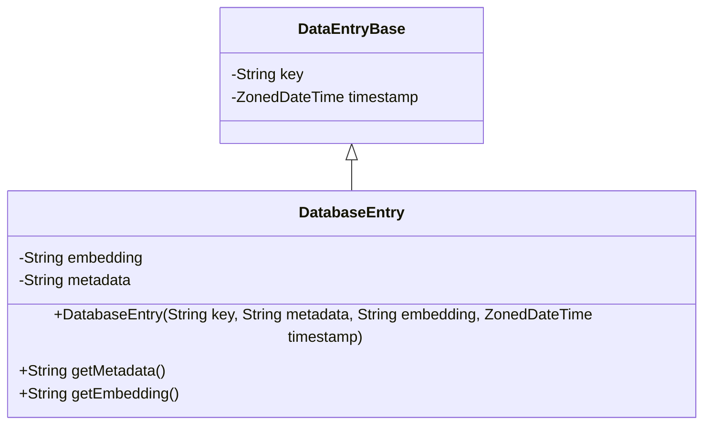

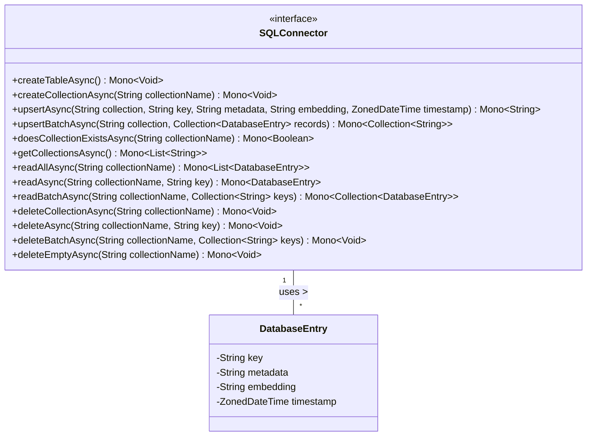

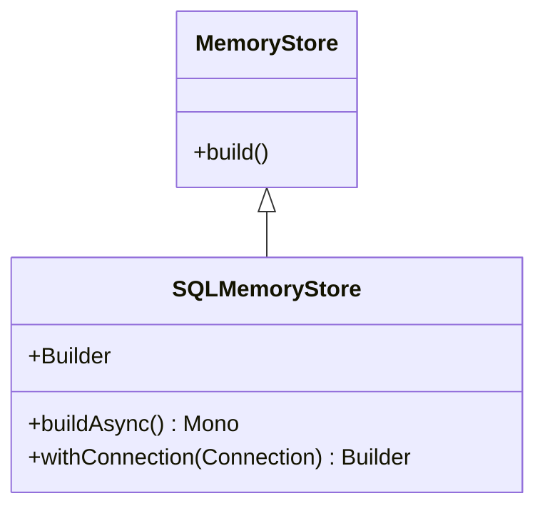

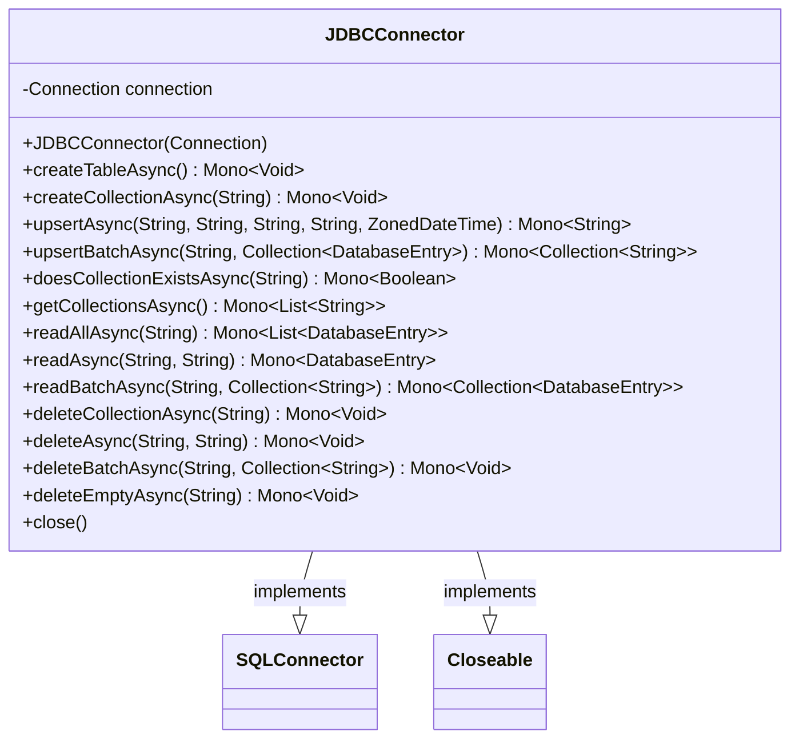

These diagrams collectively illustrate the system's architectural design, showcasing the inheritance, interfaces, and methods that define the interactions between the system components.


***


## 5. Goals and Constraints

### System Goals

The system goals across various components of the architecture are to:

- Provide a structured and informative mechanism for handling SQL-related errors within the application's exception framework, enabling the classification and diagnosis of SQL errors through detailed exception information, including specific error codes.
- Offer an abstraction for a memory store that interacts with a SQL database through the `SQLMemoryStore` interface, enabling asynchronous creation of `SQLMemoryStore` instances and facilitating the configuration of database connections via a fluent API.
- Deliver a robust `DatabaseEntry` class that extends `DataEntryBase` for applications requiring a combination of contextual and numerical data representation, ensuring unique identification of each data entry for integration within the Semantic Kernel Memory Table.
- Provide an asynchronous API for SQL database interactions that adheres to reactive programming principles, enabling asynchronous CRUD operations on database entries and collections, and supporting batch operations for upserts, reads, and deletions.
- Offer a comprehensive solution for managing asynchronous database operations using JDBC, encapsulating the complexity of database interactions and providing a clean, reactive API for SQL database operations, including batch operations and effective management of database connections.

### Design Constraints

The design constraints for the system are categorized into technological, business, and regulatory constraints:

- **Technological Constraints:**
  - The `SQLConnectorException` class must extend from the `SKException` superclass and conform to the existing exception handling framework.
  - The `ErrorCodes` enumeration should allow for expansion to include more specific SQL error types as needed, without breaking existing functionality.
  - The `SQLMemoryStore` must integrate with reactive applications, adhere to the structure and contracts defined by the `MemoryStore` interface, and be compatible with SQL databases and Project Reactor.
  - The `DatabaseEntry` class must adhere to the structure and properties inherited from `DataEntryBase`, including the unique key and timestamp, and ensure that metadata and embedding information are stored as JSON strings.
  - The `SQLConnector` interface must leverage the Reactor library's `Mono` type for representing asynchronous operations, handle `ZonedDateTime` instances for timestamping, and ensure that the `metadata` and `embedding` parameters are valid JSON strings.
  - The JDBC system must be compatible with Java Database Connectivity (JDBC) and adhere to the reactive programming model, leveraging Project Reactor for asynchronous tasks.

- **Business Constraints:**
  - The system should support scalability and adaptability to different SQL databases, ensure efficiency, and minimize the impact on system resources.

- **Regulatory Constraints:**
  - Any data handling, especially concerning timestamps and potentially sensitive metadata, must comply with relevant data protection regulations.

### UML Diagrams and Sequence Diagrams

The architecture includes several UML diagrams and sequence diagrams that illustrate the relationships and interactions between different components:

- **UML Class Diagrams:**
  - The `SQLConnectorException` and `ErrorCodes` classes, showing the inheritance from `SKException` and the structure of the enumeration.
  - The `MemoryStore` and `SQLMemoryStore` classes, including the nested `Builder` interface within `SQLMemoryStore`.
  - The `DataEntryBase` and `DatabaseEntry` classes, highlighting the inheritance and properties of `DatabaseEntry`.
  - The `SQLConnector` interface and its methods, as well as the relationship with the `DatabaseEntry` class.
  - The `JDBCConnector` class, its relationship with the `SQLConnector` interface, and the implementation of the `Closeable` interface.

- **UML Sequence Diagrams:**
  - The asynchronous construction of a `SQLMemoryStore` instance using the `buildAsync` method.
  - The setting of the database connection in the `SQLMemoryStore` using the `withConnection` method.
  - The object creation process for `DatabaseEntry`.
  - The sequence of interactions for the `createTableAsync`, `upsertAsync`, `upsertBatchAsync`, and `close` methods in the `JDBCConnector` class.

These diagrams are essential for visualizing the architecture and interaction patterns of the system components and interfaces.


***


## 6. Use-Case View

This section of the architecture design document provides a comprehensive overview of the use-cases, actors, and their interactions within the system. It includes detailed descriptions of the functionalities offered by the system and the external entities that interact with it. The use-case diagrams serve as visual aids to understand the relationships and flows between different parts of the system.

### Use-Case Diagrams

The use-case diagrams presented here illustrate the various operations that can be performed by the actors on the system. These diagrams are an essential part of the documentation as they provide a clear and concise way to visualize the interactions at a high level.

1. The first diagram represents the relationship between `MemoryStore`, `SQLMemoryStore`, and the nested `Builder` interface, highlighting the asynchronous construction and configuration of `SQLMemoryStore` instances.


2. The second diagram showcases the interactions between a "Client Application" and the `SQLConnector` interface, detailing a variety of database operations such as creation, updating, retrieval, and deletion of entities.

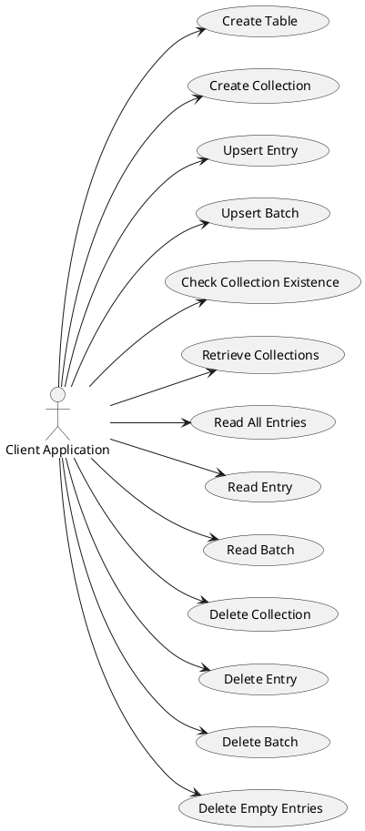

3. The third diagram is a class diagram that illustrates the inheritance relationship between `DataEntryBase` and `DatabaseEntry`, emphasizing the structure and properties of database entries.


4. The fourth diagram depicts the `JDBCConnector` class and its methods, which implement the `SQLConnector` and `Closeable` interfaces, focusing on asynchronous database operations.

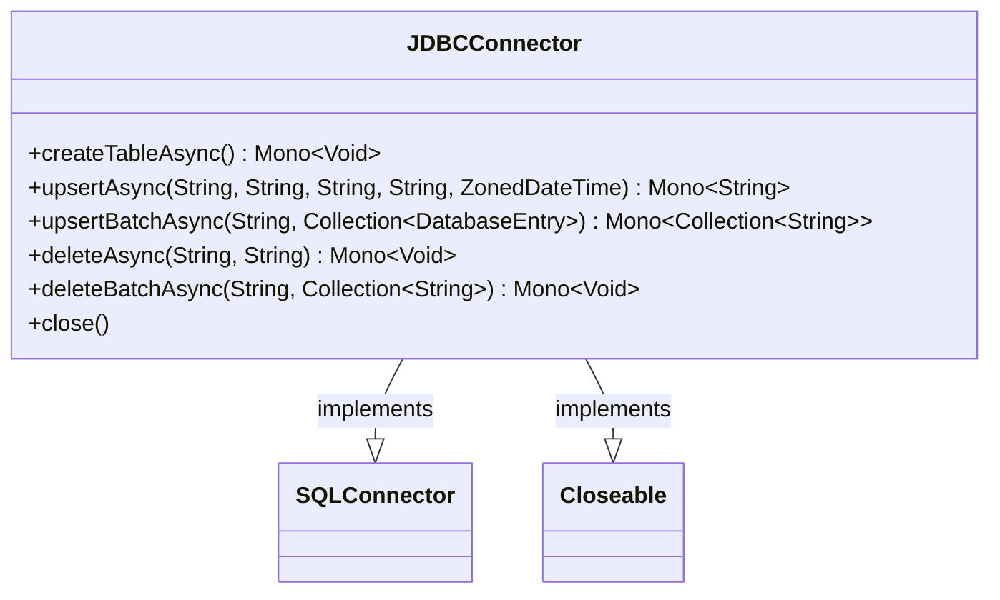

### Use-Case Descriptions

The use-case descriptions provide detailed narratives of the system's functionalities and the sequence of actions performed by the actors. These descriptions are crucial for understanding the capabilities of the system and the expected interactions.

- **Asynchronous SQLMemoryStore Construction**: Clients can asynchronously create `SQLMemoryStore` instances using the `buildAsync` method.
- **Setting Database Connection**: Clients can specify database connections for `SQLMemoryStore` using the `withConnection` method.
- **Create Table**: Clients can asynchronously create new tables in the database.
- **Create Collection**: Clients can asynchronously create new collections in the database.
- **Upsert Entry/Batch**: Clients can asynchronously insert or update individual or batches of entries in a collection.
- **Check Collection Existence**: Clients can asynchronously check for the existence of collections in the database.
- **Retrieve Collections**: Clients can asynchronously retrieve a list of all collection names.
- **Read All Entries/Entry/Batch**: Clients can asynchronously read all entries, a specific entry, or a batch of entries from a collection.
- **Delete Collection/Entry/Batch**: Clients can asynchronously delete an entire collection, a specific entry, or a batch of entries.
- **Delete Empty Entries**: Clients can asynchronously delete all entries from a collection that are considered empty.
- **Handle SQL Connection Errors**: The system encapsulates SQL errors in an `SQLConnectorException` for graceful handling and logging.
- **Create Database Entry**: Clients can create a new `DatabaseEntry` with a unique key, metadata, embedding information, and a timestamp.
- **Retrieve Metadata/Embedding Information**: The system allows retrieval of metadata and embedding information from a `DatabaseEntry`.
- **Update Timestamp**: The system records the time of creation or update of a `DatabaseEntry`.

### Actor Descriptions

The actor descriptions identify the external entities that interact with the system and their roles in the use-cases.

- **Client**: The actor that interacts with the `SQLMemoryStore.Builder` and `DatabaseEntry` class to create and configure instances or retrieve information.
- **Client Application**: The external system or user that performs database operations asynchronously through the `SQLConnector` interface.
- **System/Application using SQLConnectorException**: Represents the software components that require error handling for SQL operations.
- **Caller**: The entity that invokes the asynchronous operations provided by the `JDBCConnector` class.

By integrating these knowledge pieces, we have established a clear and comprehensive Use-Case View that outlines the system's capabilities and the interactions between the actors and the system. This view serves as a foundation for understanding the functional requirements and the flow of operations within the system.


***


## 7. Logical View

The Logical View of the architecture focuses on the system's functionality as it is relevant to end-users, stakeholders, and developers. It encompasses the primary packages, classes, and interfaces, along with their relationships, interactions, and class diagrams. Sequence diagrams are also included to illustrate the dynamic behavior of the system during runtime.

### Primary Packages, Classes, and Interfaces

The system is composed of several key components that define its logical structure:

- **DatabaseEntry Class**: This class extends `DataEntryBase` and includes additional metadata and embedding information for entries in a Semantic Kernel Memory Table.
- **Exception Handling Package**: Contains custom exception classes such as `SQLConnectorException` and `SKException`, along with an `ErrorCodes` enumeration for defining SQL error types.
- **JDBCConnector Class**: Implements the `SQLConnector` interface and the `Closeable` interface, providing methods to interact with a SQL database using JDBC.
- **SQLConnector Interface**: An asynchronous API for SQL database interaction, utilizing reactive programming principles with the Reactor library's `Mono` type.
- **SQLMemoryStore Interface**: Extends the `MemoryStore` interface and includes a nested `Builder` interface for constructing `SQLMemoryStore` instances.

### Class Diagrams

The class diagrams provide a visual representation of the system's structure:


### Sequence Diagrams

Sequence diagrams illustrate the interactions between objects during runtime:

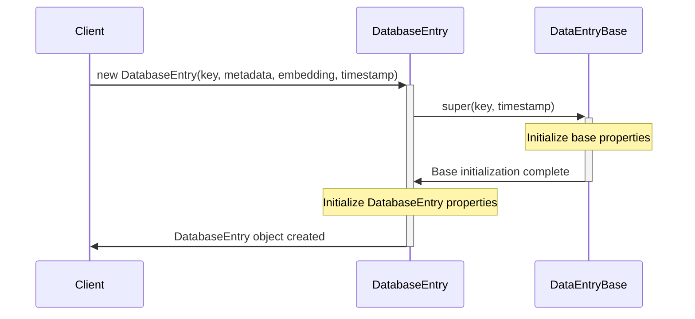

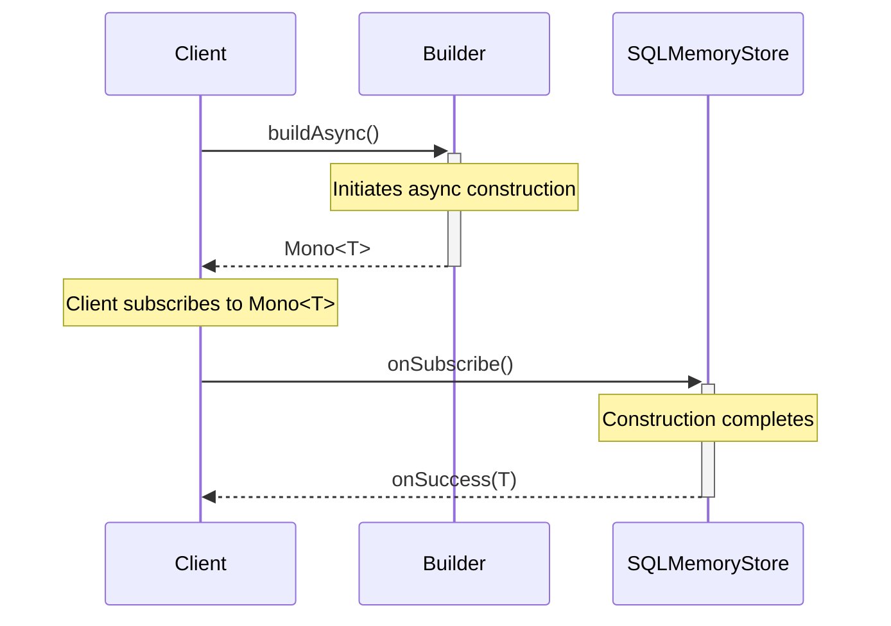

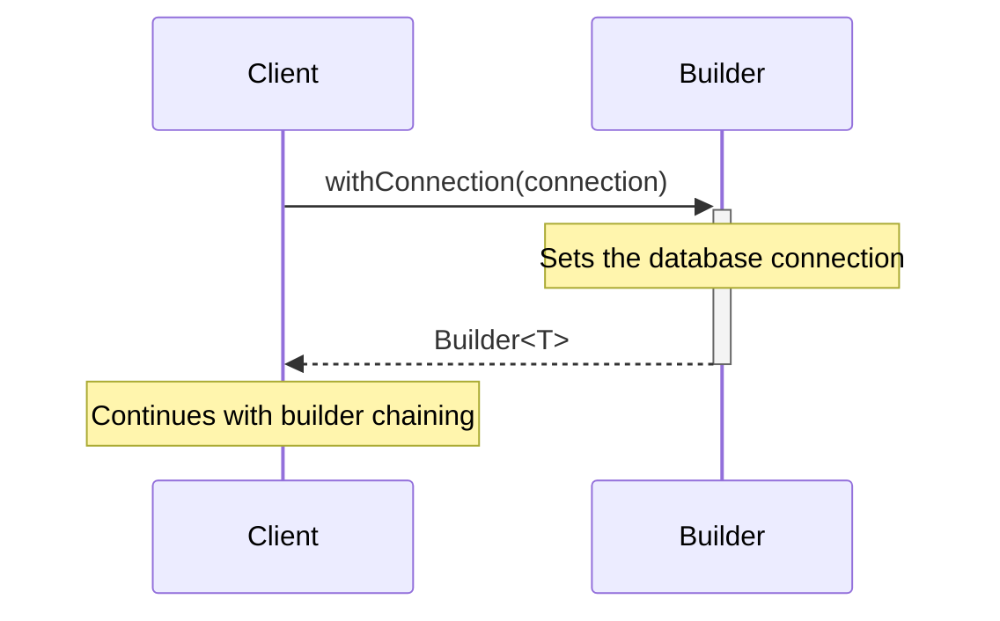

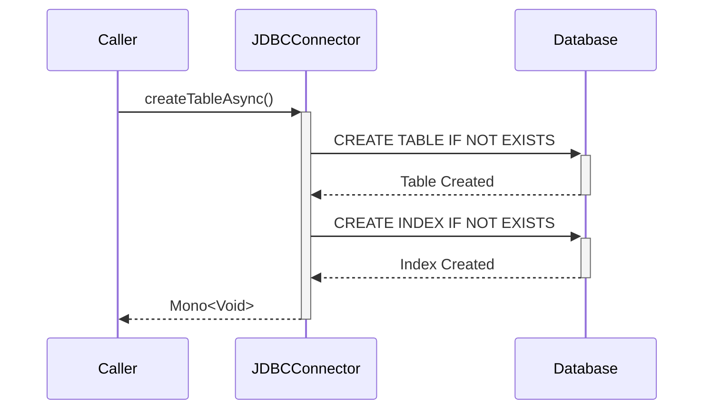

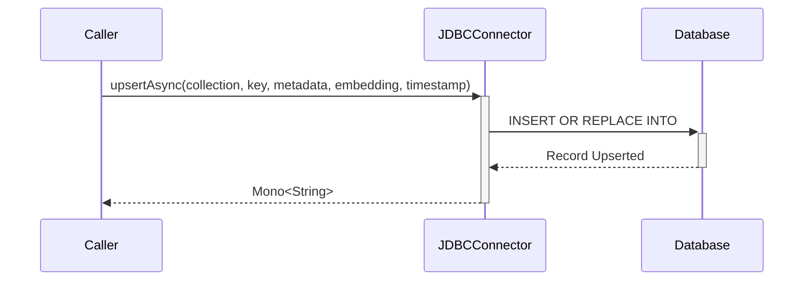

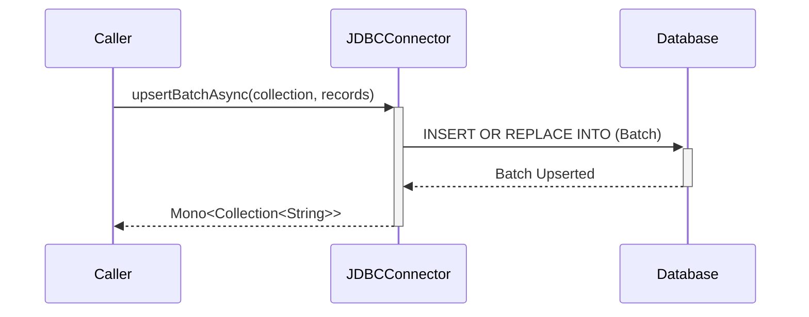

```mermaid
sequenceDiagram
    participant J as JDBCConnector
    participant DB as Database

    J->>+DB: close()
    DB-->>-J: Connection Closed
```

These diagrams are essential for understanding the creation and handling of `SQLConnectorException` instances, the instantiation and management of `DatabaseEntry` objects, the asynchronous construction of `SQLMemoryStore` instances, and the various operations performed by the `JDBCConnector` class.

**Note:** Additional sequence diagrams should be developed based on the interactions defined by the methods in the `SQLConnector` interface to illustrate the asynchronous operations and their flow.


***


## 8. Process View

### Concurrent Processes
The architecture is designed to support concurrent processes across various components. The `SQLConnector` interface and `JDBCConnector` class are central to handling database operations asynchronously, allowing for concurrent execution of multiple database operations. This is achieved through the use of the Reactor library's `Mono` type in the `SQLConnector` interface and Project Reactor's `Mono` and `Schedulers.boundedElastic()` in the `JDBCConnector` class, which represent single-result asynchronous operations and manage asynchronous execution, respectively.

Instances of `DatabaseEntry`, which extend `DataEntryBase`, are also involved in concurrent processes, particularly in applications involving semantic processing and machine learning. These instances may be created, read, and updated concurrently by different threads or processes.

The `SQLMemoryStore.Builder` interface's `buildAsync()` method indicates the presence of concurrent processes in the asynchronous construction of `SQLMemoryStore` instances. This method returns a `Mono<T>` type, suggesting that the construction process is non-blocking and concurrent.

### Synchronization Mechanisms
Synchronization mechanisms are crucial for maintaining data integrity and ensuring thread-safe operations. The `SQLConnector` interface inherently includes synchronization mechanisms through the Reactor library's handling of `Mono` types. Similarly, the `JDBCConnector` class leverages Project Reactor's synchronization features to ensure that database operations are executed in a thread-safe manner without blocking the calling thread.

For the `DatabaseEntry` class, synchronization mechanisms must be in place to handle concurrent access and modification of objects, especially since they contain a timestamp. These mechanisms could involve locking or atomic operations when creating or updating entries in the Semantic Kernel Memory Table.

The `SQLMemoryStore.Builder` interface's use of `Mono<T>` for the `buildAsync()` method also implies the presence of synchronization mechanisms to handle the completion of asynchronous operations and to ensure that the constructed instance is delivered to the client once ready.

### Process Diagrams
The architecture includes several UML diagrams to illustrate the structure and relationships of classes and interfaces, as well as the flow of operations.

For the `SQLConnectorException` class, a UML class diagram is provided to show its inheritance from the `SKException` superclass and its association with the `ErrorCodes` enumeration:

```mermaid
classDiagram
    SKException <|-- SQLConnectorException
    SQLConnectorException : -ErrorCodes errorCode
    SQLConnectorException : +SQLConnectorException(ErrorCodes errorCode)
    SQLConnectorException : +SQLConnectorException(ErrorCodes errorCode, String message)
    SQLConnectorException : +SQLConnectorException(ErrorCodes errorCode, String message, Throwable cause)
    SQLConnectorException : +getErrorCode() ErrorCodes
    class ErrorCodes {
        <<enumeration>>
        SQL_ERROR
        +getMessage() String
    }
```

The `SQLConnector` interface's UML class diagram visualizes the methods available for managing database operations asynchronously:

```mermaid
classDiagram
    class SQLConnector {
        <<interface>>
        +createTableAsync() Mono~Void~
        +createCollectionAsync(String collectionName) Mono~Void~
        +upsertAsync(String collection, String key, String metadata, String embedding, ZonedDateTime timestamp) Mono~String~
        +upsertBatchAsync(String collection, Collection~DatabaseEntry~ records) Mono~Collection~String~~
        +doesCollectionExistsAsync(String collectionName) Mono~Boolean~
        +getCollectionsAsync() Mono~List~String~~
        +readAllAsync(String collectionName) Mono~List~DatabaseEntry~~
        +readAsync(String collectionName, String key) Mono~DatabaseEntry~
        +readBatchAsync(String collectionName, Collection~String~ keys) Mono~Collection~DatabaseEntry~~
        +deleteCollectionAsync(String collectionName) Mono~Void~
        +deleteAsync(String collectionName, String key) Mono~Void~
        +deleteBatchAsync(String collectionName, Collection~String~ keys) Mono~Void~
        +deleteEmptyAsync(String collectionName) Mono~Void~
    }
    class DatabaseEntry {
        -String key
        -String metadata
        -String embedding
        -ZonedDateTime timestamp
    }
    SQLConnector "1" -- "*" DatabaseEntry : uses >
```

UML sequence diagrams are provided for the `JDBCConnector` class to illustrate the flow of control between the caller, `JDBCConnector`, and the database for methods such as `createTableAsync`, `upsertAsync`, `upsertBatchAsync`, and `close`. Here is an example for the `createTableAsync` method:

```mermaid
sequenceDiagram
    participant C as Caller
    participant J as JDBCConnector
    participant DB as Database

    C->>+J: createTableAsync()
    J->>+DB: CREATE TABLE IF NOT EXISTS
    DB-->>-J: Table Created
    J->>+DB: CREATE INDEX IF NOT EXISTS
    DB-->>-J: Index Created
    J-->>-C: Mono<Void>
```

For the `DatabaseEntry` class, a UML Sequence Diagram is provided to illustrate the object creation process and can be extended to include concurrent operations and synchronization mechanisms:

```mermaid
sequenceDiagram
    participant C as Client
    participant D as DatabaseEntry
    participant B as DataEntryBase
    participant S as Synchronization Mechanism

    C->>+S: request access
    S-->>+D: grant access
    D->>+B: super(key, timestamp)
    Note over B: Initialize base properties
    B->>-D: Base initialization complete
    Note over D: Initialize DatabaseEntry properties
    D->>-S: release access
    S->>-C: DatabaseEntry object created
```

Lastly, the UML sequence diagrams for the `SQLMemoryStore.Builder` interface demonstrate the asynchronous construction process and the client's interaction with the builder:

```mermaid
sequenceDiagram
    participant C as Client
    participant B as Builder
    participant S as SQLMemoryStore

    C->>+B: buildAsync()
    Note over B: Initiates async construction
    B-->>-C: Mono<T>
    Note over C: Client subscribes to Mono<T>
    C->>+S: onSubscribe()
    Note over S: Construction completes
    S-->>-C: onSuccess(T)
```

```mermaid
sequenceDiagram
    participant C as Client
    participant B as Builder

    C->>+B: withConnection(connection)
    Note over B: Sets the database connection
    B-->>-C: Builder<T>
    Note over C: Continues with builder chaining
```

These diagrams are essential for understanding the process view of the system architecture, as they provide a visual representation of the structure and sequence of operations, highlighting the concurrent nature of the system's processes and the synchronization mechanisms in place.


***


## 9. Deployment View

### Physical Nodes
The deployment architecture requires servers capable of hosting SQL databases and supporting a Java runtime environment for deploying Java-based interfaces such as `SQLMemoryStore` and `JDBCConnector`. Additionally, servers must be equipped to handle asynchronous operations and support the Reactor library for the `Mono` type used in the `SQLConnector` interface. The physical nodes will consist of at least two distinct types: application servers and database servers. The application servers will host the application logic, including `DatabaseEntry` class instances, `SQLMemoryStore` interface, and `SQLConnector` interface. The database servers will maintain the Semantic Kernel Memory Table and SQL databases, facilitating CRUD operations and other methods defined by the interfaces.

### Deployment Diagrams
Deployment diagrams are essential to illustrate the system's architecture. For the `DatabaseEntry` class instances, the diagram should depict the flow of data between client applications, `DatabaseEntry` objects, and the Semantic Kernel Memory Table within the server infrastructure. Similarly, diagrams for the `SQLMemoryStore` and `SQLConnector` interfaces must show the relationship between these components and the SQL database servers, emphasizing asynchronous communication and the use of the Reactor library. The diagrams should also represent the network connections between the Java application servers and the SQL database servers, highlighting the JDBC connection for the `JDBCConnector` class.

### Mapping of Software to Hardware
The `DatabaseEntry` class will be deployed on application servers with JSON processing capabilities. The `SQLMemoryStore` interface and its `Builder` interface will also be deployed on application servers that facilitate non-blocking I/O operations and asynchronous communication with the database servers. The `SQLConnector` interface will be deployed on application servers that support Java and the Reactor library, ensuring the system can handle the asynchronous nature of its operations. The SQL database servers must be configured to work with the `JDBCConnector` class and handle the CRUD operations defined in the `SQLConnector` interface.

#### UML Diagramming Information
The UML class diagram for the `SQLConnectorException` class is provided to illustrate the exception handling mechanism within the system. Additionally, the UML class diagram for the `SQLConnector` interface and its relationship with the `DatabaseEntry` class is included to represent the structure and operations performed by the interface.

```mermaid
classDiagram
    SKException <|-- SQLConnectorException
    SQLConnectorException : -ErrorCodes errorCode
    SQLConnectorException : +SQLConnectorException(ErrorCodes errorCode)
    SQLConnectorException : +SQLConnectorException(ErrorCodes errorCode, String message)
    SQLConnectorException : +SQLConnectorException(ErrorCodes errorCode, String message, Throwable cause)
    SQLConnectorException : +getErrorCode() ErrorCodes
    class ErrorCodes {
        <<enumeration>>
        SQL_ERROR
        +getMessage() String
    }
```

```mermaid
classDiagram
    class SQLConnector {
        <<interface>>
        +createTableAsync() Mono~Void~
        +createCollectionAsync(String collectionName) Mono~Void~
        +upsertAsync(String collection, String key, String metadata, String embedding, ZonedDateTime timestamp) Mono~String~
        +upsertBatchAsync(String collection, Collection~DatabaseEntry~ records) Mono~Collection~String~~
        +doesCollectionExistsAsync(String collectionName) Mono~Boolean~
        +getCollectionsAsync() Mono~List~String~~
        +readAllAsync(String collectionName) Mono~List~DatabaseEntry~~
        +readAsync(String collectionName, String key) Mono~DatabaseEntry~
        +readBatchAsync(String collectionName, Collection~String~ keys) Mono~Collection~DatabaseEntry~~
        +deleteCollectionAsync(String collectionName) Mono~Void~
        +deleteAsync(String collectionName, String key) Mono~Void~
        +deleteBatchAsync(String collectionName, Collection~String~ keys) Mono~Void~
        +deleteEmptyAsync(String collectionName) Mono~Void~
    }
    class DatabaseEntry {
        -String key
        -String metadata
        -String embedding
        -ZonedDateTime timestamp
    }
    SQLConnector "1" -- "*" DatabaseEntry : uses >
```

#### UML Deployment Diagram Example
The following UML deployment diagram example demonstrates the relationship between the Java application server with the `JDBCConnector` component and the SQL database server:

```puml
deploymentDiagram
    node "Java Application Server" {
        artifact "JDBCConnector" {
            node "JVM" {
            }
        }
    }
    node "SQL Database Server" {
        database "SQL Database" {
        }
    }
    "Java Application Server" .[#black].> "SQL Database Server" : JDBC Connection
```

#### Key Considerations
- Asynchronous operations and reactive programming principles must be supported by the physical nodes and deployment environment.
- The deployment view should clearly show the separation of concerns between application logic and database management.
- Scalability and performance requirements, especially for high-load operations, must be considered in the mapping of software to hardware.

The deployment view integrates the various components and their interactions within the physical infrastructure, ensuring a comprehensive understanding of the system's deployment architecture.


***


## 10. Implementation View

### Directory Structure
The directory structure for the implementation is organized to reflect the logical separation of concerns and ease of navigation within the codebase. The structure includes:

- A directory named `exceptions` for exception classes, including the `SQLConnectorException` class, which extends the `SKException` class.
- A directory named `models` or `entries` for data models, such as the `DatabaseEntry` class, which extends the `DataEntryBase` class.
- A directory named `database` or `connector` for database connectivity interfaces and classes, including the `SQLConnector` interface and the `JDBCConnector` class, which extends `SQLConnector` and implements `Closeable`.
- A directory that reflects the hierarchy and usage of the `MemoryStore` and `SQLMemoryStore` interfaces, with the latter extending the former and including a nested `Builder` interface.

### Module Organization
The module organization ensures that related classes and interfaces are grouped together to facilitate a modular approach:

- The `SQLConnectorException` class is part of a module handling SQL connections and operations, grouped with other SQL-related classes and interfaces.
- The `DatabaseEntry` class is part of a module that handles semantic processing and machine learning data structures, organized alongside other classes that deal with data entries.
- The `JDBCConnector` class is organized within a module that handles database operations, making it accessible to other parts of the application that require database interaction.
- The `SQLConnector` interface is part of a module responsible for providing asynchronous access to SQL databases, including implementations of the interface, utility classes, and exception handling classes.
- The `SQLMemoryStore` interface is an extension of the `MemoryStore` interface, indicating a modular approach where SQL-specific functionality is separated from the general memory store logic.

### Dependencies
The dependencies for each component are managed to ensure proper interaction and accessibility:

- The `SQLConnectorException` class depends on the `SKException` class, which must be accessible within its scope.
- The `DatabaseEntry` class relies on the `DataEntryBase` class for foundational data entry properties and the `ZonedDateTime` class from the `java.time` package for timestamping entries.
- The `JDBCConnector` class depends on the Project Reactor library for handling asynchronous operations and the JDBC API for database connectivity.
- The `SQLConnector` interface module depends on the Reactor library for its asynchronous programming model and a JSON processing library for handling JSON strings in the `upsertAsync` method.
- The `SQLMemoryStore` interface implementation requires the Project Reactor library for asynchronous operations and a JDBC API or similar database connection library for the `Connection` object.

### UML Diagrams
The UML diagrams provided illustrate the structure and relationships of the classes and interfaces:

- The UML class diagram for `SQLConnectorException` and `ErrorCodes` enumeration.
- The UML class diagram for `DatabaseEntry` and `DataEntryBase`.
- The UML sequence diagram for the creation of a `DatabaseEntry` object.
- The UML class diagram for `JDBCConnector`, `SQLConnector`, and `Closeable`.
- The UML class diagram for `SQLConnector` and `DatabaseEntry`.
- The UML class diagram for `SQLMemoryStore`, `MemoryStore`, and the nested `Builder` interface.

These diagrams are integral to the design document, providing a visual representation of the components and their interactions.

### Constraints and Expected Behavior
- The `key` parameter in the `SQLConnector` interface must be a unique identifier adhering to database indexing constraints.
- The `metadata` and `embedding` parameters should be valid JSON strings.
- The `timestamp` parameter should be a valid `ZonedDateTime` instance.
- The `Mono<Void>` return type indicates the completion of the operation and error propagation.

### Additional Notes
- The `DatabaseEntry` class encapsulates key, metadata, embedding content, and timestamp for a database entry, with its structure and fields defined in its documentation.
- The `Builder` interface for `SQLMemoryStore` allows for asynchronous building of the memory store with a specified `Connection`.

By adhering to this structured approach, the implementation view of the architecture design document ensures clarity, modularity, and ease of maintenance for the software development process.


***


## 11. Data View

The Data View section of the architecture design document focuses on the representation of data within the system, the relationships between data entities, and the flow of data through the system. This section includes data models, entity-relationship diagrams, and data flow diagrams.

### Data Models

The data models described in this section are primarily centered around the interactions with SQL databases and the structures that facilitate these interactions.

#### SQLConnector Interface
The `SQLConnector` interface is an asynchronous API that provides methods for managing tables and collections, performing CRUD operations, and managing entries within a SQL database. It utilizes the Reactor library's `Mono` type for single-result asynchronous operations.

#### SQLMemoryStore Interface
The `SQLMemoryStore` interface extends the `MemoryStore` interface and is marked as compatible with SQL databases. It includes a nested `Builder` interface for asynchronous instantiation and a method for setting the database connection.

#### DatabaseEntry Class
The `DatabaseEntry` class inherits from `DataEntryBase` and encapsulates a database entry's key, metadata, embedding content, and timestamp. It stores metadata and embedding information in JSON format and provides methods for accessing this data.

#### JDBCConnector Class
The `JDBCConnector` class implements the `SQLConnector` interface and the `Closeable` interface, managing asynchronous CRUD operations and database connections.

#### Exceptions and Error Handling
The `SQLConnectorException` class is used for handling SQL-related errors within the data layer and inherits from the `SKException` class. It includes an `ErrorCodes` enumeration to categorize different SQL error types.

### Entity-Relationship Diagrams

Entity-Relationship Diagrams are not applicable in this context as the provided knowledge pieces do not contain information about entity relationships within the database.

### Data Flow Diagrams

Data Flow Diagrams are not provided in the source document. However, the UML sequence diagrams included in the knowledge pieces illustrate the interactions between components during the execution of various methods for managing database operations asynchronously.

### UML Diagrams

The UML diagrams provided in the knowledge pieces visually represent the structure and relationships of the classes and interfaces described in the data models. These diagrams include class diagrams for `SQLConnector`, `SQLMemoryStore`, `DatabaseEntry`, `JDBCConnector`, and `SQLConnectorException`, as well as sequence diagrams for methods such as `createTableAsync`, `upsertAsync`, `upsertBatchAsync`, and `close` from the `JDBCConnector` class.

The UML diagrams serve as a visual aid to understand the components and their interactions within the data layer of the system. They are an integral part of the Data View section, providing clarity on the design and flow of data operations.

---

This comprehensive Data View section ensures that all relevant data models, their relationships, and the flow of data are clearly documented, providing a solid foundation for understanding the system's data architecture.


***


## 12. Size and Performance

### System Size Metrics
The system size metrics are crucial for understanding the impact of various components on the overall architecture. The `SQLMemoryStore` interface, which extends the `MemoryStore` interface, introduces additional components for SQL database interactions, potentially increasing the system size. The presence of a nested `Builder` interface within `SQLMemoryStore` suggests a modular design that could influence the system size based on the `SQLMemoryStore` instances' implementation details.

The `SQLConnector` interface is designed to manage database collections and handle CRUD operations asynchronously, including batch operations like `upsertBatchAsync`, `readBatchAsync`, and `deleteBatchAsync`. This indicates that the system is expected to process multiple records in a single operation, which should be considered when measuring system size. The `DatabaseEntry` class, which encapsulates data for entries, extends the `DataEntryBase` class, adding properties for metadata and embedding information, thus contributing to the system's size. The storage requirements for this class include space for a unique key, metadata in JSON format, embedding information in JSON format, and timestamp data.

The `SQLConnectorException` class, while a lightweight component, extends the `SKException` class and includes an inner `ErrorCodes` enumeration, contributing minimally to the overall system size. Its class structure comprises a private final field, multiple constructors, and a method, expected to have a negligible impact on the system's size.

Lastly, the `JDBCConnector` class interfaces Java applications with SQL databases using JDBC and manages asynchronous CRUD operations, batch operations, and connection management. It extends `SQLConnector` and implements `Closeable`, which should be factored into the system size metrics.

### Performance Targets and Benchmarks
Performance targets and benchmarks are set to ensure the system meets the required efficiency and responsiveness. The `buildAsync()` method in the `SQLMemoryStore.Builder` interface indicates a design for asynchronous operations, which can lead to non-blocking I/O and efficient resource utilization. The use of `Mono<T>` as a return type for this method suggests that the system is expected to handle reactive programming patterns, affecting latency and throughput performance benchmarks in a reactive application environment. The `withConnection(Connection connection)` method allows for the configuration of database connections, impacting performance based on the connection properties set, such as connection pooling and timeout settings.

The `SQLConnector` interface's asynchronous operations using Reactor's `Mono` type emphasize non-blocking I/O and efficient resource utilization as key performance targets. The system should be benchmarked for its ability to handle concurrent asynchronous operations and CRUD operations, both for individual entries and batch operations, to ensure scalability. The use of `ZonedDateTime` in `upsertAsync` implies that timestamp precision may be a performance factor, especially in time-sensitive applications.

The performance of the `DatabaseEntry` class is measured by the efficiency of retrieving metadata and embedding information, stored as JSON strings. High-performance benchmarks in the serialization and deserialization of JSON data within `DatabaseEntry` objects are crucial for quick access to metadata and embedding information. Timestamping functionality should have minimal impact on performance.

The `SQLConnectorException` class is designed for efficient error handling with minimal performance overhead, providing quick access to error codes for diagnostics, essential for maintaining performance during SQL error handling. The use of enumerations for error codes is optimized for performance, allowing for constant-time retrieval of error messages associated with specific SQL errors.

The `JDBCConnector` class's design to handle database operations asynchronously is crucial for performance in reactive systems. Methods like `createTableAsync`, `upsertAsync`, and `upsertBatchAsync` execute on a `Schedulers.boundedElastic()`, indicating a performance consideration for offloading blocking tasks to a separate thread pool. Batch operations in methods like `upsertBatchAsync` optimize performance by reducing the number of round trips to the database. The class's design for use with Project Reactor implies optimization for non-blocking and backpressure-aware operations, contributing to system performance.

#### UML Diagrams Relevant to Size and Performance
The UML diagrams provided offer a visual representation of the system's structure and interactions, which are integral to understanding the size and performance implications.

**UML Class Diagrams:**
- The `SQLMemoryStore` and `SQLConnector` class diagrams illustrate the inheritance relationships and methods, which help assess the complexity and potential performance impact of the class structure.
- The `SQLConnectorException` class diagram shows its inheritance and composition, useful for understanding its impact on system design and performance.
- The `JDBCConnector` class diagram displays the structure of the class, relevant to understanding the system size.

**UML Sequence Diagrams:**
- The `buildAsync()` and `withConnection()` methods' sequence diagrams provide insights into the expected interactions and flow of control, inferring performance characteristics such as the asynchronous nature of instance creation and the configuration of database connections.
- The Object Creation sequence diagram for `DatabaseEntry` shows the steps involved in creating an object, which can be used to analyze performance during object instantiation.
- The `createTableAsync` and `upsertBatchAsync` methods' sequence diagrams illustrate the asynchronous nature and batch operation capability, which are key performance features.

**UML Class Diagram for SQLConnector and DatabaseEntry:**
```mermaid
classDiagram
    class SQLConnector {
        <<interface>>
        +createTableAsync() Mono~Void~
        +createCollectionAsync(String collectionName) Mono~Void~
        +upsertAsync(String collection, String key, String metadata, String embedding, ZonedDateTime timestamp) Mono~String~
        +upsertBatchAsync(String collection, Collection~DatabaseEntry~ records) Mono~Collection~String~~
        +doesCollectionExistsAsync(String collectionName) Mono~Boolean~
        +getCollectionsAsync() Mono~List~String~~
        +readAllAsync(String collectionName) Mono~List~DatabaseEntry~~
        +readAsync(String collectionName, String key) Mono~DatabaseEntry~
        +readBatchAsync(String collectionName, Collection~String~ keys) Mono~Collection~DatabaseEntry~~
        +deleteCollectionAsync(String collectionName) Mono~Void~
        +deleteAsync(String collectionName, String key) Mono~Void~
        +deleteBatchAsync(String collectionName, Collection~String~ keys) Mono~Void~
        +deleteEmptyAsync(String collectionName) Mono~Void~
    }
    class DatabaseEntry {
        -String key
        -String metadata
        -String embedding
        -ZonedDateTime timestamp
    }
    SQLConnector "1" -- "*" DatabaseEntry : uses >
```

**UML Class Diagram for DataEntryBase and DatabaseEntry:**
```mermaid
classDiagram
    class DataEntryBase {
        -String key
        -ZonedDateTime timestamp
    }
    class DatabaseEntry {
        -String embedding
        -String metadata
        +DatabaseEntry(String key, String metadata, String embedding, ZonedDateTime timestamp)
        +String getMetadata()
        +String getEmbedding()
    }
    DataEntryBase <|-- DatabaseEntry
```

**UML Class Diagram for SQLConnectorException:**
```mermaid
classDiagram
    SKException <|-- SQLConnectorException
    SQLConnectorException : -ErrorCodes errorCode
    SQLConnectorException : +SQLConnectorException(ErrorCodes errorCode)
    SQLConnectorException : +SQLConnectorException(ErrorCodes errorCode, String message)
    SQLConnectorException : +SQLConnectorException(ErrorCodes errorCode, String message, Throwable cause)
    SQLConnectorException : +getErrorCode() ErrorCodes
    class ErrorCodes {
        <<enumeration>>
        SQL_ERROR
        +getMessage() String
    }
```

**UML Class Diagram for JDBCConnector:**
```mermaid
classDiagram
    class JDBCConnector {
        -Connection connection
        +JDBCConnector(Connection)
        +createTableAsync() Mono~Void~
        +upsertAsync(String, String, String, String, ZonedDateTime) Mono~String~
        +upsertBatchAsync(String, Collection~DatabaseEntry~) Mono~Collection~String~~
        +close()
    }
    JDBCConnector --|> SQLConnector : implements
    JDBCConnector --|> Closeable : implements
```

**UML Sequence Diagram for createTableAsync:**
```mermaid
sequenceDiagram
    participant C as Caller
    participant J as JDBCConnector
    participant DB as Database

    C->>+J: createTableAsync()
    J->>+DB: CREATE TABLE IF NOT EXISTS
    DB-->>-J: Table Created
    J->>+DB: CREATE INDEX IF NOT EXISTS
    DB-->>-J: Index Created
    J-->>-C: Mono<Void>
```

**UML Sequence Diagram for upsertBatchAsync:**
```mermaid
sequenceDiagram
    participant C as Caller
    participant J as JDBCConnector
    participant DB as Database

    C->>+J: upsertBatchAsync(collection, records)
    J->>+DB: INSERT OR REPLACE INTO (Batch)
    DB-->>-J: Batch Upserted
    J-->>-C: Mono<Collection<String>>
```

In conclusion, the system's size and performance are influenced by the design and implementation of its components, including interfaces, classes, and methods that facilitate SQL database interactions and asynchronous operations. The UML diagrams serve as a visual aid to understand the system's architecture and its implications on size and performance.


***


## 13. Quality Attributes

### Security Measures
Security is a paramount concern in the system's architecture, particularly in the handling of sensitive data through CRUD operations. The `SQLConnector` interface is designed to ensure secure data interactions, with a focus on encryption for `metadata` and `embedding` parameters and secure API endpoints. Additionally, the `SQLConnectorException` class is part of an exception handling framework that securely handles SQL-related errors by providing detailed error information while preventing the exposure of sensitive details to unauthorized users. The `JDBCConnector` class, while not explicitly mentioning security measures, is responsible for managing database connections, which necessitates secure connection handling and potentially integrating with secure credential storage mechanisms. The `DatabaseEntry` class ensures each entry has a unique key, crucial for preventing data collision and unauthorized data manipulation. Lastly, the `SQLMemoryStore.Builder` interface's `withConnection` method allows for secure configuration of database connections by enabling the client to specify the `Connection` object.

### Reliability & Availability
The system's reliability and availability are enhanced through the asynchronous nature of the `SQLConnector` interface, which utilizes `Mono` types from the Reactor library to ensure non-blocking database operations. Error handling within the `SQLConnectorException` class captures SQL errors with specific error codes, allowing for precise identification and handling of issues. The `JDBCConnector` class contributes to higher availability by providing asynchronous CRUD operations and a `close` method to ensure proper closure of database connections. The `DatabaseEntry` class includes a timestamp to provide a reliable way to track the creation and update times of entries, essential for data integrity. The `SQLMemoryStore.Builder` interface suggests that the `SQLMemoryStore` operates asynchronously, contributing to system reliability and availability by not blocking client operations during instance construction.

### Maintainability & Scalability
Maintainability is addressed through a clear separation of concerns and a well-defined contract for database interactions within the `SQLConnector` interface. The `SQLConnectorException` class is designed with multiple constructors to enable informative error reporting and easier debugging. The `JDBCConnector` class extends the `SQLConnector` interface, suggesting a modular design that facilitates maintenance and future extensions. It also uses a bounded elastic scheduler for IO-intensive work, indicating a design for scalability. The `DatabaseEntry` class inherits from `DataEntryBase`, indicating a modular design that facilitates easier maintenance and potential scalability. The use of a `Builder` interface for creating instances of `SQLMemoryStore` provides a maintainable and scalable approach to object construction, allowing for future enhancements and configurations without altering client code.

#### UML Diagrams and Sequence Diagrams
The provided UML diagrams offer visual representations of the system's components, illustrating the structure and relationships within the system, which are crucial for understanding maintenance and scalability. The sequence diagrams for methods like `createTableAsync`, `upsertAsync`, `upsertBatchAsync`, and `close` illustrate the flow of operations and interactions with the database, highlighting how reliability and availability are addressed through asynchronous execution and proper resource management. The UML Class Diagram for `SQLMemoryStore` and related interfaces shows the inheritance relationship between `MemoryStore` and `SQLMemoryStore`, supporting maintainability and scalability.

#### Examples
For instance, the `JDBCConnector` class's asynchronous operations, executed on a bounded elastic scheduler, demonstrate the system's ability to handle multiple concurrent operations efficiently, which is a key aspect of scalability. The `DatabaseEntry` class's storage of metadata and embedding information in JSON format showcases the system's flexibility to adapt to various data types and sizes, contributing to maintainability and scalability.

#### Alphabetical Lists
- Error Codes: SQL_ERROR
- Interfaces: Closeable, MemoryStore, SQLConnector, SQLMemoryStore.Builder
- Methods: buildAsync, close, createCollectionAsync, createTableAsync, deleteAsync, deleteBatchAsync, deleteCollectionAsync, deleteEmptyAsync, doesCollectionExistsAsync, getCollectionsAsync, readAllAsync, readAsync, readBatchAsync, upsertAsync, upsertBatchAsync, withConnection
- Classes: DataEntryBase, DatabaseEntry, JDBCConnector, SQLConnectorException, SQLMemoryStore

*** 

This comprehensive document integrates the provided knowledge pieces into a cohesive structure, ensuring clarity and structural integrity while avoiding repetition.


***


## 14. Technical Risks and Mitigations

### Identified Risks
The architecture design identifies several risks across different components of the system:

1. **Asynchronous Building Complexity**: The `buildAsync` method in the `SQLMemoryStore.Builder` interface could lead to thread management and synchronization issues.
2. **Asynchronous Operations Failure**: The `SQLConnector` interface's reliance on asynchronous operations may fail due to network issues, database locks, or timeouts.
3. **Database Connection Management**: Both the `withConnection` method in the `SQLMemoryStore.Builder` and the `JDBCConnector` class's connection management could result in leaks or failures.
4. **Database Schema Changes**: The `SQLConnector` interface assumes a certain database schema, changes to which could lead to incompatibility issues.
5. **Error Handling Complexity**: Since methods return `Mono` types, errors are encapsulated within these objects, leading to complex error handling logic.
6. **Inadequate Error Handling**: The `SQLConnectorException` class may not capture all potential SQL error scenarios if the `ErrorCodes` enumeration is not comprehensive.
7. **Inheritance Risks**: Changes or issues in the `DataEntryBase` class could affect the derived `DatabaseEntry` class.
8. **Metadata and Embedding Mismanagement**: Incorrect formatting or parsing of metadata and embedding in the `DatabaseEntry` class could lead to data corruption.
9. **Risk of Data Inconsistency**: The `DatabaseEntry` class relies on proper timestamping to maintain data integrity, which could fail and lead to inconsistent states.

### Mitigation Strategies
To address the identified risks, the following strategies are proposed:

1. **Asynchronous Building Complexity**: Implement comprehensive testing, including unit and integration tests, to ensure thread safety and proper synchronization.
2. **Asynchronous Operations Failure**: Implement robust error handling within the subscription logic of `Mono` types to manage exceptions and recover from failures gracefully.
3. **Connection Pooling**: Use a connection pool for the `JDBCConnector` class to manage database connections efficiently and prevent resource exhaustion.
4. **Database Schema Changes**: Maintain database schema versions and ensure backward compatibility or provide migration scripts for schema changes.
5. **Error Handling Complexity**: Follow best practices for reactive programming, such as proper error handling, to ensure that asynchronous operations do not lead to unhandled exceptions or system instability.
6. **Expand ErrorCodes Enumeration**: To mitigate the risk of inadequate error handling, expand the `ErrorCodes` enumeration to include a wider range of SQL error types.
7. **Implement Robust Timestamping**: Ensure that the timestamping functionality in the `DatabaseEntry` class is reliable and tested thoroughly.
8. **Validate JSON Data**: Introduce strict validation rules for metadata and embedding information to ensure that all JSON data conforms to the expected format.
9. **Version Control for Inheritance**: Maintain strict version control and backward compatibility checks for the `DataEntryBase` class.

### Contingency Plans
In the event that the mitigation strategies are not sufficient, the following contingency plans are in place:

1. **Asynchronous Building Complexity**: Have a fallback synchronous building method that can be used while asynchronous issues are being resolved.
2. **Fallback Mechanisms**: Develop fallback mechanisms to handle failures in asynchronous operations, such as retry policies or circuit breakers.
3. **Monitoring and Alerts**: Implement monitoring for the number of open connections and set up alerts for when the number approaches the limit.
4. **Performance Testing**: Conduct performance testing with different batch sizes to determine the optimal batch size for `upsertBatchAsync`.
5. **Regular Review and Update**: Implement a process for regular review and updates to the `ErrorCodes` enumeration and the `SQLConnectorException` class structure.
6. **Documentation and Training**: Ensure that the `DatabaseEntry` class and other related components are well-documented, and provide training for developers on handling the complexities of reactive programming with `Mono` types.

***UML Diagrams***

The UML diagrams provided offer a visual representation of the system's components and their relationships, aiding in understanding the design and identifying potential risks and their mitigations.

- **SQLConnectorException Class Diagram**:
```mermaid
classDiagram
    SKException <|-- SQLConnectorException
    SQLConnectorException : -ErrorCodes errorCode
    SQLConnectorException : +SQLConnectorException(ErrorCodes errorCode)
    SQLConnectorException : +SQLConnectorException(ErrorCodes errorCode, String message)
    SQLConnectorException : +SQLConnectorException(ErrorCodes errorCode, String message, Throwable cause)
    SQLConnectorException : +getErrorCode() ErrorCodes
    class ErrorCodes {
        <<enumeration>>
        SQL_ERROR
        +getMessage() String
    }
```

- **SQLMemoryStore and Builder Interface Diagram**:
```mermaid
classDiagram
    MemoryStore <|-- SQLMemoryStore
    MemoryStore : +build()
    SQLMemoryStore : +Builder
    class SQLMemoryStore~Builder~ {
        +buildAsync() Mono<T>
        +withConnection(Connection) Builder<T>
    }
```

- **JDBCConnector Class Diagram**:
```mermaid
classDiagram
    class JDBCConnector {
        -Connection connection
        +JDBCConnector(Connection)
        +createTableAsync() Mono~Void~
        +upsertAsync(String, String, String, String, ZonedDateTime) Mono~String~
        +upsertBatchAsync(String, Collection~DatabaseEntry~) Mono~Collection~String~~
        +close()
    }
    JDBCConnector --|> SQLConnector : implements
    JDBCConnector --|> Closeable : implements
```

- **SQLConnector Interface and DatabaseEntry Class Diagram**:
```mermaid
classDiagram
    class SQLConnector {
        <<interface>>
        +createTableAsync() Mono~Void~
        +createCollectionAsync(String collectionName) Mono~Void~
        +upsertAsync(String collection, String key, String metadata, String embedding, ZonedDateTime timestamp) Mono~String~
        +upsertBatchAsync(String collection, Collection~DatabaseEntry~ records) Mono~Collection~String~~
        +doesCollectionExistsAsync(String collectionName) Mono~Boolean~
        +getCollectionsAsync() Mono~List~String~~
        +readAllAsync(String collectionName) Mono~List~DatabaseEntry~~
        +readAsync(String collectionName, String key) Mono~DatabaseEntry~
        +readBatchAsync(String collectionName, Collection~String~ keys) Mono~Collection~DatabaseEntry~~
        +deleteCollectionAsync(String collectionName) Mono~Void~
        +deleteAsync(String collectionName, String key) Mono~Void~
        +deleteBatchAsync(String collectionName, Collection~String~ keys) Mono~Void~
        +deleteEmptyAsync(String collectionName) Mono~Void~
    }
    class DatabaseEntry {
        -String key
        -String metadata
        -String embedding
        -ZonedDateTime timestamp
    }
    SQLConnector "1" -- "*" DatabaseEntry : uses >
```

- **DatabaseEntry Inheritance Diagram**:
```mermaid
classDiagram
    class DataEntryBase {
        -String key
        -ZonedDateTime timestamp
    }
    class DatabaseEntry {
        -String embedding
        -String metadata
        +DatabaseEntry(String key, String metadata, String embedding, ZonedDateTime timestamp)
        +String getMetadata()
        +String getEmbedding()
    }
    DataEntryBase <|-- DatabaseEntry
```

These diagrams should be included in the design document to visually support the identified risks and mitigation strategies.


***


## 15. Cross-Cutting Concerns

### Internationalization
The source documents do not provide specific details related to internationalization. Therefore, this aspect is not addressed in the current architecture design document. Future revisions may include internationalization considerations as the application requirements evolve.

### Logging and Monitoring
The architecture design incorporates logging and monitoring as implicit requirements within the system's components. Although not explicitly mentioned in the source documents, the use of `Mono` types in the `SQLConnector` interface methods suggests that implementers should provide logging for errors and monitoring of operations by subscribing to these types. Additionally, the `DatabaseEntry` class includes a timestamp, which is crucial for logging and monitoring, as it helps maintain data integrity and track changes over time.

### Error Handling Strategies
Error handling is a critical aspect of the system's design, with strategies implemented across various components. The `SQLConnector` interface and its implementer, the `JDBCConnector` class, use custom exceptions such as `SQLConnectorException` to encapsulate and propagate SQL errors. These exceptions provide detailed error codes and messages, aiding in effective error handling. The `SQLConnectorException` class extends the `SKException` class, indicating integration with the system's broader exception handling framework. Error handling is further implemented in try-catch blocks within methods such as `createTableAsync`, `upsertAsync`, `upsertBatchAsync`, and `close`, where `SQLException` is caught and wrapped in a `SQLConnectorException`. Additionally, the use of `Mono<T>` in methods like `buildAsync` implies that error handling can be implemented reactively, using operators like `onErrorResume`, `onErrorReturn`, or `doOnError`.

#### UML Diagrams Relevant to Cross-Cutting Concerns
The UML diagrams provided offer visual representations of the system's components and their relationships, highlighting points where cross-cutting concerns such as logging, monitoring, and error handling may be integrated.

***UML Class Diagram for SQLConnector Interface:***
```mermaid
classDiagram
    class SQLConnector {
        <<interface>>
        +createTableAsync() Mono~Void~
        +createCollectionAsync(String collectionName) Mono~Void~
        +upsertAsync(String collection, String key, String metadata, String embedding, ZonedDateTime timestamp) Mono~String~
        +upsertBatchAsync(String collection, Collection~DatabaseEntry~ records) Mono~Collection~String~~
        +doesCollectionExistsAsync(String collectionName) Mono~Boolean~
        +getCollectionsAsync() Mono~List~String~~
        +readAllAsync(String collectionName) Mono~List~DatabaseEntry~~
        +readAsync(String collectionName, String key) Mono~DatabaseEntry~
        +readBatchAsync(String collectionName, Collection~String~ keys) Mono~Collection~DatabaseEntry~~
        +deleteCollectionAsync(String collectionName) Mono~Void~
        +deleteAsync(String collectionName, String key) Mono~Void~
        +deleteBatchAsync(String collectionName, Collection~String~ keys) Mono~Void~
        +deleteEmptyAsync(String collectionName) Mono~Void~
    }
```

***UML Class Diagram for JDBCConnector Class:***
```mermaid
classDiagram
    class JDBCConnector {
        -Connection connection
        +JDBCConnector(Connection)
        +createTableAsync() Mono~Void~
        +upsertAsync(String, String, String, String, ZonedDateTime) Mono~String~
        +upsertBatchAsync(String, Collection~DatabaseEntry~) Mono~Collection~String~~
        +close()
    }
    JDBCConnector --|> SQLConnector : implements
    JDBCConnector --|> Closeable : implements
```

***UML Sequence Diagram for Error Handling in close Method:***
```mermaid
sequenceDiagram
    participant J as JDBCConnector
    participant DB as Database

    J->>+DB: close()
    alt success
        DB-->>-J: Connection Closed
    else error
        DB-->>J: SQLException
        J->>J: SQLConnectorException
    end
```

***UML Class Diagram for SQLConnectorException Class:***
```mermaid
classDiagram
    SKException <|-- SQLConnectorException
    SQLConnectorException : -ErrorCodes errorCode
    SQLConnectorException : +SQLConnectorException(ErrorCodes errorCode)
    SQLConnectorException : +SQLConnectorException(ErrorCodes errorCode, String message)
    SQLConnectorException : +SQLConnectorException(ErrorCodes errorCode, String message, Throwable cause)
    SQLConnectorException : +getErrorCode() ErrorCodes
    class ErrorCodes {
        <<enumeration>>
        SQL_ERROR
        +getMessage() String
    }
```

***UML Class Diagram for DatabaseEntry and DataEntryBase Classes:***
```mermaid
classDiagram
    class DataEntryBase {
        -String key
        -ZonedDateTime timestamp
    }
    class DatabaseEntry {
        -String embedding
        -String metadata
        +DatabaseEntry(String key, String metadata, String embedding, ZonedDateTime timestamp)
        +String getMetadata()
        +String getEmbedding()
    }
    DataEntryBase <|-- DatabaseEntry
```

***UML Sequence Diagram for DatabaseEntry Object Creation:***
```mermaid
sequenceDiagram
    participant C as Client
    participant D as DatabaseEntry
    participant B as DataEntryBase

    C->>+D: new DatabaseEntry(key, metadata, embedding, timestamp)
    D->>+B: super(key, timestamp)
    Note over B: Initialize base properties
    B->>-D: Base initialization complete
    Note over D: Initialize DatabaseEntry properties
    D->>-C: DatabaseEntry object created
```

***UML Class Diagram for SQLMemoryStore and Related Interfaces:***
```mermaid
classDiagram
    MemoryStore <|-- SQLMemoryStore
    MemoryStore : +build()
    SQLMemoryStore : +Builder
    class SQLMemoryStore~Builder~ {
        +buildAsync() Mono<T>
        +withConnection(Connection) Builder<T>
    }
```

These diagrams collectively illustrate the system's structure and the integration points for cross-cutting concerns, providing a clear visual guide for developers and stakeholders.


***


## 16. Tools and Technologies

### Development Tools
The development of the system primarily relies on the Java Development Kit (JDK), which is essential for developing and running Java-based classes such as `DatabaseEntry`, `SQLConnectorException`, `SQLMemoryStore`, `SQLConnector`, and `JDBCConnector`. An Integrated Development Environment (IDE) like IntelliJ IDEA or Eclipse is recommended for writing and managing Java code efficiently.

### Frameworks and Libraries
Several frameworks and libraries are integral to the system's functionality:
- JSON Processing Library: Utilized for handling JSON formatted metadata within the `DatabaseEntry` class.
- Java Database Connectivity (JDBC): A Java API for connecting and executing queries with a SQL database, used in the `JDBCConnector` class.
- Project Reactor: A library for building reactive non-blocking applications on the JVM, employed for handling asynchronous database operations in classes like `SQLMemoryStore`, `SQLConnector`, and `JDBCConnector`.
- Reactor library: Provides an asynchronous API using `Mono` type, which is evident in the `SQLConnector` interface methods.
- An exception handling framework is implied by the extension of the `SKException` class in the `SQLConnectorException` class, although the specific framework is not named.

### External Services/APIs
The system is designed to interact with SQL Database services, which are necessary for the operation of classes such as `SQLMemoryStore`, `SQLConnector`, and `JDBCConnector`. No other external services or APIs are directly referenced in the provided documentation, but services for timestamping or machine learning models may be relevant depending on the broader system context.

### UML Diagrams
The architecture design document includes several UML diagrams to visualize the system's structure and the sequence of operations:

- UML Class Diagrams:
  - `DatabaseEntry` and its inheritance from `DataEntryBase`.
  - `SQLConnectorException` and its relationship to the `SKException` superclass.
  - `SQLMemoryStore` and its nested `Builder` interface.
  - `SQLConnector` interface and its usage of `DatabaseEntry` class.
  - `JDBCConnector` class, its implementation of the `SQLConnector` interface, and its adherence to the `Closeable` interface.

- UML Sequence Diagrams:
  - Object creation process for `DatabaseEntry`.
  - Flow of operations for the `buildAsync` and `withConnection` methods in `SQLMemoryStore`.
  - `createTableAsync`, `upsertAsync`, `upsertBatchAsync`, and `close` methods in `JDBCConnector`.

These diagrams are crucial for understanding the relationships and interactions within the system and should be referred to for a comprehensive understanding of the system's design.

### Mermaid
Mermaid, a JavaScript-based diagramming tool, is used for creating and modifying the UML diagrams dynamically. It renders Markdown-inspired text definitions to produce visual representations of the system's structure and behavior.

### Alphabetical Definitions, Acronyms, and Abbreviations
- IDE: Integrated Development Environment
- JDBC: Java Database Connectivity
- JDK: Java Development Kit
- JSON: JavaScript Object Notation
- JVM: Java Virtual Machine
- UML: Unified Modeling Language

By integrating these tools, frameworks, libraries, and services, the system is equipped to handle the complexities of database operations, exception handling, and asynchronous processing, while providing a clear visual representation of its architecture through UML diagrams.


***


## 17. References

This section consolidates all external documents and standards and guidelines that have been referenced throughout the architecture design document. These references provide the necessary background and support for the design decisions made in the document.

### External Documents

1. **Java Database Connectivity (JDBC) API Specification**: This document provides details on the JDBC API, which is utilized by the `JDBCConnector` class to interface with SQL databases.
2. **Project Reactor Documentation**: This documentation is essential for understanding the usage of `Mono<T>` in asynchronous operations and the reactive programming model used in the `JDBCConnector` class.
3. **Reactor library documentation**: This document is crucial for understanding the usage of the `Mono` type and the principles of reactive programming.

### Standards and Guidelines

1. **Java Coding Standards**: Since the `JDBCConnector` class is implemented in Java, these standards are necessary for maintainability and consistency.
2. **JSON Data Format Standards**: These standards are applied for `metadata` and `embedding` parameters in the `upsertAsync` method.
3. **Reactive Programming Standards**: Best practices for implementing reactive programming patterns, particularly in building asynchronous systems.
4. **SQL Database Interaction Standards**: Guidelines for setting up and managing database connections within applications, including asynchronous operations.
5. **SQL Syntax Standards**: As the `JDBCConnector` class uses SQL statements for database operations, adherence to these standards is essential.
6. **Indexing Constraints and Unique Identifier Standards**: These standards are applied for the `key` parameter in database operations.

### UML Diagrams

UML diagrams are included to provide a visual representation of the system's architecture and the interactions between its components. The diagrams included are:

1. **UML Class Diagram for `SQLConnector` and `DatabaseEntry`**: This diagram shows the interface `SQLConnector` and its relationship with the `DatabaseEntry` class, which stores metadata and embedding information in JSON format for semantic processing and machine learning applications.

2. **UML Class Diagram for `JDBCConnector`**: This diagram illustrates the `JDBCConnector` class, its methods, and its implementation of the `SQLConnector` interface and the `Closeable` interface.

3. **UML Class Diagram for `SQLMemoryStore` and Related Interfaces**: This diagram depicts the `MemoryStore` interface, the `SQLMemoryStore` class, and the `SQLMemoryStore.Builder` inner class with its methods.

4. **UML Class Diagram for `SQLConnectorException`**: This diagram provides the structure of the `SQLConnectorException` class, showing its inheritance from `SKException` and the `ErrorCodes` enumeration.

5. **UML Sequence Diagrams**: These diagrams illustrate the sequence of operations for methods such as `createTableAsync`, `upsertAsync`, `upsertBatchAsync`, and `close` in the `JDBCConnector` class, as well as object creation for `DatabaseEntry` and the `buildAsync` and `withConnection` methods in the `SQLMemoryStore.Builder`.

### Class References

- **`DatabaseEntry`**: This class extends `DataEntryBase` and is used for storing metadata and embedding information in JSON format. It is utilized for semantic processing and machine learning applications. The class provides a constructor, `DatabaseEntry(String key, String metadata, String embedding, ZonedDateTime timestamp)`, and accessor methods, `String getMetadata()` and `String getEmbedding()`.

- **`SQLConnectorException`**: This class encapsulates errors related to SQL connections and operations. It extends the `SKException` class and includes an `ErrorCodes` enumeration for listing SQL error types. The class provides constructors for varying levels of exception detail and a method, `getErrorCode()`, for accessing the stored error code.

By referring to these documents and standards, the architecture design document ensures that the system is built on a foundation of established best practices and industry standards. The UML diagrams and class references provide clarity on the system's structure and behavior, facilitating a better understanding of the design and interactions within the system.


***


## 18. Appendix

### Additional Diagrams

This section includes a collection of UML diagrams that provide a visual representation of various classes and interfaces, along with their relationships and interactions within the system. The diagrams serve as a detailed guide for understanding the structure and behavior of the system components.

#### UML Class Diagram for `SQLConnectorException`
```mermaid
classDiagram
    SKException <|-- SQLConnectorException
    SQLConnectorException : -ErrorCodes errorCode
    SQLConnectorException : +SQLConnectorException(ErrorCodes errorCode)
    SQLConnectorException : +SQLConnectorException(ErrorCodes errorCode, String message)
    SQLConnectorException : +SQLConnectorException(ErrorCodes errorCode, String message, Throwable cause)
    SQLConnectorException : +getErrorCode() ErrorCodes
    class ErrorCodes {
        <<enumeration>>
        SQL_ERROR
        +getMessage() String
    }
```

#### UML Class Diagram for `DatabaseEntry`
```mermaid
classDiagram
    class DataEntryBase {
        -String key
        -ZonedDateTime timestamp
    }
    class DatabaseEntry {
        -String embedding
        -String metadata
        +DatabaseEntry(String key, String metadata, String embedding, ZonedDateTime timestamp)
        +String getMetadata()
        +String getEmbedding()
    }
    DataEntryBase <|-- DatabaseEntry
```

#### UML Sequence Diagram for `DatabaseEntry` Object Creation
```mermaid
sequenceDiagram
    participant C as Client
    participant D as DatabaseEntry
    participant B as DataEntryBase

    C->>+D: new DatabaseEntry(key, metadata, embedding, timestamp)
    D->>+B: super(key, timestamp)
    Note over B: Initialize base properties
    B->>-D: Base initialization complete
    Note over D: Initialize DatabaseEntry properties
    D->>-C: DatabaseEntry object created
```

#### UML Class Diagram for SQLMemoryStore and Related Interfaces
```mermaid
classDiagram
    MemoryStore <|-- SQLMemoryStore
    MemoryStore : +build()
    SQLMemoryStore : +Builder
    class SQLMemoryStore~Builder~ {
        +buildAsync() Mono<T>
        +withConnection(Connection) Builder<T>
    }
```

#### UML Sequence Diagram for buildAsync Method
```mermaid
sequenceDiagram
    participant C as Client
    participant B as Builder
    participant S as SQLMemoryStore

    C->>+B: buildAsync()
    Note over B: Initiates async construction
    B-->>-C: Mono<T>
    Note over C: Client subscribes to Mono<T>
    C->>+S: onSubscribe()
    Note over S: Construction completes
    S-->>-C: onSuccess(T)
```

#### UML Sequence Diagram for withConnection Method
```mermaid
sequenceDiagram
    participant C as Client
    participant B as Builder

    C->>+B: withConnection(connection)
    Note over B: Sets the database connection
    B-->>-C: Builder<T>
    Note over C: Continues with builder chaining
```

#### UML Class Diagram for SQLConnector Interface
```mermaid
classDiagram
    class SQLConnector {
        <<interface>>
        +createTableAsync() Mono~Void~
        +createCollectionAsync(String collectionName) Mono~Void~
        +upsertAsync(String collection, String key, String metadata, String embedding, ZonedDateTime timestamp) Mono~String~
        +upsertBatchAsync(String collection, Collection~DatabaseEntry~ records) Mono~Collection~String~~
        +doesCollectionExistsAsync(String collectionName) Mono~Boolean~
        +getCollectionsAsync() Mono~List~String~~
        +readAllAsync(String collectionName) Mono~List~DatabaseEntry~~
        +readAsync(String collectionName, String key) Mono~DatabaseEntry~
        +readBatchAsync(String collectionName, Collection~String~ keys) Mono~Collection~DatabaseEntry~~
        +deleteCollectionAsync(String collectionName) Mono~Void~
        +deleteAsync(String collectionName, String key) Mono~Void~
        +deleteBatchAsync(String collectionName, Collection~String~ keys) Mono~Void~
        +deleteEmptyAsync(String collectionName) Mono~Void~
    }
    class DatabaseEntry {
        -String key
        -String metadata
        -String embedding
        -ZonedDateTime timestamp
    }
    SQLConnector "1" -- "*" DatabaseEntry : uses >
```

#### UML Class Diagram for JDBCConnector
```mermaid
classDiagram
    class JDBCConnector {
        -Connection connection
        +JDBCConnector(Connection)
        +createTableAsync() Mono~Void~
        +createCollectionAsync(String) Mono~Void~
        +upsertAsync(String, String, String, String, ZonedDateTime) Mono~String~
        +upsertBatchAsync(String, Collection~DatabaseEntry~) Mono~Collection~String~~
        +doesCollectionExistsAsync(String) Mono~Boolean~
        +getCollectionsAsync() Mono~List~String~~
        +readAllAsync(String) Mono~List~DatabaseEntry~~
        +readAsync(String, String) Mono~DatabaseEntry~
        +readBatchAsync(String, Collection~String~) Mono~Collection~DatabaseEntry~~
        +deleteCollectionAsync(String) Mono~Void~
        +deleteAsync(String, String) Mono~Void~
        +deleteBatchAsync(String, Collection~String~) Mono~Void~
        +deleteEmptyAsync(String) Mono~Void~
        +close()
    }
    JDBCConnector --|> SQLConnector : implements
    JDBCConnector --|> Closeable : implements
```

#### UML Sequence Diagram for createTableAsync
```mermaid
sequenceDiagram
    participant C as Caller
    participant J as JDBCConnector
    participant DB as Database

    C->>+J: createTableAsync()
    J->>+DB: CREATE TABLE IF NOT EXISTS
    DB-->>-J: Table Created
    J->>+DB: CREATE INDEX IF NOT EXISTS
    DB-->>-J: Index Created
    J-->>-C: Mono<Void>
```

#### UML Sequence Diagram for upsertAsync
```mermaid
sequenceDiagram
    participant C as Caller
    participant J as JDBCConnector
    participant DB as Database

    C->>+J: upsertAsync(collection, key, metadata, embedding, timestamp)
    J->>+DB: INSERT OR REPLACE INTO
    DB-->>-J: Record Upserted
    J-->>-C: Mono<String>
```

#### UML Sequence Diagram for upsertBatchAsync
```mermaid
sequenceDiagram
    participant C as Caller
    participant J as JDBCConnector
    participant DB as Database

    C->>+J: upsertBatchAsync(collection, records)
    J->>+DB: INSERT OR REPLACE INTO (Batch)
    DB-->>-J: Batch Upserted
    J-->>-C: Mono<Collection<String>>
```

#### UML Sequence Diagram for close
```mermaid
sequenceDiagram
    participant J as JDBCConnector
    participant DB as Database

    J->>+DB: close()
    DB-->>-J: Connection Closed
```

### Glossary of Terms

- **Asynchronous Operations**: Operations that occur independently of the main program flow, allowing the program to continue processing.
- **Batch Operations**: A group of SQL commands executed as a single database transaction.
- **Builder Interface**: A nested generic interface within `SQLMemoryStore` that offers a fluent API for constructing instances of `SQLMemoryStore`.
- **Closeable**: An interface for classes whose resources can be closed.
- **CRUD Operations**: Create, Read, Update, and Delete operations on database entries.
- **DatabaseEntry**: A class that extends `DataEntryBase` to include metadata and embedding information in JSON format, suitable for semantic processing and machine learning applications.
- **DataEntryBase**: The foundational class that provides the structure for data entries, including a unique key and timestamp.
- **Embedding**: A numerical representation of a data entry, stored in JSON format within the `DatabaseEntry` class, designed for compatibility with machine learning models.
- **ErrorCodes**: An enumeration within `SQLConnectorException` that defines different types of SQL errors.
- **Fluent API**: A design pattern that provides a more readable and concise way to configure objects, often by chaining method calls.
- **getErrorCode()**: A method in `SQLConnectorException` used to retrieve the error code associated with the exception.
- **Idempotency**: The property of certain operations in mathematics and computer science whereby they can be applied multiple times without changing the result beyond the initial application.
- **JDBC**: Java Database Connectivity, a Java API for connecting and executing queries with a database.
- **Metadata**: Descriptive information about a data entry, stored in JSON format within the `DatabaseEntry` class.
- **Mono<T>**: A reactive type from Project Reactor indicating an asynchronous operation that will produce a single result in the future.
- **Project Reactor**: A Reactive library for building non-blocking applications on the JVM.
- **Reactive Applications**: Applications built with a reactive programming paradigm, focusing on asynchronous data streams and propagation of change.
- **Reactive Programming**: Programming with asynchronous data streams.
- **Schedulers**: Components in Project Reactor that control the thread execution context.
- **Semantic Kernel Memory Table**: A conceptual data structure where `DatabaseEntry` objects are stored and identified by their unique keys. (Note: This term is inferred from the context and may require further definition based on the broader system architecture.)
- **SKException**: The superclass of `SQLConnectorException`, part of the system's exception handling framework.
- **SQLConnector**: An interface that defines operations for SQL database connectivity.
- **SQLConnectorException**: A custom exception class designed to encapsulate SQL error information, extending from `SKException`.
- **SQLMemoryStore**: An interface that extends `MemoryStore` to provide an abstraction for a memory store interacting with a SQL database.
- **Timestamp**: A record of the time when a data entry was created or last updated, included in both `DataEntryBase` and `DatabaseEntry` classes.
- **UML (Unified Modeling Language)**: A standardized modeling language enabling developers to specify, visualize, construct, and document artifacts of software systems.
- **Unique Key**: An identifier for each `DatabaseEntry` object, inherited from the `DataEntryBase` class.
- **ZonedDateTime**: A date-time with a time-zone in the ISO-8601 calendar system, such as '2007-12-03T10:15:30+01:00 Europe/Paris'.
